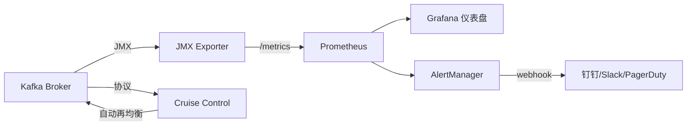
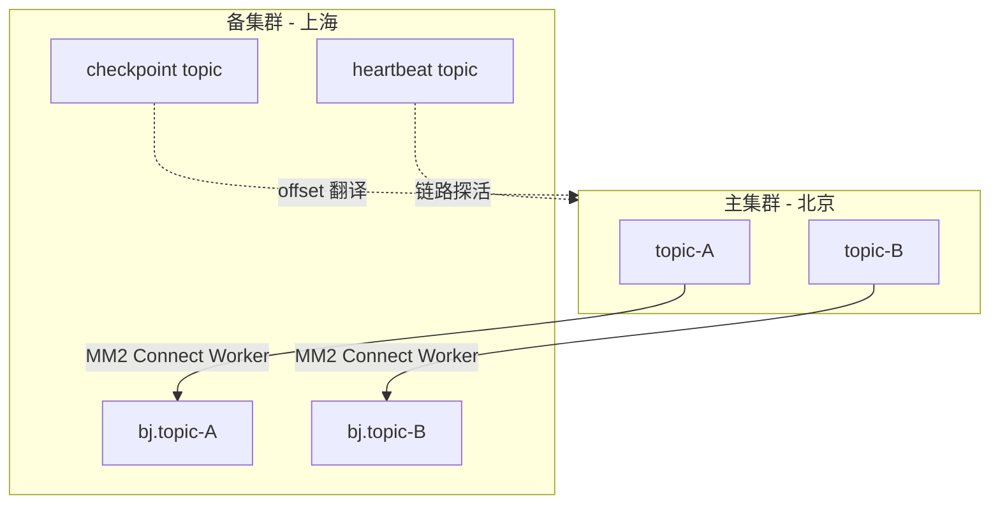
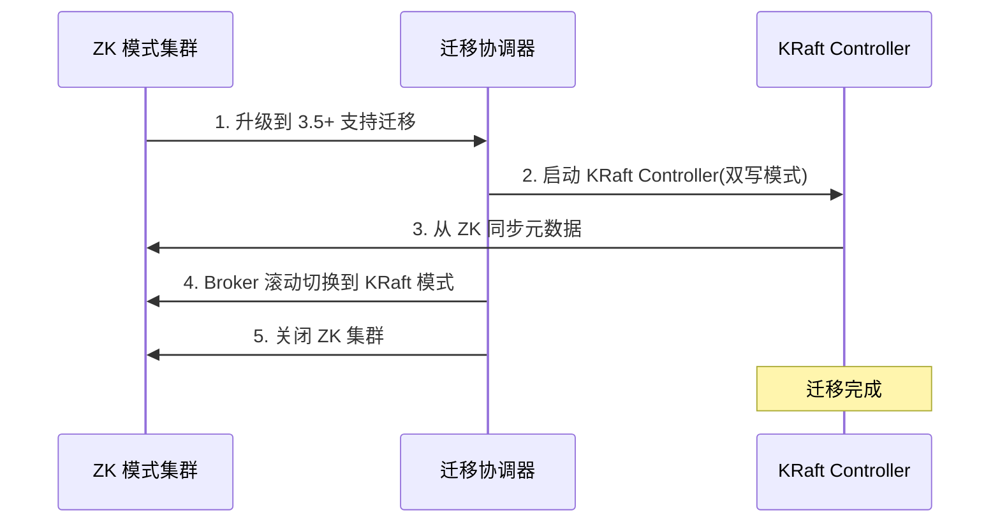
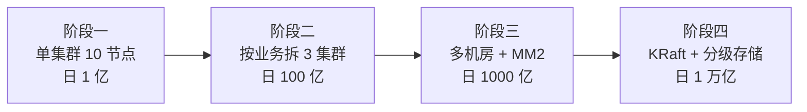

# 第 8 章 大神篇:集群管理、性能调优与生产实践

到了这一章,我们不再讨论"怎么用 Kafka",而是讨论"怎么把 Kafka 稳住、用好、扛住"。这是架构师视角:容量、参数、内核、JVM、监控、跨集群、安全、容灾、反模式,以及万亿消息平台的演进经验。

> [!note] 本章定位
> 前面 [[07-高手-事务与精确一次语义]] 讲的是语义保证,本章讲的是把这套语义保证跑在真实硬件上、扛住真实流量的工程实践。如果你是 SRE 或基础架构负责人,这章应该至少读三遍。

---

## 一、容量规划:别上来就装机

容量规划失败的项目,90% 是因为"先买机器再算账"。正确顺序是反过来的:**先估业务量,再估分区,再估硬件**。

### 1.1 分区数估算

分区数决定了消费者并行度的上限。常用公式:

```
分区数 = max(目标吞吐 / 单分区写入吞吐, 目标吞吐 / 单消费者消费吞吐)
```

> [!example] 实际算例
> 假设业务峰值 200 MB/s,单分区稳定写入约 10 MB/s(SSD、压缩后),单消费者处理能力约 20 MB/s。
> - 写入侧需要:200 / 10 = 20 个分区
> - 消费侧需要:200 / 20 = 10 个分区
> - 取较大值,再留 50% 余量:**30 个分区**

> [!warning] 分区不是越多越好
> 每个分区在 Broker 上对应若干打开的文件句柄、若干内存中的索引、若干 Controller 元数据。在 ZK 模式下,**单集群分区总数超过 20 万就会感觉到 Controller 切换缓慢**。KRaft 模式下这个上限被显著抬高,但仍然不是无限的。

### 1.2 副本因子选择

| 副本因子 | 适用场景 | 风险 |
|--------|---------|------|
| 1 | 临时数据、本地测试 | 任一 Broker 宕机即数据丢失 |
| 2 | 内部辅助流 | 滚动重启时无冗余 |
| **3** | **绝大多数生产场景** | 标准选择,可容忍 1 台故障 |
| 5 | 金融级、跨 AZ | 成本翻倍,延迟略升 |

搭配 `min.insync.replicas=2`(副本因子 3 时),既保证一致性,又允许单台故障下仍可写入。具体语义见 [[05-进阶-副本与ISR机制]]。

### 1.3 磁盘容量公式

```
磁盘容量 = 日均消息量(字节) × 保留天数 × 副本数 × (1 + 索引开销) / 压缩比
```

> [!tip] 经验值
> - 索引开销约 0.5% ~ 1%,可忽略,但留 10% buffer
> - LZ4 压缩比典型 2~4,JSON 文本可达 5~8
> - 实际容量再 × 1.3 作为水位安全垫(超过 80% 会触发各种诡异问题)

### 1.4 硬件选型

| 资源 | 推荐 | 说明 |
|------|------|------|
| CPU | 16~24 核,主频优先 | 压缩、SSL、CRC 都吃 CPU |
| 内存 | 64~128 GB | 给 PageCache 留至少 50% |
| 磁盘 | **NVMe SSD 优先**,HDD 仅用于冷归档 | SSD IOPS 是 HDD 的 100 倍 |
| 网卡 | 万兆起步,推荐 25 GbE | Kafka 是网络密集型 |
| 文件系统 | XFS | ext4 在大文件场景下不如 XFS |

> [!question] HDD 还能用吗?
> 可以,但只建议在:**冷数据归档、保留期超长(>30 天)、吞吐要求低**的辅助集群。主集群上 HDD 会成为最大瓶颈,尤其是消费者 Lag 时大量随机读会把 IO 打爆。

---

## 二、关键 Broker 参数

Kafka 有几百个参数,但生产环境真正需要调的只有十几个。其他默认值都是 LinkedIn 用万亿消息验证过的,**不要乱动**。

### 2.1 网络与 IO 线程

```properties
# 处理网络请求的线程数,默认 3,建议 = CPU 核数
num.network.threads=8

# 处理磁盘 IO 的线程数,默认 8,建议 = CPU 核数 × 2(磁盘数多时更高)
num.io.threads=16

# Socket 发送/接收缓冲区,默认 100 KB,跨机房或高带宽场景调到 1 MB
socket.send.buffer.bytes=1048576
socket.receive.buffer.bytes=1048576

# 副本同步线程数,默认 1,大集群建议 4~8
num.replica.fetchers=4
```

### 2.2 Topic 默认值

```properties
# 自动创建 Topic 必须关闭,否则手抖一个错误名就多一个野生 Topic
auto.create.topics.enable=false

# 允许删除 Topic
delete.topic.enable=true

# 默认分区数,默认 1,建议改为 6~12
num.partitions=6

# 默认副本因子,默认 1,生产必须 3
default.replication.factor=3

# ISR 最小数量,配合 acks=all 使用
min.insync.replicas=2
```

### 2.3 不要乱碰的参数

> [!danger] log.flush.* 不要动
> Kafka 的设计哲学是**依赖操作系统的 PageCache 和 fsync**,而不是应用层主动 flush。手动调小 `log.flush.interval.messages` 或 `log.flush.interval.ms` 会让 Kafka 性能腰斩,且对数据安全没有任何提升(副本机制已经覆盖了)。

更多 producer 端参数见 [[03-进阶-生产者深入]],consumer 端见 [[04-进阶-消费者与位移管理]]。

---

## 三、操作系统层调优

Broker 跑在 Linux 上,OS 没调好,Kafka 再怎么调都是白搭。

### 3.1 文件描述符

```bash
# /etc/security/limits.conf
kafka soft nofile 1000000
kafka hard nofile 1000000
```

### 3.2 虚拟内存

```bash
# /etc/sysctl.conf
vm.swappiness=1                    # 几乎禁用 swap,但保留紧急逃生
vm.dirty_background_ratio=5        # 后台开始刷盘的脏页比例
vm.dirty_ratio=60                  # 应用阻塞强制刷盘的脏页比例
vm.max_map_count=262144            # mmap 上限
```

> [!warning] swappiness 不要设 0
> 设 0 在 OOM 时会直接 kill 进程而不是 swap,有些场景反而更危险。设 1 是社区共识的最佳实践。

### 3.3 文件系统

```bash
# XFS 挂载示例,关闭 atime 减少元数据写入
mount -t xfs -o noatime,nodiratime,largeio,inode64 /dev/nvme1n1 /data/kafka
```

### 3.4 网络

```bash
# 开启网卡多队列
ethtool -L eth0 combined 16

# Jumbo Frame(同 AZ 内推荐,跨网段慎用)
ip link set eth0 mtu 9000

# TCP 缓冲区
sysctl -w net.core.rmem_max=16777216
sysctl -w net.core.wmem_max=16777216
```

---

## 四、JVM 调优

> [!tip] Kafka 的 JVM 哲学:堆要小,PageCache 要大
> Kafka 几乎所有读写都走 OS PageCache,堆里只放元数据和缓冲。**堆 6 GB 就够了,设到 32 GB 反而会因为 GC 停顿变慢**。

推荐配置:

```bash
export KAFKA_HEAP_OPTS="-Xms6g -Xmx6g"
export KAFKA_JVM_PERFORMANCE_OPTS="\
  -server \
  -XX:+UseG1GC \
  -XX:MaxGCPauseMillis=20 \
  -XX:InitiatingHeapOccupancyPercent=35 \
  -XX:+ExplicitGCInvokesConcurrent \
  -Djava.awt.headless=true \
  -XX:+UnlockDiagnosticVMOptions \
  -XX:+G1SummarizeConcMark"
```

GC 日志单独写到一个目录,出问题时是救命的:

```bash
export KAFKA_GC_LOG_OPTS="-Xlog:gc*:file=/var/log/kafka/gc.log:time,tags:filecount=10,filesize=100M"
```

---

## 五、监控:看不到等于没在跑

### 5.1 必须盯的 JMX 指标

| 指标 | 含义 | 告警阈值 |
|------|------|---------|
| `BytesInPerSec` / `BytesOutPerSec` | 流入流出带宽 | 接近网卡 70% 告警 |
| **`UnderReplicatedPartitions`** | 副本未跟上的分区数 | **> 0 即告警** |
| **`OfflinePartitionsCount`** | 离线分区数 | **> 0 立即 P0** |
| `ActiveControllerCount` | 活跃 Controller 数 | 全集群必须 = 1 |
| `RequestQueueSize` | 请求队列长度 | 持续 > 100 告警 |
| `ProduceRequestRate` | 生产请求速率 | 业务基线 ±30% |
| **ConsumerLag** | 消费滞后(消费者侧) | 业务 SLA 决定 |

> [!danger] `OfflinePartitionsCount > 0` 意味着数据正在丢
> 这是 Kafka 监控的最高优先级告警。一旦出现,说明某个分区的所有 ISR 都不可用,新写入会失败,已写入数据可能丢失。

### 5.2 监控架构



### 5.3 管理与可视化工具

| 工具 | 定位 | 评价 |
|------|------|------|
| **Cruise Control** | LinkedIn 出品,自动再均衡 | 大集群必备 |
| AKHQ | Web 管理界面,功能全 | 推荐 |
| kafka-ui | Provectus 出品,轻量现代 | 中小集群够用 |
| Kafka Manager (CMAK) | Yahoo 出品,老牌 | 维护变慢,可选 |
| Confluent Control Center | 商业版,功能最全 | 有钱就上 |

---

## 六、跨集群方案

单数据中心扛不住灾难,跨集群复制是必须的。

### 6.1 方案对比

| 方案 | 实现 | 适用场景 |
|------|------|---------|
| **MirrorMaker 2** | 基于 Kafka Connect | 开源标准,DR、聚合、迁移 |
| Cluster Linking | Confluent 商业 | 字节级复制,offset 一致 |
| Replicator | Confluent 商业 | MM2 升级版 |
| 自研 Connector | 自己写 | 特殊定制需求 |

### 6.2 MirrorMaker 2 架构



> [!note] 多活的难点不在复制,在冲突
> 双向复制(Active-Active)看起来很美,但**两边同时写同一个 key 时如何裁定**是业务问题,不是 Kafka 问题。常见做法:
> 1. 按 key 路由(单 key 永远只在一个机房写)
> 2. 应用层带逻辑时钟 / 版本号
> 3. 业务接受最终一致,后写覆盖

### 6.3 容灾备份

- **跨 AZ 部署**:同城三 AZ,`broker.rack` 配置 + `rack-aware` 副本分配
- **跨地域 MM2**:异地灾备机房,RPO 秒级
- **快照**:对关键 Topic 定期 dump 到对象存储,作为最后一道防线

---

## 七、升级与 KRaft 迁移

KRaft 是 Kafka 自带的 Raft 实现,用来替代 ZooKeeper。3.3 起 KRaft 标记为生产可用,4.0 移除 ZK 模式。

### 7.1 KRaft vs ZooKeeper

| 维度 | ZooKeeper 模式 | KRaft 模式 |
|------|---------------|-----------|
| 元数据存储 | 外部 ZK 集群 | 内部 `__cluster_metadata` |
| 部署复杂度 | 需独立维护 ZK | 单一进程 |
| Controller 切换 | 秒级到分钟级 | 毫秒级 |
| 元数据扩展性 | 数万分区 | 数百万分区 |
| 运维门槛 | 高 | 低 |

### 7.2 迁移步骤(概览)



> [!warning] 迁移前必读
> 1. 严格按官方版本兼容矩阵升级,**不要跨大版本跳跃**
> 2. 在测试环境完整演练,包括回滚
> 3. 迁移期间禁止 Topic 创建/删除
> 4. 备份 ZK 数据(`zkCli` 导出 `/brokers`, `/config` 等)

---

## 八、安全

> [!example] 生产安全四件套
> 1. **认证**:SASL/SCRAM 或 mTLS
> 2. **授权**:ACL
> 3. **传输加密**:SSL/TLS
> 4. **静态加密**:磁盘层 LUKS 或文件系统加密

### 8.1 认证机制对比

| 机制 | 强度 | 运维成本 | 适用场景 |
|------|------|---------|---------|
| SASL/PLAIN | 弱(明文密码) | 低 | 内网测试 |
| **SASL/SCRAM-SHA-512** | 中 | 低 | **大多数生产** |
| SASL/GSSAPI (Kerberos) | 强 | 高 | 已有 Kerberos 体系的企业 |
| **mTLS** | 强 | 中 | 服务网格、零信任 |
| OAUTHBEARER | 强 | 中 | 与统一身份平台集成 |

### 8.2 ACL 示例

```bash
# 允许 user:alice 向 orders Topic 写入
kafka-acls.sh --bootstrap-server localhost:9092 \
  --add --allow-principal User:alice \
  --operation Write --topic orders

# 允许消费者组 order-svc 消费 orders
kafka-acls.sh --bootstrap-server localhost:9092 \
  --add --allow-principal User:alice \
  --operation Read --topic orders \
  --group order-svc
```

> [!tip] 安全是默认拒绝
> 启用 `authorizer.class.name=kafka.security.authorizer.AclAuthorizer` 后,**未授权的所有操作一律拒绝**。上线前在测试环境跑一遍所有业务路径,避免线上 403。

---

## 九、Kubernetes 部署

| Operator | 出品方 | 评价 |
|---------|--------|------|
| **Strimzi** | CNCF 沙箱项目 | **开源首选**,功能成熟 |
| Confluent for Kubernetes | Confluent | 商业,贴合 Confluent 平台 |
| Koperator | Banzai Cloud | 维护放缓,不推荐新用 |

Strimzi 一个最小集群 CRD:

```yaml
apiVersion: kafka.strimzi.io/v1beta2
kind: Kafka
metadata:
  name: production
spec:
  kafka:
    version: 3.7.0
    replicas: 3
    listeners:
      - name: tls
        port: 9093
        type: internal
        tls: true
        authentication:
          type: scram-sha-512
    config:
      offsets.topic.replication.factor: 3
      transaction.state.log.replication.factor: 3
      transaction.state.log.min.isr: 2
      default.replication.factor: 3
      min.insync.replicas: 2
    storage:
      type: jbod
      volumes:
        - id: 0
          type: persistent-claim
          size: 500Gi
          class: nvme-ssd
          deleteClaim: false
  zookeeper:
    replicas: 3
    storage:
      type: persistent-claim
      size: 100Gi
      class: ssd
```

---

## 十、反模式:这些事千万别干

> [!danger] Kafka 不是数据库
> Kafka 是日志,**不要试图用 Kafka 直接查询历史数据**。正确做法是把数据沉淀到 ClickHouse / Hudi / Iceberg,Kafka 只做流转管道。

### 常见反模式清单

| 反模式 | 后果 | 正确做法 |
|--------|------|---------|
| 拿 Kafka 当 KV 数据库查 | 性能差,运维痛苦 | 数据沉淀到 OLAP / 湖仓 |
| 单消息 > 1 MB | 内存炸、超时、复制慢 | 消息存指针,数据放 S3/OSS |
| 频繁创建删除 Topic | Controller 抖动,元数据膨胀 | 复用 Topic + 业务字段路由 |
| 单集群分区 > 百万 | Controller 切换慢,启动慢 | 拆分集群或上 KRaft |
| 用 Consumer 做强一致事务 | 重平衡时数据不一致 | 用 EOS([[07-高手-事务与精确一次语义]]) |
| 所有 Topic 副本因子 = 1 | 单点故障即丢数据 | 至少 RF=3 |
| 生产环境 auto.create.topics.enable=true | 野生 Topic 失控 | 显式关闭,走审批 |

### 大消息处理示例(引用模式)

```java
// 错误:直接发 50 MB 的图片字节
producer.send(new ProducerRecord<>("images", imageBytes));

// 正确:上传 S3,Kafka 里只发引用
String s3Key = s3.upload(bucket, imageBytes);
ImageEvent event = ImageEvent.builder()
    .imageId(imageId)
    .s3Bucket(bucket)
    .s3Key(s3Key)
    .checksum(crc32(imageBytes))
    .build();
producer.send(new ProducerRecord<>("image-events", imageId, toJson(event)));
```

Python 对照:

```python
import boto3, json, hashlib
from kafka import KafkaProducer

s3 = boto3.client("s3")
producer = KafkaProducer(
    bootstrap_servers="kafka:9092",
    value_serializer=lambda v: json.dumps(v).encode(),
)

def publish_image(image_id: str, image_bytes: bytes):
    key = f"images/{image_id}"
    s3.put_object(Bucket="my-bucket", Key=key, Body=image_bytes)
    event = {
        "image_id": image_id,
        "s3_bucket": "my-bucket",
        "s3_key": key,
        "checksum": hashlib.md5(image_bytes).hexdigest(),
    }
    producer.send("image-events", key=image_id.encode(), value=event)
```

Go 对照:

```go
package main

import (
    "context"
    "crypto/md5"
    "encoding/hex"
    "encoding/json"

    "github.com/aws/aws-sdk-go-v2/service/s3"
    "github.com/segmentio/kafka-go"
)

type ImageEvent struct {
    ImageID  string `json:"image_id"`
    S3Bucket string `json:"s3_bucket"`
    S3Key    string `json:"s3_key"`
    Checksum string `json:"checksum"`
}

func PublishImage(ctx context.Context, w *kafka.Writer, s3c *s3.Client, id string, data []byte) error {
    key := "images/" + id
    if _, err := s3c.PutObject(ctx, &s3.PutObjectInput{
        Bucket: ptr("my-bucket"), Key: &key, Body: bytesReader(data),
    }); err != nil {
        return err
    }
    sum := md5.Sum(data)
    evt := ImageEvent{ImageID: id, S3Bucket: "my-bucket", S3Key: key, Checksum: hex.EncodeToString(sum[:])}
    payload, _ := json.Marshal(evt)
    return w.WriteMessages(ctx, kafka.Message{Key: []byte(id), Value: payload})
}
```

---

## 十一、实战案例:日万亿消息平台的演进

某互联网公司的 Kafka 平台演进路径:



| 阶段 | 关键决策 | 踩过的坑 |
|------|---------|---------|
| 一 | 全部业务挤一个集群 | Topic 互相影响,一个慢消费拖垮全集群 |
| 二 | 按业务域拆分(日志、订单、IoT) | 跨集群消费需要应用层适配 |
| 三 | MM2 异地灾备 | 双向复制导致循环复制,需配置 IdentityReplicationPolicy |
| 四 | KRaft + Tiered Storage | 元数据迁移期间禁止变更,需严格冻结期 |

### 典型业务场景

| 场景 | 特点 | 关键参数 |
|------|------|---------|
| **用户行为日志** | 高吞吐、可丢、保留短 | 副本 2、保留 3 天、LZ4 压缩 |
| **订单事件** | 不可丢、有序、EOS | 副本 3、`min.insync.replicas=2`、`acks=all` |
| **IoT 设备数据** | 海量分区、稀疏写入 | KRaft、分区按设备分片、长保留 |

---

## 十二、常见面试题

> [!question] Q1: Kafka 怎么扛百万 QPS?
>
> **答**:
> 1. **架构**:充分利用顺序写、零拷贝(sendfile)、PageCache、批量发送、压缩
> 2. **分区**:按 QPS / 单分区吞吐计算分区数,留 50% 余量
> 3. **硬件**:NVMe SSD、25 GbE 网卡、足够内存给 PageCache
> 4. **生产者**:`linger.ms=5~20`,`batch.size=64KB`,启用压缩
> 5. **消费者**:并行度 ≤ 分区数,异步处理 + 手动 commit
> 6. **Broker**:`num.network.threads` 和 `num.io.threads` 拉满

> [!question] Q2: 怎么排查 ConsumerLag?
>
> **答**(分层定位):
> 1. **看是哪一层**:`kafka-consumer-groups.sh --describe` 看每个分区的 lag 分布
> 2. **生产侧爆量**:对比 `BytesInPerSec` 历史基线,是否突增
> 3. **消费侧慢**:看消费者 CPU、GC、下游依赖延迟
> 4. **分区倾斜**:某几个分区 lag 高,通常是 key 分布不均
> 5. **重平衡**:`RebalanceRate` 是否异常,session.timeout 配置是否合理
> 6. **网络**:消费者与 Broker 之间的 RTT、丢包

> [!question] Q3: 怎么做端到端 Exactly Once?
>
> **答**:见 [[07-高手-事务与精确一次语义]]。关键三件套:
> 1. **生产者幂等**:`enable.idempotence=true`
> 2. **事务**:`transactional.id` + `initTransactions / beginTransaction / commitTransaction`
> 3. **消费者隔离级别**:`isolation.level=read_committed`
> 4. **下游系统**:要么也支持事务(Kafka Connect 的 EOS sink),要么幂等写(基于业务主键 upsert)

> [!question] Q4: KRaft 比 ZK 好在哪?
>
> **答**:
> 1. **少一个组件**:不用维护独立 ZK 集群
> 2. **元数据上限高**:支持百万级分区
> 3. **Controller 切换快**:从秒级降到毫秒级
> 4. **启动恢复快**:不需要从 ZK 全量加载元数据
> 5. **运维统一**:监控、安全、备份都收敛在 Kafka 自身

> [!question] Q5: ISR 收缩频繁怎么办?
>
> **答**:
> 1. 检查 `replica.lag.time.max.ms`(默认 30s)是否过小
> 2. 看 follower 所在节点的 IO/网络是否瓶颈
> 3. 看 `num.replica.fetchers` 是否够用
> 4. 检查是否有大消息导致 follower 拉取超时
> 5. 跨 AZ 部署时网络延迟是否突增

> [!question] Q6: 为什么 Kafka 堆内存不要给太大?
>
> **答**:Kafka 几乎所有读写都通过 OS PageCache,堆里只放协议缓冲、元数据、压缩临时区。堆大于 6~8 GB 后,G1 也很难把停顿压到 20ms 以内,反而拖累 P99 延迟。把内存让给 PageCache 才是正解。

---

## 十三、延伸阅读

- [[00-MOC-Kafka总览]] - 回到知识地图
- [[01-入门-Kafka是什么]] - 基础概念回顾
- [[03-进阶-生产者深入]] - Producer 参数详解
- [[04-进阶-消费者与位移管理]] - Consumer 调优
- [[05-进阶-副本与ISR机制]] - 副本机制原理
- [[06-高手-存储与日志结构]] - 底层存储
- [[07-高手-事务与精确一次语义]] - EOS 语义

外部参考:

- Kafka 官方文档:Operations 一章
- 《Kafka 权威指南》第 2 版(Confluent 团队著)
- LinkedIn Engineering Blog 的 Kafka 系列
- Strimzi 官方文档与 Operator 源码
- Confluent Blog 的 KRaft 迁移系列

> [!note] 写在最后
> 架构师做 Kafka,不是把每个参数都调到极致,而是**在容量、成本、稳定性、复杂度之间做权衡**。能用默认值就用默认值,能用 Operator 就用 Operator,能让业务侧自治就让业务侧自治。中央集群只暴露最小的 SLA 接口,把复杂度藏在围墙里 -- 这才是大神。
