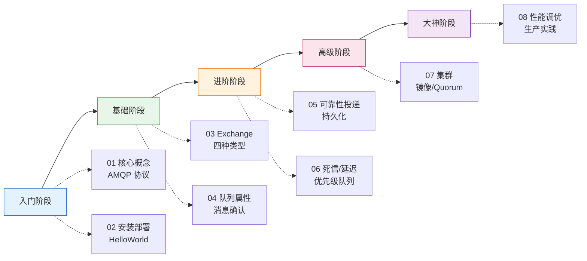

# RabbitMQ 学习路线 MOC

RabbitMQ 是基于 Erlang/OTP 平台、实现了 AMQP 0-9-1 协议的开源消息中间件,核心解决三类问题:**系统解耦**(生产者与消费者互不感知)、**异步削峰**(把瞬时高并发请求堆到队列里慢慢消费)、**最终一致性**(通过可靠投递机制保证消息不丢)。它在中小规模、对路由灵活性要求高的业务场景里几乎是默认选择。

> [!note] 本系列定位
> 这是一份从零到生产级的 RabbitMQ 学习索引,8 篇正文按"入门 → 基础 → 进阶 → 高级 → 大神"五阶递进。每篇都包含可运行的 Spring Boot 与原生客户端示例,以及一份 Python/Go 对照,确保跨语言读者都能落地。

## 学习路线全景图

## 系列文章索引

- [[01-入门-核心概念与AMQP协议]] —— 先把 Producer、Exchange、Queue、Binding、Consumer、Channel、VHost 这几个名词搞清楚,再过一遍 AMQP 0-9-1 协议帧结构,后面所有内容都建立在这之上。
- [[02-入门-安装部署与HelloWorld]] —— Docker 一行命令拉起 RabbitMQ,打开 15672 管理后台,跑通第一个 Java/Python/Go 客户端,完成发消息 → 收消息闭环。
- [[03-基础-Exchange四种类型详解]] —— Direct、Fanout、Topic、Headers 四种交换机的路由规则、典型场景与代码对比,这是消息能否"被正确送达"的关键。
- [[04-基础-队列消息属性与确认机制]] —— TTL、Max-Length、Auto-Delete、Exclusive 等队列属性,以及 ack/nack/reject、prefetch 限流、手动确认模式的正确姿势。
- [[05-进阶-可靠性投递与持久化]] —— Publisher Confirms、Return 机制、消息/队列/交换机三层持久化、消费幂等性设计,把"消息不丢"这件事彻底讲透。
- [[06-进阶-死信队列延迟队列与优先级]] —— DLX 死信路由的三种触发条件、基于 TTL+DLX 的延迟队列实现、rabbitmq-delayed-message-exchange 插件、优先级队列的代价与边界。
- [[07-高级-集群镜像队列与Quorum]] —— 普通集群与镜像集群的区别、为什么镜像队列在 3.8+ 被 Quorum Queue 取代、Raft 共识在 Quorum 里的角色、脑裂处理策略。
- [[08-大神-性能调优与生产实践]] —— Erlang 调度器/内存高水位/磁盘告警调优、Lazy Queue 与 Stream、监控告警(Prometheus + Grafana)、容量规划与典型故障复盘。

> [!tip] 如何使用本系列
> - **零基础读者**:严格按 01 → 08 顺序通读,每篇代码都亲手敲一遍,跑通后再进入下一篇。
> - **有 Kafka 背景的读者**:可以跳过 01,直接从 03 开始,重点关注 Exchange 路由模型(这是 Kafka 没有的概念)。
> - **救火型读者(线上出问题来查)**:直接跳到 05、07、08,搜对应关键字。
> - **面试备战**:每篇末尾的"常见面试题"章节集中过一遍,再回头补薄弱点。

## 与其他主流消息中间件对比

挑选 MQ 之前先看清各家定位,免得用错工具:

| 维度 | RabbitMQ | Kafka | RocketMQ | ActiveMQ |
|---|---|---|---|---|
| 开发语言 | Erlang | Scala/Java | Java | Java |
| 协议 | AMQP / STOMP / MQTT | 自研 TCP 协议 | 自研 + 兼容 JMS | JMS / AMQP / STOMP |
| 单机吞吐 | 万级(1-5 万 TPS) | 百万级 | 十万级 | 万级 |
| 延迟 | 微秒级 | 毫秒级 | 毫秒级 | 毫秒级 |
| 路由灵活性 | ✓ 极高(4 种 Exchange) | ✗ 仅 Topic+Partition | 中(Tag 过滤) | 中 |
| 顺序消息 | 单队列单消费者 | 单 Partition 内有序 | ✓ 原生支持 | 单队列有序 |
| 事务消息 | ✗(只有 Publisher Confirm) | ✓(0.11+) | ✓ 原生半消息 | ✓ JMS 事务 |
| 延迟消息 | 插件 / TTL+DLX | ✗(需外部实现) | ✓ 原生支持 | ✓ 原生支持 |
| 集群一致性 | Quorum(Raft) | ISR(类 Raft) | DLedger(Raft) | LevelDB Replication |
| 运维复杂度 | 中(Erlang 栈) | 高(依赖 ZK/KRaft) | 中 | 低 |
| 典型场景 | 业务解耦、异步任务、复杂路由 | 日志、流计算、事件溯源 | 电商交易、金融订单 | 传统企业集成 |

> [!warning] 选型避坑
> 不要听到"高吞吐"就无脑选 Kafka。如果你的业务 QPS 在 1 万以下,但路由规则复杂(按用户类型/地域/订单状态分发),RabbitMQ 的开发与运维成本远低于 Kafka。反之,日志聚合、埋点上报这类一写多读、按时间回溯的场景,Kafka 才是合适的选择。

> [!question] 我该学哪一个?
> 如果只能学一个,先学 RabbitMQ —— 它的 AMQP 模型是经典消息中间件的教科书式实现,理解了 Exchange/Queue/Binding 之后,再去看 Kafka 的 Topic/Partition、RocketMQ 的 Topic/Tag/Queue 都会觉得"原来都是类似的思想"。反过来则不容易。

## 配套官方资源

- 官网首页:<https://www.rabbitmq.com/>
- 官方教程(6 个经典示例,强烈建议全跑一遍):<https://www.rabbitmq.com/tutorials>
- AMQP 0-9-1 协议规范:<https://www.rabbitmq.com/resources/specs/amqp0-9-1.pdf>
- Java Client 文档:<https://www.rabbitmq.com/client-libraries/java-client>
- Spring AMQP 参考手册:<https://docs.spring.io/spring-amqp/reference/>
- 管理后台 HTTP API:<https://www.rabbitmq.com/docs/management>
- Quorum Queue 设计文档:<https://www.rabbitmq.com/docs/quorum-queues>
- 性能调优官方建议:<https://www.rabbitmq.com/docs/production-checklist>

> [!example] 推荐配套书与课程
> - 《RabbitMQ 实战指南》朱忠华 —— 中文社区最系统的一本,源码级讲解
> - 《RabbitMQ in Depth》Gavin M. Roy —— 英文进阶,作者是 Pivotal 工程师
> - RabbitMQ Summit 历年大会视频(YouTube 免费):真实生产案例最多

---

下一步:进入 [[01-入门-核心概念与AMQP协议]],把基础名词彻底吃透。
