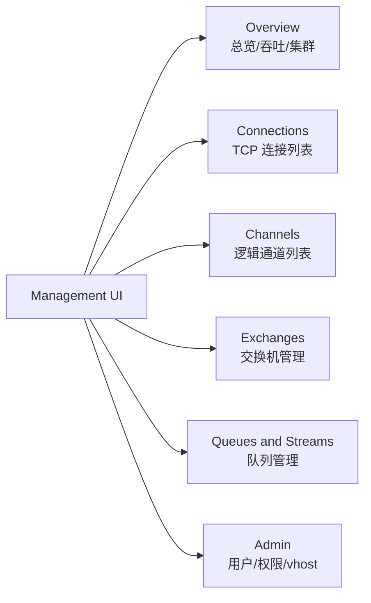
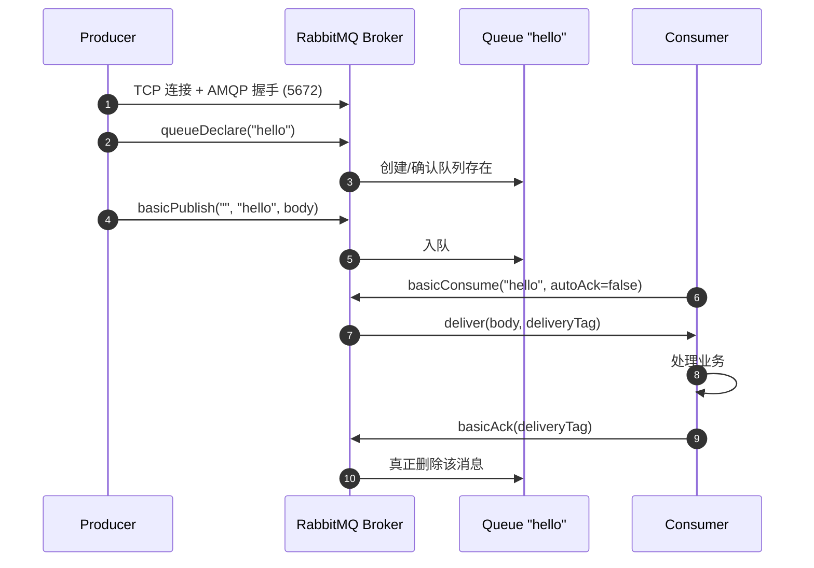

上一章 [[01-概述-为什么需要消息队列]] 讲完了"为什么",这一章直接进"怎么做"。目标是:**今天结束前你必须在自己机器上跑通一条消息**,从 Producer 发出去,经过 Broker,被 Consumer 收到,并且能在 Management UI 里看到曲线动起来。

如果你只想抄一段能跑的代码,直接跳到[第 5 节 Hello World](#5-hello-world-java-原生客户端)。如果你想理解每个步骤背后在干什么,从头读。

---

## 1. 安装方式总览

RabbitMQ 是 Erlang 写的,所以传统包安装会先装 Erlang 再装 RabbitMQ,版本对应关系一旦错就启动不了。**强烈建议生产和开发都用 Docker**,只有在以下场景才考虑原生包:

| 场景 | 推荐方式 | 原因 |
|---|---|---|
| 本地开发 / POC | Docker | 一条命令起好,删了不留痕 |
| CI / 测试环境 | Docker / Testcontainers | 隔离、可重复 |
| 生产 Kubernetes | Helm Chart 或 Operator | 集群管理、自动恢复 |
| 生产物理机/VM | apt/yum 包 + systemd | 长期稳定、便于运维监控 |
| Windows 桌面学习 | 官方 installer | 不想装 Docker Desktop |

> [!tip] 版本选择建议
> 写本文时建议使用 RabbitMQ 3.13.x 或 4.0.x (LTS)。3.8 及以下已不再维护,新项目不要再用。Erlang 至少 26+。

---

## 2. Docker 安装(推荐)

### 2.1 一条命令起一个开发实例

```bash
docker run -d \
  --name rabbitmq \
  --hostname rabbit-local \
  -p 5672:5672 \
  -p 15672:15672 \
  -e RABBITMQ_DEFAULT_USER=admin \
  -e RABBITMQ_DEFAULT_PASS=admin123 \
  rabbitmq:3.13-management
```

几个端口必须记住:

- `5672` - AMQP 协议端口,**客户端用这个**
- `15672` - Management UI / HTTP API,**浏览器和运维用这个**
- `25672` - 集群节点间通信(单机用不到)
- `4369` - Erlang epmd,集群发现用

> [!warning] hostname 一定要指定
> RabbitMQ 把数据目录命名为 `rabbit@<hostname>`。如果容器每次重启 hostname 都变(Docker 默认随机),旧数据就读不到了,队列和消息全丢。生产部署必须固定 `--hostname` 并挂载 volume。

### 2.2 带持久化的 docker-compose.yml

开发环境多容器协作时更推荐这个版本:

```yaml
version: "3.8"

services:
  rabbitmq:
    image: rabbitmq:3.13-management
    container_name: rabbitmq
    hostname: rabbit-local
    restart: unless-stopped
    ports:
      - "5672:5672"
      - "15672:15672"
    environment:
      RABBITMQ_DEFAULT_USER: admin
      RABBITMQ_DEFAULT_PASS: admin123
      RABBITMQ_DEFAULT_VHOST: /
    volumes:
      - rabbitmq_data:/var/lib/rabbitmq
      - rabbitmq_logs:/var/log/rabbitmq
      - ./rabbitmq.conf:/etc/rabbitmq/rabbitmq.conf:ro
    healthcheck:
      test: ["CMD", "rabbitmq-diagnostics", "-q", "ping"]
      interval: 30s
      timeout: 10s
      retries: 5

volumes:
  rabbitmq_data:
  rabbitmq_logs:
```

启动:

```bash
docker compose up -d
docker compose logs -f rabbitmq
```

> [!note] 镜像 tag 解读
> `rabbitmq:3.13` 是**不含**管理插件的精简镜像,Production 用。
> `rabbitmq:3.13-management` **已经预装并启用**了 management 插件,开发用。
> 不要去 pull `:latest`,版本不可控。

---

## 3. Linux 包管理安装

以 Ubuntu 22.04 为例,Team RabbitMQ 提供 Cloudsmith APT 仓库:

```bash
# 1. 安装 Erlang (RabbitMQ 官方仓库)
sudo apt-get install -y curl gnupg apt-transport-https

curl -1sLf "https://github.com/rabbitmq/signing-keys/releases/download/3.0/cloudsmith.rabbitmq-erlang.E495BB49CC4BBE5B.key" | \
  sudo gpg --dearmor -o /usr/share/keyrings/rabbitmq.E495BB49CC4BBE5B.gpg

# 2. 添加仓库
sudo tee /etc/apt/sources.list.d/rabbitmq.list <<EOF
deb [signed-by=/usr/share/keyrings/rabbitmq.E495BB49CC4BBE5B.gpg] https://ppa1.rabbitmq.com/rabbitmq/rabbitmq-erlang/deb/ubuntu jammy main
deb [signed-by=/usr/share/keyrings/rabbitmq.E495BB49CC4BBE5B.gpg] https://ppa1.rabbitmq.com/rabbitmq/rabbitmq-server/deb/ubuntu jammy main
EOF

# 3. 安装
sudo apt-get update -y
sudo apt-get install -y erlang-base erlang-asn1 erlang-crypto erlang-eldap erlang-ftp \
  erlang-inets erlang-mnesia erlang-os-mon erlang-parsetools erlang-public-key \
  erlang-runtime-tools erlang-snmp erlang-ssl erlang-syntax-tools erlang-tftp \
  erlang-tools erlang-xmerl rabbitmq-server

# 4. 启动 systemd 服务
sudo systemctl enable --now rabbitmq-server
sudo systemctl status rabbitmq-server
```

CentOS / RHEL 用 `yum` 仓库,流程类似。**不要用发行版默认仓库里的 rabbitmq-server**,版本都太老。

---

## 4. Windows 安装

1. 下载并安装 [Erlang/OTP for Windows](https://www.erlang.org/downloads) (`otp_win64_xx.x.exe`),装到默认路径即可。
2. 下载 [RabbitMQ Windows Installer](https://www.rabbitmq.com/install-windows.html) (`rabbitmq-server-x.x.x.exe`),一路下一步。
3. 安装后会自动注册成 Windows 服务,在"服务"里能看到 `RabbitMQ`。
4. 打开 `RabbitMQ Command Prompt (sbin dir)`(开始菜单里有),执行下面这条命令启用管理插件:

```bat
rabbitmq-plugins enable rabbitmq_management
```

> [!warning] Windows 老坑
> 用户名带中文或空格的 Windows 账号会导致 RabbitMQ 启动后 cookie 文件路径乱码、节点起不来。要么换 Docker,要么用 Administrator / 英文用户。

---

## 5. 启用管理插件并访问 UI

如果你用的是 `:management` 镜像,这一步已经做好了。否则手动开启:

```bash
# 容器里:
docker exec -it rabbitmq rabbitmq-plugins enable rabbitmq_management

# 物理机:
sudo rabbitmq-plugins enable rabbitmq_management

# 查看已启用插件:
rabbitmq-plugins list
```

浏览器打开 <http://localhost:15672>,默认账号:

- 用户名: `guest`
- 密码: `guest`

如果用了上文的 compose,登录改成 `admin / admin123`。

### 5.1 管理界面 Tab 速览



各 Tab 重点关注什么:

| Tab | 重点字段 | 你会用它做什么 |
|---|---|---|
| **Overview** | Message rates、Node、Disk free、File descriptors | 一眼看出 Broker 是不是健康 |
| **Connections** | Client IP、protocol、state | 排查"为什么消费者断了" |
| **Channels** | Prefetch、unacked、confirm | 排查"为什么消息卡住不消费" |
| **Exchanges** | Type、durable、bindings | 看交换机和队列怎么连的 |
| **Queues** | Messages ready / unacked / total、consumers | 看积压、看消费者数 |
| **Admin** | Users、Virtual Hosts、Policies | 加用户、配权限、设镜像策略 |

> [!tip] 第一次进 Admin 必做的两件事
> 1. 新建一个业务用户(不要让所有人都用 guest),给定 vhost 配权限。
> 2. 把 guest 用户删掉,或者至少改一个强密码。

---

## 6. rabbitmqctl 常用命令

UI 能干的事,`rabbitmqctl` 都能干,而且适合写脚本和接监控。所有命令在 Broker 所在机器(或容器内)执行。

```bash
# 进入容器执行
docker exec -it rabbitmq bash

# === 查询 ===
rabbitmqctl status                  # 节点状态
rabbitmqctl cluster_status          # 集群状态
rabbitmqctl list_queues name messages messages_ready messages_unacknowledged consumers
rabbitmqctl list_exchanges name type durable
rabbitmqctl list_bindings
rabbitmqctl list_connections user host peer_host state
rabbitmqctl list_channels

# === 用户与权限 ===
rabbitmqctl add_user appuser AppPass123!
rabbitmqctl set_user_tags appuser monitoring     # 给 tag(monitoring/administrator/none)
rabbitmqctl set_permissions -p / appuser ".*" ".*" ".*"
#                              vhost user  conf write read 三个正则
rabbitmqctl list_users
rabbitmqctl list_permissions -p /

# === vhost ===
rabbitmqctl add_vhost order_service
rabbitmqctl list_vhosts

# === 队列管理 ===
rabbitmqctl purge_queue order.dead_letter        # 清空队列
rabbitmqctl delete_queue order.tmp

# === 节点 ===
rabbitmqctl stop_app                              # 停止 RabbitMQ 应用(不停 Erlang)
rabbitmqctl start_app
rabbitmqctl reset                                 # 危险:清空所有数据
```

> [!danger] reset 会清空所有持久化数据
> `rabbitmqctl reset` 会把这个节点上的队列、交换机、用户、绑定**全部删掉**。生产环境永远不要执行,除非你知道自己在干什么。

> [!example] 一个典型的初始化脚本
> ```bash
> #!/bin/bash
> set -e
> rabbitmqctl add_vhost /order
> rabbitmqctl add_user order_app 'S3cret!2026'
> rabbitmqctl set_user_tags order_app none
> rabbitmqctl set_permissions -p /order order_app \
>     "^order\..*" "^order\..*" "^order\..*"
> echo "init done"
> ```

---

## 7. Hello World - Java 原生客户端

最小可运行示例。先建 Maven 项目:

```xml
<dependency>
    <groupId>com.rabbitmq</groupId>
    <artifactId>amqp-client</artifactId>
    <version>5.21.0</version>
</dependency>
<dependency>
    <groupId>org.slf4j</groupId>
    <artifactId>slf4j-simple</artifactId>
    <version>2.0.13</version>
</dependency>
```

### 7.1 Producer

```java
package com.example.hello;

import com.rabbitmq.client.Channel;
import com.rabbitmq.client.Connection;
import com.rabbitmq.client.ConnectionFactory;

import java.nio.charset.StandardCharsets;

public class HelloProducer {

    private static final String QUEUE_NAME = "hello";

    public static void main(String[] args) throws Exception {
        ConnectionFactory factory = new ConnectionFactory();
        factory.setHost("localhost");
        factory.setPort(5672);
        factory.setUsername("admin");
        factory.setPassword("admin123");
        factory.setVirtualHost("/");

        // try-with-resources 保证 Connection / Channel 被关掉
        try (Connection conn = factory.newConnection();
             Channel channel = conn.createChannel()) {

            // 声明队列(幂等):durable=false,持久化关掉,demo 用
            channel.queueDeclare(QUEUE_NAME, false, false, false, null);

            for (int i = 1; i <= 5; i++) {
                String msg = "Hello RabbitMQ #" + i;
                channel.basicPublish(
                        "",                  // 默认交换机
                        QUEUE_NAME,          // routingKey = queue name
                        null,                // properties
                        msg.getBytes(StandardCharsets.UTF_8));
                System.out.println(" [x] Sent: " + msg);
            }
        }
    }
}
```

### 7.2 Consumer

```java
package com.example.hello;

import com.rabbitmq.client.*;

import java.nio.charset.StandardCharsets;

public class HelloConsumer {

    private static final String QUEUE_NAME = "hello";

    public static void main(String[] args) throws Exception {
        ConnectionFactory factory = new ConnectionFactory();
        factory.setHost("localhost");
        factory.setUsername("admin");
        factory.setPassword("admin123");

        Connection conn = factory.newConnection();
        Channel channel = conn.createChannel();
        channel.queueDeclare(QUEUE_NAME, false, false, false, null);

        // 一次最多预取 1 条,处理完再要下一条 -- 关键的反压参数
        channel.basicQos(1);

        DeliverCallback onMsg = (consumerTag, delivery) -> {
            String body = new String(delivery.getBody(), StandardCharsets.UTF_8);
            System.out.println(" [.] Received: " + body);
            // 手动 ack
            channel.basicAck(delivery.getEnvelope().getDeliveryTag(), false);
        };

        channel.basicConsume(QUEUE_NAME,
                false,                  // autoAck = false,手动确认
                onMsg,
                consumerTag -> { });

        System.out.println(" [*] Waiting for messages. Ctrl-C to exit.");
        // 阻塞,不让 main 退出
        Thread.currentThread().join();
    }
}
```

整条链路的时序:



---

## 8. Spring Boot 集成

实际项目里大概率不会手写 `Connection` 和 `Channel`,而是用 `spring-boot-starter-amqp`。它会自动帮你管 Connection 复用、Channel 池、重连、监听器线程池。

### 8.1 依赖

```xml
<dependency>
    <groupId>org.springframework.boot</groupId>
    <artifactId>spring-boot-starter-amqp</artifactId>
</dependency>
```

### 8.2 application.yml

```yaml
spring:
  rabbitmq:
    host: localhost
    port: 5672
    username: admin
    password: admin123
    virtual-host: /
    publisher-confirm-type: correlated   # 启用 publisher confirm
    publisher-returns: true
    listener:
      simple:
        acknowledge-mode: manual         # 手动 ack
        prefetch: 10                     # 每个消费者预取 10 条
        concurrency: 2                   # 最小消费线程
        max-concurrency: 8               # 最大消费线程
        retry:
          enabled: true
          max-attempts: 3
          initial-interval: 1s
```

### 8.3 配置类

```java
@Configuration
public class RabbitConfig {

    public static final String QUEUE_HELLO = "hello.spring";

    @Bean
    public Queue helloQueue() {
        // durable=true 才能在 broker 重启后还在
        return QueueBuilder.durable(QUEUE_HELLO).build();
    }
}
```

### 8.4 Producer

```java
@Service
@RequiredArgsConstructor
public class HelloSender {

    private final RabbitTemplate rabbitTemplate;

    public void send(String content) {
        rabbitTemplate.convertAndSend(
                "",                                 // exchange
                RabbitConfig.QUEUE_HELLO,           // routingKey = queue
                content);
    }
}
```

### 8.5 Consumer

```java
@Component
@Slf4j
public class HelloListener {

    @RabbitListener(queues = RabbitConfig.QUEUE_HELLO)
    public void onMessage(String body, Channel channel, Message message) throws IOException {
        long tag = message.getMessageProperties().getDeliveryTag();
        try {
            log.info("received: {}", body);
            // ...业务逻辑...
            channel.basicAck(tag, false);
        } catch (Exception e) {
            log.error("handle fail, requeue=false", e);
            // 第二个参数 multiple=false,第三个 requeue=false 进死信
            channel.basicNack(tag, false, false);
        }
    }
}
```

> [!note] Spring Boot 帮你做了什么
> - 一个 `CachingConnectionFactory` 全应用复用 TCP 连接,Channel 池化
> - `@RabbitListener` 注解背后是一个 `SimpleMessageListenerContainer`,自动重连、并发管理、线程隔离
> - 异常时按你配的 retry 策略重试,最终失败可以走死信交换机
> - 序列化/反序列化通过 `MessageConverter` 抽象,默认 `SimpleMessageConverter`,推荐换 `Jackson2JsonMessageConverter`

详细的 Spring 高级用法见 [[06-SpringBoot高级集成-死信延迟重试]]。

---

## 9. Python pika 对照

不是 Java 工程师?这一段给你看看其他语言写 RabbitMQ 是什么形状。本质上 AMQP 0-9-1 是个跨语言协议,所有 client 概念都一样:Connection / Channel / Exchange / Queue / Binding。

```python
# pip install pika
import pika

conn = pika.BlockingConnection(
    pika.ConnectionParameters(
        host="localhost",
        port=5672,
        credentials=pika.PlainCredentials("admin", "admin123"),
    )
)
channel = conn.channel()
channel.queue_declare(queue="hello", durable=False)

# Producer
channel.basic_publish(exchange="", routing_key="hello", body="hi from python")

# Consumer
def on_msg(ch, method, props, body):
    print("got:", body.decode())
    ch.basic_ack(delivery_tag=method.delivery_tag)

channel.basic_qos(prefetch_count=1)
channel.basic_consume(queue="hello", on_message_callback=on_msg)
channel.start_consuming()
```

Go 的 `github.com/rabbitmq/amqp091-go`、Node 的 `amqplib`、.NET 的 `RabbitMQ.Client`,API 形状都差不多,熟一个就基本会全部。

---

## 10. 常见坑

### 10.1 guest 用户只能本地登录

> [!warning] 远程登录 guest 被拒绝怎么办
> 默认配置里有一条:
> ```
> loopback_users.guest = true
> ```
> 意思是 `guest` 用户**只能从 127.0.0.1 / ::1 连接**,从别的 IP 来的会直接被拒,日志里会看到:
> ```
> user 'guest' can only connect via localhost
> ```
> **正确做法不是把 guest 改成允许远程**,而是:
> 1. `rabbitmqctl add_user appuser 'StrongPass!'`
> 2. `rabbitmqctl set_user_tags appuser none`
> 3. `rabbitmqctl set_permissions -p / appuser ".*" ".*" ".*"`
> 4. 业务代码用 `appuser` 登录,guest 留给本机调试或者干脆删掉。

### 10.2 Connection 是 TCP 长连接,很贵

每个 `Connection` 都是一条真实的 TCP 长连接,创建要做 AMQP 握手、SASL 认证、心跳协商,代价不低。**一个进程一般只持有一两条 Connection 就够**,通过它创建大量 Channel 来并发。

> [!danger] 反模式:每发一条消息建一个 Connection
> 我见过有人把 `new Connection()` 写在循环里,结果 QPS 才 30,Broker 那边 connections 数飙到几千,直接 OOM。`ConnectionFactory` 要全局单例,或者用 Spring 的 `CachingConnectionFactory`。

### 10.3 Channel 是轻量的,但**不是线程安全的**

| 对象 | 创建成本 | 线程安全 | 复用粒度 |
|---|---|---|---|
| Connection | 高(TCP+握手) | ✓ 可多线程共享 | 全进程 1~2 个 |
| Channel | 低(逻辑通道) | ✗ 不可跨线程 | 每线程独占一个 |

跨线程共享 Channel 是经典 bug:`basicAck` 和 `basicPublish` 混在一起会导致 frame 错乱,Broker 直接关掉这个 Channel。Spring AMQP 已经替你处理了,但是用原生 client 必须注意。

### 10.4 队列、交换机声明要幂等

`queueDeclare("xxx", true, ...)` 是幂等的,但前提是**参数完全一致**。如果之前声明 `durable=true`,后来代码改成 `durable=false` 又去声明同一个名字,会抛 `PRECONDITION_FAILED`,直接挂掉 Channel。所以改持久化属性时,要先 `delete` 旧队列。

### 10.5 不要在 Consumer 里做超长 IO

Prefetch 默认是无限的(autoAck 模式)或者按 `prefetch_count` 控制。如果一条消息处理要 30 分钟,而 Broker 配的心跳是 60s,中间没动静 Broker 会以为这个 Channel 挂了,直接断开 + 把所有 unacked 消息重新投递,大概率重复消费。解决方案:消息里只放任务 ID,具体业务异步跑;或者拆细消息粒度。

---

## 11. 验证你装对了

跑一遍 checklist:

- [ ] `docker ps` 看到 `rabbitmq` 容器是 `(healthy)`
- [ ] 浏览器打开 <http://localhost:15672> 能登录
- [ ] `rabbitmqctl status` 没有报错
- [ ] 跑完上面 Java Producer,UI 的 Queues Tab 看到 `hello` 队列里有 5 条消息
- [ ] 跑完 Java Consumer,5 条消息变成 0,Consumers 一列显示 1
- [ ] Overview Tab 的 Message rates 图有曲线

全部 ✓ 才算入门通过。下一章 [[03-核心概念-Exchange-Queue-Binding-RoutingKey]] 我们就要进 AMQP 协议的核心:四种 Exchange 类型怎么路由,Binding Key 和 Routing Key 的匹配规则到底怎么算。

---

## 12. 常见面试题

> [!question] Q1: RabbitMQ 默认端口有哪些?分别用来干什么?
> 5672 AMQP 客户端连接;15672 管理 UI / HTTP API;25672 集群节点间通信;4369 Erlang epmd 节点发现;1883/8883 MQTT(可选插件);61613 STOMP(可选插件)。

> [!question] Q2: Connection 和 Channel 的区别?为什么不能每次发消息都新建 Connection?
> Connection 是真实 TCP 长连接,创建有握手开销且占用 OS 文件句柄;Channel 是 Connection 上的逻辑通道,廉价、可大量创建。一个进程一般只持有 1~2 个 Connection,每个线程自己的 Channel。频繁新建 Connection 会迅速打爆 Broker 的 fd 上限。

> [!question] Q3: guest 用户为什么远程登录连不上?
> 配置 `loopback_users.guest = true` 限制 guest 只能从 localhost 连。正确做法是新建专用业务用户、设置 vhost 权限,而不是放开 guest。

> [!question] Q4: rabbitmq-plugins enable rabbitmq_management 之后还需要重启服务吗?
> 不需要。management 插件支持热加载,执行命令后插件立即生效,15672 端口随即可用。

> [!question] Q5: durable=true 的队列消息一定不会丢吗?
> 不一定。队列 durable 只保证队列定义本身持久化,消息还得 `deliveryMode=2`(persistent),并且写入磁盘后才安全;同时还要开 publisher confirm 才能让 Producer 知道消息真的落盘了。镜像/Quorum 队列才能在节点宕机时不丢,详见 [[09-高可用-镜像队列与Quorum队列]]。

> [!question] Q6: prefetch 设多少合适?
> 没有标准答案,经验值:CPU 密集型业务 1~5;IO 密集型业务 20~100;批量处理可以更高。原则是:让单个消费者既不闲也不被压垮,unacked 数量稳定在一个合理水位。

---

## 13. 延伸阅读

- 官方文档: [Get Started with RabbitMQ](https://www.rabbitmq.com/getstarted.html)
- 官方教程: [RabbitMQ Tutorials (Java/Python/Go/.NET)](https://www.rabbitmq.com/tutorials)
- AMQP 0-9-1 规范: [AMQP 0-9-1 Specification](https://www.rabbitmq.com/specification.html)
- Docker Hub: [rabbitmq image](https://hub.docker.com/_/rabbitmq)
- Spring AMQP 参考: [Spring AMQP Reference](https://docs.spring.io/spring-amqp/reference/)
- 本系列下一篇: [[03-核心概念-Exchange-Queue-Binding-RoutingKey]]
- 本系列相关:
  - [[01-概述-为什么需要消息队列]]
  - [[04-工作模式-六种WorkQueue模式详解]]
  - [[06-SpringBoot高级集成-死信延迟重试]]
  - [[09-高可用-镜像队列与Quorum队列]]
