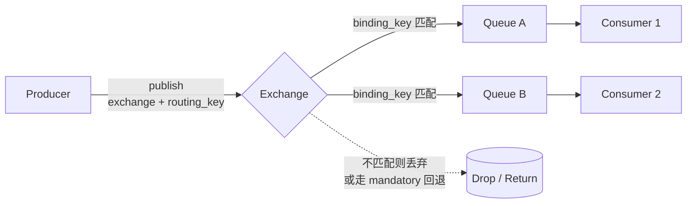
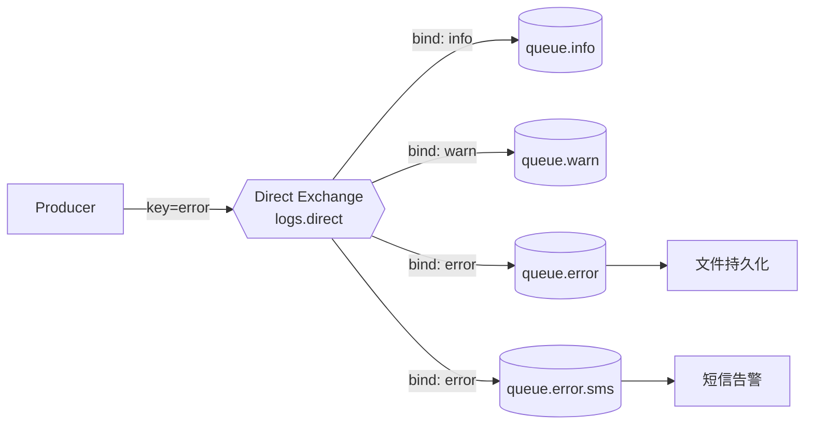
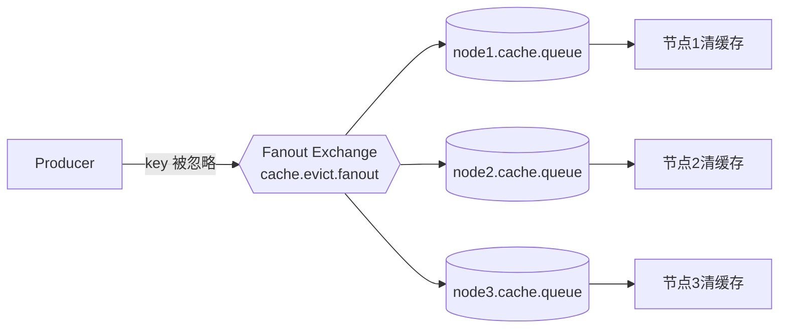
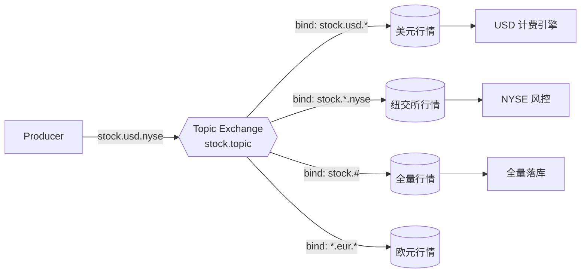
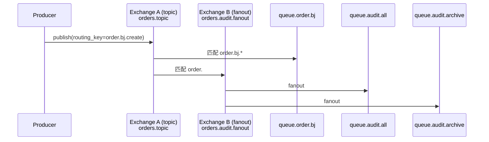

# 第 3 章 Exchange 四种类型详解

Exchange(交换器)是 RabbitMQ 路由模型的核心。生产者**永远不会**把消息直接发给 Queue,它只会发给 Exchange,由 Exchange 根据**类型(type)**和**绑定关系(binding)**决定把消息投到哪些队列里。理解 Exchange 的四种类型,基本就理解了 RabbitMQ 一半的路由模型。

前置内容请先看 [[01-RabbitMQ-是什么]] 和 [[02-基础-核心概念与AMQP协议]]。

---

## 1. 路由模型总览



> [!note] 三个关键字段
> - **exchange**:消息发到哪个交换器
> - **routing_key**:生产者带的"路由钥匙"
> - **binding_key**:队列与交换器绑定时声明的"匹配规则"
>
> 不同 Exchange 类型,只是对 `routing_key` 与 `binding_key` 的匹配规则不一样而已。

---

## 2. Direct Exchange:精确匹配

Direct 交换器只做一件事:`routing_key == binding_key` 时把消息投递到该队列。一对一,简单粗暴。

### 2.1 路由示意图



注意 `error` 队列被绑定了两个消费目的(文件持久化 + 短信告警),Direct 同样支持"一个 key 多个 binding"。

### 2.2 典型场景:日志按级别分发

- `info` → 写入日志文件
- `warn` → 写入文件 + 落库
- `error` → 写入文件 + 落库 + 触发告警

### 2.3 Spring Boot 完整示例

> [!example] Maven 依赖
> ```xml
> <dependency>
>   <groupId>org.springframework.boot</groupId>
>   <artifactId>spring-boot-starter-amqp</artifactId>
> </dependency>
> ```

```java
// LogDirectConfig.java
@Configuration
public class LogDirectConfig {

    public static final String EXCHANGE = "logs.direct";

    @Bean DirectExchange logsExchange() {
        return ExchangeBuilder.directExchange(EXCHANGE)
                .durable(true)        // 重启不丢
                .build();
    }

    @Bean Queue queueInfo()  { return QueueBuilder.durable("queue.info").build(); }
    @Bean Queue queueWarn()  { return QueueBuilder.durable("queue.warn").build(); }
    @Bean Queue queueError() { return QueueBuilder.durable("queue.error").build(); }

    @Bean Binding bindInfo(Queue queueInfo, DirectExchange logsExchange) {
        return BindingBuilder.bind(queueInfo).to(logsExchange).with("info");
    }
    @Bean Binding bindWarn(Queue queueWarn, DirectExchange logsExchange) {
        return BindingBuilder.bind(queueWarn).to(logsExchange).with("warn");
    }
    @Bean Binding bindError(Queue queueError, DirectExchange logsExchange) {
        return BindingBuilder.bind(queueError).to(logsExchange).with("error");
    }
}
```

```java
// LogProducer.java
@Service
@RequiredArgsConstructor
public class LogProducer {
    private final RabbitTemplate rabbit;

    public void log(String level, String msg) {
        rabbit.convertAndSend(LogDirectConfig.EXCHANGE, level, msg);
    }
}

// LogConsumer.java
@Component
public class LogConsumer {
    @RabbitListener(queues = "queue.error")
    public void onError(String msg) {
        System.out.println("[ERROR] " + msg);
        // TODO: 触发告警
    }
}
```

> [!tip] 不需要时不要写成 Topic
> 业务真的只用到精确匹配时,**用 Direct 而不是 Topic**。Topic 的正则匹配在大 binding 数量下有性能成本(见后文对比表)。

---

## 3. Fanout Exchange:广播

Fanout 完全**忽略 routing_key**,只要绑定了就投递。一对多广播。

### 3.1 路由示意图



### 3.2 典型场景:多节点缓存失效

分布式部署的服务,本地缓存(如 Caffeine)需要在数据更新后**所有节点同步失效**。每个节点声明一个**独占临时队列**绑定到同一个 fanout 交换器,即可实现广播。

### 3.3 Spring Boot 完整示例

```java
@Configuration
public class CacheFanoutConfig {

    public static final String EXCHANGE = "cache.evict.fanout";

    @Bean FanoutExchange cacheExchange() {
        return ExchangeBuilder.fanoutExchange(EXCHANGE).durable(true).build();
    }

    // 每个节点启动时声明一个临时队列(独占 + 自动删除 + 非持久)
    @Bean Queue nodeQueue() {
        return QueueBuilder.nonDurable()
                .exclusive()
                .autoDelete()
                .build();   // 名字由 broker 随机生成
    }

    @Bean Binding bindNode(Queue nodeQueue, FanoutExchange cacheExchange) {
        return BindingBuilder.bind(nodeQueue).to(cacheExchange);
    }
}

@Component
public class CacheEvictListener {
    @RabbitListener(queues = "#{nodeQueue.name}")
    public void onEvict(String key) {
        LocalCache.evict(key);   // 清本机缓存
    }
}
```

发送端只要 `rabbit.convertAndSend("cache.evict.fanout", "", "user:1024")` 即可,routing_key 写空字符串。

> [!warning] 临时队列的生命周期
> `exclusive + autoDelete` 表示只有当前连接能消费,断开就删除。这是 Fanout 广播最常见的配套写法,**不要用持久化命名队列**,否则节点下线后队列会堆积消息直到撑爆磁盘。

---

## 4. Topic Exchange:通配符匹配

Topic 是 RabbitMQ 最灵活的类型。routing_key 是用 `.` 分隔的单词序列,binding_key 支持两种通配符:

| 通配符 | 含义 |
|--------|------|
| `*` | 匹配**恰好一个**单词 |
| `#` | 匹配**零个或多个**单词 |

### 4.1 路由示意图



对于 routing_key = `stock.usd.nyse`:

- ✓ `stock.usd.*` 匹配
- ✓ `stock.*.nyse` 匹配
- ✓ `stock.#` 匹配
- ✗ `*.eur.*` 不匹配

### 4.2 典型场景:多维度订阅

股票/物流/IoT 设备这类**多维度属性**的消息流,用 Topic 一次定义、多方订阅。例如设备消息:`device.<region>.<type>.<event>`,北京区温度传感器告警就是 `device.bj.temp.alarm`。

### 4.3 Spring Boot 完整示例

```java
@Configuration
public class StockTopicConfig {

    public static final String EXCHANGE = "stock.topic";

    @Bean TopicExchange stockExchange() {
        return ExchangeBuilder.topicExchange(EXCHANGE).durable(true).build();
    }

    @Bean Queue usdQueue() { return QueueBuilder.durable("queue.stock.usd").build(); }
    @Bean Queue nyseQueue() { return QueueBuilder.durable("queue.stock.nyse").build(); }
    @Bean Queue allQueue() { return QueueBuilder.durable("queue.stock.all").build(); }

    @Bean Binding bindUsd(Queue usdQueue, TopicExchange stockExchange) {
        return BindingBuilder.bind(usdQueue).to(stockExchange).with("stock.usd.*");
    }
    @Bean Binding bindNyse(Queue nyseQueue, TopicExchange stockExchange) {
        return BindingBuilder.bind(nyseQueue).to(stockExchange).with("stock.*.nyse");
    }
    @Bean Binding bindAll(Queue allQueue, TopicExchange stockExchange) {
        return BindingBuilder.bind(allQueue).to(stockExchange).with("stock.#");
    }
}
```

> [!question] `#` 能匹配空吗?
> 能。`stock.#` 既匹配 `stock`(零个单词)也匹配 `stock.usd.nyse`。但 `stock.*` 不会匹配单独的 `stock`,`*` 必须占据一个单词位。

### 4.4 Python 客户端对照(pika)

```python
import pika

conn = pika.BlockingConnection(pika.ConnectionParameters("localhost"))
ch = conn.channel()
ch.exchange_declare(exchange="stock.topic", exchange_type="topic", durable=True)
ch.basic_publish(exchange="stock.topic",
                 routing_key="stock.usd.nyse",
                 body=b'{"price":188.5}')
conn.close()
```

### 4.5 Go 客户端对照(amqp091-go)

```go
ch.PublishWithContext(ctx, "stock.topic", "stock.usd.nyse", false, false,
    amqp.Publishing{ContentType: "application/json", Body: []byte(`{"price":188.5}`)})
```

---

## 5. Headers Exchange:用 headers 匹配

Headers 完全无视 routing_key,改成根据消息 `headers` 字段做匹配。binding 上必须声明 `x-match`:

| x-match | 含义 |
|---------|------|
| `all`(默认) | 所有 header 都要匹配 |
| `any` | 任意一个匹配即可 |

### 5.1 示例

```java
@Configuration
public class OrderHeadersConfig {

    @Bean HeadersExchange ordersExchange() {
        return ExchangeBuilder.headersExchange("orders.headers").durable(true).build();
    }

    @Bean Queue vipBJQueue() { return QueueBuilder.durable("queue.order.vip.bj").build(); }

    @Bean Binding bindVipBJ(Queue vipBJQueue, HeadersExchange ordersExchange) {
        Map<String, Object> headers = new HashMap<>();
        headers.put("x-match", "all");
        headers.put("vip", true);
        headers.put("region", "bj");
        return BindingBuilder.bind(vipBJQueue).to(ordersExchange).whereAll(headers).match();
    }
}
```

发送:

```java
MessageProperties props = new MessageProperties();
props.setHeader("vip", true);
props.setHeader("region", "bj");
Message msg = new Message("{\"orderId\":1001}".getBytes(), props);
rabbit.send("orders.headers", "", msg);
```

> [!danger] Headers 为什么"很少用"?
> 1. **性能差**:每条消息要遍历所有 binding 的 header 字典做哈希比较,比 Topic 的 trie 匹配慢一个数量级。
> 2. **可读性差**:绑定关系藏在代码/管理界面深处,运维排查时不如 Topic 一眼看出路由。
> 3. **能力被 Topic 覆盖**:绝大多数"多维度匹配"用 Topic 拼 routing_key 就够了。
>
> 真正需要 Headers 的场景极少,例如某些 header 值是**非字符串**(布尔/数字)、或者来自上游不可控的 SDK 强制带 headers 时。能用 Topic 就别用 Headers。

---

## 6. 默认交换器与 amq.* 系统交换器

### 6.1 默认交换器(`""`)

每个 Queue 创建时,broker 会自动把它绑定到一个**名字为空字符串的 Direct 交换器**上,binding_key 就是队列名本身。

```java
// 这一行等价于:发到默认交换器,路由到名为 "queue.hello" 的队列
rabbit.convertAndSend("", "queue.hello", "hi");
```

> [!tip] 何时用默认交换器
> 写**最简单的点对点示例**或**临时调试**时方便,但生产环境不推荐 —— 它把"队列名"和"路由 key"耦合死了,以后改名很痛。

### 6.2 `amq.*` 系统交换器

RabbitMQ 启动时预创建一批保留交换器,**不能删除、不能修改类型**:

| 名称 | 类型 | 说明 |
|------|------|------|
| `(空字符串)` | direct | 默认交换器 |
| `amq.direct` | direct | 预置 direct |
| `amq.fanout` | fanout | 预置 fanout |
| `amq.topic` | topic | 预置 topic |
| `amq.headers` / `amq.match` | headers | 预置 headers |
| `amq.rabbitmq.trace` | topic | Firehose 追踪 |
| `amq.rabbitmq.log` | topic | broker 日志 |

> [!warning] 不要往 amq.* 上发业务流量
> 这些是 broker 保留命名空间,业务交换器应该用自己的命名约定(如 `<bounded-context>.<purpose>.<type>`),例如 `order.dlx.direct`、`stock.quote.topic`。

---

## 7. Exchange 的属性

声明交换器时除了 name + type,还有这些属性需要决策:

| 属性 | 类型 | 含义 | 常见取值 |
|------|------|------|----------|
| `durable` | bool | broker 重启后是否保留元数据 | 生产环境 `true` |
| `autoDelete` | bool | 最后一个 binding 解除后是否自动删除 | 通常 `false` |
| `internal` | bool | 是否只接受**其他 exchange 转发**,生产者不能直接发 | E2E 转发时 `true` |
| `arguments` | map | 扩展参数,如 `alternate-exchange`(备用交换器) | 按需 |

> [!example] alternate-exchange(备胎交换器)
> 当一条消息在主交换器上**没有匹配任何队列**时,会被转发到 alternate-exchange,可以在那里挂一个"未路由消息"的兜底队列,避免静默丢失。
>
> ```java
> @Bean DirectExchange main() {
>     return ExchangeBuilder.directExchange("orders.direct")
>             .durable(true)
>             .withArgument("alternate-exchange", "orders.unrouted.fanout")
>             .build();
> }
> ```

---

## 8. Exchange 到 Exchange 的绑定(E2E)

AMQP 0-9-1 协议允许把一个 Exchange **绑定到另一个 Exchange**,形成路由链。这是 RabbitMQ 的扩展能力,在做**消息分层路由**或**审计旁路**时非常好用。

### 8.1 时序图



### 8.2 Spring Boot 配置

```java
@Bean Binding e2e(TopicExchange ordersTopic, FanoutExchange auditFanout) {
    return BindingBuilder.bind(auditFanout).to(ordersTopic).with("order.#");
}
```

> [!note] internal=true 的配合
> 配合 `internal=true` 的下游交换器,可以**禁止生产者直接发到下游**,只能通过 E2E 流入,适合做"审计/归档"这种强约束链路。

---

## 9. 四种 Exchange 对比表

| 维度 | Direct | Fanout | Topic | Headers |
|------|--------|--------|-------|---------|
| 路由依据 | routing_key 精确匹配 | 忽略 key,广播 | routing_key 通配符匹配 | headers 字典匹配 |
| 通配符 | 无 | 无 | `*` 一词 / `#` 任意 | `x-match: all/any` |
| 性能 | 最高(哈希查表 O(1)) | 高(直接广播) | 中(trie 匹配) | 低(逐 binding 比对) |
| 灵活性 | 低 | 极低 | 高 | 高但难维护 |
| 典型场景 | 日志分级、点对点任务 | 缓存广播、配置推送 | 多维订阅、事件总线 | 非字符串属性匹配 |
| 推荐度 | ★★★★★ | ★★★★ | ★★★★★ | ★★ |

> [!tip] 选型口诀
> - 精确发某一类 → Direct
> - 所有人都收 → Fanout
> - 多维 + 通配 → Topic
> - 真没办法了 → Headers

---

## 10. 常见面试题

> [!question] Q1:Topic 的 `*` 和 `#` 有什么区别?
> `*` 必须匹配**恰好一个**单词(`.` 分隔),`#` 可匹配**零个或多个**单词。例如 `a.#` 同时匹配 `a`、`a.b`、`a.b.c`,但 `a.*` 只匹配 `a.b`。

> [!question] Q2:Fanout 性能为什么比 Topic 高?
> Fanout 不需要做任何 key 匹配,broker 拿到消息后直接遍历 binding 表把消息塞进每个绑定队列;Topic 需要对 routing_key 做 trie 树匹配,匹配本身有 CPU 开销,binding 越多越慢。

> [!question] Q3:Headers 为什么生产中很少见?
> 性能差(无法用 trie 优化,逐条 header 比较)+ 可维护性差(绑定规则散落在代码里,看管理界面也不直观)+ 能力被 Topic 完全覆盖。除非有强约束(如 header 是布尔/数字,或者上游 SDK 必须用 header),否则用 Topic。

> [!question] Q4:不指定 exchange(发到 `""`)会怎样?
> 发到**默认交换器**,它是一个特殊的 Direct,binding_key 就是队列名。所以 `rabbit.convertAndSend("", "queue.foo", msg)` 等价于"发到名为 queue.foo 的队列"。

> [!question] Q5:消息发出去但没有任何队列匹配,会怎样?
> 默认**直接丢弃**。如果想感知:
> 1. 设置 `mandatory=true` + 监听 `ReturnCallback`,broker 会把消息退回生产者;
> 2. 配置 `alternate-exchange`,broker 把未路由消息转给备用交换器。

> [!question] Q6:同一个队列能绑到多个 Exchange 吗?
> 可以。一个 Queue 可以同时被多个 Exchange、多个 binding_key 绑定,常用于"主路由 + 旁路审计"。

---

## 11. 延伸阅读

- [[02-基础-核心概念与AMQP协议]] — 回顾 Channel、Connection、Virtual Host
- [[04-基础-Queue队列属性详解]] — 持久化、TTL、最大长度、DLX
- [[05-进阶-死信队列与延迟队列]] — alternate-exchange 与 x-dead-letter-exchange 区别
- [[06-进阶-Topic路由实战]] — 用 Topic 设计事件总线
- [[10-运维-Management控制台]] — 在 UI 里观察 binding 关系
- 官方文档:`https://www.rabbitmq.com/tutorials/amqp-concepts.html`
- AMQP 0-9-1 协议规范:`https://www.rabbitmq.com/resources/specs/amqp0-9-1.pdf`

> [!note] 下一步
> 看完本章请动手在本地 broker 上把四种 Exchange 都跑一遍 —— 强烈建议打开 Management UI(15672 端口),发消息时看 `Exchanges → Bindings` 标签页,观察消息是怎么流到队列的。理论看十遍,不如亲手 publish 三条。
