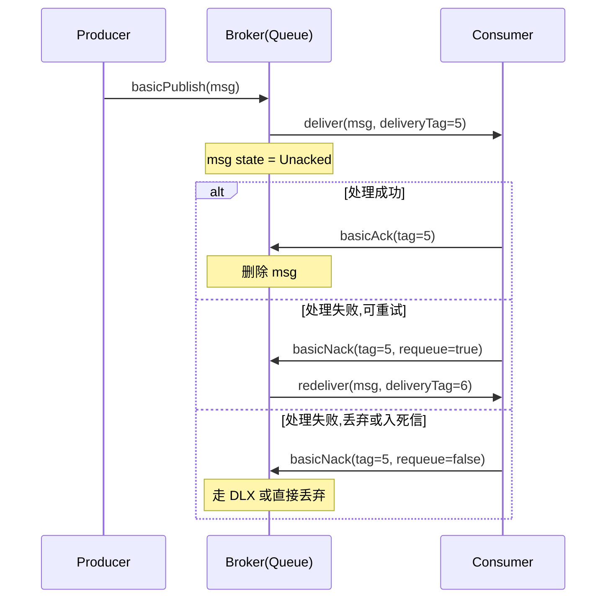
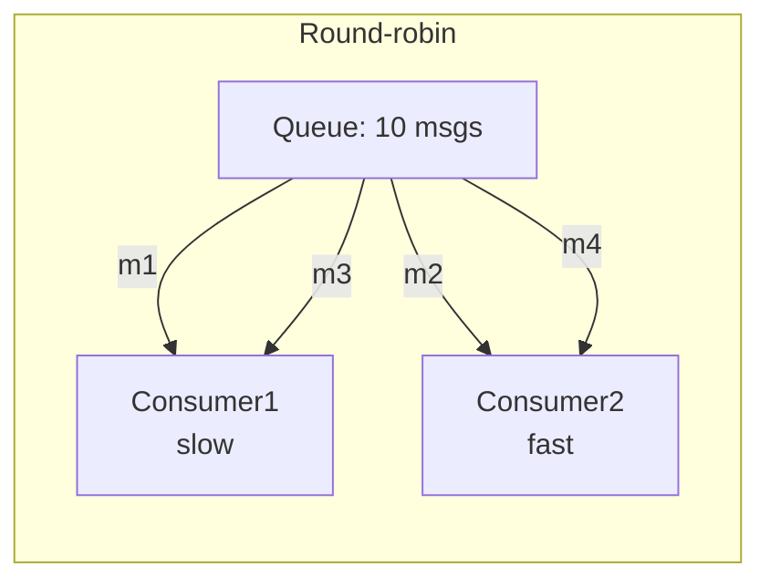

# 第 4 章 队列声明、消息属性与确认机制

前几章我们把 Exchange、Queue、Binding 这些核心概念过了一遍（见 [[03-基础-Exchange与Binding详解]]），这一章把视角拉回到「队列本身长什么样」和「消息从 Broker 到达消费者再被确认」的全过程。这一章是 RabbitMQ 真正进入生产环境前**必须吃透**的一章，绝大多数线上事故——消息丢失、消息堆积、Unacked 爆炸、消费者饿死——都源自对这里的某个参数理解错了。

> [!note] 阅读节奏建议
> 本章信息量较大。建议按顺序读：队列声明参数 → 消息属性 → push/pull → ack → nack/reject → prefetch → 实战 Spring Boot 示例 → 踩坑清单。不要跳，前后是有依赖的。

---

## 1. 队列声明（Queue Declare）的参数

声明队列在 AMQP 协议里就是 `queue.declare` 这个方法。客户端无论是 Java、Python、Go，本质上都是把这几个参数填好发给 Broker。

### 1.1 四个主参数

| 参数 | 类型 | 默认 | 含义 |
|---|---|---|---|
| `durable` | boolean | false | 队列**元数据**是否持久化到磁盘，Broker 重启后队列还在 |
| `exclusive` | boolean | false | 是否排他：只有声明它的 Connection 能用，连接断开自动删除 |
| `autoDelete` | boolean | false | 当**最后一个消费者**断开后，队列是否自动删除 |
| `arguments` | Map | null | 扩展参数，所有 x-* 前缀的特性都从这里走 |

> [!warning] durable 只持久化「队列定义」
> `durable=true` 只是让队列这个对象在 Broker 重启后还存在，**它不保证里面的消息不丢**。消息要不丢，还得满足：
> 1. 消息的 `deliveryMode = 2`（持久化消息）
> 2. 队列 `durable = true`
> 3. 生产者开启 Publisher Confirm（见 [[05-基础-生产者确认与事务]]）
>
> 三者缺一不可。很多人以为 `durable=true` 一开消息就不丢了，这是经典误解。

### 1.2 排他队列（exclusive）使用场景

`exclusive=true` 的队列有这些特性：

- 只对**声明它的 Connection**可见
- 同一 Connection 的多个 Channel 都能用
- Connection 断开 → 队列立即删除（无视 durable / autoDelete）

> [!tip] 什么时候用 exclusive
> 典型场景：RPC 客户端的 reply 队列、临时回调队列。需要"一个客户端一个独立队列、断开就清理"的场景。如果你写的是常驻消费者服务，**几乎永远不该用 exclusive**。

### 1.3 arguments 里的高频可选参数

| 参数 | 作用 |
|---|---|
| `x-message-ttl` | 队列里消息的存活时间（毫秒），到期自动从队列移除 |
| `x-expires` | 队列本身的空闲超时时间，超过没人用就删除 |
| `x-max-length` | 队列最大消息数，超过后按策略丢弃 |
| `x-max-length-bytes` | 队列最大字节数 |
| `x-overflow` | 满了之后的策略：`drop-head`（默认，丢最老）、`reject-publish`、`reject-publish-dlx` |
| `x-dead-letter-exchange` | 死信交换机，配合 TTL/拒绝/超长 使用，详见 [[09-进阶-死信队列DLX]] |
| `x-dead-letter-routing-key` | 转发到 DLX 时覆盖原 routing key |
| `x-max-priority` | 启用优先级队列，1-255，越大越优先 |
| `x-queue-mode` | `lazy` 模式，把消息尽量写盘，适合堆积场景 |
| `x-queue-type` | `classic` / `quorum` / `stream`，仲裁队列见 [[12-高可用-Quorum队列]] |

> [!example] Java 声明一个带 TTL + 死信 + 限长的队列
> ```java
> Map<String, Object> args = new HashMap<>();
> args.put("x-message-ttl", 60_000);              // 消息 60s 过期
> args.put("x-max-length", 10_000);               // 最多 1w 条
> args.put("x-overflow", "reject-publish");       // 满了拒绝新消息
> args.put("x-dead-letter-exchange", "dlx.order");
> args.put("x-dead-letter-routing-key", "order.dead");
>
> channel.queueDeclare(
>     "order.process",
>     /* durable    */ true,
>     /* exclusive  */ false,
>     /* autoDelete */ false,
>     args
> );
> ```

> [!danger] 声明参数不可变
> 队列一旦声明，**arguments 不能改**。再次声明同名队列但参数不同会直接抛 `PRECONDITION_FAILED`，连 Channel 都会被关掉。生产环境要改参数：要么换队列名，要么先删除（接受短暂消息丢失），要么用 [Policy](https://www.rabbitmq.com/parameters.html) 覆盖部分动态参数。

---

## 2. 消息属性 BasicProperties

每条消息除了 `body`（字节数组）之外，还能挂一组属性。AMQP 0-9-1 规范固定了这些字段：

| 属性 | 类型 | 说明 |
|---|---|---|
| `contentType` | String | MIME 类型，例如 `application/json` |
| `contentEncoding` | String | 编码，例如 `gzip`、`utf-8` |
| `deliveryMode` | int | **1 = 非持久化，2 = 持久化** |
| `priority` | int | 优先级，配合 `x-max-priority` 使用 |
| `correlationId` | String | 关联 ID，RPC 场景把请求和响应配对 |
| `replyTo` | String | RPC 回复队列名 |
| `expiration` | String | 单条消息 TTL（毫秒，注意是字符串） |
| `messageId` | String | 业务侧消息唯一 ID，做幂等 key 非常有用 |
| `timestamp` | Date | 发送时间戳 |
| `type` | String | 业务类型，例如 `OrderCreated` |
| `userId` | String | 如果设置，Broker 会校验它必须等于当前登录用户 |
| `appId` | String | 应用标识 |
| `headers` | Map | 任意键值对，header 交换机依赖它 |

> [!tip] deliveryMode 是最容易踩的字段
> 默认是 1（非持久化），意味着 Broker 重启时这条消息直接消失，**就算队列是 durable 也救不了**。Spring AMQP 的 `RabbitTemplate` 默认会把它设为 2，但用原生 Java 客户端必须自己设：
> ```java
> AMQP.BasicProperties props = new AMQP.BasicProperties.Builder()
>         .deliveryMode(2)                    // 持久化
>         .contentType("application/json")
>         .messageId(UUID.randomUUID().toString())
>         .timestamp(new Date())
>         .build();
> channel.basicPublish("ex.order", "order.create", props, body);
> ```

> [!question] messageId 一定要传吗？
> 强烈建议传。下游做消费幂等时，最稳的 key 就是生产者塞进去的 `messageId`。不要用 Broker 内部的 `deliveryTag`——它只在当前 Channel 内有效，重连就变。

---

## 3. Consumer 的两种模式：push vs pull

### 3.1 push 模式（basicConsume）

Broker 主动把消息推给消费者。是**生产环境唯一推荐**的方式。

```java
channel.basicConsume(
    "order.process",
    /* autoAck */ false,
    "consumer-tag-1",
    new DefaultConsumer(channel) {
        @Override
        public void handleDelivery(String tag,
                                   Envelope env,
                                   AMQP.BasicProperties props,
                                   byte[] body) throws IOException {
            try {
                handle(body);
                channel.basicAck(env.getDeliveryTag(), false);
            } catch (Exception e) {
                channel.basicNack(env.getDeliveryTag(), false, true);
            }
        }
    });
```

### 3.2 pull 模式（basicGet）

消费者主动一条一条拉。每次 `basicGet` 一次往返，吞吐**极差**。

```java
GetResponse resp = channel.basicGet("order.process", false);
if (resp != null) {
    handle(resp.getBody());
    channel.basicAck(resp.getEnvelope().getDeliveryTag(), false);
}
```

> [!danger] 不要用 pull 模式做常规消费
> 它只适合一次性脚本（例如线上调试时手工取一条看看 body）。push 模式由 Broker 推送 + prefetch 控流，性能差几个数量级。

---

## 4. 消费确认 ack 的三种模式

ack（acknowledge）是消费者告诉 Broker：「这条消息我处理完了，可以从队列里彻底删除」。在 ack 之前，消息在 Broker 那边的状态是 **Unacked**——它已经被投递出去，但 Broker 还留着，万一连接挂了会重新投递给别的消费者。

### 4.1 三种模式对比

| 模式 | 配置 | 行为 | 风险 |
|---|---|---|---|
| 自动 ack | `autoAck = true` | Broker 一发出去就当作处理完，立即从队列删除 | **可能丢消息** |
| 手动 ack（逐条） | `autoAck = false` + `basicAck(tag, false)` | 业务处理完再确认 | 安全 |
| 手动 ack（批量） | `autoAck = false` + `basicAck(tag, true)` | 一次确认 ≤ tag 的所有未 ack | 高吞吐，但要保证业务都成功 |

> [!danger] 永远不要在生产用自动 ack
> 自动 ack 等于「我收到了消息就当我做完了」。如果消费者拿到消息后还没处理就崩了，这条消息**永远丢失**，Broker 不会重投。看似省事，代价是数据。

### 4.2 deliveryTag 是什么

`deliveryTag` 是 Broker 在**当前 Channel** 上对投递的编号，从 1 开始单调递增。ack/nack 都靠它来定位消息。

> [!warning] deliveryTag 跨 Channel 无效
> 不能把 Channel A 收到的 tag 用 Channel B 去 ack，会直接报 `PRECONDITION_FAILED, unknown delivery tag`。线程模型设计错的时候很容易踩。

### 4.3 ack/nack 时序图



---

## 5. basicNack / basicReject：拒绝消息

两个方法都用于「我不要这条消息」，区别只在批量能力：

| 方法 | 批量 | 签名 |
|---|---|---|
| `basicReject` | 否 | `basicReject(long deliveryTag, boolean requeue)` |
| `basicNack` | 可以 | `basicNack(long deliveryTag, boolean multiple, boolean requeue)` |

`requeue` 参数的含义：

- `true`：消息重回队列头部，**会被立刻再投**（很可能给同一个消费者）
- `false`：从队列删除；如果队列配置了 `x-dead-letter-exchange`，会进死信

> [!warning] requeue=true 容易死循环
> 业务异常时一脚踢回去 → 立刻又被投出来 → 又异常 → 又踢回去 → CPU 烧了，日志爆了。**生产实践**：用 `requeue=false` 走死信队列，在 DLQ 上做有限次重试或人工介入。详见 [[10-进阶-延迟队列与重试]]。

---

## 6. Prefetch（QoS）：控制未 ack 数

`channel.basicQos(prefetchCount)` 告诉 Broker：「这个 Channel 上，未 ack 的消息数最多别超过 N 条」。

```java
channel.basicQos(50);   // 每个 channel 最多 50 条 unacked
```

### 6.1 为什么必须设

> [!danger] 不设 prefetch = 默认无限
> 默认值是 0，意思是「不限」。Broker 会把队列里**所有**消息一股脑推给第一个连上来的消费者，导致：
> 1. 内存爆掉
> 2. 其他消费者饿死，看起来像负载不均
> 3. 处理慢的消息阻塞所有后面的消息

### 6.2 公平分发 vs 轮询分发

- **轮询分发（Round-robin）**：默认行为，不管消费者忙不忙，挨个发。慢的消费者会堆积。
- **公平分发（Fair dispatch）**：开启 `basicQos(1)` 后，只有当前消息被 ack 才会发下一条。慢的消费者自然少接，快的多接。



```mermaid
flowchart LR
    Q2[Queue: 10 msgs]
    subgraph Fair-dispatch_prefetch=1
        Q2 -- m1 --> S[Consumer1<br/>slow]
        Q2 -- m2,m3,m4 --> F[Consumer2<br/>fast]
    end
```

> [!tip] prefetch 值怎么选
> - 处理快（毫秒级、纯内存）：50 ~ 250
> - 处理中（涉及一次 DB）：10 ~ 50
> - 处理慢（外部 HTTP、大事务）：1 ~ 5
>
> 经验法则：`prefetch ≈ 单条平均耗时 / 网络 RTT`。先压测再定，别拍脑袋。

---

## 7. 完整实战：Spring Boot 配置 prefetch + 手动 ack

### 7.1 application.yml

```yaml
spring:
  rabbitmq:
    host: 127.0.0.1
    port: 5672
    username: app
    password: secret
    virtual-host: /prod
    listener:
      simple:
        acknowledge-mode: manual      # 手动 ack
        prefetch: 20                  # 每个 consumer 20 条 unacked
        concurrency: 4                # 并发消费者数
        max-concurrency: 16
        retry:
          enabled: false              # 关掉框架自动重试,我们自己控
```

### 7.2 队列与监听器

```java
@Configuration
public class OrderMqConfig {

    @Bean
    public Queue orderQueue() {
        return QueueBuilder.durable("order.process")
                .withArgument("x-dead-letter-exchange", "dlx.order")
                .withArgument("x-dead-letter-routing-key", "order.dead")
                .withArgument("x-message-ttl", 60_000)
                .build();
    }
}

@Component
@Slf4j
public class OrderConsumer {

    @RabbitListener(queues = "order.process")
    public void onMessage(Message message, Channel channel) throws IOException {
        long tag = message.getMessageProperties().getDeliveryTag();
        String msgId = message.getMessageProperties().getMessageId();
        try {
            OrderEvent evt = JSON.parseObject(message.getBody(), OrderEvent.class);
            // 业务幂等: 用 msgId 查一下是否处理过
            if (idempotentStore.exists(msgId)) {
                channel.basicAck(tag, false);
                return;
            }
            orderService.handle(evt);
            idempotentStore.mark(msgId);
            channel.basicAck(tag, false);
        } catch (BusinessRetryableException e) {
            // 可重试: 入死信走延迟重试
            log.warn("retryable, send to DLX, msgId={}", msgId, e);
            channel.basicNack(tag, false, false);
        } catch (Exception e) {
            // 不可重试: 同样进 DLX,人工介入
            log.error("fatal, send to DLX, msgId={}", msgId, e);
            channel.basicNack(tag, false, false);
        }
    }
}
```

### 7.3 Python（pika）对照

```python
import pika, json

def callback(ch, method, props, body):
    try:
        evt = json.loads(body)
        handle(evt)
        ch.basic_ack(delivery_tag=method.delivery_tag)
    except Exception:
        ch.basic_nack(delivery_tag=method.delivery_tag,
                      multiple=False, requeue=False)

conn = pika.BlockingConnection(pika.ConnectionParameters('127.0.0.1'))
ch = conn.channel()
ch.basic_qos(prefetch_count=20)
ch.basic_consume(queue='order.process', on_message_callback=callback, auto_ack=False)
ch.start_consuming()
```

### 7.4 Go（amqp091-go）对照

```go
ch.Qos(20, 0, false)
msgs, _ := ch.Consume("order.process", "", false, false, false, false, nil)
for d := range msgs {
    if err := handle(d.Body); err != nil {
        d.Nack(false, false)   // multiple=false, requeue=false
        continue
    }
    d.Ack(false)
}
```

---

## 8. 常见坑清单

> [!danger] 坑 1：忘记 ack 导致 Unacked 持续涨
> 现象：管控台上某队列 `Unacked` 一直涨，`Ready` 不变，消费速度看着正常，但其实消息没真正确认。
> 原因：代码里漏写 `basicAck`，或者异常分支没 ack 也没 nack。
> 修复：所有出口都要 ack/nack；用 `try/finally` 兜底。

> [!danger] 坑 2：用错 deliveryTag
> 现象：`channel error; protocol method: PRECONDITION_FAILED - unknown delivery tag`。
> 原因：跨 Channel ack、或同一 tag ack 了两次、或重连后用了旧 tag。
> 修复：每个 Channel 在自己的线程里串行处理；重连后 tag 全部作废。

> [!danger] 坑 3：自动 ack 丢消息
> 现象：消费者 OOM 重启后，丢失大量未处理消息。
> 原因：`autoAck=true`。
> 修复：改成手动 ack。**不接受任何例外**。

> [!warning] 坑 4：requeue=true 死循环
> 见上文。统一改成 `requeue=false` + DLX。

> [!warning] 坑 5：prefetch 默认 0
> 见上文。一定要显式设。

> [!warning] 坑 6：队列参数想改改不了
> 见 1.3。提前规划好，或用 Policy 覆盖动态参数。

> [!note] 坑 7：消息持久化但队列非 durable
> 反过来也一样。三件套必须配齐：`durable queue` + `deliveryMode=2` + `publisher confirm`。

---

## 9. 常见面试题

> [!question] Q1：消息丢失可能发生在哪些环节？怎么防？
> 三段：
> 1. 生产者 → Broker：开 `publisher confirm` + `mandatory` + `return callback`
> 2. Broker 内部：队列 durable + 消息 `deliveryMode=2` + 集群用 Quorum 队列
> 3. Broker → 消费者：关闭 autoAck，业务成功后再手动 ack
>
> 详细见 [[11-高级-消息可靠投递全链路]]。

> [!question] Q2：basicNack 和 basicReject 有什么区别？
> 功能等价，区别在 `basicNack` 多了 `multiple` 参数，可以一次拒绝 ≤ tag 的所有未 ack 消息。

> [!question] Q3：prefetchCount 设多少合适？
> 没有标准值。原则：**单消费者吞吐 × 平均处理时延 ≈ prefetch**。压测调优。处理慢的设 1（公平分发），处理快的设几十到几百。

> [!question] Q4：autoAck=true 的消息一定会丢吗？
> 不是「一定」，是「随时可能」。Broker 把消息发出 TCP buffer 那一刻就当作 ack 完成，消费者还没读到也好、读到没处理也好、处理一半崩了也好，Broker 都不知道。所以工程上视同必丢。

> [!question] Q5：什么是死信？什么时候进死信？
> 三种触发：① 消息被拒绝且 `requeue=false`；② 消息 TTL 到期；③ 队列满了被丢弃（取决于 overflow 策略）。详见 [[09-进阶-死信队列DLX]]。

> [!question] Q6：消费者拿到消息后没 ack，连接断了会怎样？
> 这条消息会被 Broker 标记为可重新投递（redelivered=true），重新投给当前队列的下一个消费者。

> [!question] Q7：怎么实现消费幂等？
> 生产者塞 `messageId` → 消费者用它做幂等 key（Redis SETNX 或数据库唯一索引）→ 已处理直接 ack 跳过。

---

## 10. 延伸阅读

- [[03-基础-Exchange与Binding详解]] 上一章：交换机与绑定
- [[05-基础-生产者确认与事务]] 下一章：Publisher Confirm 与事务
- [[09-进阶-死信队列DLX]] 死信机制详解
- [[10-进阶-延迟队列与重试]] 基于 DLX/插件实现延迟与重试
- [[11-高级-消息可靠投递全链路]] 端到端不丢消息方案
- [[12-高可用-Quorum队列]] 仲裁队列与镜像队列对比
- [RabbitMQ 官方文档：Consumer Acknowledgements](https://www.rabbitmq.com/confirms.html)
- [RabbitMQ 官方文档：Queues](https://www.rabbitmq.com/queues.html)
- [RabbitMQ 官方文档：Consumer Prefetch](https://www.rabbitmq.com/consumer-prefetch.html)

---

> [!tip] 本章核心总结
> 1. 队列声明：`durable / exclusive / autoDelete / arguments` 四件事，arguments 不可变。
> 2. 消息属性：`deliveryMode=2` 才持久化，`messageId` 用来做幂等。
> 3. 消费一律 push + 手动 ack，**永远别用 autoAck**。
> 4. 拒绝消息一律 `requeue=false` 走 DLX，不要 requeue=true 自循环。
> 5. 必须显式设 `basicQos(prefetchCount)`，否则等于把队列全拉到本地。
> 6. 出口（成功/异常）都要 ack 或 nack，try/finally 兜底。
