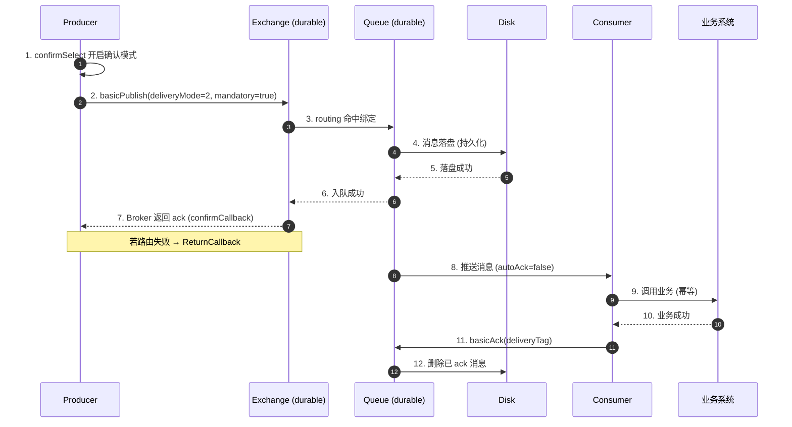
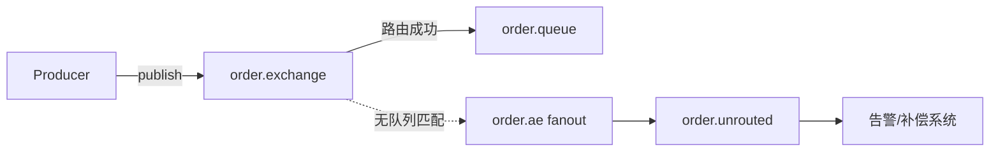
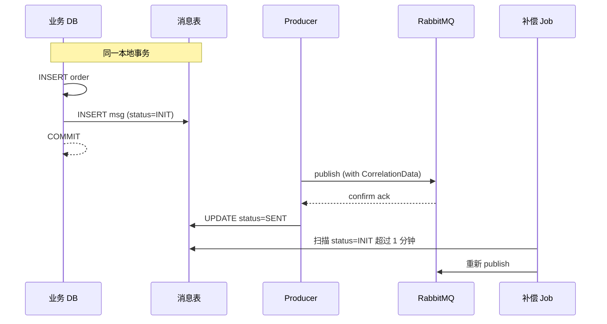

# 第 5 章 进阶：可靠性投递与持久化

消息中间件最怕一个字 —— "丢"。生产者宕机丢、网络抖动丢、Broker 重启丢、消费者还没处理完就 ack 也丢。本章把 RabbitMQ 的可靠性拆成 **生产端 → Broker 端 → 消费端** 三个层面，逐个把链路堵死。

前置知识请回顾 [[02-核心概念-Exchange-Queue-Binding]] 和 [[04-基础-五种工作模式]]。

---

## 一、可靠性链路全景

先建立一张完整的图，后面所有内容都围绕它展开。



> [!note] 关键认知
> 上图的 **每一步都可能失败**。可靠性投递的本质，就是为每一步设计补偿或重试机制。

---

## 二、生产端可靠：Publisher Confirm vs 事务

生产者把消息扔给 Broker，怎么知道 Broker 真的收到了？RabbitMQ 给了两种方案。

### 2.1 两种方案对比

| 维度 | 事务模式 (txSelect) | Publisher Confirm |
|---|---|---|
| 开启方式 | `channel.txSelect()` | `channel.confirmSelect()` |
| 提交 | `txCommit()` / `txRollback()` | 异步回调 ack / nack |
| 性能 | 同步阻塞，TPS 下降 **10 倍** 左右 | 异步，性能损失约 **10%-20%** |
| 是否推荐 | ✗ 不推荐 | ✓ 推荐 |
| 适用 | 几乎没有合理场景 | 所有需要可靠投递的场景 |

> [!warning] 不要混用
> 一个 channel 上 `txSelect` 和 `confirmSelect` **互斥**，开了一个就不能开另一个。

### 2.2 原生客户端三种 Confirm 用法

```java
// 1. 同步等待单条 (最慢)
channel.confirmSelect();
channel.basicPublish(exchange, routingKey, props, body);
if (!channel.waitForConfirms(5000)) {
    // 超时或 nack，需要补偿
}

// 2. 同步批量等待 (折中)
channel.confirmSelect();
for (int i = 0; i < 100; i++) {
    channel.basicPublish(exchange, routingKey, props, body);
}
channel.waitForConfirmsOrDie(5000); // 任一失败就抛异常

// 3. 异步监听 (最快，强烈推荐)
channel.confirmSelect();
channel.addConfirmListener(
    (deliveryTag, multiple) -> {
        // ack 回调：消息成功到达 Broker
        confirmSet.remove(deliveryTag);
    },
    (deliveryTag, multiple) -> {
        // nack 回调：Broker 内部错误，需要重发
        Message msg = confirmSet.get(deliveryTag);
        resend(msg);
    }
);
```

> [!tip] sequenceNumber 怎么拿
> 调用 `channel.getNextPublishSeqNo()` 在 `basicPublish` 之前取到本条消息的 deliveryTag，存到 `ConcurrentSkipListMap` 里。回调来了再按 tag 移除或重发。

### 2.3 Spring Boot 完整示例

```java
@Configuration
public class RabbitConfig {

    @Bean
    public RabbitTemplate rabbitTemplate(ConnectionFactory cf) {
        // 必须在 application.yml 开启:
        // spring.rabbitmq.publisher-confirm-type: correlated
        // spring.rabbitmq.publisher-returns: true
        RabbitTemplate tpl = new RabbitTemplate(cf);
        tpl.setMandatory(true); // 路由失败时触发 ReturnCallback，而不是丢弃

        // 1. ConfirmCallback：消息是否到达 Exchange
        tpl.setConfirmCallback((correlationData, ack, cause) -> {
            String msgId = correlationData != null ? correlationData.getId() : "null";
            if (ack) {
                log.info("消息已到达 Exchange, id={}", msgId);
                MessageStore.markSent(msgId); // 业务表更新状态
            } else {
                log.error("消息未到达 Exchange, id={}, cause={}", msgId, cause);
                MessageStore.markFailed(msgId); // 进入重试调度
            }
        });

        // 2. ReturnCallback：到达 Exchange 但路由不到 Queue
        tpl.setReturnsCallback(returned -> {
            log.error("消息路由失败: exchange={}, rk={}, replyCode={}, replyText={}, body={}",
                returned.getExchange(),
                returned.getRoutingKey(),
                returned.getReplyCode(),
                returned.getReplyText(),
                new String(returned.getMessage().getBody()));
            // 通常发送告警 + 写入死信表
        });
        return tpl;
    }
}

@Service
public class OrderProducer {
    @Resource RabbitTemplate rabbitTemplate;

    public void send(Order order) {
        String msgId = UUID.randomUUID().toString();
        MessageStore.save(msgId, order); // 先入库 (本地消息表)
        CorrelationData cd = new CorrelationData(msgId);
        rabbitTemplate.convertAndSend("order.exchange", "order.create", order, cd);
    }
}
```

> [!example] Python 对照 (pika)
> ```python
> channel.confirm_delivery()
> try:
>     channel.basic_publish(
>         exchange='order.exchange',
>         routing_key='order.create',
>         body=json.dumps(order),
>         properties=pika.BasicProperties(delivery_mode=2),
>         mandatory=True,
>     )
>     print("消息已确认")
> except pika.exceptions.UnroutableError:
>     print("路由失败")
> except pika.exceptions.NackError:
>     print("Broker nack")
> ```

> [!example] Go 对照 (amqp091-go)
> ```go
> ch.Confirm(false)
> confirms := ch.NotifyPublish(make(chan amqp.Confirmation, 1))
> returns  := ch.NotifyReturn(make(chan amqp.Return, 1))
>
> ch.PublishWithContext(ctx, "order.exchange", "order.create", true, false,
>     amqp.Publishing{
>         DeliveryMode: amqp.Persistent, // 2
>         ContentType:  "application/json",
>         Body:         body,
>     })
>
> select {
> case c := <-confirms:
>     if !c.Ack { /* 重发 */ }
> case r := <-returns:
>     log.Printf("路由失败: %+v", r)
> }
> ```

---

## 三、Mandatory 与备份交换器

### 3.1 Mandatory 的两种处置

发布时 `mandatory=true`，意思是 "如果 Exchange 找不到匹配的 Queue，请把消息退回给我，不要默默丢掉"。

- `mandatory=false` (默认)：Broker 直接丢弃，**没人知道**。
- `mandatory=true` + `ReturnCallback`：消息回到生产者，由生产者决定补偿。
- 配置 **备份交换器 (alternate-exchange, AE)**：Broker 自动把无法路由的消息转给 AE。

### 3.2 备份交换器示例

```java
@Bean
public DirectExchange orderExchange() {
    Map<String, Object> args = new HashMap<>();
    args.put("alternate-exchange", "order.ae"); // 指定备份交换器
    return new DirectExchange("order.exchange", true, false, args);
}

@Bean
public FanoutExchange aeExchange() {
    return new FanoutExchange("order.ae", true, false);
}

@Bean
public Queue aeQueue() {
    return new Queue("order.unrouted", true);
}

@Bean
public Binding aeBinding(Queue aeQueue, FanoutExchange aeExchange) {
    return BindingBuilder.bind(aeQueue).to(aeExchange);
}
```

> [!tip] AE 与 Mandatory 的优先级
> 若 Exchange 配置了 AE，则 mandatory 不会触发 ReturnCallback —— 因为消息已经被 AE 接管，不算 "路由失败"。两者一般 **二选一**。



---

## 四、Broker 端可靠：三个 durable 缺一不可

> [!danger] 三位一体
> Exchange durable、Queue durable、Message deliveryMode=2 —— **三者缺一不可**。任何一个没设置，Broker 重启都可能丢消息。

| 对象 | 持久化方式 | 漏掉的后果 |
|---|---|---|
| Exchange | 声明时 `durable=true` | Broker 重启后 Exchange 消失，新消息无处可投 |
| Queue | 声明时 `durable=true` | Broker 重启后 Queue 消失，连同里面的消息一起没了 |
| Message | `BasicProperties.deliveryMode=2` | Queue 还在，但里面的消息没落盘，重启即丢 |

```java
// 完整持久化示例
channel.exchangeDeclare("order.exchange", "direct", true);  // durable=true
channel.queueDeclare("order.queue", true, false, false, null); // durable=true
channel.queueBind("order.queue", "order.exchange", "order.create");

AMQP.BasicProperties props = new AMQP.BasicProperties.Builder()
    .deliveryMode(2)       // 持久化消息
    .contentType("application/json")
    .messageId(UUID.randomUUID().toString())
    .build();

channel.basicPublish("order.exchange", "order.create", true, props, body);
```

> [!warning] 持久化 ≠ 绝对不丢
> 消息从内存写到磁盘有个时间窗口 (Linux 默认 page cache 30s 刷盘)。这段窗口内 Broker 宕机仍可能丢失。要更强保证：
> - 开 **Publisher Confirm** (Broker 真正持久化后才 ack)
> - 用 **镜像队列 / Quorum Queue** (多副本)

---

## 五、消费端可靠：手动 ack + 幂等

### 5.1 关掉自动 ack

```yaml
spring:
  rabbitmq:
    listener:
      simple:
        acknowledge-mode: manual    # 关键
        prefetch: 10                # 限流，防止压垮消费者
        retry:
          enabled: false            # 让我们自己控制重试
```

```java
@RabbitListener(queues = "order.queue")
public void onMessage(Message msg, Channel ch) throws IOException {
    long tag = msg.getMessageProperties().getDeliveryTag();
    String msgId = msg.getMessageProperties().getMessageId();
    try {
        if (IdempotentStore.exists(msgId)) {
            ch.basicAck(tag, false); // 已处理过，直接 ack 不重复消费
            return;
        }
        bizService.handle(msg.getBody());
        IdempotentStore.mark(msgId);  // 业务成功后落幂等表
        ch.basicAck(tag, false);
    } catch (BusinessException be) {
        // 业务错误，没必要重试 → 进死信
        ch.basicNack(tag, false, false);
    } catch (Exception e) {
        // 系统错误，可重试
        ch.basicNack(tag, false, true);  // requeue=true，重新入队
    }
}
```

### 5.2 幂等的两种主流实现

| 方案 | 实现 | 适用场景 |
|---|---|---|
| **唯一 ID + 去重表** | 用 messageId 做主键，DB 唯一约束兜底 | 普通业务、订单创建 |
| **状态机** | 业务对象有明确的状态流转，重复消息会被状态校验挡掉 | 订单支付、账户余额、流程引擎 |

> [!question] 为什么不能用 Redis SETNX 单独做幂等？
> 可以做 **前置过滤**，但不能完全替代 DB 唯一约束。Redis 异步持久化，主从切换有丢数据风险。最稳妥的是 **Redis 做第一道闸 + DB 唯一索引兜底**。

---

## 六、性能与可靠性的权衡

可靠性是有成本的。下面是大致量级 (单机、3KB 消息，仅供参考)：

| 配置组合 | TPS 量级 | 损耗 |
|---|---|---|
| 不持久化 + 无 confirm + autoAck | 50k+ | 基线 |
| 队列/消息持久化 | 15k-20k | 下降约 60% |
| 持久化 + 同步 confirm (单条) | 1k-2k | 下降约 95% |
| 持久化 + **异步 confirm** | 12k-18k | 下降约 70% |
| 持久化 + 异步 confirm + Quorum Queue | 8k-12k | 下降约 80% |

> [!tip] 提速的几个手段
> 1. **必用异步 confirm**，永远不用 `waitForConfirms` 同步阻塞
> 2. **批量发送**：客户端攒一批再 publish，但不要批量 confirm (一条失败全失败)
> 3. **多 channel 并行**：channel 不是线程安全的，每个生产线程一个
> 4. SSD 磁盘 + 独立挂载 mnesia 目录
> 5. 大消息走 **对象存储**，MQ 只传引用 (URL/key)

---

## 七、常见坑

> [!danger] 坑 1：只持久化 Queue，没持久化 Message
> 最常见的错误。`queueDeclare(name, true, ...)` 写了，但 `BasicProperties` 里没设 `deliveryMode=2`。Broker 重启后队列还在，里面消息全没了。

> [!danger] 坑 2：confirmCallback 没处理 nack
> 很多人只关心 ack 不管 nack，认为 "反正业务大部分时间是成功的"。结果 Broker 偶尔抽风返回 nack，那批消息就永远丢了。**必须维护未确认消息表 + 重发机制**。

> [!danger] 坑 3：消费端 try-catch 后 ack
> ```java
> try {
>     biz.handle(msg);
> } catch (Exception e) {
>     log.error(e);
> }
> ch.basicAck(tag, false); // ✗ 错！业务失败也 ack，消息直接丢了
> ```
> 应当根据异常类型决定 ack / nack / 死信。

> [!danger] 坑 4：mandatory + 无 ReturnCallback
> mandatory=true 但没注册 ReturnCallback，等同于消息悄无声息地被退回又被丢弃。**两者必须配对**。

> [!danger] 坑 5：以为持久化就万无一失
> RabbitMQ **不保证 "永不丢消息"**。在以下窗口内仍可能丢失：
> - 消息从内存到磁盘的 fsync 间隙
> - 主从复制延迟期间主节点宕机
> - 磁盘损坏 / 文件系统损坏
> 真正接近 100% 的方案是 **本地消息表 + 定时补偿 + MQ + 幂等消费**，而不是迷信 Broker。

---

## 八、本地消息表：最终一致性的标准答案



> [!note] 核心思路
> **业务表和消息表在同一事务里写**，保证 "业务成功 ↔ 消息一定存在"。后续 confirm 回调或定时 Job 负责把消息从 INIT 推到 SENT。即使 Broker 短暂不可用，重启后 Job 也能把积压消息追平。

---

## 九、常见面试题

> [!question] Q1：RabbitMQ 如何保证消息不丢失？
> 三层防护：
> - **生产端**：开启 Publisher Confirm + mandatory + ReturnCallback；推荐配合本地消息表
> - **Broker 端**：Exchange / Queue / Message 三处持久化，配合镜像队列或 Quorum Queue 实现多副本
> - **消费端**：手动 ack + 业务幂等

> [!question] Q2：Confirm 和事务有什么区别？为什么不用事务？
> 事务是同步阻塞的 AMQP 标准协议，每条消息都要 commit/rollback，性能下降约 10 倍。Confirm 是 RabbitMQ 扩展，支持异步回调，性能损失只有 10-20%，且语义更清晰。**只用 Confirm。**

> [!question] Q3：mandatory 参数的作用？没人匹配的消息怎么办？
> mandatory=true 时，路由不到 Queue 的消息会回退给生产者 (ReturnCallback)，而不是丢弃。配合 ReturnCallback 做告警；或配置 alternate-exchange 把无主消息转到备份队列。

> [!question] Q4：消费者怎么做幂等？
> 主流两种：唯一 ID + 数据库唯一索引去重表；业务状态机。Redis 可做前置加速。**幂等是消费方的责任，不是 MQ 的责任。**

> [!question] Q5：开了所有可靠性配置就 100% 不丢吗？
> 不。fsync 间隙、主从切换、磁盘故障都可能丢。要做到接近 100%，需要 **本地消息表 + 定时补偿 + 消费幂等**，把可靠性责任分散到业务系统而非完全依赖 MQ。

> [!question] Q6：Publisher Confirm 的 nack 什么时候触发？怎么处理？
> Broker 内部错误 (例如持久化失败、队列不可用) 时返回 nack。处理方式：维护未确认消息 Map，按 deliveryTag 找到原消息，触发重发或写入告警系统。

---

## 十、延伸阅读

- [[06-进阶-死信队列与延迟消息]]：消息消费失败后的去向
- [[07-进阶-镜像队列与Quorum Queue]]：Broker 端的多副本方案
- [[08-运维-集群搭建与高可用]]：生产环境集群部署
- [[09-运维-监控与性能调优]]：吞吐量与可靠性的实际平衡
- [[10-实战-本地消息表与最终一致性]]：分布式事务方案对比

外部资源：

- RabbitMQ 官方文档：Reliability Guide (https://www.rabbitmq.com/reliability.html)
- RabbitMQ 官方文档：Publisher Confirms (https://www.rabbitmq.com/confirms.html)
- 《RabbitMQ 实战指南》朱忠华，第 4 章
- Spring AMQP Reference：Publisher Confirms and Returns

---

> [!tip] 本章 take-away
> 1. 生产端用 **异步 Publisher Confirm**，绝不用事务
> 2. Broker 端 **三个 durable 缺一不可** + 镜像 / Quorum
> 3. 消费端 **手动 ack + 业务幂等**
> 4. 真正的可靠性来自 **本地消息表 + 定时补偿**，不要把命运完全交给 MQ
