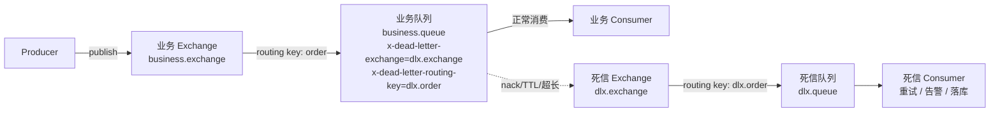
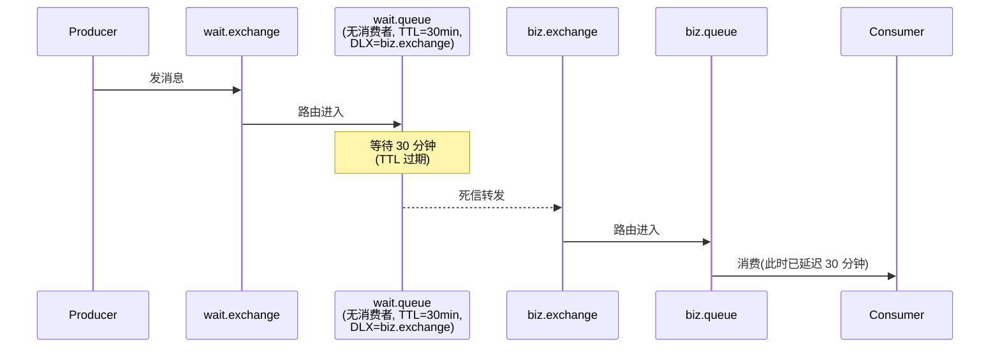
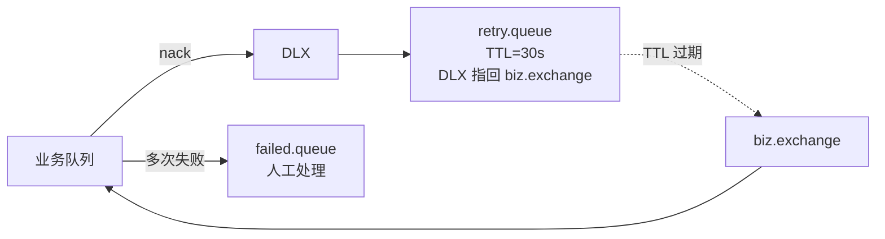

# 第 6 章 进阶:死信队列、延迟队列与优先级

前面几章 [[03-核心概念-交换器与队列绑定]] 已经把 RabbitMQ 的"骨架"讲完了,本章把骨架上挂的几块"硬骨头"啃下来:**死信队列(DLX)**、**延迟队列(Delayed Queue)** 和 **优先级队列(Priority Queue)**。这三块是面试高频区,也是生产环境出问题最多的地方,搞清楚机制比记住配置参数重要得多。

---

## 一、死信(Dead Letter)是怎么产生的

一条消息变成"死信",只有三种可能。记住,**只有这三种**,其他情况(比如消费者宕机、网络抖动)不会让消息死。

> [!note] 死信产生的三种条件
> 1. **消息被消费者拒绝**:`basic.reject` 或 `basic.nack`,**并且 `requeue=false`**(不重新入队)
> 2. **消息 TTL 过期**:消息或队列设置了 TTL,消息在队列中待的时间超过这个值
> 3. **队列达到最大长度**:队列设置了 `x-max-length` 或 `x-max-length-bytes`,头部最早的消息会被挤出去变死信

下面这张表帮你一眼看清触发点:

| 触发条件 | 配置项 | 触发位置 | 典型场景 |
|---|---|---|---|
| 拒绝不重入队 | `basic.nack(requeue=false)` | 消费者侧 | 业务校验失败、无法重试的脏数据 |
| TTL 过期 | `x-message-ttl` / message expiration | 队列或消息 | 延迟队列、限时未支付订单 |
| 队列超限 | `x-max-length` / `x-max-length-bytes` | 队列声明时 | 防止队列堆积撑爆 broker |

> [!warning] 容易混淆的点
> `basic.reject(requeue=true)` 和 `basic.nack(requeue=true)` **不会** 产生死信,消息会被丢回原队列头部继续被消费(很可能立刻又被同一个消费者拿到,造成死循环)。生产环境慎用 `requeue=true`。

---

## 二、死信交换器(DLX)的配置

死信不会凭空消失,它会被路由到一个你预先配置好的**死信交换器(Dead Letter Exchange, DLX)**。DLX 本质就是一个普通的 Exchange,只不过是在队列声明时通过 `arguments` 指定的。

### 2.1 队列声明参数

| 参数名 | 必填 | 说明 |
|---|---|---|
| `x-dead-letter-exchange` | 是 | 死信被丢到哪个 Exchange |
| `x-dead-letter-routing-key` | 否 | 死信进入 DLX 时使用的 routing key,**不设置则沿用消息原 routing key** |

> [!tip] 强烈建议显式设置 routing key
> 沿用原 routing key 在复杂拓扑下会导致死信路由到错误队列。养成显式声明 `x-dead-letter-routing-key` 的习惯,问题排查会轻松一个量级。

### 2.2 死信流转图



参考前置知识 [[04-消息可靠性-confirm-与-ack]] 里关于 ack/nack 的内容。

---

## 三、Spring Boot 完整示例:业务队列 + DLX

下面这套配置是生产中能直接抄走的最小可用骨架。

### 3.1 配置类

```java
@Configuration
public class RabbitDlxConfig {

    public static final String BIZ_EXCHANGE = "business.exchange";
    public static final String BIZ_QUEUE    = "business.queue";
    public static final String BIZ_RK       = "order";

    public static final String DLX_EXCHANGE = "dlx.exchange";
    public static final String DLX_QUEUE    = "dlx.queue";
    public static final String DLX_RK       = "dlx.order";

    // ---- 业务侧 ----
    @Bean
    public DirectExchange bizExchange() {
        return new DirectExchange(BIZ_EXCHANGE, true, false);
    }

    @Bean
    public Queue bizQueue() {
        Map<String, Object> args = new HashMap<>();
        args.put("x-dead-letter-exchange", DLX_EXCHANGE);
        args.put("x-dead-letter-routing-key", DLX_RK);
        // 可选:队列级 TTL
        // args.put("x-message-ttl", 60000);
        // 可选:最大长度
        // args.put("x-max-length", 10000);
        return new Queue(BIZ_QUEUE, true, false, false, args);
    }

    @Bean
    public Binding bizBinding() {
        return BindingBuilder.bind(bizQueue()).to(bizExchange()).with(BIZ_RK);
    }

    // ---- 死信侧 ----
    @Bean
    public DirectExchange dlxExchange() {
        return new DirectExchange(DLX_EXCHANGE, true, false);
    }

    @Bean
    public Queue dlxQueue() {
        return new Queue(DLX_QUEUE, true);
    }

    @Bean
    public Binding dlxBinding() {
        return BindingBuilder.bind(dlxQueue()).to(dlxExchange()).with(DLX_RK);
    }
}
```

### 3.2 业务消费者(主动 nack 让消息变死信)

```java
@Component
public class OrderConsumer {

    @RabbitListener(queues = RabbitDlxConfig.BIZ_QUEUE)
    public void handle(Message msg, Channel channel) throws IOException {
        long tag = msg.getMessageProperties().getDeliveryTag();
        try {
            String body = new String(msg.getBody(), StandardCharsets.UTF_8);
            // ... 业务处理
            if (isInvalid(body)) {
                // 脏数据,不重入队,进 DLX
                channel.basicNack(tag, false, false);
                return;
            }
            channel.basicAck(tag, false);
        } catch (Exception e) {
            // 系统异常也丢死信,让 DLQ 消费者集中重试
            channel.basicNack(tag, false, false);
        }
    }

    private boolean isInvalid(String body) { /* ... */ return false; }
}
```

### 3.3 死信消费者(重试或告警)

```java
@Component
public class DlxConsumer {

    @RabbitListener(queues = RabbitDlxConfig.DLX_QUEUE)
    public void handle(Message msg) {
        Map<String, Object> headers = msg.getMessageProperties().getHeaders();
        // x-death 头里有完整死信原因
        List<?> xDeath = (List<?>) headers.get("x-death");
        String reason = xDeath != null && !xDeath.isEmpty()
            ? ((Map<?, ?>) xDeath.get(0)).get("reason").toString()
            : "unknown";

        log.warn("收到死信, reason={}, body={}", reason,
                 new String(msg.getBody(), StandardCharsets.UTF_8));

        // 策略:落库 + 告警,严重的走人工
        alertService.send(reason, msg);
    }
}
```

> [!example] `x-death` 头长这样
> ```json
> [{
>   "count": 1,
>   "reason": "rejected",        // rejected | expired | maxlen
>   "queue": "business.queue",
>   "time": "2026-05-28T10:00:00Z",
>   "exchange": "business.exchange",
>   "routing-keys": ["order"]
> }]
> ```
> 一条消息在多个队列间死信流转时,这个数组会按时间倒序追加,排查链路非常有用。

---

## 四、延迟队列的两种实现

> [!question] 为什么需要延迟队列?
> 典型场景:订单 30 分钟未支付自动取消、活动倒计时、消息定时推送。这些场景本质都是"消息发出后等一段时间再被消费"。RabbitMQ 原生**不支持**延迟投递,有两种主流做法。

### 4.1 方案 A:TTL + DLX 模拟

思路:消息进入一个**没有消费者**的"等待队列",等到 TTL 过期,通过 DLX 转到真正的"业务队列"被消费。



**队列级 TTL 与消息级 TTL 的差异:**

| 维度 | 队列级 TTL (`x-message-ttl`) | 消息级 TTL (`expiration` 属性) |
|---|---|---|
| 设置位置 | 队列声明 args | 发送消息时 properties |
| 灵活性 | 整队列固定 | 每条消息可不同 |
| 过期检测 | 入队时启动计时 | 入队时启动计时 |
| **致命问题** | 无 | **队头阻塞**:头部消息未过期,后面消息即便已过期也不会出队 |

> [!danger] 消息级 TTL 的最大坑:队头阻塞
> RabbitMQ 只检查队列头部消息是否过期,不会扫描整个队列。如果你前后发了两条消息,前面 TTL=10 分钟、后面 TTL=1 分钟,**后面那条要等前面那条过期了才会被检测**,实际延迟变成 10 分钟而不是 1 分钟。
>
> 用 TTL+DLX 模拟延迟队列时,**只能用固定 TTL**(即队列级 TTL),不能让每条消息有不同的延迟时间。要支持任意延迟,请用方案 B。

### 4.2 方案 B:`rabbitmq-delayed-message-exchange` 插件(推荐)

这是官方维护的延迟消息插件,通过一种新的 Exchange 类型 `x-delayed-message` 实现按消息独立延迟,**没有队头阻塞问题**。

#### 安装

```bash
# 1. 下载插件到 RabbitMQ 插件目录(版本号要和 RabbitMQ 对齐)
wget https://github.com/rabbitmq/rabbitmq-delayed-message-exchange/releases/download/v3.13.0/rabbitmq_delayed_message_exchange-3.13.0.ez \
    -O $RABBITMQ_HOME/plugins/rabbitmq_delayed_message_exchange-3.13.0.ez

# 2. 启用
rabbitmq-plugins enable rabbitmq_delayed_message_exchange

# 3. 重启 RabbitMQ
systemctl restart rabbitmq-server
```

Docker 用户:

```dockerfile
FROM rabbitmq:3.13-management
COPY rabbitmq_delayed_message_exchange-3.13.0.ez /opt/rabbitmq/plugins/
RUN rabbitmq-plugins enable --offline rabbitmq_delayed_message_exchange
```

#### Spring Boot 使用

```java
@Configuration
public class DelayedConfig {

    public static final String DELAY_EX = "delay.exchange";
    public static final String DELAY_Q  = "delay.queue";
    public static final String DELAY_RK = "delay.order";

    @Bean
    public CustomExchange delayExchange() {
        Map<String, Object> args = new HashMap<>();
        args.put("x-delayed-type", "direct");   // 底层路由类型
        return new CustomExchange(DELAY_EX, "x-delayed-message", true, false, args);
    }

    @Bean
    public Queue delayQueue() { return new Queue(DELAY_Q, true); }

    @Bean
    public Binding delayBinding() {
        return BindingBuilder.bind(delayQueue())
                .to(delayExchange()).with(DELAY_RK).noargs();
    }
}
```

发送时通过 `x-delay` header 指定延迟毫秒数:

```java
@Service
public class DelaySender {
    @Autowired RabbitTemplate rabbitTemplate;

    public void sendDelay(String body, long delayMs) {
        rabbitTemplate.convertAndSend(
            DelayedConfig.DELAY_EX,
            DelayedConfig.DELAY_RK,
            body,
            msg -> {
                msg.getMessageProperties().setHeader("x-delay", delayMs);
                return msg;
            });
    }
}
```

Python (pika) 对照:

```python
import pika

conn = pika.BlockingConnection(pika.ConnectionParameters('localhost'))
ch = conn.channel()
ch.exchange_declare(
    exchange='delay.exchange',
    exchange_type='x-delayed-message',
    arguments={'x-delayed-type': 'direct'},
    durable=True,
)
ch.basic_publish(
    exchange='delay.exchange',
    routing_key='delay.order',
    body=b'order-123',
    properties=pika.BasicProperties(headers={'x-delay': 30000}),  # 30s
)
```

Go (amqp091-go) 对照:

```go
ch.Publish("delay.exchange", "delay.order", false, false, amqp.Publishing{
    ContentType: "text/plain",
    Body:        []byte("order-123"),
    Headers:     amqp.Table{"x-delay": int32(30000)},
})
```

> [!warning] 插件方案的限制
> 1. 延迟期间消息存在节点本地的 Mnesia/Khepri,**不能像普通队列那样集群高可用**,节点宕机延迟消息可能丢
> 2. 单节点延迟消息数量过大会拖慢 broker,官方建议单节点延迟消息控制在百万级以内
> 3. `x-delay` 最大值约 `2^32 ms`(约 49 天),超过会立即投递

---

## 五、优先级队列

让高优先级消息插队被消费,典型场景是 VIP 用户请求优先处理。

### 5.1 声明带优先级的队列

```java
@Bean
public Queue priorityQueue() {
    Map<String, Object> args = new HashMap<>();
    args.put("x-max-priority", 10);   // 范围 1-255,强烈建议 1-10
    return new Queue("priority.queue", true, false, false, args);
}
```

> [!tip] 为什么建议 1-10 而不是 1-255?
> 优先级数越多,broker 内部维护的排序结构越复杂,内存和 CPU 占用越高。10 个级别足以覆盖 99% 的业务诉求,255 个完全是浪费。

### 5.2 发送时设置优先级

```java
rabbitTemplate.convertAndSend("", "priority.queue", "VIP 任务", msg -> {
    msg.getMessageProperties().setPriority(9);
    return msg;
});
```

### 5.3 行为细节

| 行为 | 说明 |
|---|---|
| 未设置 priority 的消息 | 视为优先级 0 |
| priority 超过 `x-max-priority` | 按 `x-max-priority` 处理 |
| 已存在的队列改 `x-max-priority` | **不允许**,必须删除重建 |
| 与 prefetch 配合 | prefetch 太大会让已经被 push 到 consumer 本地缓冲的低优先级消息抢先消费 |

> [!warning] 优先级队列三大坑
> 1. **内存占用高**:优先级队列在 broker 内部维护多个子队列,内存占用显著高于普通队列
> 2. **不能与 lazy queue 同用**:`x-queue-mode=lazy` 与优先级互斥
> 3. **prefetch 影响优先级生效**:把消费者 `prefetch` 调到 1 才能保证严格优先级,否则会被本地缓冲打乱

---

## 六、重试机制:本地重试 vs DLX 集中重试

Spring AMQP 提供了开箱即用的 `RetryTemplate`,可以在消费者端本地重试。

### 6.1 本地重试(简单场景)

```yaml
spring:
  rabbitmq:
    listener:
      simple:
        retry:
          enabled: true
          initial-interval: 1000ms
          max-attempts: 3
          multiplier: 2          # 指数退避
          max-interval: 10000ms
```

> [!note] 本地重试的本质
> Spring 在消费者**进程内**做重试,**消息没有重新入队**,broker 看到的依然是一次投递。重试期间 channel 阻塞,broker 也不会把这条消息推给其他消费者。

### 6.2 DLX 集中重试(推荐生产用)

本地重试有两个明显短板:进程重启会丢重试状态、长时间退避会把 channel 卡死。生产环境更推荐组合:

```
业务队列 ──失败 nack(requeue=false)──> DLX ──> 重试队列(TTL=N秒) ──TTL过期──> 业务交换器 ──> 业务队列
```



通过在消息头里记录 `x-retry-count`,达到阈值后路由到 `failed.queue` 走人工兜底,避免无限循环。

---

## 七、实战案例:订单超时未支付自动取消

业务诉求:用户下单后 30 分钟未支付,系统自动取消订单并释放库存。

### 7.1 方案选型

| 方案 | 优点 | 缺点 |
|---|---|---|
| 数据库轮询 | 简单 | 性能差、不精准 |
| 定时任务扫表 | 兼容老系统 | 海量订单时压力大 |
| Redis Key 过期 | 快 | 过期回调不可靠,容易丢 |
| **RabbitMQ 延迟队列** | **精准、可靠、解耦** | 依赖 MQ |

### 7.2 基于延迟插件的实现

```java
// 下单后发送延迟消息
@Service
public class OrderService {
    @Autowired DelaySender sender;

    @Transactional
    public void createOrder(Order order) {
        orderRepo.save(order);
        stockService.lock(order);
        // 30 分钟后投递取消消息
        sender.sendDelay(order.getId(), Duration.ofMinutes(30).toMillis());
    }
}

// 取消消费者
@Component
public class OrderCancelConsumer {

    @RabbitListener(queues = DelayedConfig.DELAY_Q)
    public void onCancel(String orderId) {
        Order o = orderRepo.findById(orderId).orElse(null);
        // 幂等检查:已支付的不取消
        if (o == null || o.getStatus() != OrderStatus.UNPAID) return;
        o.setStatus(OrderStatus.CANCELLED);
        orderRepo.save(o);
        stockService.release(orderId);
    }
}
```

> [!tip] 三个必须做的工程实践
> 1. **幂等**:延迟消息可能重复消费,必须在消费时检查订单当前状态
> 2. **支付成功要补一个"提前取消延迟消息"动作吗?** 不需要。消息到了发现已支付直接 return 即可,节省工程复杂度
> 3. **延迟时间留余量**:业务说 30 分钟,设 31 分钟,避免边界并发

详见 [[05-生产实战-幂等与重复消费]] 关于幂等的进一步讨论。

---

## 八、常见坑总结

> [!danger] 高频踩坑清单
> 1. **TTL 模式队头阻塞**:消息级 TTL 不同会导致后面短 TTL 的消息被前面长 TTL 的卡住,延迟变形
> 2. **DLX 没绑队列**:消息变死信后无队列接收,直接丢失。务必让 DLX 至少绑定一个队列
> 3. **`x-dead-letter-routing-key` 没设**:沿用原 routing key,死信路由到非预期队列
> 4. **优先级队列内存爆炸**:`x-max-priority` 设大、消息体大、堆积量大,内存几何级增长
> 5. **延迟插件单点风险**:延迟消息不参与 mirror queue / quorum queue 的高可用,节点挂了延迟消息可能丢
> 6. **本地重试卡 channel**:`max-attempts` 设大、`max-interval` 设长,会让 channel 长时间被一条消息占用,导致整个消费者吞吐下降
> 7. **死信无限循环**:DLQ 消费者再次 nack 到原 DLX 时如果配置错误,死信会在两个队列间反复打转
> 8. **修改已有队列参数**:`x-dead-letter-exchange`、`x-max-priority` 等参数声明后不能修改,必须删除重建,生产慎重

---

## 九、常见面试题

> [!question] Q1:死信产生的条件有哪几种?
> 三种:**消费者拒绝且不重入队**、**消息或队列 TTL 过期**、**队列达到最大长度上限**。其他情况(如消费者宕机、连接断开)不会产生死信。

> [!question] Q2:RabbitMQ 怎么实现延迟队列?两种方案各有什么坑?
> - **TTL + DLX 方案**:利用消息或队列 TTL 过期后通过 DLX 转到业务队列。坑在于消息级 TTL 会因为 broker 只检查队头,导致**队头阻塞**,所以这种方案只能做固定延迟。
> - **delayed-message-exchange 插件方案**:每条消息独立延迟,无阻塞问题,推荐。坑在于延迟消息不能参与高可用复制,单节点失败可能丢消息。

> [!question] Q3:优先级队列为什么建议优先级范围在 1-10?
> 优先级越多,broker 内部需要维护的子队列结构越复杂,内存和 CPU 开销越大。10 级足够覆盖业务,255 级是浪费。

> [!question] Q4:本地重试和 DLX 重试哪个好?
> 各有场景。本地重试简单适合短暂瞬时错误。生产推荐 DLX 集中重试,通过"业务队列 → DLX → retry.queue(TTL) → 业务队列"循环,搭配 `x-retry-count` 控制最大次数,避免本地重试卡 channel 与丢状态。

> [!question] Q5:消息变成死信后,头部 `x-death` 里有什么?
> 数组,每个元素包含 `reason`(rejected/expired/maxlen)、`queue`(从哪个队列死的)、`exchange`、`routing-keys`、`time`、`count` 等。多次死信会按时间倒序追加,排查链路用。

> [!question] Q6:订单 30 分钟未支付取消,为什么不用 Redis Key 过期?
> Redis Key 过期回调基于 keyspace notifications,**不可靠**(订阅模式不持久化,客户端断开会丢通知),且在集群下行为不一致。延迟队列在消息可靠性上有 ack/confirm 兜底,更适合生产。

---

## 十、延伸阅读

- [[02-安装与管理界面]] 复习 broker 与管理界面基础
- [[03-核心概念-交换器与队列绑定]] 复习 Exchange/Queue/Binding 模型
- [[04-消息可靠性-confirm-与-ack]] ack/nack/confirm 是死信机制的前提
- [[05-生产实战-幂等与重复消费]] 延迟队列与重试都必须配合幂等
- [[07-集群与高可用]] 延迟插件与镜像队列、quorum queue 的兼容性
- 官方文档: `https://www.rabbitmq.com/dlx.html`
- 延迟插件源码: `https://github.com/rabbitmq/rabbitmq-delayed-message-exchange`
- Spring AMQP 参考: `https://docs.spring.io/spring-amqp/reference/`
