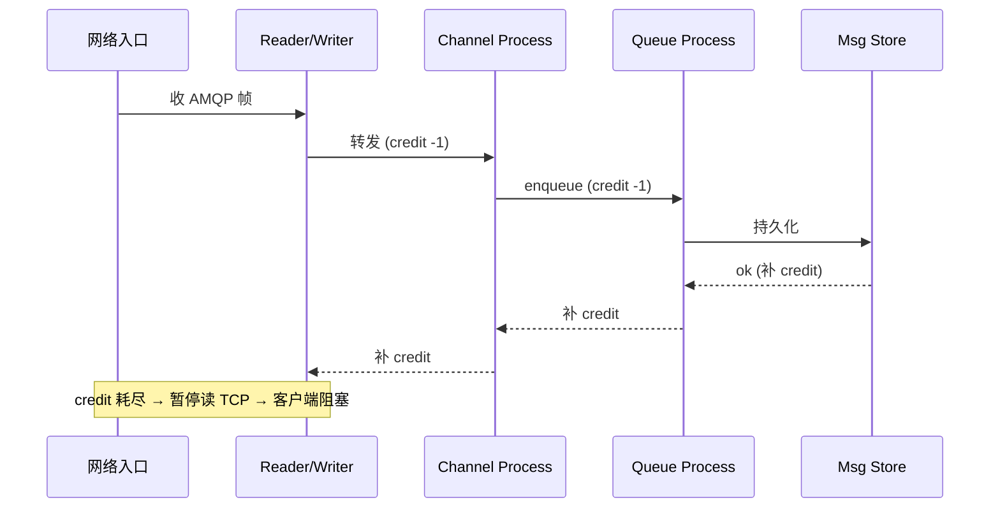
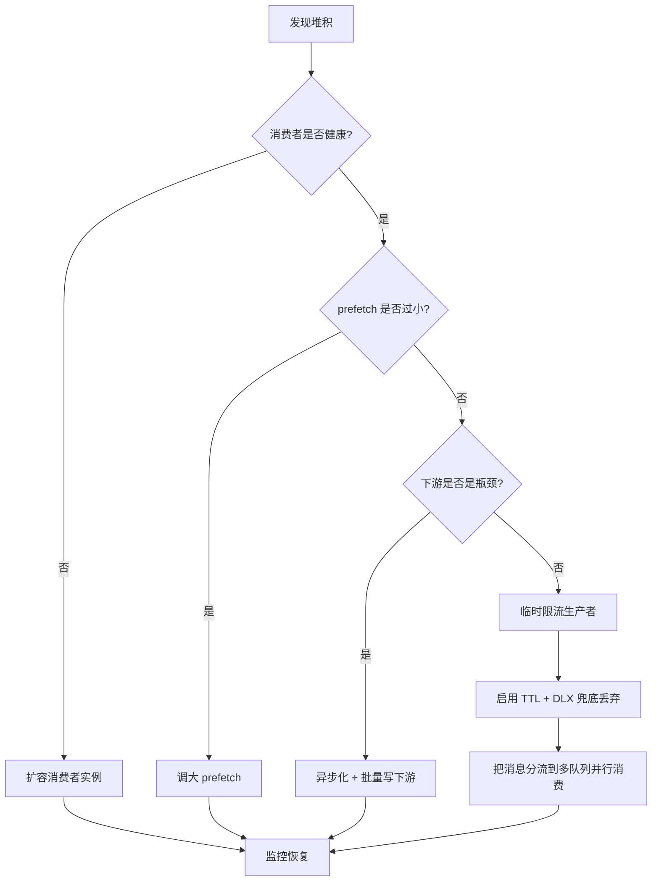
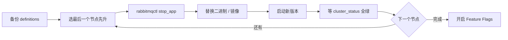
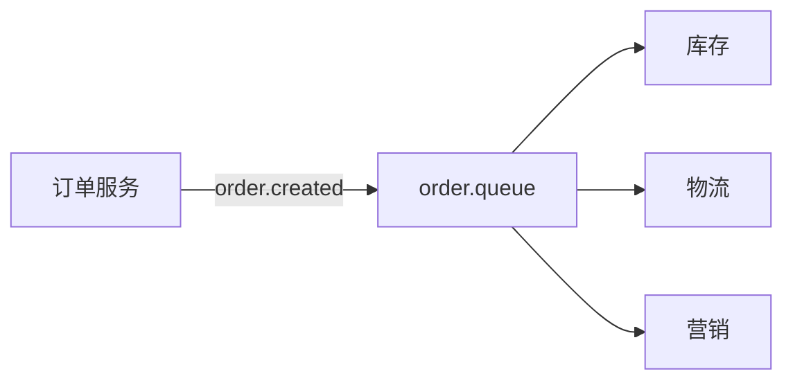
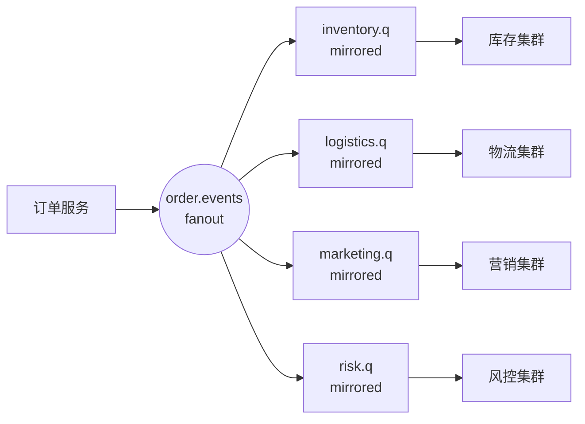

# RabbitMQ 大神篇 - 性能调优与生产实践

到这一章,你应该已经能熟练写出 Producer/Consumer、搭建集群、配置镜像或 Quorum 队列了。但生产环境真正考验的不是"会不会用",而是"能不能扛得住、出事能不能救回来"。这一章我们从架构师视角,把单机性能、集群规划、监控告警、容灾安全、容器化、反模式、面试题一次性讲透。

如果还没看过前面的基础,建议先回顾 [[00-MOC-RabbitMQ总览]],并确保 [[07-高级-集群与高可用]] 已经吃透。

---

## 一、性能基线: 心里要有个数

很多人调优瞎调,根本原因是不知道"正常应该是多少"。先把基线印在脑子里。

### 单机经典队列吞吐量参考 (3.13 / Erlang 26, 4 核 8G, SSD)

| 场景 | 吞吐量 (msg/s) | 备注 |
|---|---|---|
| Transient + autoAck + 1KB | 50k ~ 80k | 几乎是网络上限 |
| Transient + manual ack + 1KB | 30k ~ 50k | ack 会拖慢 |
| Persistent + publisher confirm + 1KB | 6k ~ 12k | 受 fsync 影响 |
| Persistent + tx (事务模式) | 500 ~ 1500 | 事务模式直接腰斩,不要用 |
| Quorum 队列 + persistent + confirm | 3k ~ 8k | Raft 复制有开销 |
| Stream 队列 + batch publish | 100k ~ 1M | 顺序写,接近 Kafka 量级 |

> [!note] 关键洞察
> 持久化 + Publisher Confirm 是生产的"政治正确",但代价是吞吐量从 5 万掉到 1 万。**不要把 RabbitMQ 当 Kafka 用**——需要百万级吞吐就别选经典队列,选 Stream 或者直接换 Kafka。

### Quorum vs Classic Mirrored vs Stream

| 维度 | Classic Mirrored (已废弃) | Quorum | Stream |
|---|---|---|---|
| 一致性算法 | 主从异步复制 | Raft 强一致 | Raft (元数据) + 追加日志 |
| 吞吐量 | 中 | 中低 | 极高 |
| 延迟 | 低 | 中 | 低 (批量) |
| 消息保留 | 消费即删 | 消费即删 | 按时间/大小保留,可重放 |
| 适用场景 | 不要再用 | 核心业务、需要可靠性 | 日志流、事件溯源、大吞吐 |
| 内存占用 | 全量驻留 | 滑动窗口 + 磁盘 | 几乎全在磁盘 |

> [!warning] 镜像队列已死
> 3.9 起 Classic Mirrored 被标记为 deprecated, 4.0 完全移除。**新项目直接 Quorum**。还在用镜像队列的,做好迁移预算。

---

## 二、Connection 与 Channel 优化

这是最容易踩的坑。我见过线上服务把 RabbitMQ 拖死,根因是开发同学每发一条消息 new 一个 Connection。

> [!danger] 反模式: 每次发消息建连接
> ```java
> // 错误示范!!!
> public void send(String msg) {
>     Connection conn = factory.newConnection();  // TCP 三次握手 + AMQP 握手
>     Channel ch = conn.createChannel();
>     ch.basicPublish("", "q", null, msg.getBytes());
>     conn.close();  // 又一次四次挥手
> }
> ```
> 这种代码在 QPS 100 以下你看不出问题,到了 1k QPS 直接把 broker 的 file descriptor 耗光,日志里全是 `accept_failed`。

### 正确姿势: Connection 单例 + Channel 池

```java
@Configuration
public class RabbitConfig {

    @Bean
    public CachingConnectionFactory connectionFactory() {
        CachingConnectionFactory cf = new CachingConnectionFactory();
        cf.setHost("rmq.prod.local");
        cf.setUsername("app");
        cf.setPassword("***");

        // 关键参数
        cf.setChannelCacheSize(50);              // 每个 Connection 缓存的 Channel 数
        cf.setConnectionCacheSize(2);            // Connection 数,一般 1~2 个
        cf.setCacheMode(CacheMode.CONNECTION);   // 高并发用 CONNECTION 模式
        cf.setPublisherConfirmType(ConfirmType.CORRELATED);
        cf.setPublisherReturns(true);

        // 心跳和超时
        cf.getRabbitConnectionFactory().setRequestedHeartbeat(30);
        cf.getRabbitConnectionFactory().setConnectionTimeout(15000);
        return cf;
    }
}
```

> [!tip] Connection vs Channel 的工程经验
> - **Connection**: 重 (TCP + TLS + AMQP handshake), 建议 1 个进程 1~2 个,长连接复用
> - **Channel**: 轻 (逻辑通道), 但**不是线程安全的**。同一个 Channel 不要跨线程用,要么 ThreadLocal 要么池化
> - 一个 Connection 上 Channel 不要超过 200, Channel 上限默认 2047,但太多会让 broker 调度压力大

### Python (pika) 对照

```python
import pika
from pika.adapters.blocking_connection import BlockingConnection

# 全局单例
params = pika.ConnectionParameters(
    host='rmq.prod.local',
    heartbeat=30,
    blocked_connection_timeout=300,
    connection_attempts=3,
    retry_delay=2,
    credentials=pika.PlainCredentials('app', '***'),
)
connection = BlockingConnection(params)

def send(msg: str):
    channel = connection.channel()  # 轻量,但仍建议复用
    channel.basic_publish(exchange='', routing_key='q', body=msg.encode())
```

---

## 三、Producer 优化

### 1. 批量发送 + 异步 Confirm

最大的杀手是同步 confirm。每发一条 `waitForConfirms()` 一下,吞吐量直接掉到几百。正确做法是**异步 confirm + 滑动窗口**:

```java
channel.confirmSelect();

// 用 ConcurrentSkipListMap 存未确认的消息, key = deliveryTag
ConcurrentNavigableMap<Long, String> outstanding = new ConcurrentSkipListMap<>();

channel.addConfirmListener(
    (tag, multiple) -> {  // ack
        if (multiple) {
            outstanding.headMap(tag, true).clear();
        } else {
            outstanding.remove(tag);
        }
    },
    (tag, multiple) -> {  // nack
        log.error("Message nacked, tag={}, multiple={}", tag, multiple);
        // 重发逻辑
    }
);

for (int i = 0; i < 10000; i++) {
    long seq = channel.getNextPublishSeqNo();
    String body = "msg-" + i;
    outstanding.put(seq, body);
    channel.basicPublish("ex", "rk", PERSISTENT_TEXT_PLAIN, body.getBytes());
}

// 退出前 flush
channel.waitForConfirmsOrDie(60_000);
```

### 2. 自行压缩 Payload

RabbitMQ 本身不压缩消息(传输层 TLS 可以开,但 CPU 开销大)。如果消息体大,自己用 LZ4 / Snappy 压缩:

```java
byte[] compressed = LZ4Factory.fastestInstance()
    .fastCompressor()
    .compress(payload);

AMQP.BasicProperties props = new AMQP.BasicProperties.Builder()
    .contentEncoding("lz4")
    .deliveryMode(2)
    .build();

channel.basicPublish("ex", "rk", props, compressed);
```

消费端按 `contentEncoding` 头判断要不要解压。

> [!example] 实测数据
> 一条 5KB 的 JSON 订单消息,LZ4 压缩后 1.2KB,吞吐量提升 ~3x,broker 内存压力直接砍半。CPU 多耗 5% 左右,完全划算。

---

## 四、Consumer 优化

### prefetch 调优心法

prefetch (qos) 是消费端最关键的一个旋钮:

```java
channel.basicQos(50);  // 一次最多 50 条未 ack
```

| 业务类型 | 推荐 prefetch | 原因 |
|---|---|---|
| CPU 密集 (复杂计算) | 1 ~ 10 | 处理慢,多了占内存 |
| IO 密集 (查 DB / 调 RPC) | 50 ~ 200 | 等待时间长,多缓存几条 |
| 极轻量 (纯转发) | 500 ~ 1000 | 让网络吃饱 |
| 顺序处理 (有序消费) | 1 | 必须 1, 否则乱序 |

> [!warning] 不要无脑设大
> 我见过有人直接 `basicQos(10000)`,结果一个 consumer 把队列里所有消息都拉到本地内存,然后挂了。其他 consumer 干瞪眼,因为消息都被那一个"贪心鬼" prefetch 走了。

### 多消费者并发模型

```java
@RabbitListener(
    queues = "order.queue",
    concurrency = "5-20"  // 最小 5, 最大 20 线程
)
public void handle(Order order, Channel ch,
                   @Header(AmqpHeaders.DELIVERY_TAG) long tag) throws IOException {
    try {
        process(order);
        ch.basicAck(tag, false);
    } catch (BusinessException e) {
        ch.basicNack(tag, false, false);  // 不重入队,进 DLX
    } catch (Exception e) {
        ch.basicNack(tag, false, true);   // 系统异常,重试
    }
}
```

> [!tip] 并发模型选择
> - **多线程 + 1 Channel**: 错误,Channel 非线程安全
> - **多线程 + 多 Channel + 1 Connection**: 正确,Spring AMQP 默认就这么做
> - **多 Connection**: 极高吞吐场景 (>5w QPS), 用多 Connection 突破单连接瓶颈

---

## 五、流量控制 (Flow Control)

RabbitMQ 内部用 **credit-based flow control** 实现反压。简单说就是:每个进程之间有"信用额度",处理完一批才给上游补 credit。



当下游慢,credit 用光,broker 会**反压到 TCP 层**,客户端的 `basicPublish` 会卡住。这就是 `Connection.Blocked` 事件的由来。

### 内存与磁盘水位

```ini
# rabbitmq.conf
vm_memory_high_watermark.relative = 0.6        # 占系统内存 60% 触发限流
vm_memory_high_watermark_paging_ratio = 0.5    # 达到 60%*50%=30% 开始 page out
disk_free_limit.absolute = 5GB                 # 磁盘剩余 < 5G 阻塞 publish
```

> [!danger] 磁盘水位的坑
> 默认 `disk_free_limit.relative = 1.0` 意思是"剩余磁盘 < 1 倍内存大小"就阻塞。如果你的机器 64G 内存、磁盘只剩 50G,直接触发,publisher 全卡死。**生产环境务必显式配 `disk_free_limit.absolute`**。

---

## 六、慢消费者堆积应对

> [!question] 半夜被叫起来: "队列堆积 500 万了,怎么办?"

按优先级处理:



具体战术:

1. **加消费者**: K8s 直接 `kubectl scale deployment consumer --replicas=20`
2. **加 prefetch**: 临时改大 (注意不要 OOM)
3. **限流生产者**: 上游降级开关, 把非核心消息丢弃或落库延后
4. **TTL 兜底**: 设置队列 message-ttl,超时进 DLX 后人工处理
5. **消息分流**: 同一 routing key 拆分到多个队列 (一致性哈希), 提升并行度
6. **冷热分离**: 历史堆积消息搬到独立 queue, 用低优先级 consumer 慢慢消费,不影响新消息

参考 [[06-高级-死信与延迟队列]] 里的 DLX 模式。

---

## 七、监控: 没有监控就没有调优

### 推荐方案: Prometheus + Grafana

启用官方插件:

```bash
rabbitmq-plugins enable rabbitmq_prometheus
# 默认暴露在 :15692/metrics
```

Prometheus scrape config:

```yaml
- job_name: rabbitmq
  static_configs:
    - targets: ['rmq-01:15692', 'rmq-02:15692', 'rmq-03:15692']
  scrape_interval: 15s
```

### 关键指标 (背下来)

| 指标 | 含义 | 告警阈值参考 |
|---|---|---|
| `rabbitmq_queue_messages_ready` | 队列堆积数 | 业务相关, 一般 >10w 告警 |
| `rabbitmq_queue_messages_unacknowledged` | 未 ack 数 | 持续上涨说明消费卡住 |
| `rabbitmq_channel_messages_published_total` | 发送速率 | 突降 50% 告警 |
| `rabbitmq_channel_messages_delivered_total` | 投递速率 | publish > deliver 持续 5min 告警 |
| `rabbitmq_connections_opened_total` - closed | Connection churn | >10/s 说明客户端在反复建连 |
| `rabbitmq_process_open_fds` | 打开 fd 数 | >ulimit*0.8 告警 |
| `rabbitmq_resident_memory_limit_bytes` vs used | 内存水位 | 使用率 >80% 告警 |
| `erlang_vm_statistics_dirty_cpu_schedulers_online` | Erlang 调度 | 持续 100% 说明 CPU 瓶颈 |

> [!note] Churn 是最容易被忽略的杀手
> Connection / Channel 频繁创建销毁,会让 broker 持续做内存分配/回收, 在高 QPS 下能把 CPU 打到 100%。监控 `rabbitmq_connections_opened_total` 的增长率,如果非部署时段 >5/s, 一定是代码 bug。

---

## 八、日志与排查工具箱

```bash
# 1. 健康检查
rabbitmq-diagnostics ping
rabbitmq-diagnostics status
rabbitmq-diagnostics check_running
rabbitmq-diagnostics check_local_alarms
rabbitmq-diagnostics cluster_status

# 2. 查看队列细节
rabbitmqctl list_queues name messages messages_ready messages_unacknowledged consumers memory state

# 3. 实时连接观察
rabbitmqctl list_connections name peer_host channels recv_oct send_oct state

# 4. Erlang 进程级排查 (老司机才用)
rabbitmq-diagnostics observer  # 类似 top 但是看 Erlang 进程

# 5. 出现 crash dump
ls -la /var/log/rabbitmq/erl_crash.dump
# 用 crashdump_viewer:start() 在 Erlang shell 分析
```

抓包分析 AMQP 协议直接用 **Wireshark**,选 `amqp` filter, 能看清楚每一帧 (Connection.Start, Basic.Publish, Basic.Ack ...)。

---

## 九、容灾: 跨机房与备份

### 跨机房方案对比

| 方案 | 拓扑 | 一致性 | 适用 |
|---|---|---|---|
| **Federation** | Exchange/Queue 级别单向链 | 异步, 最终一致 | 多机房消息汇聚 (子→中心) |
| **Shovel** | 静态转发 | 异步 | 简单的跨集群搬运、灰度切流 |
| **Cluster 跨机房** | 单逻辑集群 | 强一致 (Quorum) | 仅同城低延迟 (<5ms) |

> [!warning] 不要跨城建集群
> Quorum / Mnesia 都对网络延迟非常敏感。北京-上海 30ms 的延迟会让 Raft 选举反复触发,集群一直处于脑裂边缘。**跨城用 Federation/Shovel, 同城多 AZ 可以一个集群**。

### 备份: definitions 导出/导入

definitions = exchanges + queues + bindings + users + permissions + policies + parameters。**消息数据不在里面**, 真正的灾备是备份元数据 + 让消息在多副本 (Quorum) 中存活。

```bash
# 导出 (每天定时跑)
rabbitmqctl export_definitions /backup/rmq-defs-$(date +%F).json

# 或通过 HTTP API
curl -u admin:*** http://rmq:15672/api/definitions > defs.json

# 恢复
rabbitmqctl import_definitions /backup/rmq-defs-2026-05-28.json
```

---

## 十、安全加固

### TLS

```ini
# rabbitmq.conf
listeners.ssl.default = 5671
ssl_options.cacertfile = /etc/rmq/certs/ca.pem
ssl_options.certfile   = /etc/rmq/certs/server.pem
ssl_options.keyfile    = /etc/rmq/certs/server.key
ssl_options.verify     = verify_peer
ssl_options.fail_if_no_peer_cert = true
ssl_options.versions.1 = tlsv1.3
```

### 用户与 ACL

```bash
# 创建 vhost 和应用账号
rabbitmqctl add_vhost /order
rabbitmqctl add_user order_app 'strong-pass'
rabbitmqctl set_user_tags order_app application

# 最小权限: 只能访问 order.* 资源
rabbitmqctl set_permissions -p /order order_app \
    "^order\..*"   `# configure: 不允许声明无关资源` \
    "^order\..*"   `# write: 只能往 order.* 发` \
    "^order\..*"   `# read: 只能消费 order.*`
```

> [!danger] 三件事必须做
> 1. **删除默认 guest 账号** (`rabbitmqctl delete_user guest`) 或至少改密码并限制为 localhost
> 2. **Management UI 不要暴露公网**, 用 VPN 或 IP 白名单
> 3. **生产环境不要给业务账号 administrator tag**, 用 management/monitoring/policymaker 细分

---

## 十一、容器化: K8s Operator

官方 [RabbitMQ Cluster Operator](https://www.rabbitmq.com/kubernetes/operator/operator-overview) 是 K8s 部署的事实标准。

```yaml
apiVersion: rabbitmq.com/v1beta1
kind: RabbitmqCluster
metadata:
  name: rmq-prod
spec:
  replicas: 3
  image: rabbitmq:3.13-management
  resources:
    requests:
      cpu: 2
      memory: 4Gi
    limits:
      cpu: 4
      memory: 8Gi
  persistence:
    storageClassName: ssd-retain
    storage: 100Gi
  rabbitmq:
    additionalConfig: |
      cluster_partition_handling = pause_minority
      vm_memory_high_watermark.relative = 0.6
      disk_free_limit.absolute = 10GB
      default_user_tags.administrator = false
  affinity:
    podAntiAffinity:
      requiredDuringSchedulingIgnoredDuringExecution:
        - labelSelector:
            matchLabels:
              app.kubernetes.io/name: rmq-prod
          topologyKey: kubernetes.io/hostname
```

> [!tip] K8s 部署要点
> - **StatefulSet**: pod 名稳定 (rmq-prod-0/1/2), Erlang node name 才能稳定
> - **PV 必须是 ReadWriteOnce 且不可共享**, 一个 Pod 独享一块盘
> - **storageClass 选 retain 策略**, Pod 删了盘不要被回收,否则数据没了
> - **podAntiAffinity** 必须配, 避免 3 个 Pod 调度到同一台机器
> - **优雅停机**: `preStop` 调用 `rabbitmqctl shutdown`, 不要直接 SIGKILL

详细集群部分见 [[07-高级-集群与高可用]]。

---

## 十二、升级策略

### 滚动升级流程



### Feature Flags

RabbitMQ 3.8+ 引入 Feature Flags, 升级后**新特性默认不启用**, 等所有节点都到新版本再手动开:

```bash
rabbitmqctl list_feature_flags
rabbitmqctl enable_feature_flag quorum_queue
rabbitmqctl enable_feature_flag all  # 开启所有兼容的
```

> [!warning] 版本兼容矩阵
> - **不能跨大版本升级**: 3.11 → 3.13 不行, 必须 3.11 → 3.12 → 3.13
> - **Erlang 也要同步升**, RabbitMQ 4.x 要求 Erlang 26+
> - **Mixed-version cluster** 允许临时存在但不超过一周
> - 升级前查 [Compatibility and Upgrade Notes](https://www.rabbitmq.com/release-information)

---

## 十三、反模式 (Anti-patterns)

> [!danger] 这些坑我替你踩过
> 见到一律打回需求评审

| 反模式 | 后果 | 正确做法 |
|---|---|---|
| 用 RMQ 跑日志流 / 大数据 | 磁盘炸 + 吞吐顶不住 | 用 Kafka / Pulsar, 或 RMQ Stream |
| 一个 Channel 跨多线程 | 偶发 IllegalStateException + 消息错乱 | 每线程独立 Channel |
| 消息 body > 1MB | 内存压力剧增, Flow Control 频繁 | 大对象存 S3/OSS, 消息只发 URL |
| 过度依赖优先级队列 | 高优先级把队列吃光, 内存暴涨 | 业务分队列, 不同 SLA 不同 queue |
| 同步 confirm 每条等 | 吞吐量 100x 下降 | 异步 confirm + 滑动窗口 |
| 用事务模式 (tx) | 比 confirm 慢 100 倍 | 永远用 publisher confirm |
| autoAck=true 干重要业务 | 消息丢了都不知道 | 手动 ack, 失败 nack 进 DLX |
| 不设 prefetch | 一个消费者吃光所有消息 | basicQos 务必设 |
| Management UI 暴露公网 | 被打成肉鸡 | 内网 + VPN + IP 白名单 |
| 集群跨城建 | 脑裂, 全员失业 | 同城多 AZ, 跨城用 Federation |

---

## 十四、实战案例: 千万日订单系统的 MQ 架构演进

某电商, 日订单 1500w, 峰值 8000 TPS。MQ 用于订单 → 库存 / 物流 / 营销 / 风控 等下游。

### V1: 单集群单队列 (崩了)



问题: 物流 RPC 慢导致 prefetch 堆积 → 库存/营销也消费不到 → 整个订单链路雪崩。

### V2: 按消费者拆队列 + 镜像 (扛住, 但镜像同步成瓶颈)



每个消费者一个队列,互不影响。但镜像队列同步占带宽,峰值时 broker 间网络打满。

### V3: 迁 Quorum + 业务分集群 + 监控告警体系 (稳定)

- 核心订单链 (库存/支付) → 独立 RMQ 集群 + Quorum
- 非核心 (营销/数据分析) → 共享集群 + Classic 队列
- 大文件流 (商品图片处理) → 切到 Kafka
- 跨机房灾备 → Federation 把订单事件同步到异地中心
- 全链路 Prometheus + 告警, SRE 7x24

教训:
1. 不要追求"一个 MQ 集群打天下", 按 SLA 分层
2. 镜像队列在大流量下扛不住, 早迁 Quorum
3. 不适合 MQ 的场景果断换组件 (大文件 → Kafka / 对象存储)

---

## 十五、常见面试题

> [!question] Q1: 怎么扛百万 QPS?
> - 单集群经典队列做不到, 必须用 Stream 队列 (顺序写, 接近 Kafka)
> - 或者横向切多集群 + 客户端路由 (按 userId hash 分集群)
> - Producer 端: 异步 confirm + 批量 + 压缩 + Connection 池
> - Consumer 端: 多实例 + 合理 prefetch + 异步处理
> - 网络: 万兆内网 + TLS offload + 关闭无关插件

> [!question] Q2: 消息堆积 1000w 怎么办?
> - 立即扩容 consumer (K8s scale)
> - 临时调大 prefetch
> - 上游降级限流
> - 启用 DLX + TTL 兜底丢弃过期消息
> - 把队列消息分流到多个临时队列并行消费
> - 复盘: 是 consumer 性能问题 还是 业务突发? 加监控避免下次

> [!question] Q3: Connection 风暴怎么处理?
> - 现象: `rabbitmq_connections_opened_total` 每秒涨几百
> - 根因 99% 是客户端代码 bug, 每次操作建 connection
> - 应急: 在 LB 层限制单 IP 连接频率
> - 根治: review 代码, 强制用 Connection 池 (Spring 的 CachingConnectionFactory)
> - 预防: 在 broker 加 `connection_max` 限制, 防止单服务打爆 broker

> [!question] Q4: 镜像队列和 Quorum 队列怎么选?
> 不用选, 新项目无脑 Quorum。镜像队列已被废弃, 3.x 还能用, 4.x 移除。

> [!question] Q5: RabbitMQ 和 Kafka 怎么选?
> - 业务消息 (订单/支付/通知)、复杂路由、低延迟 → RabbitMQ
> - 日志、埋点、流处理、超高吞吐、消息重放 → Kafka
> - 两者混用是常态, 别非此即彼

> [!question] Q6: 怎么保证消息不丢?
> 三处都要保证:
> - **Producer**: publisher confirm + 失败重试 + 本地落库兜底
> - **Broker**: 持久化队列 + 持久化消息 + Quorum 集群
> - **Consumer**: 手动 ack + 业务幂等 + 失败进 DLX

> [!question] Q7: vm_memory_high_watermark 触发后会发生什么?
> Broker 会发 `Connection.Blocked` 给 publisher, publish 操作阻塞。Consumer 不受影响。等内存回落到 watermark * paging_ratio 才解除阻塞。

---

## 十六、延伸阅读

- [[00-MOC-RabbitMQ总览]] - 回到导航页
- [[07-高级-集群与高可用]] - 集群拓扑与 Quorum 详解
- [[06-高级-死信与延迟队列]] - DLX 与延迟消息的工程实现
- [[05-中级-Exchange路由策略]] - Exchange 类型选型
- [[04-中级-消息可靠性投递]] - Confirm / Return / Ack 三件套

外部资料 (背书过的):
- [RabbitMQ 官方 Production Checklist](https://www.rabbitmq.com/production-checklist.html)
- [Cluster Operator on K8s](https://www.rabbitmq.com/kubernetes/operator/operator-overview)
- 《RabbitMQ in Depth》Gavin M. Roy - 深入原理首选
- [RabbitMQ Blog: Quorum Queues Internals](https://blog.rabbitmq.com/) - Raft 实现细节

> [!tip] 写在最后
> 性能调优不是把所有参数调到极限, 而是**理解每个旋钮的代价, 在你的业务 SLA 下做权衡**。能扛 100w QPS 的架构在每天 1w 单的系统里就是过度设计。先有监控, 后有调优; 先求稳定, 再求极致。
