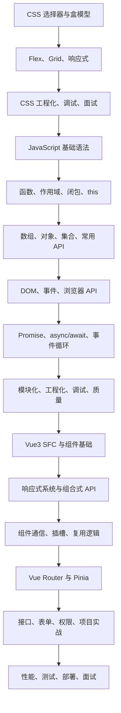

# 前端学习路线：CSS、JavaScript 与 Vue3 从 0 基础到大神

> [!tip] 学习定位
> 前端不是“会写页面”这么简单。真正能做项目的人，要同时掌握三层能力：CSS 页面表现、JavaScript 语言底层、框架工程实践。CSS 解决页面长什么样和怎么排版，JavaScript 解决页面为什么会动，Vue3 解决复杂页面如何组织成工程。

> [!success] 推荐顺序
> 1. 先读 [[00-MOC-CSS从0基础到大神]]
> 2. 再读 [[00-MOC-JavaScript从0基础到大神]]
> 3. 再读 [[00-MOC-Vue3从0基础到大神]]
> 4. 最后按项目反复回看：布局、响应式、异步请求、组件通信、状态管理、权限、性能优化、面试避坑。

## 学习地图

## 三条主线

### CSS 路线

1. [[01-CSS是什么与三种引入方式]]
2. [[02-选择器优先级继承与层叠]]
3. [[03-盒模型尺寸单位颜色与字体]]
4. [[04-Display定位浮动与层叠上下文]]
5. [[05-Flex布局从入门到实战]]
6. [[06-Grid布局响应式与媒体查询]]
7. [[07-过渡动画变形与交互效果]]
8. [[08-CSS工程化BEM变量预处理器与组件化]]
9. [[09-调试性能兼容性与面试避坑]]

### JavaScript 路线

1. [[01-环境变量类型与基础语法]]
2. [[02-函数作用域闭包与this]]
3. [[03-数组对象集合与常用API]]
4. [[04-DOM事件与浏览器API]]
5. [[05-异步编程Promise-async-await与事件循环]]
6. [[06-模块化工程化调试与质量]]
7. [[07-JavaScript面试题与避坑清单]]

### Vue3 路线

1. [[01-快速入门项目结构与SFC]]
2. [[02-模板语法组件基础与生命周期]]
3. [[03-响应式系统ref-reactive-computed-watch]]
4. [[04-组件通信插槽与组合式API]]
5. [[05-VueRouter与Pinia工程实践]]
6. [[06-接口请求表单权限与项目实战]]
7. [[07-Vue3性能测试部署与面试避坑]]

## 阶段目标

| 阶段 | 你要能做到什么 | 代表能力 |
|---|---|---|
| CSS 零基础 | 看懂选择器、颜色、字体、盒模型、间距 | 能写基础页面样式 |
| CSS 入门 | 会用 Flex、Grid、媒体查询、过渡动画 | 能写响应式页面 |
| JS 零基础 | 看懂 JS 变量、函数、数组、对象、条件、循环 | 能写小脚本 |
| JS 入门 | 能操作 DOM、绑定事件、发请求、处理 Promise | 能写交互页面 |
| JS 进阶 | 理解闭包、this、原型、模块、事件循环 | 能排查常见 bug |
| Vue3 入门 | 会写 SFC、props、emit、插槽、生命周期 | 能拆组件 |
| Vue3 进阶 | 会用 Composition API、Router、Pinia、权限、接口封装 | 能做后台管理项目 |
| 工程能力 | 会调试、测试、打包、性能优化、部署 | 能交付线上项目 |
| 面试能力 | 能讲清机制、权衡、坑点和真实项目经验 | 能过技术面 |

## 官方资料入口

- CSS: https://developer.mozilla.org/en-US/docs/Web/CSS
- CSS Flexbox: https://developer.mozilla.org/en-US/docs/Learn/CSS/CSS_layout/Flexbox
- CSS Grid: https://developer.mozilla.org/en-US/docs/Learn/CSS/CSS_layout/Grids
- JavaScript Guide: https://developer.mozilla.org/en-US/docs/Web/JavaScript/Guide
- JavaScript modules: https://developer.mozilla.org/en-US/docs/Web/JavaScript/Guide/Modules
- Promise: https://developer.mozilla.org/en-US/docs/Web/JavaScript/Guide/Using_promises
- Fetch API: https://developer.mozilla.org/en-US/docs/Web/API/Fetch_API
- Vue Quick Start: https://vuejs.org/guide/quick-start
- Vue Reactivity Fundamentals: https://vuejs.org/guide/essentials/reactivity-fundamentals.html
- Vue `<script setup>`: https://vuejs.org/api/sfc-script-setup
- Vue Router: https://router.vuejs.org/guide/
- Pinia: https://pinia.vuejs.org/

## 一句话总纲

> 先用 CSS 掌握“页面如何排版和呈现”，再用 JavaScript 掌握“页面为什么会动”，最后用 Vue3 掌握“复杂页面如何组织成可维护的工程”。
