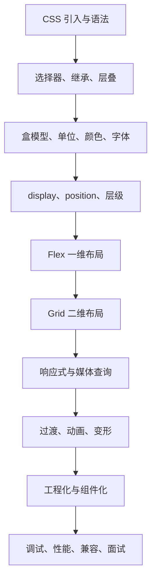

# CSS 从 0 基础到大神

> [!tip] 学习定位
> CSS 不是“背几个属性”这么简单。真正会 CSS 的人，要能解释页面为什么这样排版、为什么样式没生效、为什么元素溢出、为什么居中失败、为什么移动端变形。零基础先掌握规则，进阶掌握布局，大神阶段要能设计可维护的样式体系。

> [!abstract] 彩色阅读导航
> - 蓝色信息块：概念模型和判断思路。
> - 绿色实践块：推荐写法、模板和项目套路。
> - 黄色提醒块：容易混淆的规则。
> - 红色危险块：线上布局 bug 和面试高频坑。

## 当前版本快照

本套笔记按现代浏览器的 CSS 能力整理，学习时默认使用 Chrome、Edge、Firefox、Safari 的主流版本。重点覆盖标准 CSS、Flexbox、Grid、媒体查询、CSS 变量、过渡动画、基础工程化和 DevTools 调试。兼容 IE 的旧写法不作为主线，只在兼容性和历史问题里补充。

## 模块目录

1. [[01-CSS是什么与三种引入方式]]
2. [[02-选择器优先级继承与层叠]]
3. [[03-盒模型尺寸单位颜色与字体]]
4. [[04-Display定位浮动与层叠上下文]]
5. [[05-Flex布局从入门到实战]]
6. [[06-Grid布局响应式与媒体查询]]
7. [[07-过渡动画变形与交互效果]]
8. [[08-CSS工程化BEM变量预处理器与组件化]]
9. [[09-调试性能兼容性与面试避坑]]

## 最终能力清单

零基础阶段：

1. 能把 CSS 正确引入 HTML。
2. 能写选择器并知道样式为什么命中。
3. 能理解颜色、字体、边距、边框、背景、宽高。
4. 能解释盒模型：content、padding、border、margin。
5. 能做一个简单卡片、按钮、导航栏。

进阶阶段：

1. 能用 Flex 完成横向、纵向、居中、换行、自适应布局。
2. 能用 Grid 完成二维布局、页面骨架、卡片网格。
3. 能处理定位、层级、遮罩、吸顶、弹窗。
4. 能写媒体查询和移动端适配。
5. 能用过渡、动画、变形做基础交互效果。

大神阶段：

1. 能设计一套可维护的 class 命名和样式结构。
2. 能用 CSS 变量管理主题、间距、颜色、字号。
3. 能定位溢出、塌陷、层级、滚动、动画卡顿问题。
4. 能解释 BFC、层叠上下文、优先级、继承、reflow/repaint。
5. 能把 CSS 能力转成项目经验和面试表达。

## 学习路线图

## 最小练习项目

> [!success] 用一个个人主页串起来
> 1. 顶部导航：用 Flex 做左右分布。
> 2. 首屏介绍：用 Grid 做左右两列。
> 3. 技能卡片：用 `grid-template-columns` 做响应式卡片。
> 4. 项目列表：用 hover、transition 做交互。
> 5. 移动端：用媒体查询把两列改成单列。
> 6. 主题色：用 CSS 变量统一管理。

## 学习原则

| 原则 | 解释 |
|---|---|
| 先看盒子 | 页面上几乎所有布局问题，本质都是盒子尺寸、位置、间距问题 |
| 先用 Flex 和 Grid | 现代布局优先用 Flex/Grid，不要一上来就 float |
| 少写魔法数字 | 不要靠一堆固定 `px` 硬凑布局，要理解父子关系和可用空间 |
| 多开 DevTools | CSS 最好的老师是浏览器计算后的样式面板 |
| 用项目练 | CSS 只有在真实页面里才会暴露溢出、换行、层级、响应式问题 |

## 官方资料入口

- MDN CSS: https://developer.mozilla.org/en-US/docs/Web/CSS
- MDN CSS Selectors: https://developer.mozilla.org/en-US/docs/Web/CSS/CSS_selectors
- MDN Box Model: https://developer.mozilla.org/en-US/docs/Learn/CSS/Building_blocks/The_box_model
- MDN Flexbox: https://developer.mozilla.org/en-US/docs/Learn/CSS/CSS_layout/Flexbox
- MDN Grid: https://developer.mozilla.org/en-US/docs/Learn/CSS/CSS_layout/Grids
- MDN Media Queries: https://developer.mozilla.org/en-US/docs/Web/CSS/CSS_media_queries

## 一句话总纲

> CSS 的主线是：用选择器找到元素，用盒模型理解尺寸，用布局系统安排位置，用层叠规则解释冲突，用工程化保证长期可维护。

