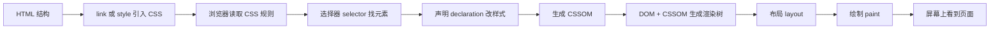

# CSS 01 - CSS 是什么与三种引入方式

> [!tip] 先建立一句话模型
> HTML 负责内容结构，CSS 负责视觉表现，JavaScript 负责交互逻辑。CSS 的本质是：找到一批元素，然后给它们声明样式规则。

## 图解：CSS 从文件到屏幕



> [!info] 看图理解
> CSS 不是直接“画页面”，它先被浏览器解析成规则，再和 HTML 结构结合，最后才经过布局和绘制显示到屏幕。

## CSS 解决什么问题

没有 CSS 时，页面只有结构：标题、段落、列表、链接、图片、表单。CSS 加上去以后，页面才有颜色、字体、间距、布局、响应式和动画。

常见职责：

1. 字体：字号、字重、行高、字体族。
2. 颜色：文字色、背景色、边框色。
3. 盒子：宽高、内边距、边框、外边距。
4. 布局：横排、竖排、居中、两列、三列、卡片网格。
5. 状态：hover、focus、active、disabled。
6. 响应式：手机、平板、桌面不同布局。
7. 动画：过渡、关键帧、变形。

## CSS 基本语法

```css
选择器 {
  属性名: 属性值;
  属性名: 属性值;
}
```

示例：

```css
.card {
  padding: 16px;
  border: 1px solid #d0d7de;
  border-radius: 8px;
  background: #ffffff;
}
```

这个规则表示：找到 class 是 `card` 的元素，然后给它设置内边距、边框、圆角和背景色。

## 语法关键字认知

> [!info] 先把 CSS 一句话拆开
> CSS 的一条规则可以读成：用 selector 选中元素，然后用 declaration 声明它的样子。声明里面左边是 property，右边是 value。

### selector：选择器

选择器回答的问题是：这条 CSS 要作用到谁身上？

```css
.profile-card {
  padding: 24px;
}
```

这里 `.profile-card` 就是选择器。它会选中 HTML 里 `class` 包含 `profile-card` 的元素。

常见选择器读法：

| 写法 | 人话解释 |
|---|---|
| `p` | 找到所有 `p` 标签 |
| `.card` | 找到所有 class 包含 `card` 的元素 |
| `#app` | 找到 id 是 `app` 的元素 |
| `.card p` | 找到 `.card` 里面的所有 `p` |
| `.card > p` | 找到 `.card` 的直接子元素 `p` |
| `input[type="text"]` | 找到 type 是 text 的输入框 |

### declaration：声明

声明就是 `{}` 里面的一条样式。

```css
color: #0969da;
```

一条声明由 `属性: 值;` 组成。注意最后的分号建议保留，尤其是多条声明连续写的时候。

### property：属性

属性回答的问题是：你想改元素的哪一类表现？

常见属性：

```css
color
font-size
background
margin
padding
display
position
```

比如 `color` 改文字颜色，`display` 改布局角色，`position` 改定位方式。

### value：值

值回答的问题是：这个属性具体改成什么？

```css
color: red;
display: flex;
position: absolute;
margin: 16px;
```

这里的 `red`、`flex`、`absolute`、`16px` 都是值。CSS 学起来像背单词，其实真正要问的是：这个值会改变浏览器哪一步计算？

### rule：规则

一组选择器加声明块，叫一条 CSS 规则。

```css
.button {
  padding: 8px 16px;
  border-radius: 6px;
  background: #0969da;
}
```

这整段就是一条规则。

### comment：注释

```css
/* 这是 CSS 注释 */
```

CSS 注释不会显示在页面上，适合解释分区、变量用途、复杂布局原因。

> [!warning] CSS 不会像 JavaScript 那样频繁报错
> 属性名写错或值非法时，浏览器通常直接忽略那条声明。所以看到样式不生效，第一步不是怀疑浏览器，而是去 DevTools 看这条声明有没有被识别。

## 三种引入方式

### 1. 行内样式

```html
<p style="color: red; font-size: 18px;">这是一段文字</p>
```

优点是直接，缺点是难维护、难复用、优先级很高。项目里只适合临时调试或极少量动态样式。

> [!warning] 不要把行内样式当主力
> 行内样式会让 HTML 和样式混在一起，后期改版时很痛苦。真正项目里，优先写到独立 CSS 文件或组件样式里。

关键词认知：

| 关键词 | 含义 |
|---|---|
| `style` | HTML 属性，里面直接写 CSS 声明 |
| `inline style` | 行内样式，写在元素自己身上 |
| `priority` | 优先级，行内样式通常比普通选择器更强 |

### 2. 内部样式表

```html
<style>
  h1 {
    color: #0969da;
  }
</style>
```

适合小 demo、教学案例、单文件页面。缺点是多个页面无法复用。

关键词认知：

| 关键词 | 含义 |
|---|---|
| `<style>` | HTML 标签，用来在页面内部写 CSS |
| internal stylesheet | 内部样式表，样式只属于当前 HTML 页面 |

### 3. 外部样式表

```html
<link rel="stylesheet" href="./style.css">
```

这是项目主流方式。HTML 放结构，CSS 独立维护，多个页面可以复用同一个样式文件。

关键词认知：

| 关键词 | 含义 |
|---|---|
| `<link>` | HTML 标签，用来引入外部资源 |
| `rel="stylesheet"` | 告诉浏览器这个资源是样式表 |
| `href` | CSS 文件路径 |
| external stylesheet | 外部样式表，项目里最常用 |

> [!danger] 外部样式最常见坑
> `href` 路径错了，CSS 文件根本没加载。打开 DevTools 的 Network 面板，如果 CSS 是 404，再怎么改选择器都没用。

## 第一个完整例子

HTML：

```html
<article class="profile-card">
  <h1>小明</h1>
  <p>前端学习者，正在学习 CSS 布局。</p>
  <a href="#">查看作品</a>
</article>
```

CSS：

```css
.profile-card {
  max-width: 360px;
  padding: 24px;
  border: 1px solid #d0d7de;
  border-radius: 8px;
  background: #ffffff;
}

.profile-card h1 {
  margin: 0 0 8px;
  font-size: 24px;
}

.profile-card p {
  margin: 0 0 16px;
  color: #57606a;
  line-height: 1.7;
}

.profile-card a {
  color: #0969da;
  text-decoration: none;
}
```

## 基础选择器先会这些

| 选择器 | 示例 | 含义 |
|---|---|---|
| 标签选择器 | `p` | 选中所有 `p` 标签 |
| 类选择器 | `.card` | 选中 `class="card"` 的元素 |
| ID 选择器 | `#app` | 选中 `id="app"` 的元素 |
| 后代选择器 | `.card p` | 选中 `.card` 里面所有 `p` |
| 子代选择器 | `.nav > a` | 选中 `.nav` 的直接子元素 `a` |
| 群组选择器 | `h1, h2, h3` | 同时选中多个选择器 |

> [!success] 项目建议
> 普通业务样式优先用 class 选择器。标签选择器适合做基础重置，ID 选择器少用，后代选择器不要嵌套太深。

## CSS 的执行方式

浏览器加载页面时，大致会做这些事：

1. 解析 HTML，生成 DOM 树。
2. 解析 CSS，生成 CSSOM。
3. 把 DOM 和 CSSOM 结合成渲染树。
4. 计算每个盒子的大小和位置。
5. 绘制像素到屏幕上。

这意味着 CSS 写错了不一定报错，浏览器会忽略它不认识的属性或无效值。所以学 CSS 必须学会用 DevTools 看计算结果。

## 常见错误

> [!danger] 新手最常见 5 个坑
> 1. 忘记给 HTML 引入 CSS 文件。
> 2. 文件路径写错，比如 `href="./style.css"` 但文件不在当前目录。
> 3. 选择器没命中元素。
> 4. 属性名拼错，比如把 `background` 写成 `backgroud`。
> 5. 写了样式但被后面的规则覆盖。

## 本章练习

1. 新建 `index.html` 和 `style.css`。
2. 写一个个人介绍卡片。
3. 给卡片加背景、边框、圆角、内边距。
4. 给标题、正文、按钮分别设置样式。
5. 打开 DevTools，查看每个元素最终生效的样式。

## 一句话总结

> CSS 的第一步不是背属性，而是理解“选择器命中元素，声明改变表现，浏览器计算最终样式”。
