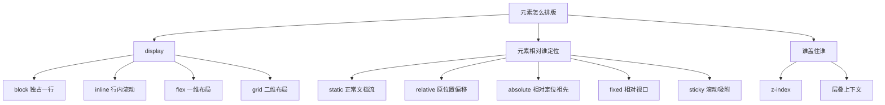

# CSS 04 - Display 定位浮动与层叠上下文

> [!tip] 布局先问三个问题
> 这个元素是否占一整行？它是否还在普通文档流里？它的层级是否被新的层叠上下文限制？多数布局问题都能从这三个问题开始排查。

## 图解：display、position、z-index 的分工



> [!info] 看图理解
> `display` 管“怎么参与布局”，`position` 管“相对谁移动”，`z-index` 管“层级比较”。三个问题要分开看。

## `display`

常见值：

| 值 | 表现 |
|---|---|
| `block` | 块级元素，默认占一整行 |
| `inline` | 行内元素，不独占一行，宽高通常不生效 |
| `inline-block` | 行内排列，但可以设置宽高 |
| `none` | 不显示，也不占空间 |
| `flex` | Flex 容器 |
| `grid` | Grid 容器 |

示例：

```css
.tag {
  display: inline-block;
  padding: 2px 8px;
  border-radius: 999px;
  background: #ddf4ff;
}
```

## display 关键字认知

> [!info] display 回答两个问题
> 第一，这个元素自己怎么占位置；第二，它的直接子元素怎么排列。

### block

块级元素，默认独占一行，宽度通常撑满父容器，可以设置宽高。

```css
.section {
  display: block;
}
```

常见块级元素有 `div`、`p`、`section`、`h1`。

### inline

行内元素，像文字一样在一行里流动，不独占一行，宽高通常不生效。

```css
.link {
  display: inline;
}
```

常见行内元素有 `span`、`a`、`strong`。

### inline-block

外面像行内元素，可以和别人排一行；里面像块级元素，可以设置宽高和 padding。

```css
.tag {
  display: inline-block;
  padding: 2px 8px;
}
```

适合标签、徽章、小按钮。

### none

元素不显示，也不占空间。

```css
.hidden {
  display: none;
}
```

对比：

| 写法 | 是否显示 | 是否占空间 |
|---|---|---|
| `display: none` | 不显示 | 不占 |
| `visibility: hidden` | 不显示 | 占 |
| `opacity: 0` | 透明 | 占 |

### flex / grid

`display: flex` 和 `display: grid` 不只是让元素显示，它们会把这个元素变成布局容器，直接影响子元素排列。

```css
.toolbar {
  display: flex;
}

.cards {
  display: grid;
}
```

## 普通文档流

默认情况下，元素按 HTML 顺序从上到下、从左到右排列。块级元素一行一个，行内元素在一行内流动。

脱离文档流的常见方式：

1. `position: absolute`
2. `position: fixed`
3. `float`

脱离后，元素不再占据原本位置，后面的元素可能顶上来。

## `position`

### static

默认值，不支持 `top`、`right`、`bottom`、`left`。

关键词认知：`static` 就是“按正常文档流排”。你写 `top: 10px` 也不会动。

### relative

相对自己原来的位置偏移，但原位置仍然保留。

```css
.badge {
  position: relative;
  top: -2px;
}
```

常用场景：作为绝对定位子元素的参照物。

关键词认知：`relative` 没有真正把元素从队伍里拿走，它只是视觉上偏移；原来的坑位还在那里。

### absolute

相对最近的已定位祖先元素定位。如果祖先都没有定位，就相对页面初始包含块。

```css
.card {
  position: relative;
}

.card-badge {
  position: absolute;
  top: 12px;
  right: 12px;
}
```

> [!warning] absolute 最常见坑
> 父元素忘记写 `position: relative`，导致子元素跑到页面别的位置。

关键词认知：`absolute` 会脱离普通文档流。它不再占原来的位置，后面的元素会当它不存在。

### fixed

相对浏览器视口定位，常用于固定顶部导航、悬浮按钮、全屏遮罩。

```css
.modal-mask {
  position: fixed;
  inset: 0;
  background: rgba(0, 0, 0, 0.45);
}
```

关键词认知：`fixed` 盯着浏览器窗口，不盯着某个普通父元素。页面滚动时它仍停在视口里的固定位置。

### sticky

先按普通文档流排列，滚动到阈值后变成吸附状态。

```css
.toolbar {
  position: sticky;
  top: 0;
  z-index: 10;
  background: #ffffff;
}
```

关键词认知：`sticky` 是 `relative` 和 `fixed` 的混合体。没滚到阈值时像普通元素，滚到 `top: 0` 这类阈值时吸住。

## `inset`

`inset` 是 `top`、`right`、`bottom`、`left` 的简写。

```css
.fullscreen {
  position: fixed;
  inset: 0;
}
```

等价于：

```css
.fullscreen {
  top: 0;
  right: 0;
  bottom: 0;
  left: 0;
}
```

## `z-index`

`z-index` 控制层级，但只对定位元素或特定布局上下文里的元素有效。

```css
.header {
  position: sticky;
  top: 0;
  z-index: 100;
}
```

> [!danger] `z-index: 9999` 也可能没用
> 如果元素被困在一个新的层叠上下文里，它再大也只能在那个上下文内部比较，无法盖过外部更高层的元素。

关键词认知：

| 关键词 | 含义 |
|---|---|
| `z-index` | 在 z 轴上的层级顺序 |
| stacking context | 层叠上下文，一个内部独立比较层级的区域 |
| `opacity` | 小于 1 时可能创建层叠上下文 |
| `transform` | 非 none 时可能创建层叠上下文 |

排查弹窗盖不住时，不要只盯着弹窗的 `z-index`，要一路看父元素有没有 `transform`、`opacity`、`position + z-index`。

## 层叠上下文

常见会创建层叠上下文的情况：

1. `position` 不是 `static` 且设置了 `z-index`。
2. `opacity` 小于 `1`。
3. `transform` 不是 `none`。
4. `filter` 不是 `none`。
5. `isolation: isolate`。
6. `position: fixed` 或 `sticky`。

排查弹窗被遮住时，不要只看弹窗本身的 `z-index`，还要看父级有没有 `transform`、`opacity`、`z-index`。

## float

`float` 早期常用于文字环绕和布局，现在布局主力已经是 Flex/Grid。

```css
.avatar {
  float: left;
  width: 64px;
  margin-right: 12px;
}
```

浮动会脱离普通文档流，父元素可能高度塌陷。

清除浮动：

```css
.clearfix::after {
  content: "";
  display: block;
  clear: both;
}
```

> [!success] 现代项目建议
> 文字环绕可以用 float，页面布局优先 Flex/Grid。不要用 float 搭整页布局。

## BFC

BFC 是块级格式化上下文，可以理解为一个独立的布局区域。

常见触发方式：

1. `overflow: hidden`
2. `display: flow-root`
3. `display: flex`
4. `display: grid`
5. `position: absolute`

常见作用：

1. 清除浮动。
2. 阻止外边距折叠。
3. 避免元素被浮动元素覆盖。

推荐清除浮动：

```css
.container {
  display: flow-root;
}
```

## overflow 关键字认知

`overflow` 决定内容超出盒子时怎么办。

```css
.panel {
  overflow: auto;
}
```

| 值 | 含义 |
|---|---|
| `visible` | 默认，超出也显示 |
| `hidden` | 超出裁掉 |
| `auto` | 需要时出现滚动条 |
| `scroll` | 总是显示滚动条 |

> [!warning] overflow 会影响布局
> `overflow: hidden` 可以裁剪内容、创建 BFC，但也可能让下拉菜单、阴影、sticky 吸顶出现问题。它不是万能修复。

## 本章练习

1. 写一个卡片右上角徽标，用 `absolute` 定位。
2. 写一个吸顶导航，用 `sticky`。
3. 写一个全屏遮罩，用 `fixed` 和 `inset: 0`。
4. 故意给父元素加 `transform`，观察弹窗层级变化。
5. 用 `display: flow-root` 清除浮动。

## 一句话总结

> `display` 决定元素怎么参与布局，`position` 决定它是否离开原位置，层叠上下文决定它能和谁比较层级。
