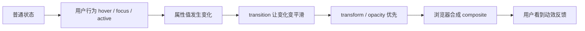
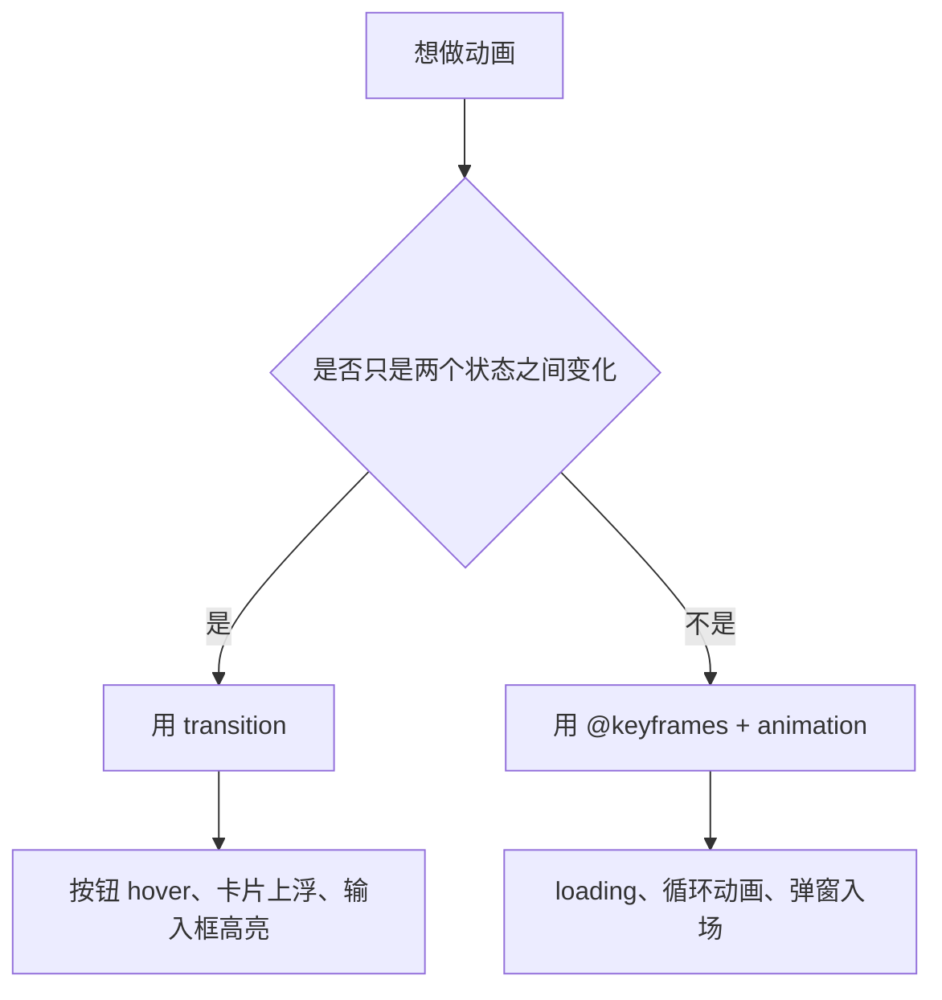

# CSS 07 - 过渡动画变形与交互效果

> [!tip] 动效不是炫技
> 好的 CSS 动效服务于反馈：按钮能点、卡片可交互、弹窗出现、菜单展开。不要为了动而动，动效应该轻、短、清楚。

## 图解：CSS 动效从状态变化开始





> [!info] 看图理解
> `transition` 适合“从 A 状态变到 B 状态”，`animation` 适合“自己定义一整段播放过程”。

## 状态伪类

```css
.button {
  background: #0969da;
  color: #ffffff;
}

.button:hover {
  background: #0757b8;
}

.button:active {
  transform: translateY(1px);
}

.button:focus-visible {
  outline: 3px solid rgba(9, 105, 218, 0.3);
  outline-offset: 2px;
}
```

常用状态：

1. `:hover`：鼠标悬停。
2. `:active`：按下。
3. `:focus`：获得焦点。
4. `:focus-visible`：键盘焦点更友好。
5. `:disabled`：禁用。

## 状态关键字认知

| 关键字 | 什么时候触发 | 常见用途 |
|---|---|---|
| `:hover` | 鼠标悬停 | 按钮变色、卡片上浮 |
| `:active` | 鼠标按下瞬间 | 按钮按压反馈 |
| `:focus` | 元素获得焦点 | 输入框高亮 |
| `:focus-visible` | 键盘等可见焦点 | 无障碍焦点样式 |
| `:disabled` | 表单控件禁用 | 变灰、禁止点击 |
| `:checked` | checkbox/radio 被选中 | 自定义开关、选项 |

> [!warning] 移动端没有可靠 hover
> 手机没有鼠标悬停。关键功能不要只藏在 hover 里，否则移动端用户可能用不了。

## 过渡 `transition`

```css
.card {
  transition:
    transform 160ms ease,
    box-shadow 160ms ease;
}

.card:hover {
  transform: translateY(-2px);
  box-shadow: 0 8px 24px rgba(31, 35, 40, 0.12);
}
```

常见属性：

| 属性 | 含义 |
|---|---|
| `transition-property` | 哪些属性参与过渡 |
| `transition-duration` | 过渡时长 |
| `transition-timing-function` | 速度曲线 |
| `transition-delay` | 延迟 |

常用简写：

```css
transition: all 160ms ease;
```

> [!warning] 不建议滥用 `all`
> `all` 方便但不够精确，可能让不该动画的属性也参与过渡。项目里更推荐明确写 `transform`、`opacity`、`box-shadow`。

## 动画关键字认知

### `transition`

`transition` 是“属性从旧值变成新值时，中间怎么过渡”。它必须有状态变化才会发生，比如 hover 后背景色改变。

### `duration`

动画持续时间。常见交互动效通常在 `120ms` 到 `240ms`，太长会拖沓。

### `timing-function`

速度曲线。

| 值 | 直觉 |
|---|---|
| `linear` | 匀速 |
| `ease` | 自然缓动 |
| `ease-in` | 慢慢开始 |
| `ease-out` | 慢慢结束 |
| `ease-in-out` | 开始和结束都慢 |

## 变形 `transform`

```css
.demo {
  transform: translateX(12px) scale(1.05) rotate(2deg);
}
```

常用函数：

1. `translate()`：移动。
2. `scale()`：缩放。
3. `rotate()`：旋转。
4. `skew()`：倾斜。

按钮按压：

```css
.button:active {
  transform: scale(0.98);
}
```

图片 hover：

```css
.image-card img {
  transition: transform 240ms ease;
}

.image-card:hover img {
  transform: scale(1.04);
}
```

关键词认知：`transform` 改的是视觉变形，不会改变元素在普通文档流里的原始占位。所以卡片上浮后，旁边元素不会被重新挤开。

## 透明度 `opacity`

```css
.tooltip {
  opacity: 0;
  transform: translateY(4px);
  transition:
    opacity 160ms ease,
    transform 160ms ease;
}

.trigger:hover .tooltip {
  opacity: 1;
  transform: translateY(0);
}
```

`opacity + transform` 是最常见、性能友好的动效组合。

关键词认知：`opacity: 0` 只是透明，元素仍然占空间，也可能还能被点击。需要避免点击时，可以配合 `pointer-events: none`。

## 关键帧动画

```css
@keyframes fade-in {
  from {
    opacity: 0;
    transform: translateY(8px);
  }

  to {
    opacity: 1;
    transform: translateY(0);
  }
}

.modal {
  animation: fade-in 180ms ease both;
}
```

`animation` 常用字段：

1. 动画名。
2. 持续时间。
3. 速度曲线。
4. 延迟。
5. 播放次数。
6. 方向。
7. 填充模式。

关键词认知：

| 关键字 | 含义 |
|---|---|
| `animation` | 主动播放一段关键帧动画 |
| `@keyframes` | 定义动画从哪到哪 |
| `infinite` | 无限循环 |
| `both` | 动画前后都保留关键帧样式影响 |

## 加载动画

```css
@keyframes spin {
  to {
    transform: rotate(360deg);
  }
}

.spinner {
  width: 24px;
  height: 24px;
  border: 3px solid #d0d7de;
  border-top-color: #0969da;
  border-radius: 50%;
  animation: spin 800ms linear infinite;
}
```

## 动画性能原则

推荐动画属性：

1. `transform`
2. `opacity`

谨慎动画属性：

1. `width`
2. `height`
3. `top`
4. `left`
5. `margin`
6. `padding`

原因：尺寸和位置变化更容易触发布局重排，`transform` 和 `opacity` 更容易走合成层，性能更稳。

关键词认知：

| 关键字 | 含义 |
|---|---|
| reflow / layout | 重新计算元素大小和位置 |
| repaint | 重新绘制颜色、阴影等像素 |
| composite | 合成图层，通常比重排重绘更轻 |

动画优先用 `transform` 和 `opacity`，就是为了尽量减少 layout 和 paint 压力。

> [!danger] 不要做大面积重布局动画
> 比如把列表里很多元素的 `height` 同时从 0 动到 auto，容易卡顿。可以改成 transform、opacity，或减少动画范围。

## 尊重用户减少动画偏好

```css
@media (prefers-reduced-motion: reduce) {
  *,
  *::before,
  *::after {
    animation-duration: 0.01ms !important;
    animation-iteration-count: 1 !important;
    scroll-behavior: auto !important;
    transition-duration: 0.01ms !important;
  }
}
```

这对晕动症用户和辅助功能更友好。

## 常见实战效果

### 按钮

```css
.button {
  transition:
    background-color 160ms ease,
    transform 120ms ease;
}

.button:hover {
  background-color: #0757b8;
}

.button:active {
  transform: translateY(1px);
}
```

### 卡片

```css
.card {
  transition:
    transform 180ms ease,
    box-shadow 180ms ease;
}

.card:hover {
  transform: translateY(-3px);
  box-shadow: 0 12px 32px rgba(31, 35, 40, 0.12);
}
```

### 弹窗

```css
@keyframes modal-in {
  from {
    opacity: 0;
    transform: translateY(12px) scale(0.98);
  }

  to {
    opacity: 1;
    transform: translateY(0) scale(1);
  }
}

.modal {
  animation: modal-in 180ms ease both;
}
```

## 本章练习

1. 给按钮写 hover 和 active。
2. 给卡片写 hover 上浮。
3. 写一个 tooltip 出现动画。
4. 写一个 loading spinner。
5. 用 DevTools Performance 观察动画是否卡顿。

## 一句话总结

> CSS 动效优先使用 `transform` 和 `opacity`，时长要短，反馈要明确，动画要服务交互而不是喧宾夺主。
