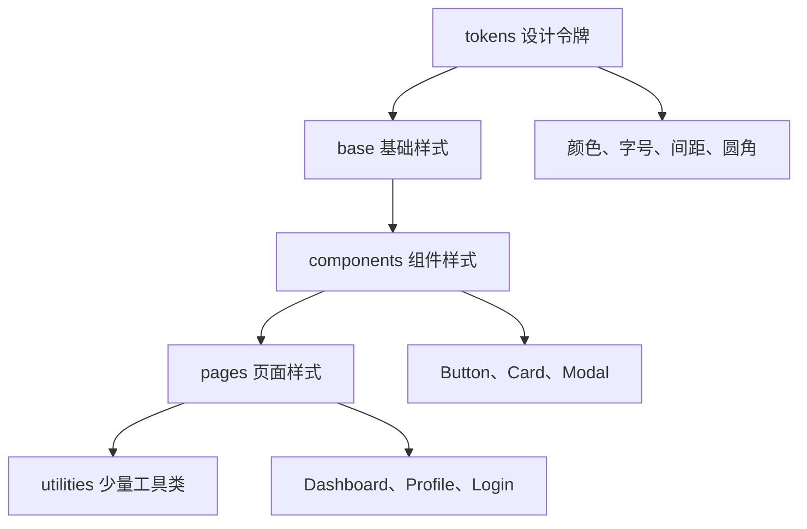
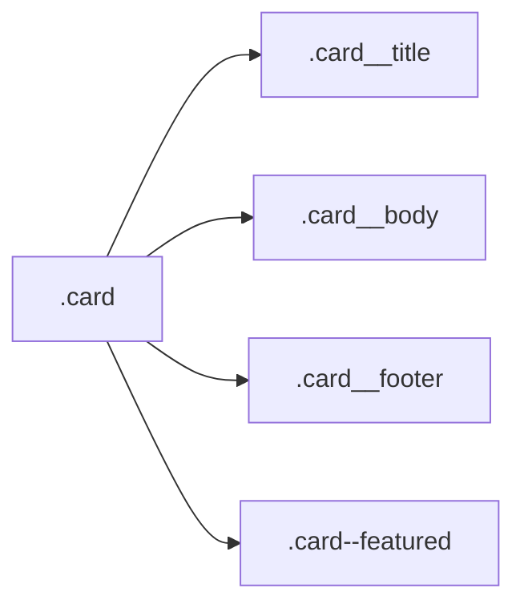

# CSS 08 - CSS 工程化 BEM 变量预处理器与组件化

> [!tip] 工程化解决的不是“能不能写”，而是“多人长期改会不会乱”
> 小 demo 可以随便写 CSS。真实项目里，难点是命名冲突、样式覆盖、主题统一、组件复用、长期维护。

## 图解：可维护 CSS 的分层





> [!info] 看图理解
> CSS 工程化不是把样式写复杂，而是让变量有来源、组件有边界、页面有组织、工具类有节制。

## 样式混乱的典型症状

1. class 名太随意：`.red`、`.left`、`.box1`。
2. 选择器嵌套太深：`.page .main .list .item .title span`。
3. 大量 `!important`。
4. 全局样式随便影响组件。
5. 颜色、间距、字号到处散落。
6. 改一个按钮影响全站。
7. 不敢删 CSS，因为不知道哪里在用。

## 命名原则

推荐 class 名表达“角色”而不是“长相”。

不推荐：

```css
.red-box {}
.left-area {}
.big-title {}
```

推荐：

```css
.profile-card {}
.sidebar {}
.page-title {}
```

原因：长相会变，角色相对稳定。今天是红色，明天可能换成蓝色；但它仍然是 profile card。

## 工程化关键字认知

### class

class 是 CSS 业务样式最常见的挂载点。

```html
<button class="button button--primary">保存</button>
```

一个元素可以有多个 class，所以 class 很适合组合基础样式、状态和变体。

### global style

全局样式。写了之后可能影响整个页面。

适合放：

1. reset。
2. body 字体。
3. 全局变量。
4. 通用工具类。

不适合随便放某个业务组件的细节样式。

### scoped style

局部样式。尽量只影响当前组件或模块。Vue 的 `<style scoped>`、CSS Modules 都是在解决这个问题。

### naming convention

命名约定。团队约好 class 怎么起名，减少“这个类到底能不能复用”的猜测。

## BEM

BEM 是一种命名方法：

1. Block：块，独立组件。
2. Element：元素，块内部的组成部分。
3. Modifier：修饰，状态或变体。

```css
.card {}
.card__title {}
.card__body {}
.card__footer {}
.card--featured {}
```

HTML：

```html
<article class="card card--featured">
  <h2 class="card__title">标题</h2>
  <p class="card__body">内容</p>
  <footer class="card__footer">底部</footer>
</article>
```

> [!success] BEM 的价值
> 你看到 `.card__title` 就知道它属于 `.card`；看到 `.card--featured` 就知道它是 card 的一种状态，不容易和别的组件冲突。

关键词认知：

| 关键词 | 写法 | 含义 |
|---|---|---|
| Block | `.card` | 独立组件块 |
| Element | `.card__title` | 组件内部元素 |
| Modifier | `.card--featured` | 组件变体或状态 |

> [!warning] BEM 不要求选择器嵌套
> `.card .card__title` 可以写，但很多时候直接 `.card__title` 就够了。BEM 的重点是命名表达关系，不是把选择器写长。

## CSS 变量

CSS 变量适合管理主题、颜色、间距、圆角、阴影。

```css
:root {
  --color-text: #24292f;
  --color-muted: #57606a;
  --color-border: #d0d7de;
  --color-primary: #0969da;
  --radius-sm: 4px;
  --radius-md: 8px;
  --space-2: 8px;
  --space-3: 12px;
  --space-4: 16px;
}

.button {
  padding: var(--space-2) var(--space-4);
  border-radius: var(--radius-md);
  background: var(--color-primary);
  color: #ffffff;
}
```

关键词认知：

| 关键词 | 含义 |
|---|---|
| custom property | CSS 自定义属性，也就是 CSS 变量 |
| `--color-primary` | 变量定义，必须以 `--` 开头 |
| `var()` | 读取变量 |
| `:root` | 通常放全局变量的位置 |

变量也会继承，所以主题切换可以只改父级变量，子元素自动跟着变。

## 主题切换

```css
:root {
  --page-bg: #ffffff;
  --text-color: #24292f;
}

[data-theme="dark"] {
  --page-bg: #0d1117;
  --text-color: #f0f6fc;
}

body {
  background: var(--page-bg);
  color: var(--text-color);
}
```

JS 只需要切换属性：

```js
document.documentElement.dataset.theme = "dark";
```

## 预处理器

Sass、Less 这类预处理器提供变量、嵌套、函数、mixin 等能力。现代 CSS 已经有变量、嵌套等部分能力，但很多老项目仍使用 Sass/Less。

Sass 示例：

```scss
$primary: #0969da;

.button {
  background: $primary;

  &:hover {
    background: darken($primary, 8%);
  }
}
```

> [!warning] 嵌套不要太深
> 预处理器嵌套很方便，但嵌套超过 3 层就容易生成很重的选择器，后期覆盖困难。

关键词认知：

| 关键词 | 含义 |
|---|---|
| Sass/Less | CSS 预处理器 |
| nesting | 嵌套写法 |
| mixin | 可复用样式片段 |
| compile | 编译，把 Sass/Less 转成浏览器能读的 CSS |

## CSS Modules

在 React、Vue 工程里，CSS Modules 可以把 class 局部化，减少全局命名冲突。

```css
/* Button.module.css */
.button {
  padding: 8px 16px;
}
```

```js
import styles from "./Button.module.css";

export function Button() {
  return <button className={styles.button}>保存</button>;
}
```

## Vue 单文件组件样式

```vue
<template>
  <button class="button">保存</button>
</template>

<style scoped>
.button {
  padding: 8px 16px;
}
</style>
```

`scoped` 会让样式尽量限制在当前组件内。

> [!warning] `scoped` 不是万能隔离墙
> 子组件根节点、深度选择器、第三方组件样式覆盖仍要小心。组件样式边界要靠命名、结构和工程约定一起维护。

关键词认知：`scoped` 解决的是“大部分样式不要漏出去”，不是解决所有覆盖问题。覆盖第三方组件、跨组件深层样式时，仍然要看框架提供的深度选择器和组件结构。

## 文件组织建议

小项目：

```text
styles/
  reset.css
  variables.css
  base.css
  components.css
  pages.css
```

中大型项目：

```text
styles/
  tokens.css
  reset.css
  base.css
  utilities.css
components/
  Button/
    Button.vue
    Button.module.css
pages/
  Dashboard/
    Dashboard.vue
    Dashboard.module.css
```

## 设计令牌

设计令牌是把设计系统里的基础值抽成变量。

```css
:root {
  --font-size-sm: 14px;
  --font-size-md: 16px;
  --font-size-lg: 20px;
  --line-height-body: 1.7;
  --shadow-card: 0 8px 24px rgba(31, 35, 40, 0.08);
}
```

好处：

1. 统一视觉。
2. 改主题更容易。
3. 减少魔法数字。
4. 让设计和开发能对齐语言。

关键词认知：设计令牌不是为了“高级”，而是为了统一。比如全站按钮圆角都用 `--radius-md`，以后设计要从 8px 改成 6px，只改变量，不用全项目搜索。

## 工具类

可以少量保留高频工具类：

```css
.sr-only {
  position: absolute;
  width: 1px;
  height: 1px;
  padding: 0;
  margin: -1px;
  overflow: hidden;
  clip: rect(0, 0, 0, 0);
  white-space: nowrap;
  border: 0;
}

.text-muted {
  color: var(--color-muted);
}
```

不建议把所有业务样式都写成工具类，除非项目明确使用 Tailwind 这类原子化方案。

## 本章练习

1. 用 BEM 写一个 card 组件。
2. 抽出颜色、间距、圆角变量。
3. 做一个浅色/深色主题切换。
4. 把全局样式拆成 reset、base、tokens、components。
5. 检查项目里是否有过深选择器和滥用 `!important`。

## 一句话总结

> CSS 工程化的目标是减少冲突、统一变量、明确边界，让样式可以被多人长期修改，而不是靠记忆和运气维护。
