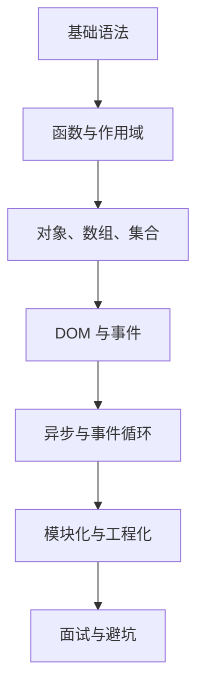

# JavaScript 从 0 基础到大神

> [!tip] 学习定位
> JavaScript 是前端的地基。Vue3、React、工程化、组件库、前端面试，本质都绕不开 JS 的函数、对象、异步、模块、事件循环和浏览器 API。不要只背语法，要能解释“代码为什么这样执行”。

> [!abstract] 彩色阅读导航
> - 蓝色信息块：概念和心智模型。
> - 绿色实践块：推荐写法和项目模板。
> - 黄色提醒块：容易混淆的点。
> - 红色危险块：线上 bug 和面试高频坑。

## 当前版本快照

本套笔记按 2026-06-13 的主流浏览器和 MDN 文档整理。重点采用现代 JavaScript 写法：`let`、`const`、箭头函数、解构、模板字符串、模块化、Promise、`async/await`、`fetch`。学习时默认你使用现代浏览器和 Node.js LTS，不再围绕 IE 时代兼容写法展开。

## 模块目录

1. [[01-环境变量类型与基础语法]]
2. [[02-函数作用域闭包与this]]
3. [[03-数组对象集合与常用API]]
4. [[04-DOM事件与浏览器API]]
5. [[05-异步编程Promise-async-await与事件循环]]
6. [[06-模块化工程化调试与质量]]
7. [[07-JavaScript面试题与避坑清单]]

## 最终能力清单

零基础阶段：

1. 能区分 `let`、`const`、`var`。
2. 能写条件、循环、函数、数组、对象。
3. 能看懂浏览器控制台报错。
4. 能用 DOM API 修改页面。
5. 能用事件实现按钮、输入框、列表交互。

进阶阶段：

1. 能解释作用域链、闭包、`this`。
2. 能用数组方法写数据转换。
3. 能处理 Promise、`async/await`、错误捕获。
4. 能解释事件循环、宏任务、微任务。
5. 能用 ES Modules 拆分代码。

大神阶段：

1. 能设计可维护的模块结构。
2. 能封装通用请求、缓存、事件、工具函数。
3. 能排查异步竞态、内存泄漏、事件重复绑定、类型转换问题。
4. 能用调试器、断点、Network、Performance 找问题。
5. 能把 JS 机制讲成项目经验，而不是背八股。

## 学习路线图

## 最小练习项目

> [!success] 用一个 Todo 项目串起来
> 1. 用数组保存任务。
> 2. 用 DOM 渲染任务列表。
> 3. 用事件新增、删除、勾选任务。
> 4. 用 `localStorage` 持久化。
> 5. 用模块拆分 `state.js`、`render.js`、`events.js`。
> 6. 用 `fetch` 模拟远程保存。

## 学习原则

| 原则 | 解释 |
|---|---|
| 先写出来 | JS 很容易“看懂但写不出”，每学一章都要敲代码 |
| 先理解执行顺序 | 异步、闭包、this 的核心都是执行时机和调用位置 |
| 少背 API，多找规律 | 数组 API、DOM API、Promise API 都有共同模型 |
| 用浏览器验证 | 控制台是最好的 JS 实验室 |
| 为 Vue3 做准备 | Vue3 的响应式、组件通信、Pinia 都建立在 JS 基础之上 |

## 官方资料入口

- MDN JavaScript Guide: https://developer.mozilla.org/en-US/docs/Web/JavaScript/Guide
- MDN JavaScript Reference: https://developer.mozilla.org/en-US/docs/Web/JavaScript/Reference
- MDN Modules Guide: https://developer.mozilla.org/en-US/docs/Web/JavaScript/Guide/Modules
- MDN Using Promises: https://developer.mozilla.org/en-US/docs/Web/JavaScript/Guide/Using_promises
- MDN Fetch API: https://developer.mozilla.org/en-US/docs/Web/API/Fetch_API
