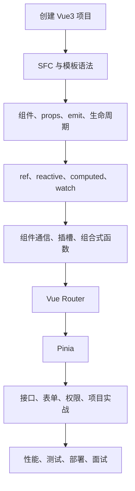

# Vue3 从 0 基础到大神

> [!tip] 学习定位
> Vue3 的核心不是“记住几个指令”，而是掌握组件化、响应式、状态流和工程组织。零基础先会写页面，进阶要能拆组件、管状态、处理接口和权限，大神阶段要能做性能优化、调试复杂响应式问题、设计可维护的前端架构。

> [!warning] 前置要求
> 学 Vue3 前至少要熟悉 [[00-MOC-JavaScript从0基础到大神]] 里的变量、函数、对象、数组、模块、Promise 和 `async/await`。Vue3 的很多“框架问题”，本质都是 JS 基础问题。

## 当前版本快照

本套笔记按 2026-06-13 的 Vue 官方文档和生态整理。现代 Vue3 项目默认使用 Vite、单文件组件 SFC、`<script setup>`、Composition API、Vue Router 4、Pinia。Vue 官方快速开始文档当前提示创建 Vue 应用需要较新的 Node.js 版本，实际项目以你本机和项目 `package.json` 为准。

## 模块目录

1. [[01-快速入门项目结构与SFC]]
2. [[02-模板语法组件基础与生命周期]]
3. [[03-响应式系统ref-reactive-computed-watch]]
4. [[04-组件通信插槽与组合式API]]
5. [[05-VueRouter与Pinia工程实践]]
6. [[06-接口请求表单权限与项目实战]]
7. [[07-Vue3性能测试部署与面试避坑]]

## 学习路线图

## 你最终要掌握什么

零基础阶段：

1. 能创建 Vue3 项目。
2. 能写 `.vue` 单文件组件。
3. 能使用模板语法、事件绑定、条件渲染、列表渲染。
4. 能用 `ref` 做响应式数据。
5. 能拆父子组件，用 props 和 emit 通信。

进阶阶段：

1. 能用 `computed`、`watch`、`watchEffect` 处理派生状态和副作用。
2. 能用 `reactive`、`toRefs`、`storeToRefs` 避免响应式丢失。
3. 能用 Vue Router 做路由、嵌套路由、路由守卫。
4. 能用 Pinia 管理登录用户、权限、全局配置、业务状态。
5. 能封装接口请求、表单校验、权限菜单。

大神阶段：

1. 能设计组件边界和状态归属。
2. 能抽取 composable 复用业务逻辑。
3. 能定位响应式失效、重复请求、组件重复渲染。
4. 能做首屏优化、路由懒加载、组件拆分、缓存策略。
5. 能把 Vue3 项目经验讲清楚，包括取舍、坑点、性能和维护性。

## Vue3 学习心法

| 心法 | 解释 |
|---|---|
| 数据驱动页面 | 不手动改 DOM，而是改状态，让 Vue 更新视图 |
| 组件拆分 | 一个组件只负责一个清晰职责 |
| 状态归属 | 能放局部就不放全局，跨页面共享再放 Pinia |
| 副作用隔离 | 请求、定时器、监听器要能创建也能清理 |
| 渐进式理解 | 先会写，再懂响应式原理，再懂架构 |

## 官方资料入口

- Vue Quick Start: https://vuejs.org/guide/quick-start
- Vue Reactivity Fundamentals: https://vuejs.org/guide/essentials/reactivity-fundamentals.html
- Vue Computed: https://vuejs.org/guide/essentials/computed.html
- Vue Watchers: https://vuejs.org/guide/essentials/watchers
- Vue `<script setup>`: https://vuejs.org/api/sfc-script-setup
- Vue Router: https://router.vuejs.org/guide/
- Pinia: https://pinia.vuejs.org/
- Vite: https://vite.dev/guide/

## 一句话总结

> Vue3 的主线是：用响应式状态描述页面，用组件组织复杂度，用 Router 和 Pinia 支撑应用级工程。
