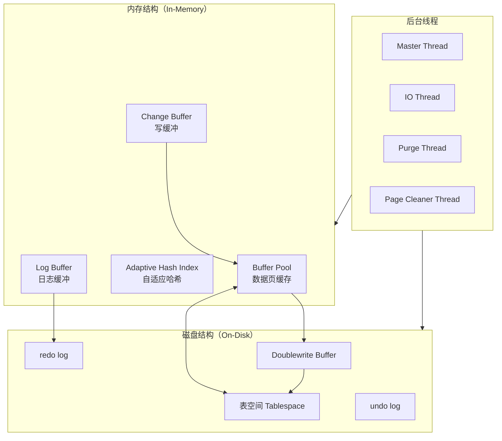
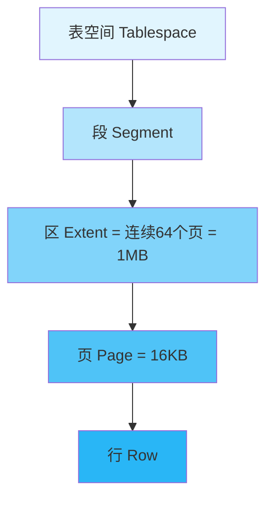
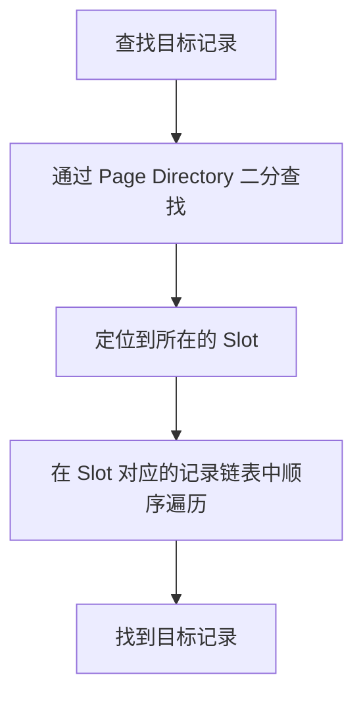
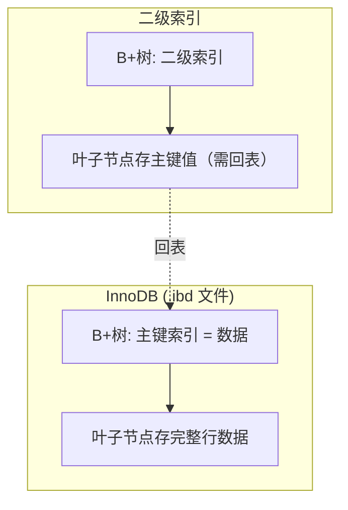
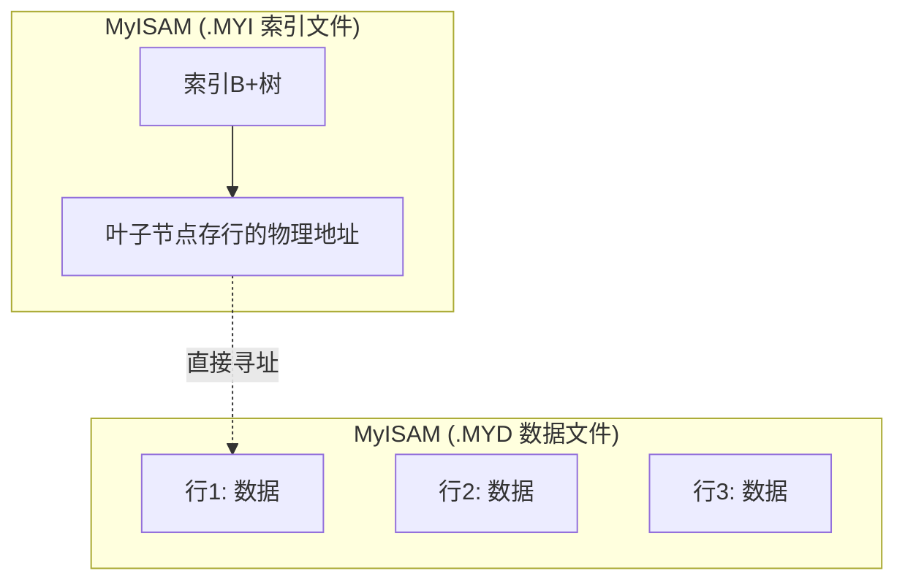

# InnoDB 存储引擎

InnoDB 是 MySQL 默认存储引擎（5.5+），也是面试考察的**核心重点**。

## InnoDB 架构全景



---

## 表空间（Tablespace）

InnoDB 的数据存储在**表空间**中，表空间是逻辑存储的最高层。

### 表空间层级结构



| 层级             | 大小   | 说明              |
| -------------- | ---- | --------------- |
| **表空间**        | 可变   | 逻辑容器            |
| **段（Segment）** | 可变   | 数据段、索引段、回滚段     |
| **区（Extent）**  | 1MB  | 连续 64 个页        |
| **页（Page）**    | 16KB | InnoDB 磁盘管理最小单位 |
| **行（Row）**     | 可变   | 实际数据记录          |

### 表空间类型

```
ibdata1          → 系统表空间（共享）
table_name.ibd   → 独立表空间（每表一个，推荐）
undo_001         → undo 表空间
ib_logfile0/1    → redo log 文件
ibtmp1           → 临时表空间
```

> [!tip] 开启独立表空间
> `innodb_file_per_table = ON`（MySQL 5.6.6+ 默认开启）
> 每个表一个 .ibd 文件，便于管理和回收空间。

---

## 页结构（Page）

页是 InnoDB 磁盘管理的**最小单位**，默认 16KB。

### 页的类型

| 类型 | 说明 |
|------|------|
| **数据页（INDEX Page）** | 存储行数据（B+树叶子节点） |
| **undo 页** | 存储 undo log |
| **系统页** | 存储系统信息 |
| **空闲页** | 未使用的页 |
| **插入缓冲位图页** | Change Buffer 相关 |

### 数据页内部结构

```
┌──────────────────────────────────────────┐
│           File Header (38字节)            │  ← 页号、前后页指针、校验和
├──────────────────────────────────────────┤
│           Page Header (56字节)            │  ← 页状态信息、记录数、槽数
├──────────────────────────────────────────┤
│         Infimum + Supremum Records        │  ← 虚拟最小/最大记录
├──────────────────────────────────────────┤
│                                          │
│           User Records (行记录)           │  ← 实际数据，按主键顺序
│           ↓ 从上往下增长                   │
│                                          │
├─ ─ ─ ─ ─ ─ ─ ─ ─ ─ ─ ─ ─ ─ ─ ─ ─ ─ ─ ┤
│                                          │
│           Free Space (空闲空间)           │
│           ↑ 从下往上增长                   │
│                                          │
├──────────────────────────────────────────┤
│        Page Directory (页目录/槽)         │  ← 稀疏目录，用于二分查找
├──────────────────────────────────────────┤
│           File Trailer (8字节)            │  ← 校验和（与Header对应验证完整性）
└──────────────────────────────────────────┘
```

### 页内记录查找过程



> [!important] 为什么页目录用稀疏索引？
> 每个槽（Slot）指向一组记录（4-8条）中最大的那条。通过槽做二分查找定位范围，再在小范围链表内遍历。平衡了空间和查找效率。

---

## 行格式（Row Format）

InnoDB 支持 4 种行格式：

| 行格式 | 说明 | 特点 |
|--------|------|------|
| **COMPACT** | 5.0 默认 | 变长字段长度列表 + NULL 标志位 |
| **REDUNDANT** | 旧格式 | 兼容性保留 |
| **DYNAMIC** | 5.7+ 默认 | 大字段完全行溢出 |
| **COMPRESSED** | 压缩存储 | 支持页级压缩 |

### COMPACT 行格式详细结构

```
┌─────────────────┬──────────────┬────────────────────────────┐
│   变长字段长度列表 │  NULL 标志位  │        记录头信息(5字节)      │
│  (逆序存放)      │  (位图)      │                            │
├─────────────────┴──────────────┴────────────────────────────┤
│                                                             │
│                     实际列数据                                │
│                                                             │
│   [隐藏列: row_id(6B) + trx_id(6B) + roll_pointer(7B)]     │
│                                                             │
└─────────────────────────────────────────────────────────────┘
```

### 隐藏列

每行记录都有三个隐藏列：

| 隐藏列 | 大小 | 说明 |
|--------|------|------|
| `row_id` | 6字节 | 隐式主键（当无主键且无唯一索引时自动生成） |
| `trx_id` | 6字节 | 最后修改该行的事务 ID（MVCC 核心！） |
| `roll_pointer` | 7字节 | 指向 undo log 的指针（版本链！） |

> [!warning] 面试高频
> `trx_id` 和 `roll_pointer` 是 MVCC 实现的基础，详见 [[MySQL事务与MVCC#MVCC 实现原理]]

### 行溢出

当一行数据超过页大小时发生行溢出：

- **COMPACT/REDUNDANT**：前 768 字节存在数据页，剩余存在溢出页，数据页存溢出页指针
- **DYNAMIC**：数据页只存 20 字节指针，全部数据存在溢出页


---

## InnoDB vs MyISAM 数据存储方式

### InnoDB — 聚簇索引组织



### MyISAM — 堆表组织



> [!important] 核心区别
> - **InnoDB**：索引即数据，数据即索引（聚簇索引）
> - **MyISAM**：索引和数据分开存储，索引叶子存的是数据的物理地址

---

## 面试高频问题

### Q1：InnoDB 一棵 B+ 树可以存放多少行数据？

**经典计算：**
- 假设主键为 bigint（8字节），页指针 6 字节
- 一个非叶子节点的页可以存储的指针数：16KB / (8+6) ≈ **1170**
- 假设每行数据 1KB，一个叶子节点存 16 行
- **两层 B+ 树**：1170 × 16 ≈ **1.8 万**行
- **三层 B+ 树**：1170 × 1170 × 16 ≈ **2000 万**行

> [!tip] 结论
> 2000 万行以内的表，B+ 树高度 ≤ 3，只需 **3 次磁盘 I/O** 即可定位任意记录！这就是为什么 MySQL 单表推荐不超过 2000 万行。

### Q2：为什么推荐使用自增主键？

1. **插入性能高**：自增主键保证顺序插入，避免页分裂
2. **索引紧凑**：二级索引存储主键值，整数主键占用空间小
3. **聚簇索引有序**：数据物理存储有序，范围查询效率高

### Q3：主键用 UUID 有什么问题？

1. UUID 长度 36 字节，远大于自增 bigint 的 8 字节
2. 无序插入导致大量**页分裂**（Page Split），性能急剧下降
3. 二级索引更大（每个二级索引叶子节点都要存主键值）
