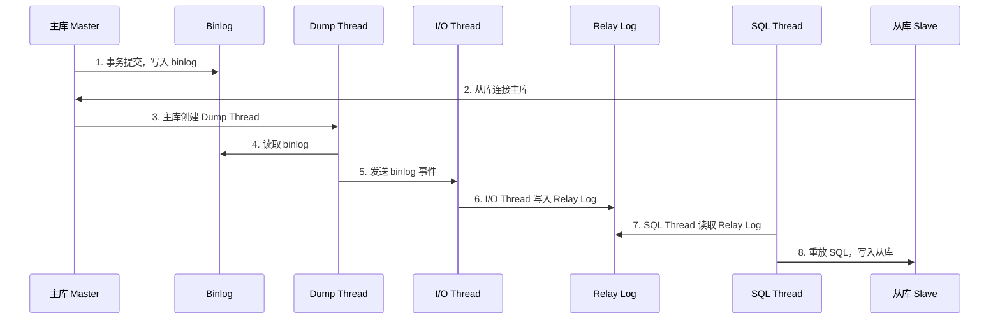
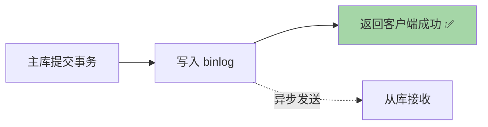
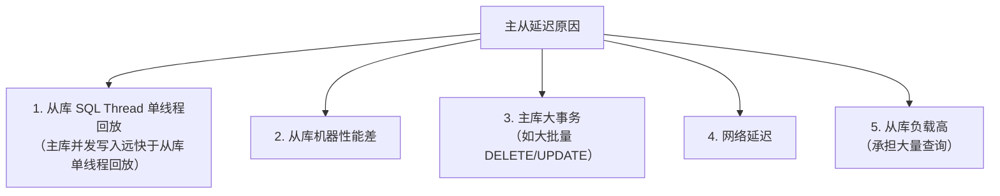
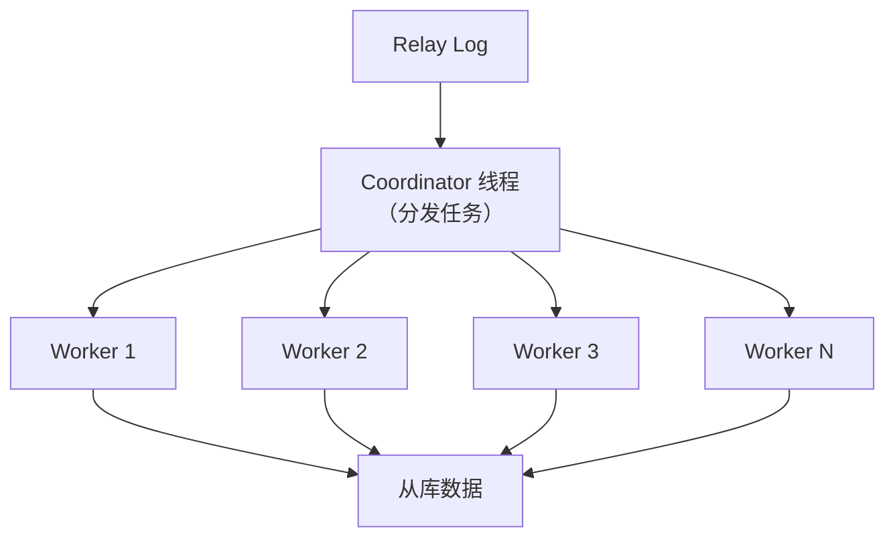
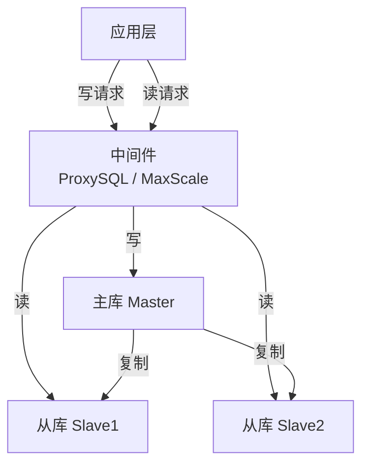
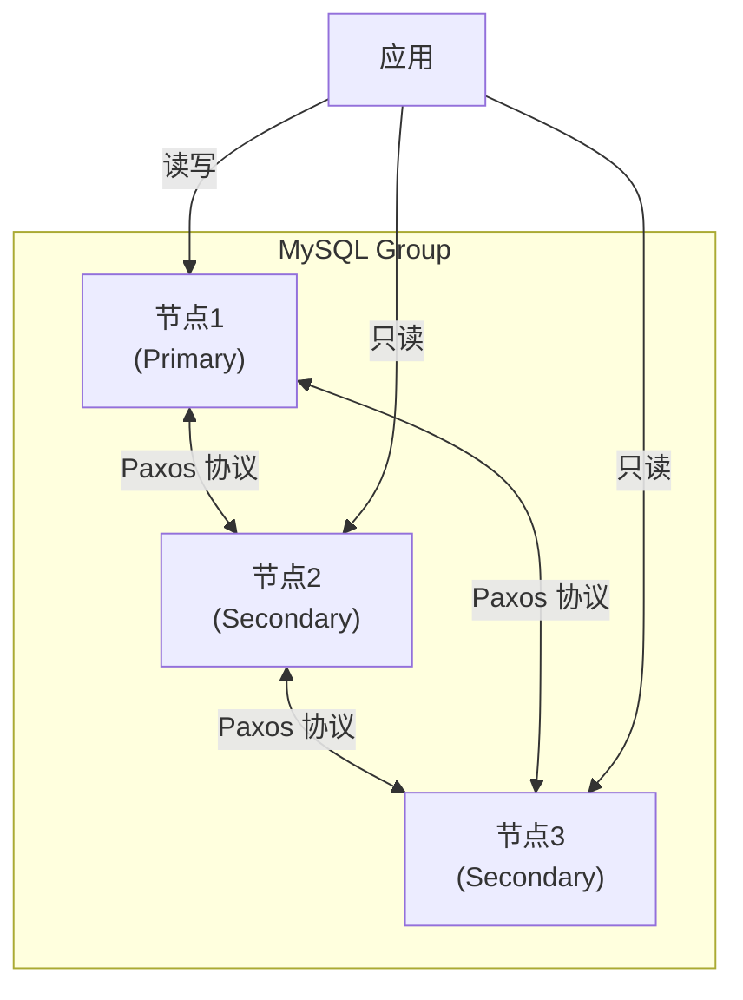
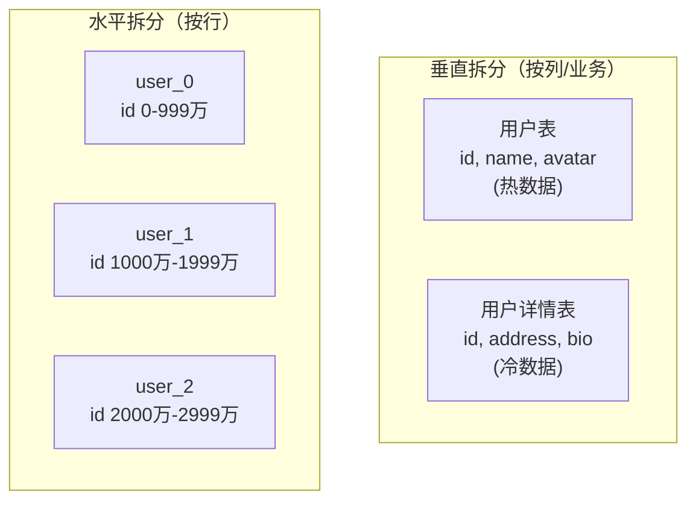

# MySQL 主从复制与高可用

## 主从复制原理

### 核心流程

### 三个核心线程

| 线程 | 位置 | 作用 |
|------|------|------|
| **Binlog Dump Thread** | 主库 | 读取主库 binlog，发送给从库 |
| **I/O Thread** | 从库 | 接收主库 binlog，写入本地 Relay Log |
| **SQL Thread** | 从库 | 读取 Relay Log，重放 SQL 到从库 |

---

## 复制模式

### 1. 异步复制（默认）

- 主库**不等待**从库确认
- 性能最好
- **风险**：主库崩溃时，已提交但未同步到从库的数据**丢失**

### 2. 半同步复制（Semi-Sync）

- 主库等待**至少一个从库**确认收到 binlog 后才返回
- 平衡了性能和数据安全
- MySQL 5.7 引入**增强半同步**（`AFTER_SYNC`）

#### AFTER_SYNC vs AFTER_COMMIT

| 模式 | 流程 | 特点 |
|------|------|------|
| **AFTER_COMMIT** | 主库提交 → 发送从库 → 等确认 | 崩溃时可能丢数据（已提交但从库未确认） |
| **AFTER_SYNC** ✅ | 主库写binlog → 发送从库 → 等确认 → 提交 | 更安全，推荐 |

### 3. 全同步复制

- 主库等待**所有从库**都执行完成
- 性能极差，实际很少使用

---

## 主从延迟

### 延迟原因

### 解决方案

| 方案 | 说明 |
|------|------|
| **多线程复制（MTS）** | MySQL 5.6+ 支持多线程 SQL Thread |
| **组复制（MGR）** | 基于 Paxos 协议的强一致复制 |
| **读写分离中间件** | ProxySQL、MaxScale |
| **并行复制策略** | 按库并行（5.6）、按组提交并行（5.7）、WRITESET（8.0） |

### MySQL 5.7+ 并行复制

**5.7 基于组提交的并行复制**：
- 主库同一组提交的事务，在从库可以并行回放
- `slave_parallel_type = LOGICAL_CLOCK`

**8.0 WRITESET 并行复制**：
- 基于事务修改的行来判断是否可以并行
- 不修改同一行的事务 → 并行回放
- `binlog_transaction_dependency_tracking = WRITESET`

---

## 读写分离

### 读写分离导致的问题：过期读

写完主库后立刻从从库读 → 可能读到旧数据（从库还没来得及复制）。

**解决方案：**

| 方案 | 说明 | 适用场景 |
|------|------|----------|
| **强制走主库** | 关键业务读主库 | 对一致性要求高的场景 |
| **sleep 方案** | 写后等一小段时间再读 | 不靠谱，不推荐 |
| **判断主从延迟** | `SHOW SLAVE STATUS` 中 `Seconds_Behind_Master = 0` | 粗略判断 |
| **等待 GTID** | `WAIT_FOR_EXECUTED_GTID_SET` | 精确等待特定事务同步 |
| **semi-sync** | 写后确认从库收到再返回 | 半同步复制 |

---

## MySQL Group Replication（MGR）

### 组复制架构

### 特点

- 基于 **Paxos 协议**，强一致性
- 自动故障转移（Failover）
- 支持**单主模式**和**多主模式**
- 最少 3 个节点，最多 9 个节点
- 事务需要**多数节点确认**才提交

---

## 分库分表

### 何时需要分库分表？

| 指标 | 阈值 | 方案 |
|------|------|------|
| 单表行数 | > 2000 万 | 分表 |
| 单库容量 | > 500GB | 分库 |
| 并发连接 | > 5000 | 分库 |

### 垂直拆分 vs 水平拆分

### 分片策略

| 策略 | 方式 | 优点 | 缺点 |
|------|------|------|------|
| **Hash 取模** | `id % N` | 数据均匀 | 扩容麻烦（数据重新分布） |
| **范围分片** | id 1-1000万 → 表1 | 扩容简单 | 可能数据不均匀（热点） |
| **一致性Hash** | 哈希环 | 扩容影响小 | 实现复杂 |

### 分库分表带来的问题

| 问题 | 解决方案 |
|------|----------|
| **分布式事务** | Seata、TCC、消息事务 |
| **跨库 JOIN** | 冗余字段、应用层组装、全局表 |
| **分页排序** | 各分片查询后合并排序 |
| **全局唯一 ID** | 雪花算法、UUID、号段模式 |
| **跨库聚合** | 分片查询后应用层聚合 |

### 常用中间件

| 中间件 | 类型 | 特点 |
|--------|------|------|
| **ShardingSphere** | 应用层 | 功能最全，社区活跃 |
| **MyCat** | 代理层 | 透明代理 |
| **Vitess** | 代理层 | YouTube 开源，K8s 友好 |

---

## 面试高频问题

### Q1：主从复制的原理？

主库提交事务后将变更写入 binlog，Dump Thread 将 binlog 发送给从库的 I/O Thread，I/O Thread 写入 Relay Log，SQL Thread 读取 Relay Log 回放到从库。

### Q2：主从延迟怎么解决？

1. 多线程并行复制（MTS）
2. 升级从库硬件
3. 避免大事务
4. 使用 MGR 组复制
5. 关键业务读主库

### Q3：分库分表后 ID 怎么生成？

推荐**雪花算法（Snowflake）**：64位 = 1位符号 + 41位时间戳 + 10位机器ID + 12位序列号，每秒可生成 400 万+ 个唯一 ID。

### Q4：如何保证主从数据一致？

1. 使用半同步复制（AFTER_SYNC）
2. 使用 GTID（全局事务ID）跟踪复制进度
3. 使用 MGR 组复制（Paxos 强一致）
4. 定期用 pt-table-checksum 校验
