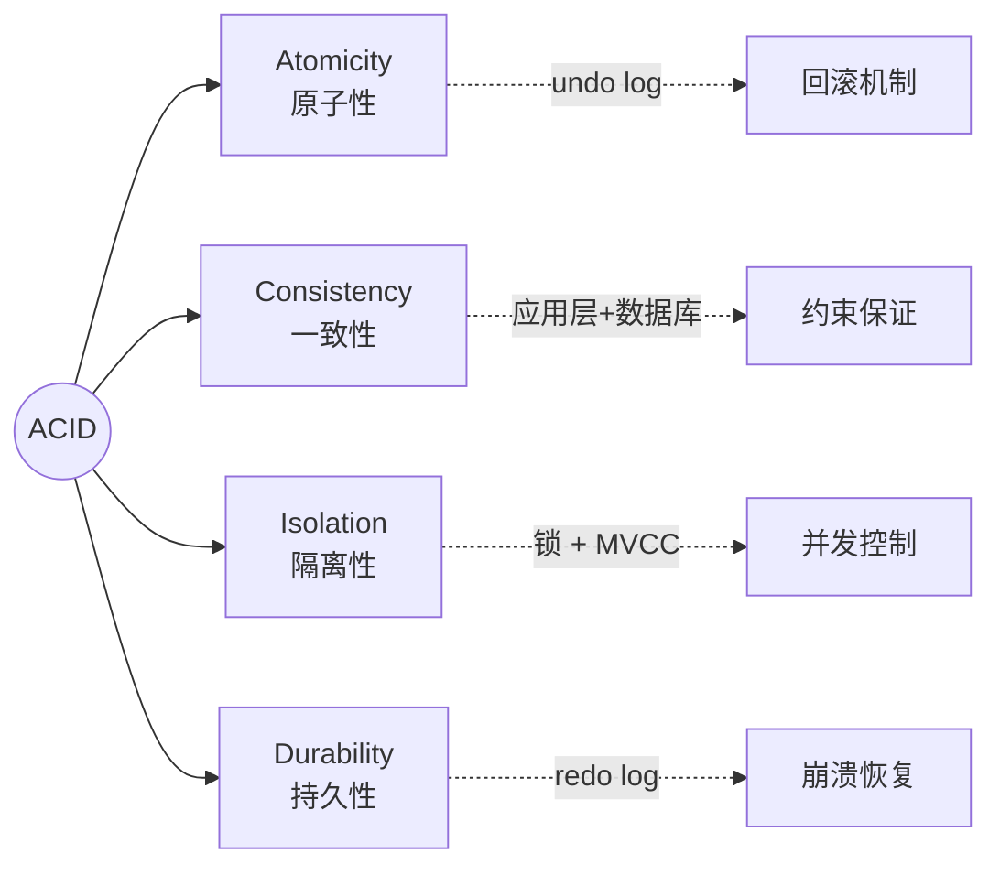
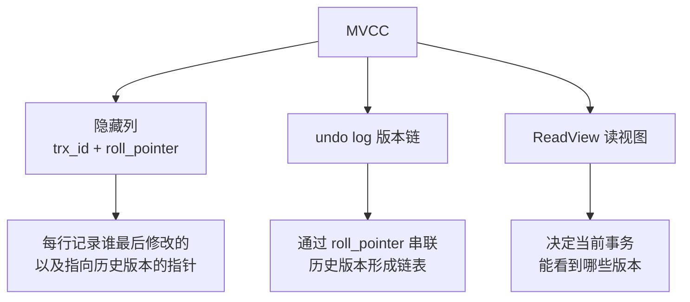
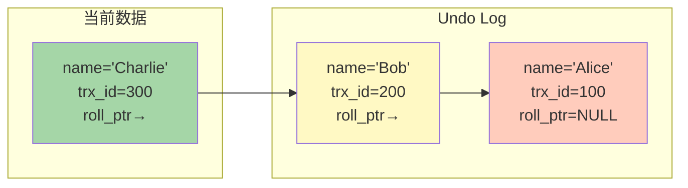
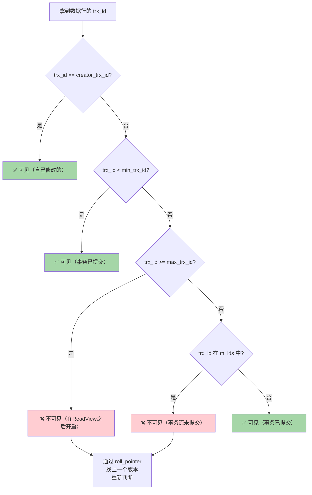

# MySQL 事务与 MVCC

MVCC 是面试中**最常考、最难理解**的知识点之一，必须掌握其底层实现。

## 事务四大特性（ACID）



| 特性 | 含义 | 实现机制 |
|------|------|----------|
| **原子性** | 事务要么全做，要么全不做 | **undo log** |
| **一致性** | 事务前后数据满足约束 | 其他三个特性共同保证 |
| **隔离性** | 并发事务互不干扰 | **锁 + MVCC** |
| **持久性** | 提交后数据不丢失 | **redo log** |

> [!important] 面试要点
> 一致性不是由某个单独机制保证的，而是由原子性、隔离性、持久性**共同保证**的结果。

---

## 并发事务问题

| 问题 | 描述 | 示例 |
|------|------|------|
| **脏读** | 读到其他事务**未提交**的数据 | 事务B读到事务A未提交的修改，A回滚后B读到的数据是无效的 |
| **不可重复读** | 同一事务内两次读取**同一行**结果不同 | 事务A第一次读 balance=100，事务B修改为200并提交，事务A再读变成200 |
| **幻读** | 同一事务内两次查询**行数不同** | 事务A查询 age>20 有 5 条，事务B插入一条 age=25，事务A再查变成 6 条 |

### 三者区别

```
脏读：     读到了「别人还没提交」的数据（最严重）
不可重复读：读到了「别人已提交的修改」（同一行数据变了）
幻读：     读到了「别人已提交的插入/删除」（行数变了）
```

---

## 四大隔离级别

| 隔离级别 | 脏读 | 不可重复读 | 幻读 | 实现方式 |
|----------|------|-----------|------|----------|
| **READ UNCOMMITTED** 读未提交 | ❌ 可能 | ❌ 可能 | ❌ 可能 | 无隔离 |
| **READ COMMITTED (RC)** 读已提交 | ✅ 解决 | ❌ 可能 | ❌ 可能 | MVCC（每次读生成 ReadView） |
| **REPEATABLE READ (RR)** 可重复读 | ✅ 解决 | ✅ 解决 | ⚠️ 大部分解决 | MVCC（事务开始时生成 ReadView）+ 间隙锁 |
| **SERIALIZABLE** 串行化 | ✅ 解决 | ✅ 解决 | ✅ 解决 | 加锁，读写串行 |

> [!warning] 面试考点
> **MySQL 默认隔离级别是 RR（可重复读）**，Oracle 默认是 RC（读已提交）。
> InnoDB 在 RR 级别通过 **MVCC + 间隙锁（Next-Key Lock）** 解决了大部分幻读问题。

---

## MVCC 实现原理

MVCC（Multi-Version Concurrency Control）= 多版本并发控制

**核心思想**：同一行数据保存多个版本，不同事务看到不同版本，实现**读写不冲突**。

### MVCC 三大组件



### 1. 隐藏列

每行记录都有（详见 [[InnoDB存储引擎#隐藏列]]）：
- `trx_id`：最后修改该行的事务 ID
- `roll_pointer`：指向该行上一个版本的指针（在 undo log 中）

### 2. Undo Log 版本链

每次修改一行数据，旧版本被写入 undo log，通过 `roll_pointer` 链接成版本链。



**解读**：
- 事务 100 插入 name='Alice'
- 事务 200 修改为 name='Bob'
- 事务 300 修改为 name='Charlie'
- 每个版本都保留在 undo log 中，通过 roll_pointer 链接

### 3. ReadView（读视图）

ReadView 是 MVCC 的**核心判断依据**，决定当前事务能看到哪个版本。

#### ReadView 包含四个关键字段

| 字段 | 含义 |
|------|------|
| `m_ids` | 生成 ReadView 时，系统中所有**活跃（未提交）**事务的 ID 列表 |
| `min_trx_id` | 活跃事务中**最小**的事务 ID |
| `max_trx_id` | 生成 ReadView 时，系统应该分配给**下一个**事务的 ID（最大事务ID + 1） |
| `creator_trx_id` | 创建该 ReadView 的事务 ID |

#### ReadView 可见性判断规则



> [!important] 核心逻辑（必背）
> 1. 如果 trx_id 等于当前事务 ID → **可见**（自己改的）
> 2. 如果 trx_id 小于 min_trx_id → **可见**（说明该事务在 ReadView 之前就提交了）
> 3. 如果 trx_id 大于等于 max_trx_id → **不可见**（说明该事务在 ReadView 之后才开启）
> 4. 如果 trx_id 在 [min_trx_id, max_trx_id) 之间：
>    - 在 m_ids 中 → **不可见**（还没提交）
>    - 不在 m_ids 中 → **可见**（已经提交了）
> 5. 不可见时，通过 roll_pointer 找上一个版本，重复判断

---

### RC 与 RR 的 ReadView 区别

这是 MVCC 最关键的区别：

| 隔离级别 | ReadView 生成时机 | 效果 |
|----------|-------------------|------|
| **RC（读已提交）** | **每次 SELECT** 都生成新的 ReadView | 可以看到其他事务新提交的数据 |
| **RR（可重复读）** | **事务第一次 SELECT** 时生成，后续复用 | 整个事务看到的数据一致 |

### 完整示例

```
假设初始数据: id=1, name='Alice', trx_id=50

时间线:
T1: 事务A (trx_id=100) 开始
T2: 事务B (trx_id=200) 开始
T3: 事务B 执行 UPDATE SET name='Bob' WHERE id=1
T4: 事务B 提交
T5: 事务A 执行 SELECT name FROM t WHERE id=1
```

**RR 级别（事务A 第一次 SELECT 生成 ReadView）：**

```
事务A 在 T5 生成 ReadView:
  m_ids = [100]        (事务A自己还活跃)
  min_trx_id = 100
  max_trx_id = 201
  creator_trx_id = 100

当前版本: name='Bob', trx_id=200
  → 200 在 [100, 201) 之间
  → 200 不在 m_ids [100] 中
  → ✅ 可见！

结果: name = 'Bob'
```

**如果事务B 还没提交（T5 发生在 T3 之后、T4 之前）：**

```
事务A 在 T5 生成 ReadView:
  m_ids = [100, 200]   (事务A和B都活跃)
  min_trx_id = 100
  max_trx_id = 201
  creator_trx_id = 100

当前版本: name='Bob', trx_id=200
  → 200 在 m_ids [100, 200] 中
  → ❌ 不可见！
  
通过 roll_pointer 找上一版本:
  name='Alice', trx_id=50
  → 50 < min_trx_id(100)
  → ✅ 可见！

结果: name = 'Alice' （看不到未提交的修改）
```

---

## 快照读 vs 当前读

| 类型 | 说明 | SQL 示例 |
|------|------|----------|
| **快照读** | 读取 MVCC 中的某个版本 | 普通 `SELECT` |
| **当前读** | 读取最新已提交的数据，并加锁 | `SELECT ... FOR UPDATE`<br/>`SELECT ... LOCK IN SHARE MODE`<br/>`INSERT / UPDATE / DELETE` |

> [!warning] 重要
> - 快照读不加锁，性能好，通过 MVCC 实现一致性
> - 当前读加锁（行锁 + 间隙锁），保证数据最新
> - **MVCC 只对快照读生效**，当前读走锁机制

---

## RR 级别下的幻读问题

### MVCC 能解决的幻读（快照读场景）

```sql
-- 事务A
BEGIN;
SELECT * FROM t WHERE age > 20;  -- 结果：5行（生成ReadView）

-- 事务B 插入一行 age=25 并提交

SELECT * FROM t WHERE age > 20;  -- 结果仍然：5行（复用ReadView，看不到新插入的行）
COMMIT;
```

### MVCC 无法解决的幻读（当前读场景）

```sql
-- 事务A
BEGIN;
SELECT * FROM t WHERE age > 20;           -- 快照读：5行

-- 事务B 插入一行 age=25 并提交

SELECT * FROM t WHERE age > 20 FOR UPDATE; -- 当前读：6行！幻读了！
```

> [!important] 解决方案
> InnoDB 在 RR 级别使用 **Next-Key Lock（间隙锁 + 行锁）** 来解决当前读的幻读问题。
> 详见 [[MySQL锁机制#Next-Key Lock]]

---

## 面试高频问题

### Q1：MVCC 是怎么实现的？

1. 每行记录有隐藏列 `trx_id` 和 `roll_pointer`
2. 修改数据时，旧版本写入 undo log，通过 roll_pointer 形成版本链
3. 读取数据时，根据 ReadView 的可见性规则，在版本链中找到可见版本
4. RC 每次 SELECT 生成新 ReadView，RR 只在第一次 SELECT 时生成

### Q2：RC 和 RR 的根本区别是什么？

**ReadView 的生成时机不同**：
- RC：每次 SELECT 都生成新的 ReadView → 可以看到其他事务新提交的修改
- RR：第一次 SELECT 生成后复用 → 整个事务看到的数据快照一致

### Q3：MVCC 能完全解决幻读吗？

不能。MVCC 只能解决**快照读**的幻读。**当前读**的幻读需要通过 **Next-Key Lock** 解决。

### Q4：undo log 什么时候删除？

当没有任何活跃事务需要读取该版本时，undo log 才会被 **Purge Thread** 清除。长事务会导致 undo log 大量积累！
