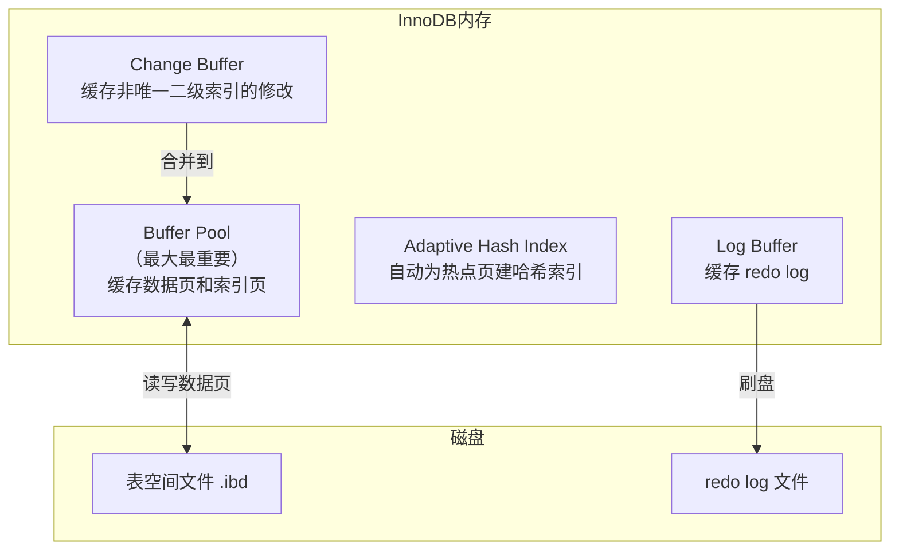
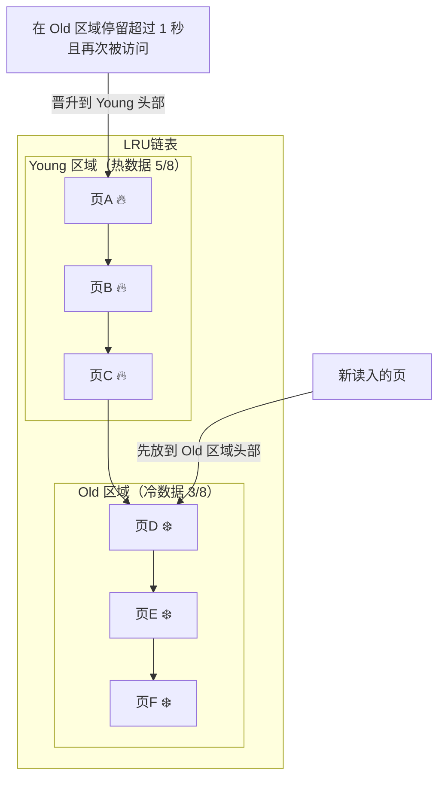
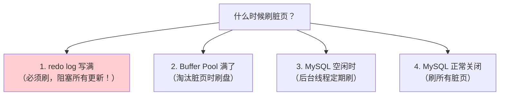
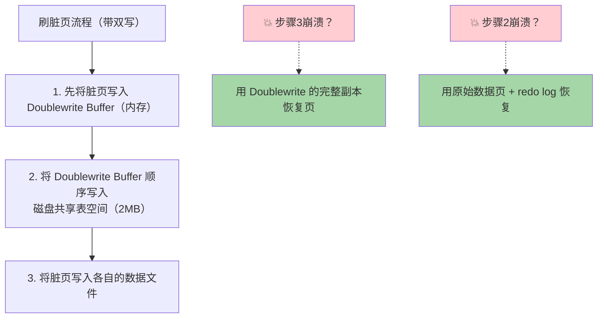
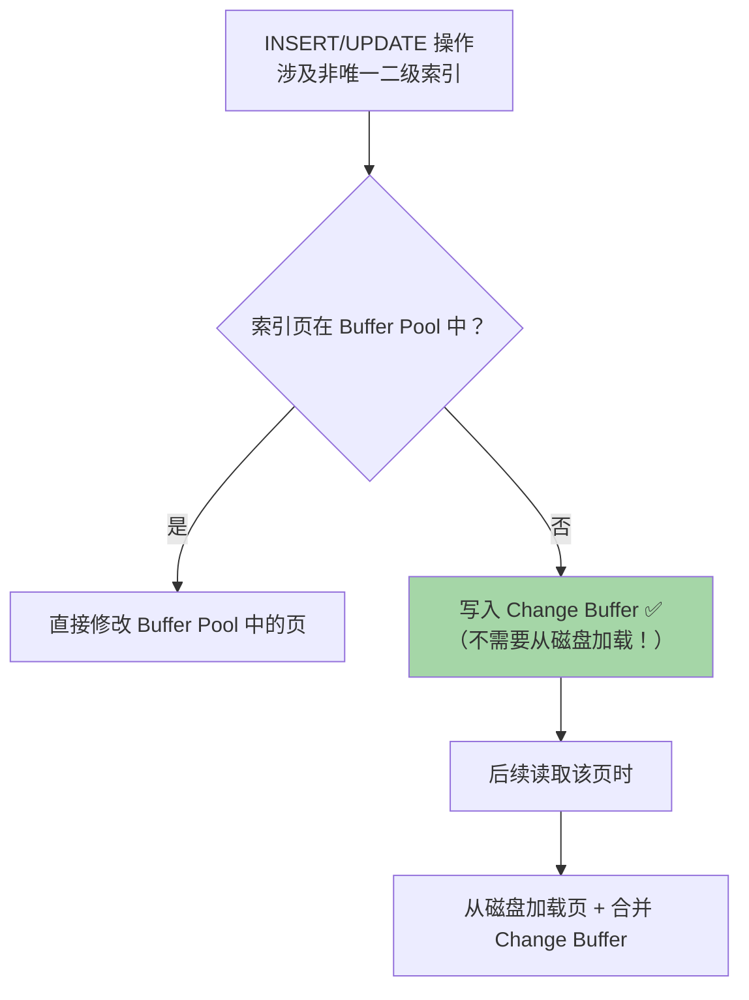

# MySQL 内存管理与 Buffer Pool

Buffer Pool 是 InnoDB 最重要的内存结构，直接影响数据库性能。

## InnoDB 内存架构



---

## Buffer Pool 核心原理

### 什么是 Buffer Pool？

- InnoDB 在内存中开辟的一块**连续区域**
- 以**页（16KB）**为单位缓存磁盘数据
- 默认大小 128MB，生产环境建议设为**物理内存的 60%-80%**

```sql
-- 查看 Buffer Pool 大小
SHOW VARIABLES LIKE 'innodb_buffer_pool_size';

-- 设置为 8GB
SET GLOBAL innodb_buffer_pool_size = 8589934592;
```

### Buffer Pool 存放什么？

| 类型 | 说明 |
|------|------|
| **数据页（Index Page）** | 表数据和索引数据 |
| **undo 页** | undo log 相关页 |
| **插入缓冲页** | Change Buffer |
| **自适应哈希索引** | AHI |
| **锁信息** | 行锁等锁结构 |

### 控制块 + 缓存页

```
Buffer Pool 内部结构：

┌──────────────────────────────────────────────┐
│ 控制块1 │ 控制块2 │ 控制块3 │ ... │ 碎片空间   │
├──────────────────────────────────────────────┤
│ 缓存页1  │ 缓存页2  │ 缓存页3  │ ... │          │
│ (16KB)   │ (16KB)   │ (16KB)   │     │          │
└──────────────────────────────────────────────┘

控制块: 记录缓存页的表空间号、页号、在链表中的位置等元信息
缓存页: 实际缓存的数据页内容 (16KB)
```

---

## Buffer Pool 的 LRU 算法

### 传统 LRU 的问题

如果用简单的 LRU（最近最少使用）：

**问题1：预读失效**
- MySQL 有预读机制，会提前加载相邻的数据页
- 预读的页可能根本不会被访问
- 但它们被放到 LRU 头部，挤掉了真正的热点页

**问题2：Buffer Pool 污染**
- 全表扫描（如 `SELECT * FROM t`）会加载大量数据页
- 这些页只访问一次，但把热点页全部挤出
- 扫描结束后 Buffer Pool 全是冷数据 → 缓存命中率暴跌

### InnoDB 改进的 LRU：冷热分离



#### 核心规则

1. **新页进入**：放到 **Old 区域的头部**（不是整个 LRU 的头部！）
2. **晋升条件**：在 Old 区域存在**超过 1 秒**，且再次被访问 → 移到 Young 头部
3. **Young 区域优化**：只有在 Young 区域**后 1/4 部分**的页被访问时才移到头部（减少链表操作）
4. **淘汰**：从 LRU 链表尾部淘汰

```sql
-- 控制 Old 区域比例（默认 37% ≈ 3/8）
innodb_old_blocks_pct = 37

-- 控制晋升等待时间（默认 1000ms = 1秒）
innodb_old_blocks_time = 1000
```

### 解决了什么问题？

| 问题 | 传统 LRU | 改进 LRU |
|------|----------|----------|
| **预读失效** | 预读页进入头部，挤掉热点 | 预读页进入 Old 区域，不影响热点 |
| **Buffer Pool 污染** | 全表扫描页冲入头部 | 全表扫描页在 Old 区域，1秒内被淘汰 |

> [!important] 面试回答要点
> InnoDB 的 Buffer Pool 使用**改进的 LRU 算法**，将链表分为 Young（热）和 Old（冷）两个区域。新读入的页先放到 Old 区域头部，只有在 Old 区域停留超过 `innodb_old_blocks_time`（默认1秒）且再次被访问才晋升到 Young 区域。这解决了预读失效和全表扫描污染的问题。

---

## 脏页刷盘（Flush）

Buffer Pool 中被修改但未写入磁盘的页叫**脏页（Dirty Page）**。

### 刷脏页的时机



> [!danger] redo log 写满导致的性能抖动
> 当 redo log 写满时，MySQL 必须暂停所有更新操作，集中刷脏页推进 checkpoint。这会导致性能**断崖式下降**。
> **解决方案**：适当增大 redo log 文件大小。

### 刷盘策略参数

```sql
-- 控制脏页刷盘速度
innodb_io_capacity = 200       -- 告诉 InnoDB 磁盘 IOPS（SSD 可设 2000+）
innodb_io_capacity_max = 2000  -- 刷脏页的上限 IOPS

-- 脏页比例阈值
innodb_max_dirty_pages_pct = 75  -- 脏页占 Buffer Pool 超过75%时加速刷盘

-- 邻居页刷新（机械硬盘有用，SSD 建议关闭）
innodb_flush_neighbors = 0     -- 0=关闭, 1=开启
```

---

## Doublewrite Buffer（双写缓冲）

### 为什么需要双写？

**部分写失效（Partial Page Write）问题**：
- InnoDB 的页是 16KB
- 操作系统一次写入通常是 4KB
- 如果写了 8KB 后崩溃 → 数据页**半新半旧** → 页损坏！
- redo log 记录的是页的增量修改，页本身损坏了 redo log 也无法恢复



---

## Change Buffer（写缓冲）

### 什么是 Change Buffer？

当修改**非唯一二级索引**页时，如果该页不在 Buffer Pool 中，不会立即从磁盘加载，而是先将修改记录在 Change Buffer 中，等到页被读取时再合并（merge）。



### 为什么只对非唯一二级索引有效？

- **唯一索引**：插入时需要**检查唯一性**，必须读页 → 没法缓冲
- **非唯一索引**：不需要唯一性检查 → 可以先缓冲，后合并

> [!tip] 适用场景
> 写多读少的业务 + 非唯一二级索引较多 → Change Buffer 收益大
> 写后立刻读的场景 → Change Buffer 反而增加开销（写了还得马上 merge）

---

## Adaptive Hash Index（自适应哈希索引）

- InnoDB 自动监控索引查找模式
- 对**热点页**自动建立**哈希索引**
- 将 B+ 树的 O(log n) 查找优化为 O(1)
- 完全由引擎自动管理，DBA 不能手动创建

```sql
-- 查看 AHI 状态
SHOW ENGINE INNODB STATUS\G

-- 开启/关闭
SET GLOBAL innodb_adaptive_hash_index = ON|OFF;
```

---

## Buffer Pool 多实例

高并发场景下，单个 Buffer Pool 的互斥锁是瓶颈。

```sql
-- 将 Buffer Pool 分为多个实例
innodb_buffer_pool_instances = 8  -- 建议 Buffer Pool > 1GB 时使用

-- 每个实例独立管理：
--   独立的 LRU 链表
--   独立的 Free 链表
--   独立的 Flush 链表
--   独立的互斥锁
```

---

## 面试高频问题

### Q1：Buffer Pool 的 LRU 和传统 LRU 有什么区别？

分为 Young（热）和 Old（冷）两个区域。新页先进 Old 区域，满足条件才晋升到 Young。解决了预读失效和全表扫描污染问题。

### Q2：什么是脏页？什么时候刷盘？

脏页是 Buffer Pool 中被修改但未写入磁盘的数据页。刷盘时机：redo log 满、Buffer Pool 满、空闲时后台刷、数据库关闭时。

### Q3：Doublewrite Buffer 的作用？

防止部分写失效导致的数据页损坏。先将脏页写入双写区域，再写入数据文件。崩溃时可用双写区域的完整副本恢复。

### Q4：Change Buffer 和 Buffer Pool 的关系？

Change Buffer 是 Buffer Pool 的一部分（默认占 25%），用于缓存对非唯一二级索引的修改操作，减少随机 I/O。
