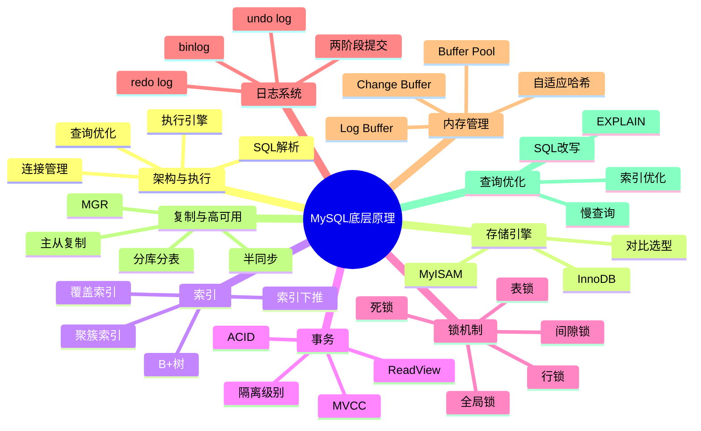

# MySQL 底层原理 - 完整知识体系

> [!tip] 使用指南
> 本系列笔记覆盖 MySQL 面试全部高频考点，从架构到优化，由浅入深。每个模块独立成篇，互相链接。建议按顺序阅读。

## 知识地图

## 模块导航

| 序号  | 模块                        | 核心内容                            | 面试热度  |
| --- | ------------------------- | ------------------------------- | ----- |
| 1   | [[MySQL架构与SQL执行流程]]       | 整体架构、连接管理、SQL执行全链路              | ⭐⭐⭐⭐  |
| 2   | [[InnoDB存储引擎]]            | 表空间、页结构、行格式、文件组织                | ⭐⭐⭐⭐⭐ |
| 3   | [[MySQL索引原理]]             | B+树、聚簇索引、二级索引、索引优化              | ⭐⭐⭐⭐⭐ |
| 4   | [[MySQL事务与MVCC]]          | ACID、隔离级别、MVCC实现、ReadView       | ⭐⭐⭐⭐⭐ |
| 5   | [[MySQL锁机制]]              | 全局锁、表锁、行锁、间隙锁、死锁                | ⭐⭐⭐⭐⭐ |
| 6   | [[MySQL日志系统]]             | redo log、undo log、binlog、两阶段提交  | ⭐⭐⭐⭐⭐ |
| 7   | [[MySQL内存管理与Buffer Pool]] | Buffer Pool、Change Buffer、LRU优化 | ⭐⭐⭐⭐  |
| 8   | [[MySQL主从复制与高可用]]         | 复制原理、半同步、MGR、分库分表               | ⭐⭐⭐⭐  |
| 9   | [[MySQL查询优化]]             | EXPLAIN、慢查询分析、索引优化策略            | ⭐⭐⭐⭐⭐ |

## 面试高频 Top 10 问题速查

1. **MySQL 一条 SQL 的执行流程是怎样的？** → [[MySQL架构与SQL执行流程#SQL 执行全流程]]
2. **为什么用 B+ 树而不用 B 树？** → [[MySQL索引原理#为什么选择 B+ 树]]
3. **什么是聚簇索引和非聚簇索引？** → [[MySQL索引原理#聚簇索引 vs 非聚簇索引]]
4. **MVCC 是怎么实现的？** → [[MySQL事务与MVCC#MVCC 实现原理]]
5. **事务隔离级别有哪些？各自解决什么问题？** → [[MySQL事务与MVCC#四大隔离级别]]
6. **redo log 和 binlog 有什么区别？** → [[MySQL日志系统#redo log vs binlog 对比]]
7. **什么情况下会发生死锁？怎么解决？** → [[MySQL锁机制#死锁]]
8. **Buffer Pool 是什么？LRU 怎么优化的？** → [[MySQL内存管理与Buffer Pool#Buffer Pool 核心原理]]
9. **主从复制的原理是什么？** → [[MySQL主从复制与高可用#主从复制原理]]
10. **如何优化慢 SQL？** → [[MySQL查询优化#慢查询优化实战]]
