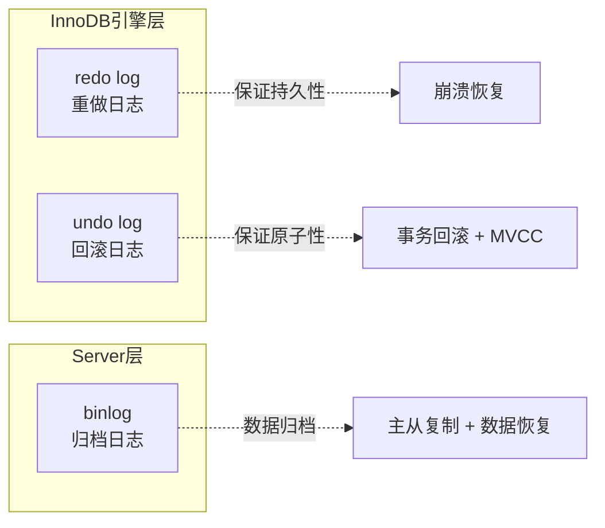
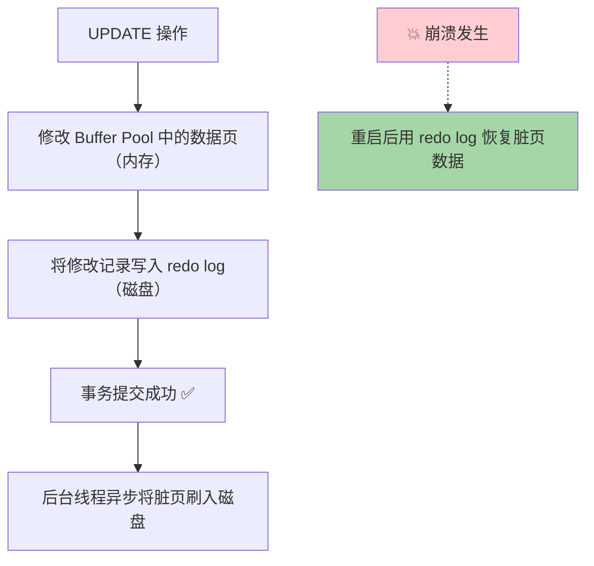
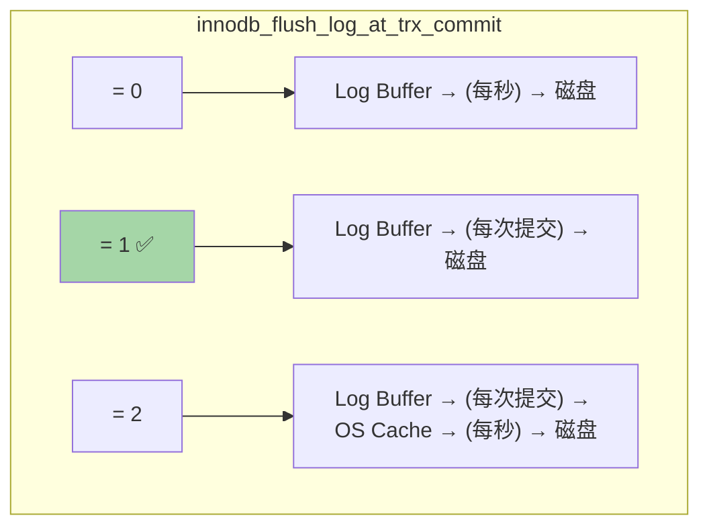
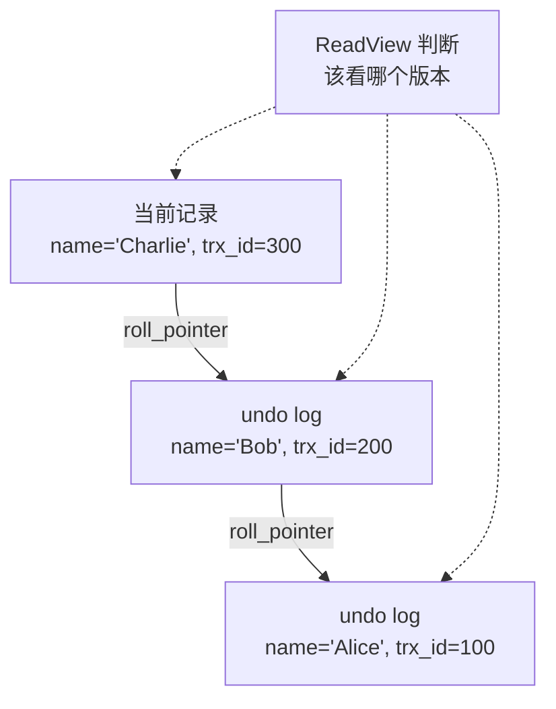
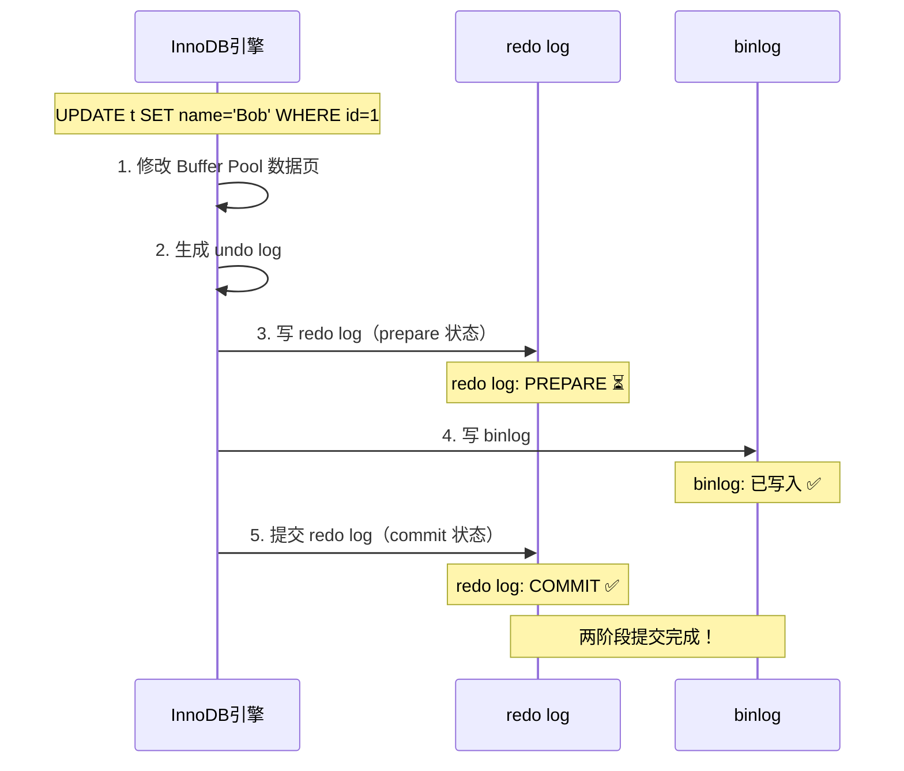
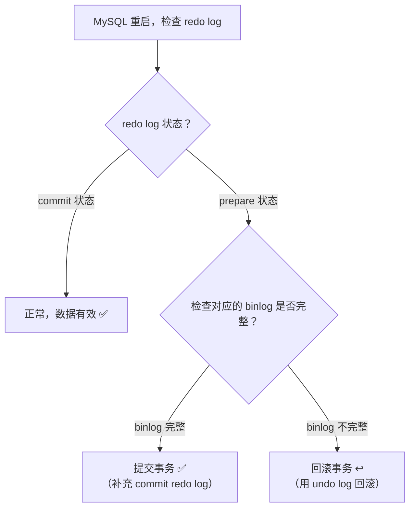
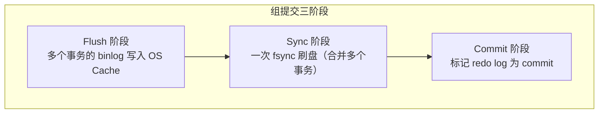
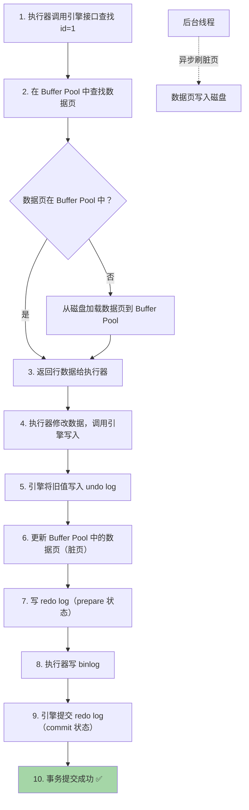

# MySQL 日志系统

日志系统是 MySQL **可靠性和高性能** 的基石。三大日志（redo log、undo log、binlog）是面试必考内容。

## 三大日志概览



| 日志 | 所属层 | 作用 | 写入方式 |
|------|--------|------|----------|
| **redo log** | InnoDB 引擎层 | 崩溃恢复（持久性） | 循环写，固定大小 |
| **undo log** | InnoDB 引擎层 | 事务回滚 + MVCC | 随机写，按需分配 |
| **binlog** | Server 层 | 主从复制 + 数据恢复 | 追加写，无限增长 |

---

## Redo Log（重做日志）

### 为什么需要 redo log？

**核心问题**：InnoDB 修改数据是先改 Buffer Pool（内存），如果数据库崩溃，内存中未刷盘的脏页数据就丢失了。

**解决方案**：WAL（Write-Ahead Logging）= **先写日志，再写磁盘**



### WAL 为什么比直接刷盘快？

| 直接刷盘 | WAL + redo log |
|----------|----------------|
| 随机 I/O（数据页分散在磁盘各处） | **顺序 I/O**（redo log 顺序追加写入） |
| 每次修改刷整个数据页（16KB） | 只写修改的部分（几十字节） |
| 性能差 | **性能极好** |

> [!important] 这就是 redo log 的核心价值
> 将**随机写**转换为**顺序写**，将**整页写**转换为**增量写**，极大提升写入性能。

### Redo Log 的结构

redo log 由固定大小的文件组组成，**循环写入**：

```
                    write pos（当前写入位置）
                         ↓
┌──────────┬──────────┬──────────┬──────────┐
│ib_logfile0│ib_logfile1│ib_logfile2│ib_logfile3│
└──────────┴──────────┴──────────┴──────────┘
↑
checkpoint（已刷盘位置）

write pos 追着 checkpoint 跑（循环写）
write pos 和 checkpoint 之间 = 可写空间
当 write pos 追上 checkpoint → 必须刷脏页推进 checkpoint
```

```mermaid
graph LR
    subgraph Redo Log 文件组（循环写）
        F0["ib_logfile0"]
        F1["ib_logfile1"]
        F2["ib_logfile2"]
        F3["ib_logfile3"]
        F0 --> F1 --> F2 --> F3 --> F0
    end
    
    WP["write pos ✏️<br/>当前写入位置"]
    CP["checkpoint ✅<br/>已刷盘位置"]
    
    WP -.-> F1
    CP -.-> F0
```

### Redo Log 刷盘策略

由 `innodb_flush_log_at_trx_commit` 控制：

| 值 | 行为 | 性能 | 安全性 |
|----|------|------|--------|
| **0** | 每秒刷一次 | 最快 | 可能丢 1 秒数据 |
| **1** | 每次提交都刷盘 | 最慢 | **最安全（推荐）** |
| **2** | 每次提交写到 OS 缓存，每秒刷盘 | 中等 | OS 崩溃可能丢数据 |



---

## Undo Log（回滚日志）

### 两大作用

1. **事务回滚**：记录修改前的旧值，回滚时恢复
2. **MVCC**：提供数据的历史版本（版本链）

### Undo Log 类型

| 类型 | 说明 | 用途 |
|------|------|------|
| **insert undo log** | INSERT 操作的 undo | 事务回滚时删除新插入的行。事务提交后可立即删除 |
| **update undo log** | UPDATE/DELETE 的 undo | 事务回滚 + MVCC 版本链。需等无事务引用才能删除 |

### Undo Log 与 MVCC 的关系



详见 [[MySQL事务与MVCC#MVCC 实现原理]]

---

## Binlog（归档日志）

### Binlog 与 Redo Log 的本质区别

| 对比维度 | redo log | binlog |
|----------|----------|--------|
| **所属层** | InnoDB 引擎 | Server 层（所有引擎通用） |
| **内容** | 物理日志（页的修改） | 逻辑日志（SQL 语句/行变更） |
| **写入方式** | 循环写（固定大小） | 追加写（不覆盖） |
| **用途** | 崩溃恢复 | 主从复制、数据恢复 |
| **事务** | 一个事务可能多条 | 事务提交时一次性写入 |

### Binlog 三种格式

| 格式 | 记录内容 | 优点 | 缺点 |
|------|----------|------|------|
| **STATEMENT** | SQL 语句原文 | 日志量小 | 有些函数不安全（NOW()、UUID()） |
| **ROW** | 行数据变更（修改前后的值） | 准确，安全 | 日志量大 |
| **MIXED** | 混合模式 | 兼顾两者 | 仍有不安全风险 |

> [!tip] 推荐使用 ROW 格式
> MySQL 5.7.7+ 默认 ROW 格式。虽然日志量大，但数据最准确，是主从复制最安全的选择。

### Binlog 刷盘策略

由 `sync_binlog` 控制：

| 值 | 行为 | 推荐 |
|----|------|------|
| **0** | 依赖 OS 刷盘 | ❌ 不安全 |
| **1** | 每次提交都刷盘 | ✅ 最安全 |
| **N** | 每 N 次提交刷一次 | 折中 |

---

## 两阶段提交（2PC）

### 为什么需要两阶段提交？

**问题**：一个事务需要同时写 redo log 和 binlog。如果写完一个后崩溃，两份日志数据不一致 → 主从数据不一致！

```
场景1: 先写 redo log，后写 binlog
  redo log 写成功 → 崩溃 → binlog 没写
  → 主库恢复后有这条数据，从库没有 → 数据不一致！

场景2: 先写 binlog，后写 redo log
  binlog 写成功 → 崩溃 → redo log 没写
  → 主库恢复后没有这条数据，从库有 → 数据不一致！
```

### 两阶段提交流程



### 崩溃恢复规则



> [!important] 两阶段提交保证了什么？
> **redo log 和 binlog 的一致性**，从而保证主从数据一致。
> 
> 这是面试**超高频**考点，务必掌握流程图和崩溃恢复规则。

### 组提交（Group Commit）

MySQL 5.6 引入，优化两阶段提交的性能：

```
传统方式: 每个事务独立刷盘 → 磁盘 IOPS 压力大

组提交: 多个事务的 redo log / binlog 合并成一批刷盘
```



---

## Redo Log Buffer 写入流程


---

## 数据更新全流程（综合）

一条 `UPDATE t SET name='Bob' WHERE id=1` 的完整流程：



---

## 面试高频问题

### Q1：redo log 和 binlog 有什么区别？

从**层级、内容、写法、用途**四个角度回答（见上方对比表）。

### Q2：为什么有了 binlog 还需要 redo log？

1. binlog 是 Server 层的，**没有崩溃恢复能力**
2. binlog 是**逻辑日志**，记录的是 SQL 或行变更，不能精确恢复数据页
3. redo log 是**物理日志**，记录的是数据页的修改，可以精确恢复
4. binlog 是追加写，redo log 是循环写（空间可控）

### Q3：两阶段提交是什么？为什么需要？

为了保证 redo log 和 binlog 的一致性。redo log 先 prepare，写完 binlog 后再 commit。任何时刻崩溃都能通过检查两份日志的状态来决定提交还是回滚。

### Q4：`innodb_flush_log_at_trx_commit` 和 `sync_binlog` 怎么设置最安全？

**双1配置**：两个都设为 1（`innodb_flush_log_at_trx_commit=1, sync_binlog=1`），每次提交都刷盘，数据最安全，但性能最低。

### Q5：MySQL 怎么保证数据不丢失？

1. redo log 保证已提交事务的修改不丢失（WAL + 刷盘策略）
2. binlog 保证数据可以恢复到任意时间点
3. 两阶段提交保证两份日志的一致性
4. 双 1 配置保证每次提交数据都落盘
