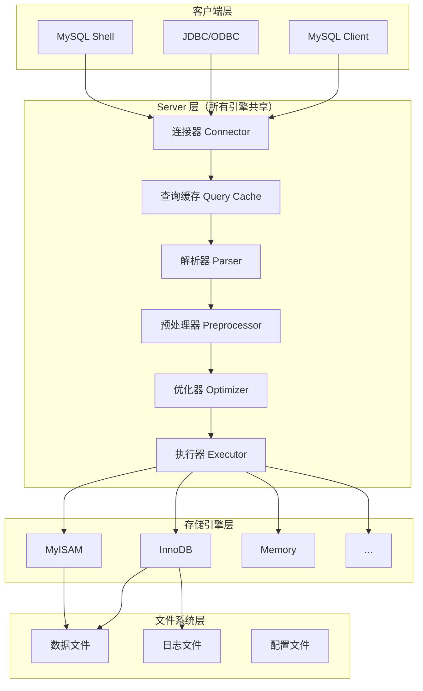
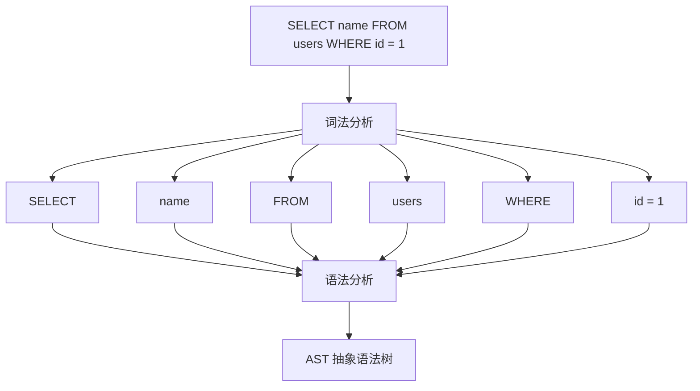
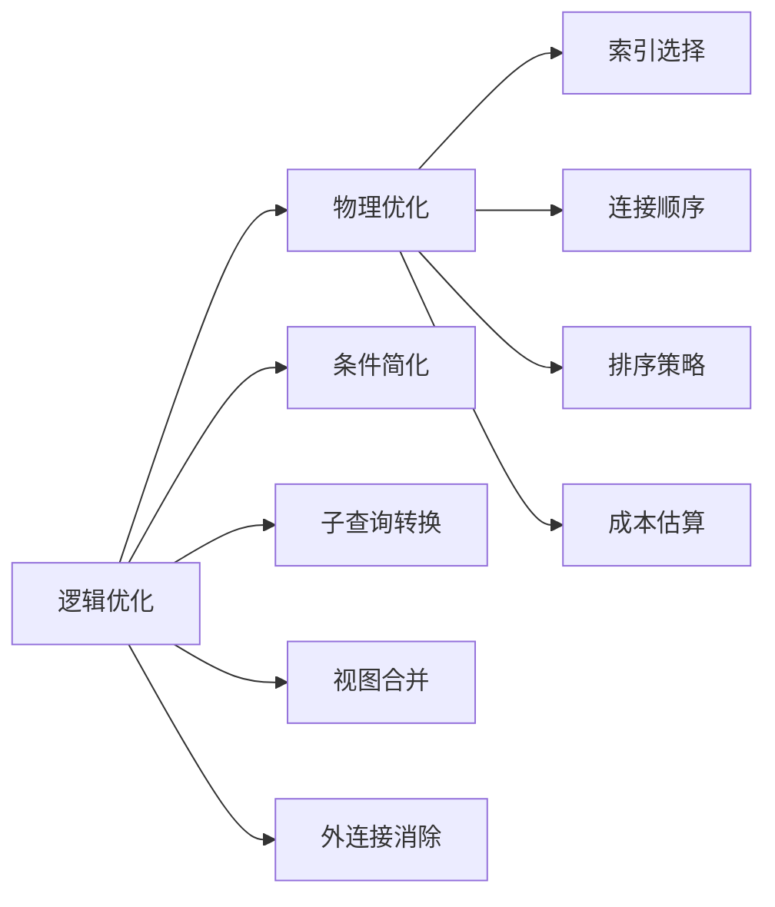
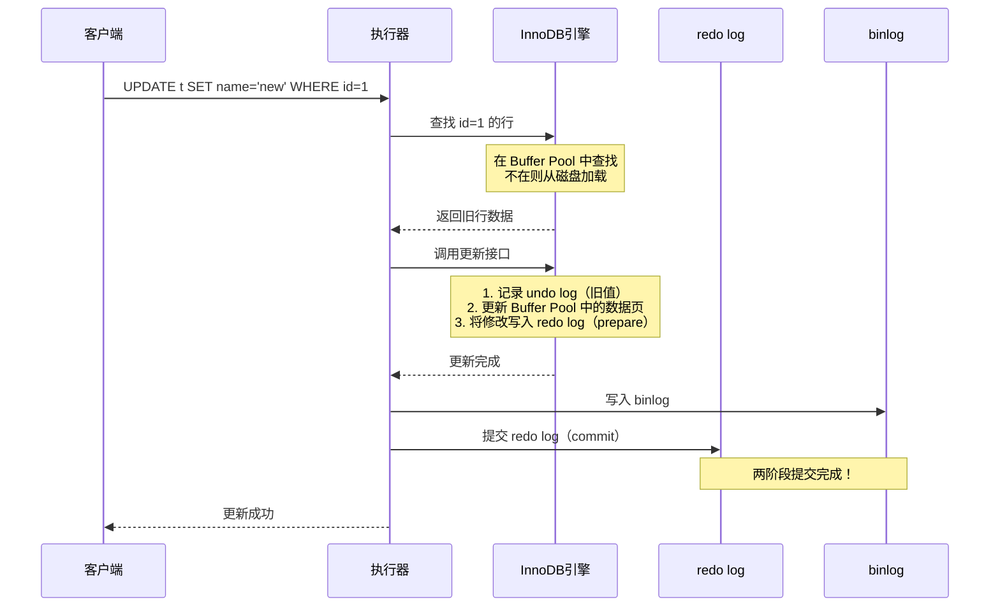

# MySQL 架构与 SQL 执行流程

## MySQL 整体架构

MySQL 采用经典的 **C/S 架构**，内部分为三大层：



### 各层职责详解

#### 1. 连接器（Connector）

负责与客户端建立连接、身份认证、权限获取。

```
mysql -h 127.0.0.1 -P 3306 -u root -p
```

**关键知识点：**
- 连接建立后，用户权限被缓存，修改权限需要**重新连接**才生效
- 连接分为**长连接**和**短连接**
- 长连接可能导致**内存 OOM**（临时内存在连接断开时才释放）
- 解决方案：
  - 定期执行 `mysql_reset_connection`（重置连接状态，不需要重连）
  - 设置 `wait_timeout` 控制空闲连接超时

> [!warning] 面试考点
> **Q：为什么长连接会导致 MySQL 内存暴涨？**
> A：MySQL 执行过程中使用的临时内存是管理在连接对象中的，只在连接断开时释放。长连接累积的临时内存不释放，导致 OOM。

#### 2. 查询缓存（Query Cache）

> [!danger] 已废弃
> MySQL 8.0 已经**完全移除**查询缓存功能。面试中问到要说明这一点。

- 以 SQL 语句为 key，查询结果为 value 的缓存
- **失效太频繁**：表上任何更新都会清空该表所有缓存
- 适用场景极少（只适合静态配置表）
- 建议设置 `query_cache_type = DEMAND`，仅手动指定使用缓存

#### 3. 解析器（Parser）

**词法分析** → 将 SQL 字符串拆分为 token（关键字、表名、列名等）

**语法分析** → 根据语法规则构建**抽象语法树（AST）**



> 如果 SQL 语法错误，在这一步就会报 `You have an error in your SQL syntax`

#### 4. 预处理器（Preprocessor）

- 检查表和列是否存在
- 将 `SELECT *` 展开为具体列名
- 检查权限（部分实现）

#### 5. 优化器（Optimizer）

核心职责：决定 SQL 的**执行计划**。

优化器做的关键决策：
- 多个索引时，选择哪个索引
- 多表关联时，决定连接顺序（小表驱动大表）
- 是否使用覆盖索引
- 子查询优化（转为 JOIN）
- 派生表合并



> [!tip] 面试加分
> 优化器基于**成本模型（Cost-Based Optimization, CBO）**，不是基于规则。它会估算每种执行计划的 I/O 成本和 CPU 成本，选择总成本最低的方案。

#### 6. 执行器（Executor）

- 先检查用户对目标表的**执行权限**
- 调用存储引擎接口，逐行或批量获取数据
- 在 Server 层完成排序、分组、聚合等操作

---

## SQL 执行全流程

### SELECT 语句完整执行流程

```mermaid
sequenceDiagram
    participant C as 客户端
    participant Conn as 连接器
    participant Cache as 查询缓存
    participant Parser as 解析器
    participant Opt as 优化器
    participant Exec as 执行器
    participant Engine as InnoDB引擎

    C->>Conn: 建立连接 + 认证
    Conn-->>C: 认证通过
    C->>Conn: SELECT * FROM t WHERE id=1
    
    Note over Cache: MySQL 8.0 已移除
    Conn->>Cache: 查询缓存？
    Cache-->>Conn: 未命中
    
    Conn->>Parser: 词法+语法分析
    Parser-->>Conn: 生成 AST
    
    Conn->>Opt: 优化器生成执行计划
    Note over Opt: 选择使用主键索引
    Opt-->>Conn: 执行计划
    
    Conn->>Exec: 按计划执行
    Exec->>Engine: 读取 id=1 的行
    Engine-->>Exec: 返回数据行
    Exec-->>C: 返回结果集
```

### UPDATE 语句执行流程

UPDATE 比 SELECT 复杂，涉及**日志系统**：



> [!important] 两阶段提交
> 这是面试**超高频**考点，详见 [[MySQL日志系统#两阶段提交]]

---

## 存储引擎对比

| 特性 | InnoDB | MyISAM |
|------|--------|--------|
| **事务** | ✅ 支持 | ❌ 不支持 |
| **行级锁** | ✅ 支持 | ❌ 仅表锁 |
| **外键** | ✅ 支持 | ❌ 不支持 |
| **MVCC** | ✅ 支持 | ❌ 不支持 |
| **崩溃恢复** | ✅ redo log | ❌ 不支持 |
| **聚簇索引** | ✅ 是 | ❌ 非聚簇 |
| **全文索引** | ✅ 5.6+ 支持 | ✅ 支持 |
| **缓存** | 数据+索引 | 仅索引 |
| **存储文件** | .ibd | .MYD + .MYI |
| **COUNT(*)** | 全表扫描 | 存储行数（O(1)） |

> [!warning] 面试考点
> **Q：为什么 InnoDB 的 COUNT(*) 比 MyISAM 慢？**
> A：MyISAM 用一个变量存储了总行数，直接返回。InnoDB 由于 MVCC 的存在，每个事务看到的行数可能不同，不能简单存储总行数，需要全表扫描统计。

---

## 面试高频问题

### Q1：一条 SQL 语句在 MySQL 中的执行过程？

**标准答案：**
1. 客户端通过**连接器**建立连接，进行身份认证
2. ~~查询缓存（8.0 已移除）~~
3. **解析器**进行词法分析和语法分析，生成语法树
4. **优化器**选择最优执行计划（选索引、决定 JOIN 顺序）
5. **执行器**检查权限，调用存储引擎接口执行

### Q2：MySQL 为什么要使用 B+ 树索引？

→ 详见 [[MySQL索引原理#为什么选择 B+ 树]]

### Q3：Server 层和存储引擎层如何交互？

通过 **Handler API**。Server 层通过调用存储引擎提供的统一接口（handler）来读写数据。不同引擎实现同一套接口，实现了引擎的可插拔设计。
