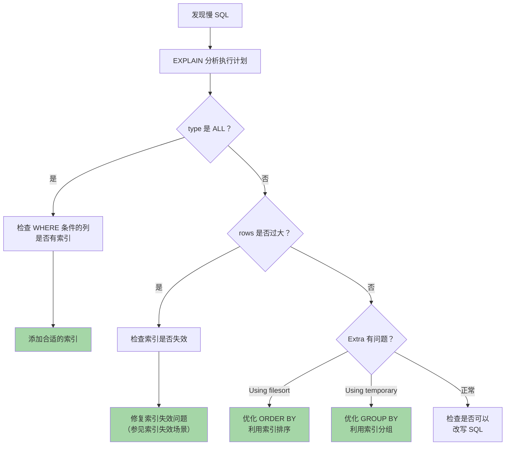
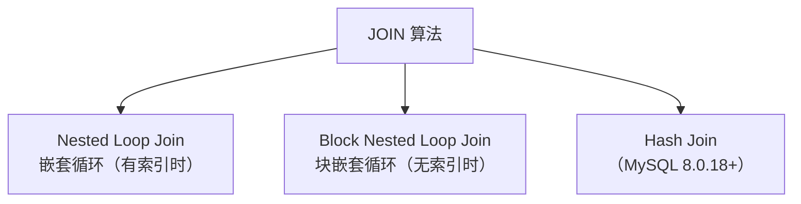
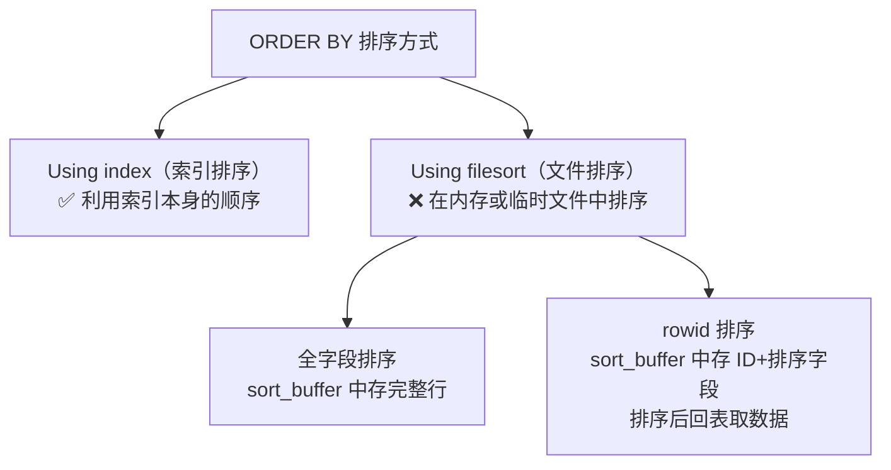
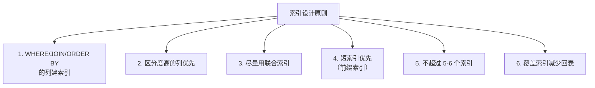

# MySQL 查询优化

查询优化是**实战和面试**都重点考察的内容，掌握 EXPLAIN 和优化策略是关键。

## EXPLAIN 执行计划

### 使用方式

```sql
EXPLAIN SELECT * FROM t WHERE id = 1;
```

### EXPLAIN 各列详解

| 列名 | 含义 | 重点关注 |
|------|------|----------|
| **id** | 查询序号 | id 相同从上到下执行，id 不同大的先执行 |
| **select_type** | 查询类型 | SIMPLE / PRIMARY / SUBQUERY / DERIVED |
| **table** | 查询的表 | |
| **partitions** | 命中的分区 | |
| **type** | 访问类型 ⭐ | **性能核心指标** |
| **possible_keys** | 可能使用的索引 | |
| **key** | 实际使用的索引 ⭐ | |
| **key_len** | 使用索引的长度 | 联合索引判断用了几列 |
| **ref** | 索引关联的列 | |
| **rows** | 预估扫描行数 ⭐ | 越少越好 |
| **filtered** | 过滤百分比 | rows × filtered% = 实际结果行数 |
| **Extra** | 额外信息 ⭐ | 重要优化提示 |

### type 访问类型（从最优到最差）


| type | 含义 | 示例 |
|------|------|------|
| **system** | 表只有一行（系统表） | |
| **const** | 主键或唯一索引等值匹配 | `WHERE id = 1` |
| **eq_ref** | 联表查询中主键/唯一索引等值 | 被驱动表的主键关联 |
| **ref** | 普通索引等值匹配 | `WHERE name = 'Alice'` |
| **range** | 索引范围查询 | `WHERE id > 100` |
| **index** | 全索引扫描（遍历索引树） | 覆盖索引全表查 |
| **ALL** | 全表扫描 ❌ | 没有合适索引 |

> [!warning] 优化目标
> 至少达到 **range** 级别，最好是 **ref** 级别。出现 **ALL** 一般需要优化。

### Extra 重要信息

| Extra | 含义 | 好坏 |
|-------|------|------|
| **Using index** | 覆盖索引，无需回表 | ✅ 非常好 |
| **Using index condition** | 索引下推（ICP） | ✅ 好 |
| **Using where** | Server 层过滤 | ⚠️ 一般 |
| **Using temporary** | 使用临时表 | ❌ 需要优化 |
| **Using filesort** | 额外排序操作 | ❌ 需要优化 |
| **Using join buffer** | 使用连接缓冲区 | ⚠️ 可能缺索引 |
| **Select tables optimized away** | 聚合函数直接从索引取值 | ✅ 非常好 |

> [!important] 面试回答模板
> 拿到 EXPLAIN 结果后：
> 1. 先看 **type** → 判断访问类型是否合理
> 2. 再看 **key** → 确认是否命中索引
> 3. 看 **rows** → 估算扫描行数
> 4. 看 **Extra** → 是否有 filesort、temporary

---

## 慢查询优化实战

### 开启慢查询日志

```sql
-- 开启慢查询日志
SET GLOBAL slow_query_log = ON;

-- 设置阈值（秒）
SET GLOBAL long_query_time = 1;

-- 查看慢查询日志文件位置
SHOW VARIABLES LIKE 'slow_query_log_file';

-- 分析慢查询日志
-- 命令行工具：
-- mysqldumpslow -s t -t 10 slow.log   -- 按时间排序取 top 10
-- pt-query-digest slow.log             -- 更强大的分析工具
```

### 优化步骤



---

## SQL 优化技巧

### 1. SELECT 优化

```sql
-- ❌ 避免 SELECT *
SELECT * FROM users WHERE id = 1;

-- ✅ 只查需要的列（可能触发覆盖索引）
SELECT name, email FROM users WHERE id = 1;
```

### 2. JOIN 优化

```sql
-- 小表驱动大表原则
-- MySQL 优化器通常会自动选择，但可以用 STRAIGHT_JOIN 强制指定

-- ❌ 大表驱动小表
SELECT * FROM big_table b 
  STRAIGHT_JOIN small_table s ON b.id = s.bid;

-- ✅ 小表驱动大表
SELECT * FROM small_table s 
  STRAIGHT_JOIN big_table b ON s.bid = b.id;

-- 被驱动表的关联字段要有索引
```

#### Join 算法



**NLJ（有索引）**：对驱动表每一行，通过索引查被驱动表 → O(N × log M)
**BNL（无索引）**：把驱动表数据放入 Join Buffer，批量匹配 → 减少被驱动表扫描次数
**Hash Join**：对小表建哈希表，大表探测 → O(N + M)，8.0 替代了 BNL

### 3. 子查询优化

```sql
-- ❌ 慢：子查询（可能每行都执行一次子查询）
SELECT * FROM orders 
WHERE user_id IN (SELECT id FROM users WHERE status = 1);

-- ✅ 快：改写为 JOIN
SELECT o.* FROM orders o 
  INNER JOIN users u ON o.user_id = u.id 
WHERE u.status = 1;
```

### 4. LIMIT 优化（深分页问题）

```sql
-- ❌ 慢：LIMIT 偏移量大（需要扫描 100 万 + 10 行）
SELECT * FROM t ORDER BY id LIMIT 1000000, 10;

-- ✅ 方案1：延迟关联（先用覆盖索引取 ID，再回表）
SELECT t.* FROM t 
  INNER JOIN (SELECT id FROM t ORDER BY id LIMIT 1000000, 10) tmp 
  ON t.id = tmp.id;

-- ✅ 方案2：游标分页（记住上次最大 ID）
SELECT * FROM t WHERE id > 1000000 ORDER BY id LIMIT 10;
```

### 5. COUNT 优化

```sql
-- COUNT(*) ≈ COUNT(1) > COUNT(主键) > COUNT(字段)
-- COUNT(*) 和 COUNT(1) 性能几乎一样，MySQL 已优化
-- COUNT(字段) 会排除 NULL 值

-- 精确计数：只能全表扫描（InnoDB 无法像 MyISAM 直接返回）
-- 近似值：SHOW TABLE STATUS（不准确）
-- 缓存方案：用 Redis 维护计数
```

### 6. ORDER BY 优化



```sql
-- ✅ 利用索引排序（联合索引 (a, b)）
SELECT * FROM t WHERE a = 1 ORDER BY b;  -- a 过滤，b 已有序

-- ❌ 需要 filesort
SELECT * FROM t WHERE a = 1 ORDER BY c;  -- c 不在索引中

-- 优化 sort_buffer_size
SET sort_buffer_size = 1048576;  -- 增大排序缓冲区
```

### 7. GROUP BY 优化

```sql
-- ✅ 利用索引分组
-- 如果 GROUP BY 的列有索引，可以避免临时表

-- 联合索引 (department, salary)
SELECT department, AVG(salary) FROM employees 
GROUP BY department;  -- ✅ 可以利用索引

-- 无索引的 GROUP BY 会使用临时表 + 排序 → Using temporary; Using filesort
```

### 8. IN 和 EXISTS 的选择

```sql
-- 外表小，内表大 → 用 IN（内表走索引）
SELECT * FROM small_table WHERE id IN (SELECT id FROM big_table);

-- 外表大，内表小 → 用 EXISTS（外表走索引）
SELECT * FROM big_table b 
WHERE EXISTS (SELECT 1 FROM small_table s WHERE s.id = b.id);
```

---

## 索引优化策略总结

### 建索引的原则



### 索引优化 Checklist

- [ ] WHERE 条件的列是否有索引？
- [ ] 联合索引的列顺序是否合理？（区分度高的在前）
- [ ] 是否存在索引失效？（函数、隐式转换、左模糊等）
- [ ] 能否利用覆盖索引避免回表？
- [ ] ORDER BY / GROUP BY 能否利用索引？
- [ ] 是否有冗余索引？（`pt-duplicate-key-checker` 检查）
- [ ] 索引数量是否过多影响写入性能？

---

## 其他优化

### 表结构优化

| 策略 | 说明 |
|------|------|
| **选择合适的数据类型** | 整数用 INT 而非 VARCHAR，日期用 DATETIME |
| **NOT NULL** | 尽量设为 NOT NULL（NULL 值影响索引和统计） |
| **ENUM 代替字符串** | 固定取值的列用 ENUM 更省空间 |
| **垂直拆分** | 大字段（TEXT/BLOB）拆到单独的表 |

### 参数优化

| 参数 | 建议值 | 说明 |
|------|--------|------|
| `innodb_buffer_pool_size` | 物理内存 60-80% | Buffer Pool 大小 |
| `innodb_flush_log_at_trx_commit` | 1 | redo log 刷盘策略 |
| `sync_binlog` | 1 | binlog 刷盘策略 |
| `innodb_io_capacity` | SSD: 2000+ | 磁盘 IOPS |
| `max_connections` | 500-1000 | 最大连接数 |
| `sort_buffer_size` | 1-4MB | 排序缓冲区 |
| `join_buffer_size` | 4-8MB | JOIN 缓冲区 |
| `tmp_table_size` | 64-256MB | 临时表大小 |

---

## 面试高频问题

### Q1：如何定位和优化慢 SQL？

1. **开启慢查询日志**，设置阈值
2. 用 **pt-query-digest** 分析慢查询日志
3. 对慢 SQL 执行 **EXPLAIN** 分析执行计划
4. 检查 type 是否合理、是否命中索引
5. 根据情况**添加/调整索引**或**改写 SQL**
6. 验证优化效果

### Q2：EXPLAIN 的 type 列有哪些值？

从优到差：system > const > eq_ref > ref > range > index > ALL
至少达到 range 级别。

### Q3：深分页怎么优化？

1. **延迟关联**：先用覆盖索引取 ID，再回表
2. **游标分页**：记住上次的最大 ID，用 `WHERE id > last_id LIMIT N`
3. **业务限制**：不允许跳页到很后面

### Q4：百万级数据的 SQL 怎么优化？

1. 确保 WHERE 条件有**高效索引**
2. 只查必要的列（覆盖索引）
3. 避免大事务和大范围锁
4. 必要时考虑**分库分表**
5. 利用**缓存**减少数据库压力
