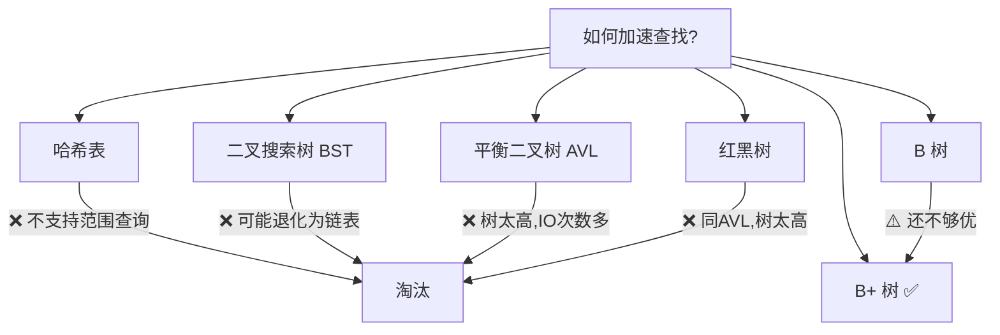
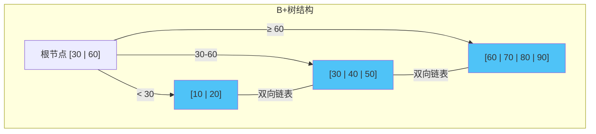
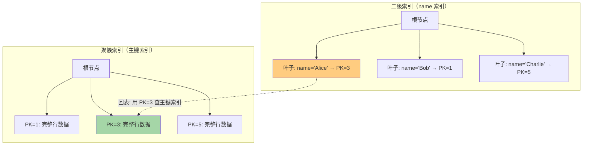
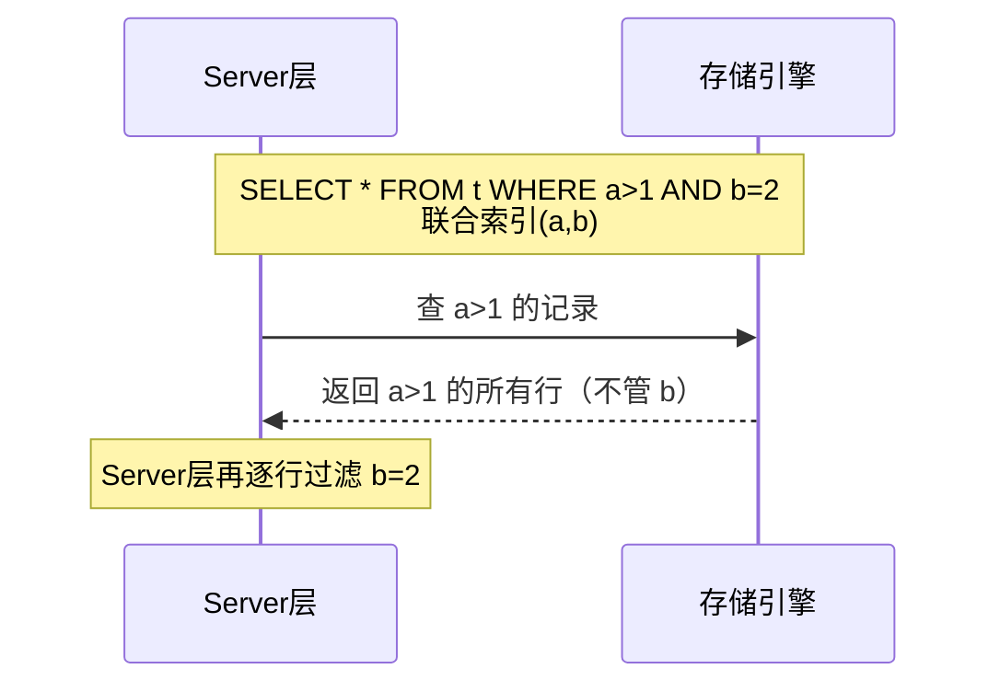
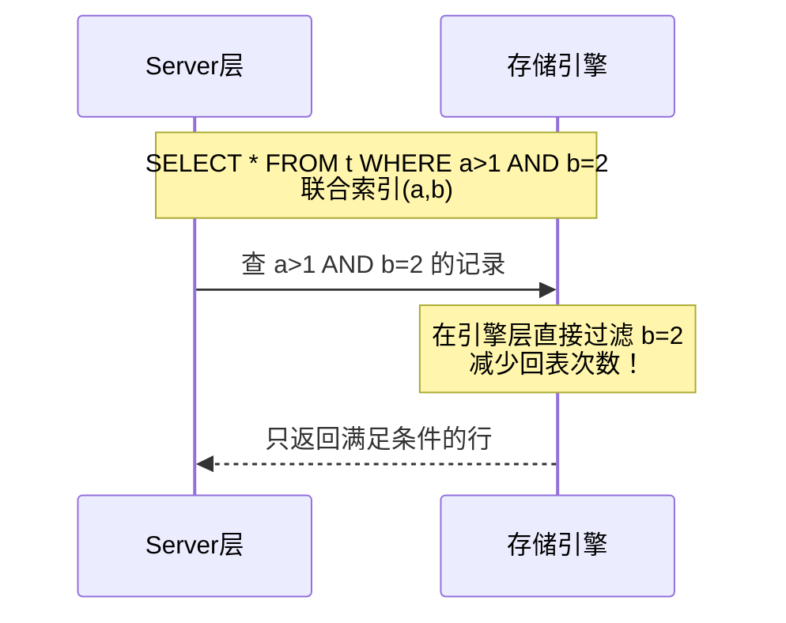

# MySQL 索引原理

索引是面试中**出现频率最高**的 MySQL 知识点，必须深入理解。

## 索引的本质

索引是一种**数据结构**，目的是加速查找。类比：字典的目录。

没有索引 → 全表扫描（O(n)）
有索引 → 树形查找（O(log n)）

---

## 数据结构演进：为什么选择 B+ 树

### 候选数据结构对比



### 为什么不用哈希索引？

| 特性 | 哈希索引 | B+树索引 |
|------|----------|----------|
| 等值查询 | O(1) ⚡ | O(log n) |
| 范围查询 | ❌ 不支持 | ✅ 高效 |
| 排序 | ❌ 不支持 | ✅ 天然有序 |
| 最左前缀 | ❌ 不支持 | ✅ 支持 |
| 哈希冲突 | 性能退化 | 稳定 |

> InnoDB 有 **自适应哈希索引（AHI）**，对热点页自动建哈希索引加速，但由引擎自动管理。

### 为什么不用二叉树/红黑树？

核心问题：**树太高！**

- 100万条数据，平衡二叉树高度 ≈ 20
- 每层一次磁盘 I/O
- 20 次随机 I/O → 极慢！

### B 树 vs B+ 树

```
B 树 (B-Tree):
              [30, 60]
             /    |    \
      [10, 20] [40, 50] [70, 80, 90]
       ↑ 每个节点都存数据

B+ 树 (B+Tree):
              [30, 60]              ← 非叶子节点只存索引
             /    |    \
      [10, 20] [40, 50] [70, 80, 90]  ← 叶子节点存所有数据
        ↓───────→↓───────→↓            ← 叶子节点用双向链表连接
```



### B+ 树的关键优势

| 特性 | B 树 | B+ 树 |
|------|------|-------|
| **非叶子节点** | 存数据 | 只存索引（键+指针） |
| **扇出（Fan-out）** | 较小 | **更大**（同样页大小可存更多键） |
| **树高度** | 较高 | **更矮**（3层可存2000万） |
| **范围查询** | 需要中序遍历 | **叶子链表顺序扫描** |
| **查询稳定性** | 不稳定（可能在非叶子找到） | **稳定**（必须到叶子节点） |
| **全表扫描** | 需遍历整棵树 | **只需扫描叶子链表** |

> [!important] 面试标准答案
> **为什么用 B+ 树而不是 B 树？**
> 1. 非叶子节点不存数据，扇出更大，树更矮，**磁盘 I/O 更少**
> 2. 叶子节点用双向链表连接，**范围查询效率极高**
> 3. 所有查询都到叶子节点，**查询性能稳定**

---

## 聚簇索引 vs 非聚簇索引

### 聚簇索引（Clustered Index）

- 索引的叶子节点存储**完整的行数据**
- 一个表只能有**一个**聚簇索引
- InnoDB 中，**主键索引就是聚簇索引**

**聚簇索引选择规则（按优先级）：**
1. 如果有主键 → 主键作为聚簇索引
2. 如果没有主键，选择第一个**不含 NULL 的唯一索引**
3. 都没有 → InnoDB 自动生成隐式 `row_id` 作为聚簇索引

### 非聚簇索引（二级索引 / Secondary Index）

- 叶子节点存储的是**主键值**（不是完整行数据）
- 查询完整数据需要**回表**

### 回表查询过程



**执行过程：**`SELECT * FROM t WHERE name = 'Alice'`
1. 在 name 索引的 B+ 树中找到 name='Alice'，拿到主键 PK=3
2. 回到主键索引（聚簇索引）的 B+ 树中，用 PK=3 查找完整行数据
3. 返回结果

> 这就是为什么二级索引查询比主键查询多一次 B+ 树搜索！

---

## 覆盖索引（Covering Index）

如果查询的列都在二级索引中，**不需要回表**！

```sql
-- 有联合索引 (name, age)

-- ✅ 覆盖索引：不需要回表
SELECT name, age FROM t WHERE name = 'Alice';

-- ❌ 需要回表：需要查 email 列
SELECT name, age, email FROM t WHERE name = 'Alice';
```

> [!tip] EXPLAIN 中判断覆盖索引
> 当 `Extra` 列出现 **`Using index`** 时，表示使用了覆盖索引。

---

## 联合索引与最左前缀原则

### 联合索引的 B+ 树结构

联合索引 `(a, b, c)` 的排列规则：**先按 a 排序，a 相同按 b 排序，b 相同按 c 排序**

```
联合索引 (a, b, c) 的叶子节点排列：

| a=1, b=1, c=1 | → PK=3
| a=1, b=1, c=3 | → PK=7
| a=1, b=2, c=1 | → PK=1
| a=2, b=1, c=1 | → PK=5
| a=2, b=1, c=3 | → PK=8
| a=2, b=3, c=2 | → PK=2
| a=3, b=1, c=1 | → PK=4
```

### 最左前缀匹配规则

```sql
-- 联合索引 INDEX(a, b, c)

-- ✅ 可以用到索引
WHERE a = 1                      -- 用到 a
WHERE a = 1 AND b = 2            -- 用到 a, b
WHERE a = 1 AND b = 2 AND c = 3  -- 用到 a, b, c（全部）
WHERE a = 1 AND c = 3            -- 只用到 a（c 无法跳过 b）

-- ❌ 无法用到索引
WHERE b = 2                      -- 缺少最左列 a
WHERE b = 2 AND c = 3            -- 缺少最左列 a
WHERE c = 3                      -- 缺少最左列 a
```

### 范围查询对联合索引的影响

```sql
-- 联合索引 INDEX(a, b, c)

WHERE a = 1 AND b > 2 AND c = 3
-- a 用到等值匹配 ✅
-- b 用到范围查询 ✅
-- c 无法使用索引 ❌ (b 是范围查询，后面的列无法保证有序)
```

> [!warning] 核心规则
> 遇到**范围查询（>, <, BETWEEN, LIKE）**时，该列可以用索引，但其**右边的列无法使用索引**。

---

## 索引下推（Index Condition Pushdown, ICP）

MySQL 5.6 引入的优化。

### 没有 ICP 的情况



### 有 ICP 的情况



> [!tip] ICP 的本质
> 把 WHERE 条件中可以利用索引列的过滤，**下推到存储引擎层**执行，减少回表次数和 Server 层处理的数据量。
> EXPLAIN 中看到 `Using index condition` 表示使用了 ICP。

---

## 索引失效的常见场景

```sql
-- 假设有索引 INDEX(name), INDEX(age), INDEX(a, b, c)

-- 1️⃣ 对索引列使用函数
WHERE YEAR(create_time) = 2024    -- ❌ 失效
WHERE create_time >= '2024-01-01' -- ✅ 改写

-- 2️⃣ 隐式类型转换
WHERE phone = 13800138000          -- ❌ phone 是 varchar，触发隐式转换
WHERE phone = '13800138000'        -- ✅ 类型匹配

-- 3️⃣ 对索引列做运算
WHERE id + 1 = 10                  -- ❌ 失效
WHERE id = 9                       -- ✅ 改写

-- 4️⃣ LIKE 左模糊
WHERE name LIKE '%张'              -- ❌ 失效
WHERE name LIKE '张%'              -- ✅ 可以用索引

-- 5️⃣ OR 条件（两侧都要有索引）
WHERE a = 1 OR b = 2              -- 如果 b 没有索引 → 全表扫描

-- 6️⃣ NOT IN / NOT EXISTS
WHERE id NOT IN (1, 2, 3)         -- 可能失效（优化器判断）

-- 7️⃣ IS NULL / IS NOT NULL
WHERE name IS NOT NULL             -- 可能失效（看数据分布）

-- 8️⃣ 字符集不匹配（关联查询）
-- 两个表字符集不一致，关联时索引失效
```

> [!important] 记忆口诀
> **函数计算类型转，左模糊 OR 不等于，联合索引缺最左，字符集对不上号**

---

## 索引设计原则

1. **选择区分度高的列**建索引（`COUNT(DISTINCT col) / COUNT(*)` > 0.1）
2. 尽量使用**联合索引**，少建单列索引
3. 联合索引把**区分度高的列放前面**
4. 利用**覆盖索引**减少回表
5. 控制索引数量，每个索引都有写入和存储开销
6. 使用**前缀索引**处理长字符串：`INDEX(email(6))`
7. 不要在**频繁更新的列**上建索引

---

## 面试高频问题

### Q1：什么是回表？怎么避免？

**回表**：通过二级索引查到主键后，再回到聚簇索引查完整数据的过程。

**避免方式**：使用**覆盖索引**，让查询所需的列都在二级索引中。

### Q2：一个表最多能建多少个索引？

理论上没有硬性限制，但 InnoDB 建议不超过 **5-6 个**。每个索引都是一棵 B+ 树，增删改都要维护所有索引。

### Q3：什么是索引的区分度？

`区分度 = COUNT(DISTINCT col) / COUNT(*)`
- 区分度 = 1：完全唯一（如主键）
- 区分度 → 0：大量重复（如性别列）
- 经验值：区分度 > 0.1 适合建索引

### Q4：前缀索引的优缺点？

```sql
ALTER TABLE t ADD INDEX idx_email(email(6));
```

- ✅ 减少索引空间
- ❌ 无法使用覆盖索引
- ❌ 无法用于 ORDER BY
- 需要根据数据分布选择合适的前缀长度
