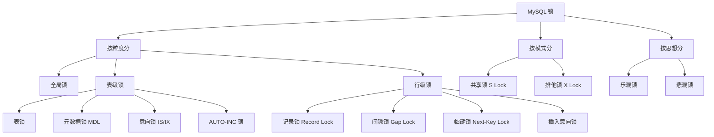
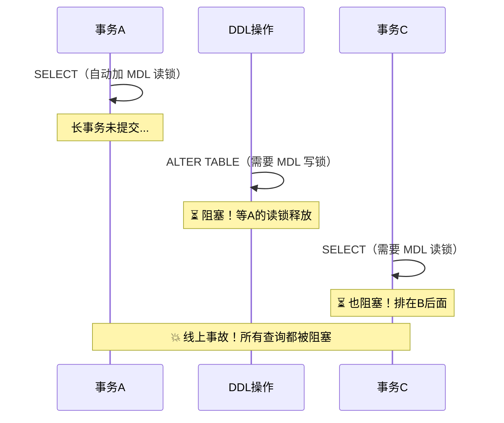
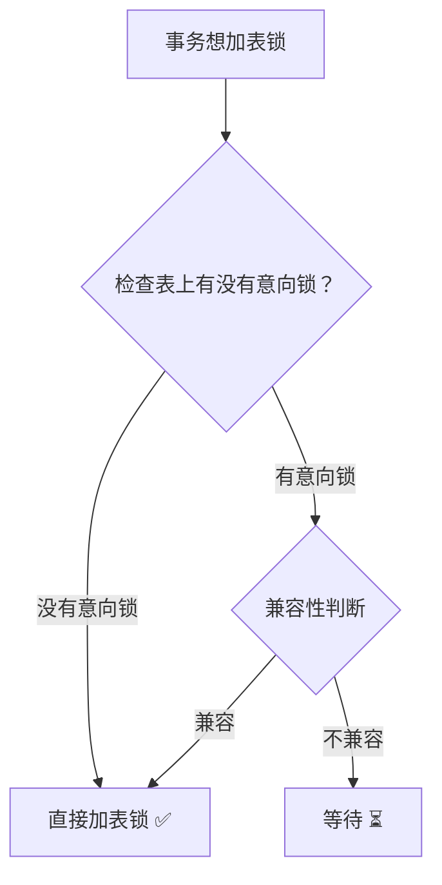
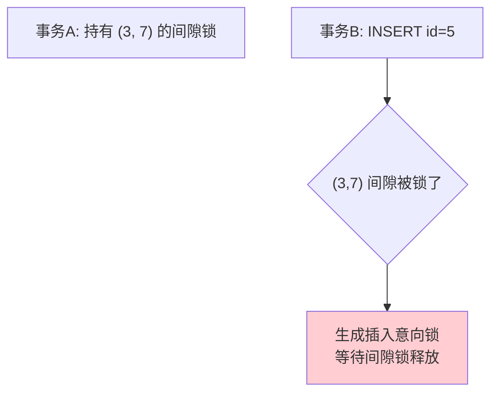
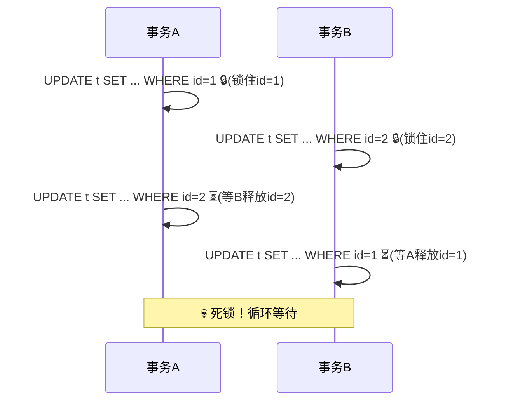

# MySQL 锁机制

锁是实现事务隔离性的核心手段。InnoDB 的锁机制非常复杂，也是面试**重灾区**。

## 锁的全景图



---

## 全局锁

```sql
FLUSH TABLES WITH READ LOCK;  -- 加全局读锁
UNLOCK TABLES;                 -- 释放
```

- 整个数据库变为**只读**
- 用途：**全库逻辑备份**
- 问题：业务完全停摆

> [!tip] 更好的备份方式
> 使用 `mysqldump --single-transaction`，利用 MVCC 的一致性快照进行备份，不需要加全局锁（仅适用于 InnoDB）。

---

## 表级锁

### 1. 表锁

```sql
LOCK TABLES t READ;   -- 加表读锁
LOCK TABLES t WRITE;  -- 加表写锁
UNLOCK TABLES;         -- 释放
```

粒度大，并发低，InnoDB 一般不用。

### 2. 元数据锁（MDL - Metadata Lock）

**自动加锁**，不需要手动操作：
- **DML（增删改查）** → 自动加 **MDL 读锁**
- **DDL（修改表结构）** → 自动加 **MDL 写锁**



> [!danger] 线上事故场景
> 一个长事务 + 一个 DDL = 所有查询阻塞！
> **解决方案**：DDL 加超时时间 `ALTER TABLE t WAIT 5 ADD COLUMN ...`

### 3. 意向锁（Intention Lock）

| 意向锁类型 | 含义 |
|-----------|------|
| **意向共享锁 IS** | 事务准备给某些行加 S 锁 |
| **意向排他锁 IX** | 事务准备给某些行加 X 锁 |

**意向锁的作用**：快速判断表中是否有行锁。



**没有意向锁的问题**：加表锁时需要逐行检查是否有行锁 → 太慢！
**有意向锁**：看一下表级的意向锁就知道有没有行锁 → O(1)！

#### 兼容性矩阵

|  | IS | IX | S | X |
|--|----|----|---|---|
| **IS** | ✅ | ✅ | ✅ | ❌ |
| **IX** | ✅ | ✅ | ❌ | ❌ |
| **S** | ✅ | ❌ | ✅ | ❌ |
| **X** | ❌ | ❌ | ❌ | ❌ |

> 意向锁之间是**互相兼容**的！它们只跟表锁冲突。

### 4. AUTO-INC 锁

针对自增列的特殊表锁：

| 模式 | innodb_autoinc_lock_mode | 说明 |
|------|--------------------------|------|
| 传统模式 | 0 | 每次插入加 AUTO-INC 锁（表级），语句结束释放 |
| 连续模式 | 1（默认5.7） | 简单插入用轻量锁，批量插入用 AUTO-INC 锁 |
| 交叉模式 | 2（默认8.0） | 全部用轻量锁，性能最好，但批量插入 ID 可能不连续 |

---

## 行级锁（核心重点）

InnoDB 的行锁是**加在索引上的**，不是加在数据行上！

> [!danger] 最关键的一句话
> **如果 SQL 没有命中索引，行锁会升级为表锁！**（因为走全表扫描，锁住了聚簇索引的所有记录）

### 1. 记录锁（Record Lock）

锁住索引上的**一条记录**。

```sql
-- 锁住 id=1 的记录
SELECT * FROM t WHERE id = 1 FOR UPDATE;
```

```
索引记录:  ... | id=1 🔒 | id=3 | id=5 | ...
```

### 2. 间隙锁（Gap Lock）

锁住索引记录之间的**间隙**（开区间），防止其他事务在间隙中插入数据。

```sql
-- 假设 id 有 1, 3, 5
-- 锁住 (1, 3) 这个间隙
SELECT * FROM t WHERE id = 2 FOR UPDATE;
```

```
索引记录:  ... | id=1 | (🔒 gap) | id=3 | id=5 | ...
                       ↑ 不允许在此插入
```

> [!important] 间隙锁特点
> - 仅在 **RR（可重复读）** 级别存在
> - 目的是**防止幻读**
> - 间隙锁之间**不互斥**（都是防止插入的）
> - 间隙锁和**插入意向锁**互斥

### 3. Next-Key Lock（临键锁）

**Record Lock + Gap Lock** 的组合，锁住一条记录**及其前面的间隙**。

这是 InnoDB 在 RR 级别下**默认的行锁类型**。

```sql
-- 假设 id 有 1, 3, 5, 8
-- 锁住 (3, 5] 这个范围
SELECT * FROM t WHERE id = 5 FOR UPDATE;
```

```
索引记录:  ... | id=3 | (🔒 gap + id=5 🔒) | id=8 | ...
                       ↑ 左开右闭区间 (3, 5]
```

### 加锁规则（重要！）

以下规则基于 **RR 隔离级别**：

**两个原则：**
1. 加锁的基本单位是 **Next-Key Lock**（前开后闭区间）
2. 查找过程中访问到的对象才会加锁

**两个优化：**
1. 索引上的**等值查询**，命中唯一索引 → Next-Key Lock 退化为 **Record Lock**
2. 索引上的**等值查询**，向右遍历到不满足条件的第一个值 → Next-Key Lock 退化为 **Gap Lock**

**一个Bug：**
- 唯一索引上的范围查询会访问到不满足条件的第一个值为止

### 加锁分析示例

```sql
-- 表 t: id (主键) 有值 1, 5, 10, 15, 20

-- 示例1: 等值查询，命中
SELECT * FROM t WHERE id = 10 FOR UPDATE;
-- 加锁: 仅 id=10 的 Record Lock（优化1: 唯一索引等值命中，退化为记录锁）

-- 示例2: 等值查询，未命中
SELECT * FROM t WHERE id = 7 FOR UPDATE;
-- 加锁: (5, 10) 的 Gap Lock（优化2: 等值遍历到10不满足，退化为间隙锁）

-- 示例3: 范围查询
SELECT * FROM t WHERE id >= 10 AND id < 12 FOR UPDATE;
-- 加锁: 
--   id=10: Record Lock（等值命中唯一索引）
--   (10, 15]: Next-Key Lock（范围查询，扫到15停止）

-- 示例4: 非唯一索引等值查询
-- 假设 age 列有普通索引，值有 10, 20, 20, 30
SELECT * FROM t WHERE age = 20 FOR UPDATE;
-- 加锁:
--   (10, 20] Next-Key Lock
--   (20, 30) Gap Lock（优化2: 向右遍历到30，退化为间隙锁）
--   对应的主键索引: Record Lock（回表加锁）
```

### 4. 插入意向锁（Insert Intention Lock）

一种特殊的间隙锁，由 `INSERT` 操作在**等待间隙锁释放时**产生。



> 插入意向锁之间**不互斥**！多个事务可以同时等待同一个间隙，只要插入的位置不同。

---

## 死锁

### 死锁产生条件

1. **互斥**：资源同一时刻只能被一个事务持有
2. **占有且等待**：持有资源的同时等待其他资源
3. **不可抢占**：不能强制夺取其他事务的锁
4. **循环等待**：事务之间形成等待环

### 经典死锁场景



### InnoDB 死锁处理

**两种策略：**

| 策略 | 参数 | 说明 |
|------|------|------|
| **超时等待** | `innodb_lock_wait_timeout = 50` | 等待超过50秒自动回滚（太慢） |
| **死锁检测** | `innodb_deadlock_detect = ON` | 主动检测死锁环，回滚代价小的事务（**推荐**） |

> [!warning] 死锁检测的性能问题
> 每个被阻塞的线程都要检测是否形成环路，时间复杂度 O(n²)。高并发热点行场景下，大量线程同时检测死锁，CPU 消耗极高。
> **优化方案**：控制并发度（中间件限流）、减少锁粒度、缩短事务。

### 如何避免死锁

1. **固定加锁顺序**：所有事务按相同顺序访问资源
2. **缩短事务**：减少持锁时间
3. **降低隔离级别**：RC 级别没有间隙锁，死锁概率更低
4. **合理使用索引**：避免行锁升级为表锁
5. **使用 `SELECT ... FOR UPDATE` 一次性锁住所需资源**

### 排查死锁

```sql
-- 查看最近一次死锁信息
SHOW ENGINE INNODB STATUS\G

-- 查看当前锁等待
SELECT * FROM information_schema.INNODB_LOCK_WAITS;
SELECT * FROM information_schema.INNODB_LOCKS;

-- MySQL 8.0+
SELECT * FROM performance_schema.data_lock_waits;
SELECT * FROM performance_schema.data_locks;
```

---

## 乐观锁 vs 悲观锁

| 特性 | 乐观锁 | 悲观锁 |
|------|--------|--------|
| **思想** | 默认不会冲突 | 默认一定会冲突 |
| **实现** | 版本号/CAS（应用层） | 数据库行锁（`FOR UPDATE`） |
| **性能** | 读多写少时好 | 写多时好 |
| **实现方式** | `UPDATE ... WHERE version = ?` | `SELECT ... FOR UPDATE` |

### 乐观锁实现

```sql
-- 1. 先读取数据和版本号
SELECT id, name, version FROM t WHERE id = 1;
-- 结果: name='Alice', version=1

-- 2. 更新时校验版本号
UPDATE t SET name='Bob', version=version+1 
WHERE id = 1 AND version = 1;

-- 如果 affected_rows = 0，说明被其他事务修改了，需要重试
```

---

## 面试高频问题

### Q1：InnoDB 行锁是锁行还是锁索引？

锁**索引**！如果查询条件没有索引，会走全表扫描，锁住聚簇索引的所有记录，效果等同于表锁。

### Q2：什么情况下行锁会升级为表锁？

1. SQL 没有使用索引（全表扫描）
2. 锁定了大量行（优化器可能放弃使用索引）

### Q3：Gap Lock 和 Next-Key Lock 的区别？

- Gap Lock：锁间隙，开区间 (a, b)
- Next-Key Lock：Record Lock + Gap Lock，左开右闭 (a, b]
- Next-Key Lock 是 InnoDB 在 RR 级别的默认行锁

### Q4：如何分析 SQL 的加锁情况？

1. 确定隔离级别（RC/RR）
2. 确定是否命中索引
3. 确定是唯一索引还是普通索引
4. 确定是等值查询还是范围查询
5. 应用加锁规则（两个原则 + 两个优化）
