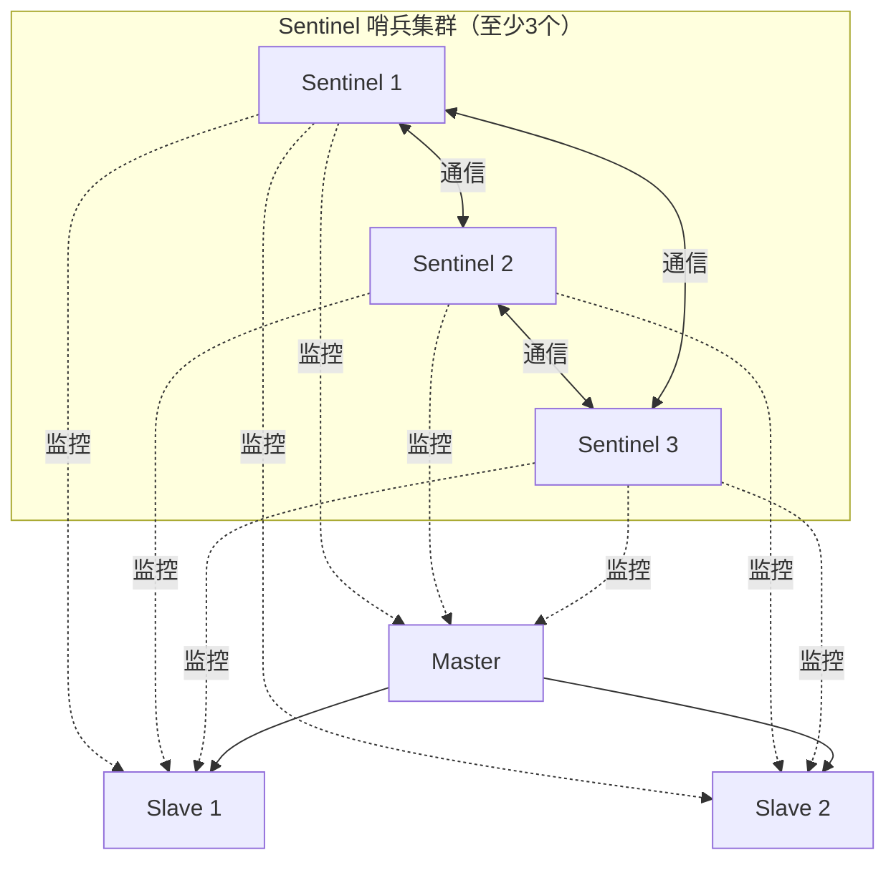
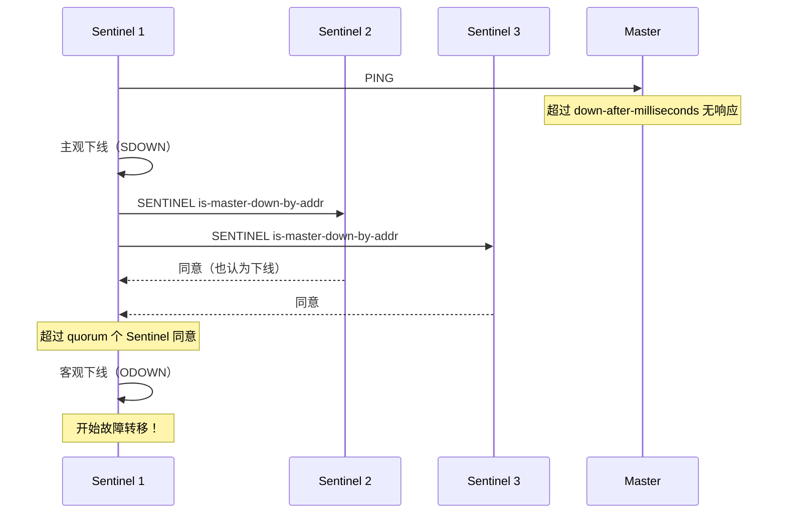
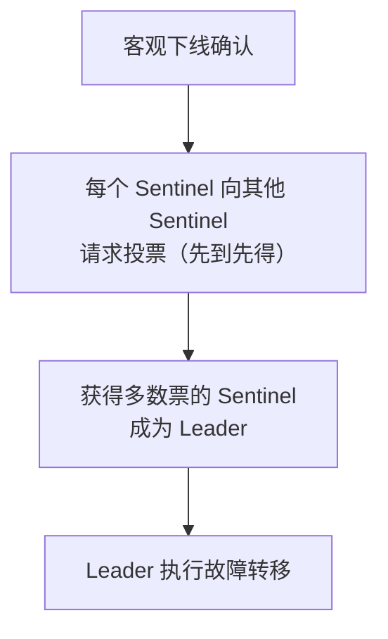
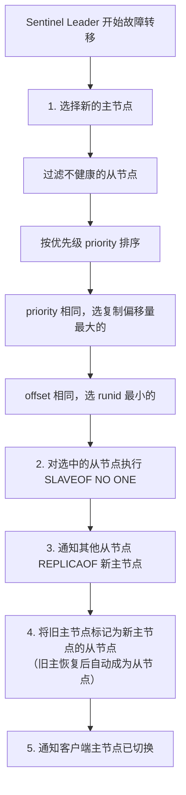
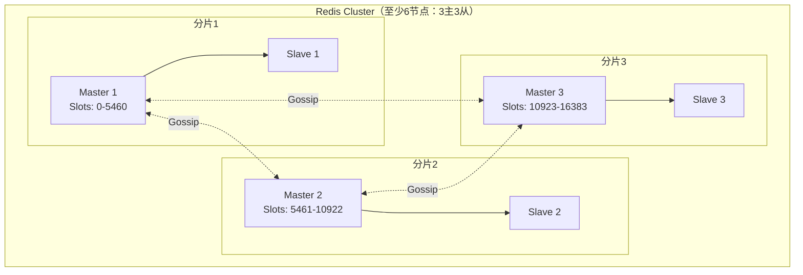
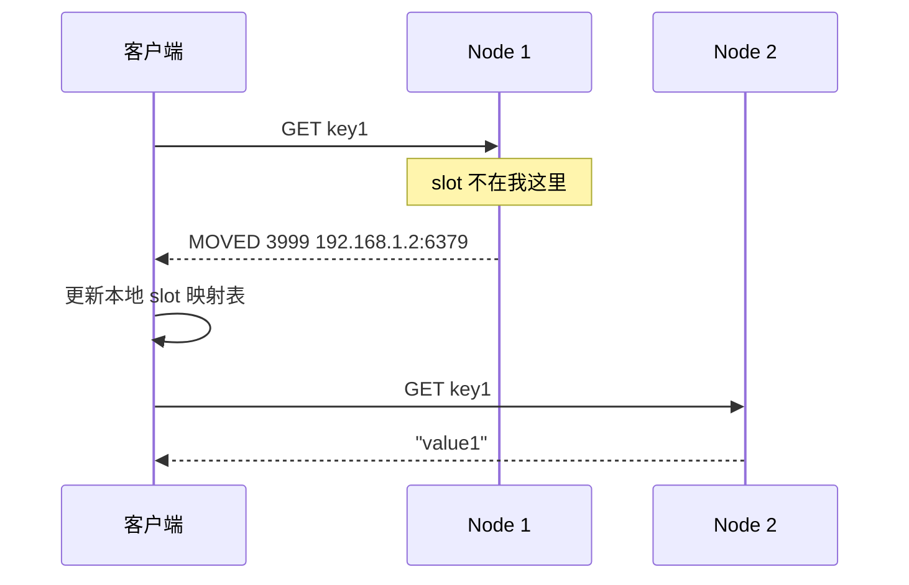
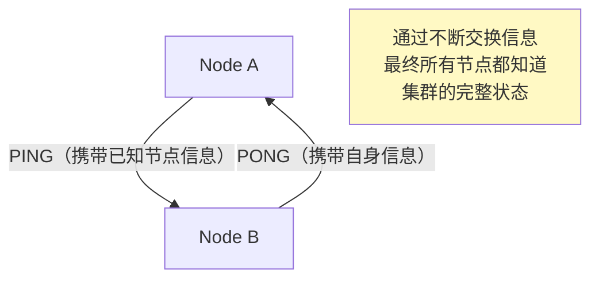
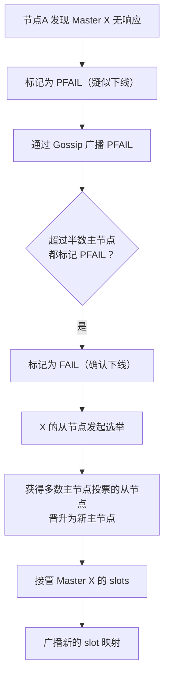

# Redis Sentinel 与 Cluster

## Redis Sentinel（哨兵）

### 架构



### Sentinel 核心功能

| 功能 | 说明 |
|------|------|
| **监控** | 持续检查主从节点是否正常运行 |
| **通知** | 通过 API 通知管理员或应用 |
| **自动故障转移** | 主节点下线时，自动将从节点提升为新主节点 |
| **配置中心** | 客户端连接 Sentinel 获取当前主节点地址 |

### 主观下线 vs 客观下线



| 状态 | 条件 | 意义 |
|------|------|------|
| **主观下线（SDOWN）** | 单个 Sentinel 认为主节点不可达 | 可能是网络问题 |
| **客观下线（ODOWN）** | **quorum 个 Sentinel** 都认为主节点不可达 | 确认主节点真的挂了 |

### Sentinel Leader 选举

故障转移需要选出一个 Sentinel 来执行。使用 **Raft 算法**的 Leader 选举：



### 故障转移流程



**新主节点选择优先级：**
1. `replica-priority` 值最小的（0 表示永不参选）
2. 复制偏移量（offset）最大的（数据最完整）
3. runid 最小的

---

## Redis Cluster

### 为什么需要 Cluster？

| 架构 | 写入能力 | 存储容量 | 高可用 |
|------|----------|----------|--------|
| 单机 | 受限 | 受限 | ❌ |
| 主从 + Sentinel | 受限（单主） | 受限（单主） | ✅ |
| **Cluster** | **可扩展（多主）** | **可扩展（多主）** | ✅ |

### Cluster 架构



### 数据分片：Hash Slot（哈希槽）

Redis Cluster 将数据划分为 **16384 个哈希槽**（0 ~ 16383），分配给各主节点。

```
slot = CRC16(key) % 16384
```


### 为什么是 16384 个槽？

> [!tip] Redis 作者的解释
> 1. 节点间 Gossip 协议交换位图（bitmap），16384 个槽 = 2KB，合理
> 2. 如果 65536 个槽 = 8KB，Gossip 消息太大
> 3. Redis Cluster 通常不超过 1000 个节点，16384 完全够用
> 4. 槽数是 2 的幂次，取模运算高效

### Hash Tag

```bash
# 默认情况，不同 key 可能分布在不同节点
SET user:1:name "Alice"    # slot X → Node A
SET user:1:age "25"        # slot Y → Node B（无法保证同节点）

# 使用 Hash Tag，用 {} 中的内容计算 slot
SET {user:1}:name "Alice"  # CRC16("user:1") → 同一个 slot
SET {user:1}:age "25"      # CRC16("user:1") → 同一个 slot ✅
```

### MOVED 和 ASK 重定向



| 重定向 | 含义 | 客户端行为 |
|--------|------|-----------|
| **MOVED** | slot 已永久迁移到其他节点 | 更新本地缓存，后续直接访问新节点 |
| **ASK** | slot 正在迁移中，临时重定向 | 只对当前请求重定向，不更新缓存 |

### Gossip 协议

节点间通过 Gossip 协议交换信息：

| 消息类型 | 说明 |
|----------|------|
| **PING** | 每秒随机选几个节点发送，携带自身状态 |
| **PONG** | 回复 PING，携带自身状态 |
| **MEET** | 邀请新节点加入集群 |
| **FAIL** | 广播某节点已被确认故障 |



### Cluster 故障转移



### 集群不可用的情况

| 场景 | 是否可用 |
|------|----------|
| 某个 slot 的主节点和所有从节点都挂了 | ❌ 默认不可用（`cluster-require-full-coverage yes`） |
| 超过半数主节点挂了 | ❌ 集群不可用 |
| 网络分区导致少数派无法通信 | ❌ 少数派不可用 |

---

## Sentinel vs Cluster 对比

| 特性 | Sentinel | Cluster |
|------|----------|---------|
| **数据分片** | ❌ 不支持 | ✅ 16384 个 hash slot |
| **写能力扩展** | ❌ 单主写入 | ✅ 多主并行写入 |
| **存储扩展** | ❌ 受限单机内存 | ✅ 多节点分摊 |
| **自动故障转移** | ✅ | ✅ |
| **复杂度** | 低 | 高 |
| **多 key 操作** | ✅ 无限制 | ⚠️ 必须同 slot |
| **适用场景** | 数据量不大，写压力不高 | 大数据量，高写入压力 |

---

## 面试高频问题

### Q1：Redis Cluster 的数据怎么分片？

使用 **Hash Slot**，共 16384 个槽。key 通过 `CRC16(key) % 16384` 计算槽号，每个主节点负责一部分槽。

### Q2：Sentinel 是怎么判断主节点下线的？

先**主观下线**（单个 Sentinel 认为不可达），再**客观下线**（超过 quorum 个 Sentinel 都认为不可达）。客观下线后 Sentinel 通过 Raft 选举 Leader，由 Leader 执行故障转移。

### Q3：Redis Cluster 为什么不用一致性哈希？

1. Hash Slot 方案更简单，容易理解和实现
2. 方便手动调整槽分配（数据迁移粒度更细）
3. 一致性哈希在节点变化时数据迁移量难以控制

### Q4：Cluster 模式下多 key 操作有什么限制？

多 key 操作（如 MGET、MSET、事务）要求所有 key 必须在同一个 slot。可以通过 Hash Tag `{tag}` 让相关 key 分配到同一个 slot。
