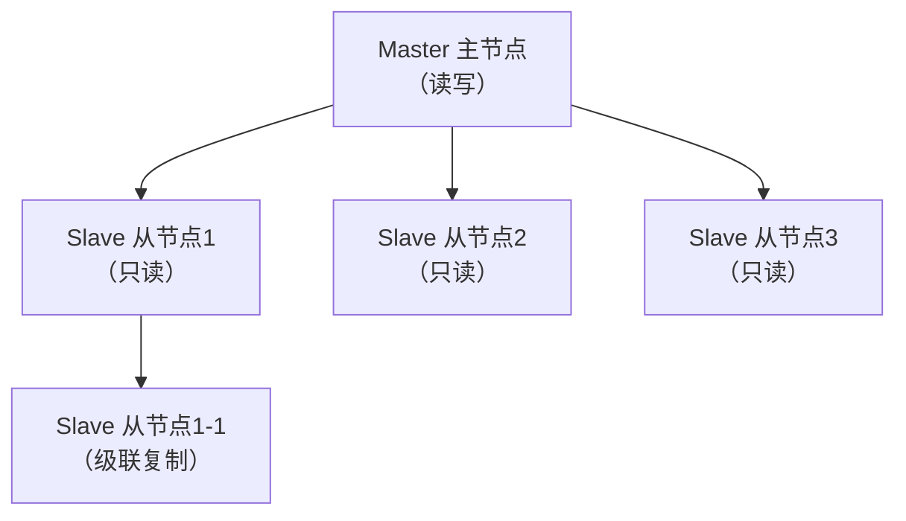
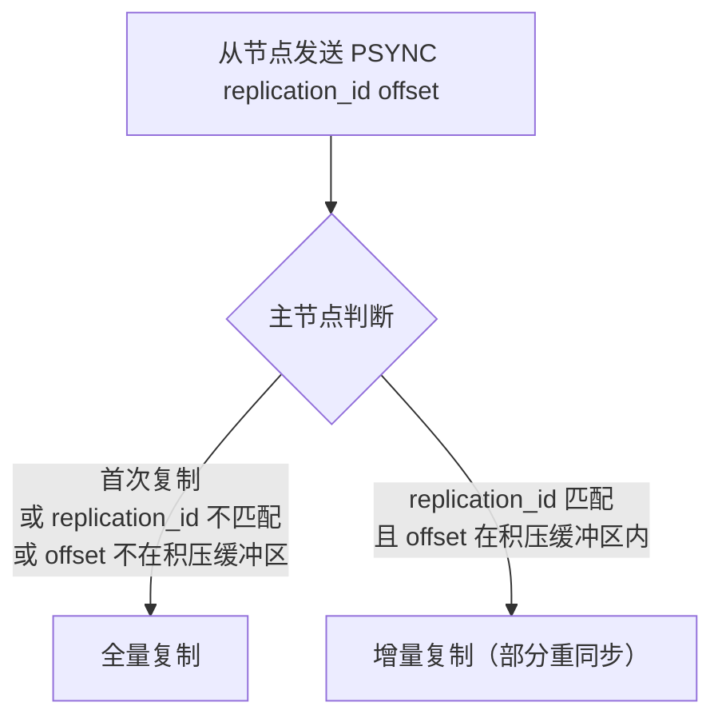
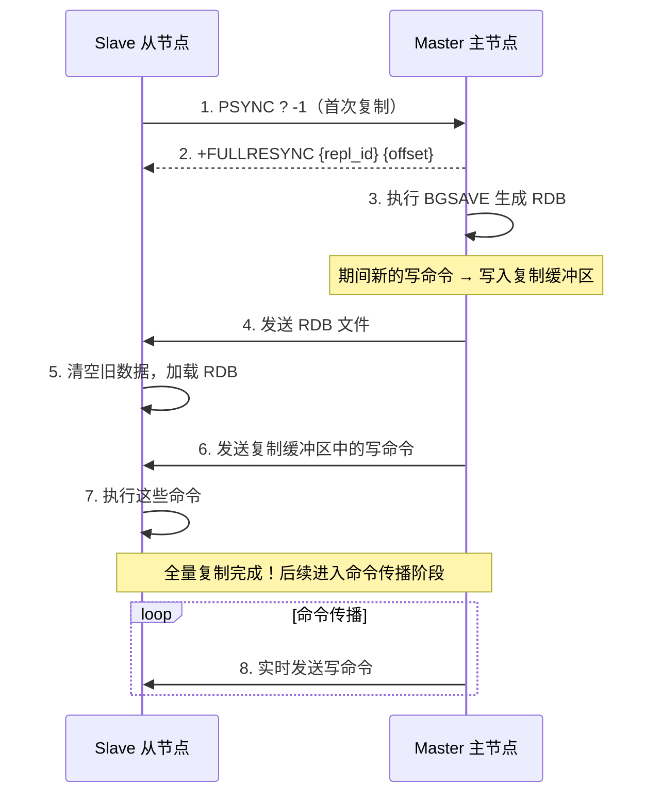
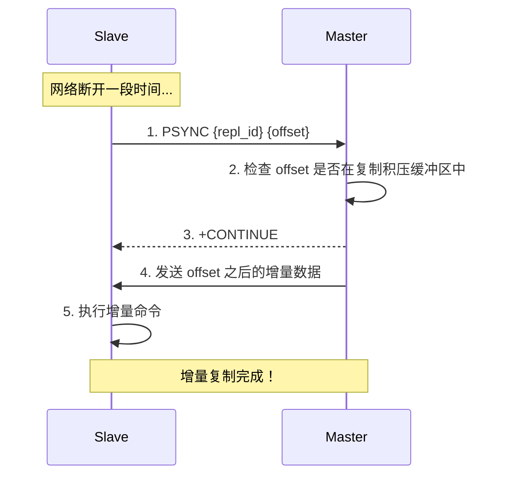
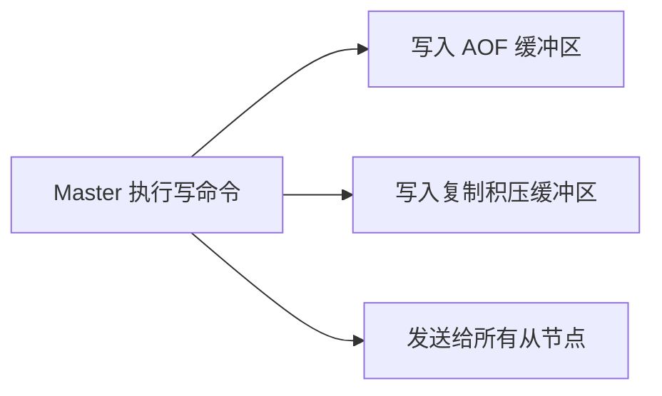

# Redis 主从复制

## 主从架构



**作用：**
- **数据冗余**：热备份
- **读写分离**：主写从读，分摊压力
- **高可用基础**：Sentinel 和 Cluster 都依赖主从复制

---

## 复制流程详解

### 建立连接

```bash
# 从节点执行
REPLICAOF 192.168.1.100 6379   # Redis 5.0+
# 或
SLAVEOF 192.168.1.100 6379     # 旧版本
```

### PSYNC 复制机制

Redis 2.8+ 使用 PSYNC 命令，支持**全量复制**和**增量复制**。



### 全量复制流程



> [!warning] 全量复制的开销
> 1. 主节点 BGSAVE 生成 RDB（fork + 磁盘 IO）
> 2. 网络传输 RDB 文件
> 3. 从节点清空旧数据 + 加载 RDB
> 4. 如果 RDB 传输期间写入量大，复制缓冲区可能溢出
> 
> 应尽量避免全量复制！

### 增量复制流程



### 复制积压缓冲区（Replication Backlog）

```
┌──────────────────────────────────────────────────┐
│              复制积压缓冲区（环形缓冲区）             │
│                                                  │
│  ... | cmd5 | cmd6 | cmd7 | cmd8 | cmd9 | ...   │
│              ↑                     ↑              │
│          slave_offset          master_offset      │
│                                                  │
│  slave 断线重连后，补发中间的 cmd6, cmd7, cmd8, cmd9 │
└──────────────────────────────────────────────────┘
```

- 默认大小 **1MB**，建议根据写入量调大
- 如果从节点断线时间太长，offset 已被覆盖 → 只能**全量复制**

```bash
# 计算合理的缓冲区大小
# repl-backlog-size = 每秒写入量 × 断线最大时长 × 2（安全系数）
# 例：每秒写入 2MB，最长断线 60 秒 → 2 × 60 × 2 = 240MB

repl-backlog-size 256mb
```

---

## 复制关键概念

### Replication ID

| 概念 | 说明 |
|------|------|
| `replication_id` | 主节点的唯一标识，每次重启或故障转移后改变 |
| `replication_id2` | 前一个主节点的 ID（用于故障转移时判断是否需要全量复制） |
| `offset` | 复制偏移量，主从各自维护，对比判断数据一致性 |

### 命令传播

全量复制完成后，主节点将所有**写命令**实时发送给从节点：



### 心跳机制

| 方向 | 周期 | 命令 | 作用 |
|------|------|------|------|
| 主 → 从 | 10秒 | PING | 检测从节点存活 |
| 从 → 主 | 1秒 | `REPLCONF ACK {offset}` | 上报自身复制偏移量 |

从节点上报 offset 的作用：
1. 主节点检测从节点是否数据延迟
2. 辅助 `min-slaves-to-write` 功能（至少 N 个从节点确认才允许写入）

---

## 面试高频问题

### Q1：主从复制的流程？

分为三个阶段：
1. **建立连接**：从节点发送 PSYNC
2. **数据同步**：全量（RDB + 缓冲区命令）或增量（积压缓冲区增量数据）
3. **命令传播**：主节点实时将写命令发送给从节点

### Q2：全量复制和增量复制的触发条件？

- **全量**：首次复制、replication_id 不匹配、offset 不在积压缓冲区
- **增量**：replication_id 匹配且 offset 在积压缓冲区范围内

### Q3：从节点可以写数据吗？

默认不可以（`replica-read-only yes`）。可以改为可写，但从节点写的数据不会同步到主节点，且下次全量复制会被清空，**不推荐**。

### Q4：主从复制会阻塞主节点吗？

BGSAVE 的 fork 会短暂阻塞。如果 RDB 生成和传输期间写入量大，复制缓冲区可能溢出。建议控制 RDB 大小，调大复制积压缓冲区。
