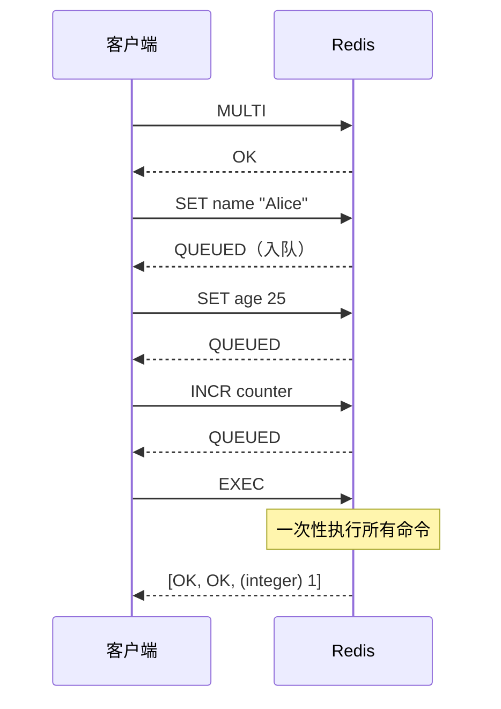
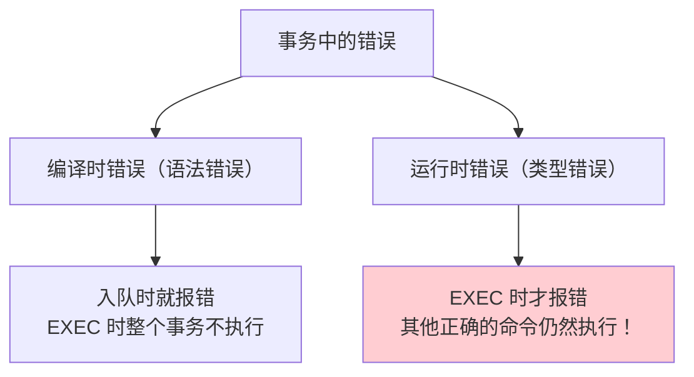
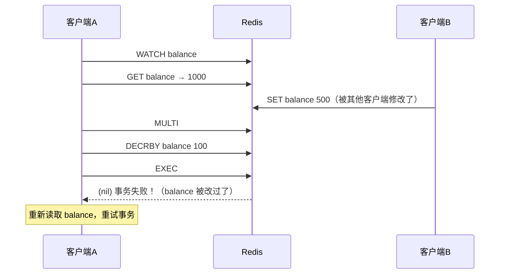
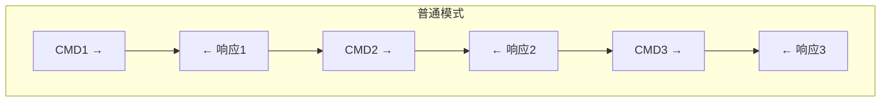
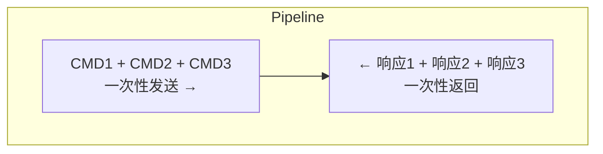

# Redis 事务与 Lua 脚本

## Redis 事务

### 基本使用

```bash
MULTI          # 开启事务
SET name "Alice"
SET age 25
INCR counter
EXEC           # 执行事务（一次性执行所有命令）
# 或
DISCARD        # 取消事务
```

### 事务执行流程



### Redis 事务的特点

| 特性 | 支持情况 | 说明 |
|------|----------|------|
| **原子性** | ⚠️ 部分支持 | 不支持回滚！某条命令失败，其他命令仍然执行 |
| **一致性** | ✅ | 命令入队时检查语法，执行时保证一致 |
| **隔离性** | ✅ | 单线程串行执行，天然隔离 |
| **持久性** | 取决于持久化配置 | 不额外保证 |

### 事务中的错误处理



```bash
# 编译时错误 → 整个事务取消
MULTI
SET name "Alice"
SETT age 25         # 语法错误！
EXEC                # (error) 整个事务不执行

# 运行时错误 → 只有错误命令失败
MULTI
SET name "Alice"
INCR name           # 对字符串执行 INCR → 类型错误
SET age 25
EXEC
# 1) OK              ← 成功
# 2) (error) ERR     ← 失败
# 3) OK              ← 成功（不会回滚！）
```

> [!danger] Redis 事务不支持回滚！
> 与 MySQL 不同，Redis 事务中某条命令失败，**不会回滚已执行的命令**。
> Redis 作者认为：运行时错误都是程序 bug，不应该出现在生产中，所以不值得为此实现回滚。

### WATCH 乐观锁

```bash
WATCH balance           # 监视 key
val = GET balance       # 读取当前值

MULTI
DECRBY balance 100      # 扣减余额
EXEC
# 如果 WATCH 之后、EXEC 之前，balance 被其他客户端修改
# → EXEC 返回 nil，事务不执行（乐观锁检测到冲突）
```



---

## Lua 脚本

Lua 脚本是 Redis 中实现**原子操作**的最佳方式。

### 为什么用 Lua 脚本？

| 需求 | 事务 MULTI | Lua 脚本 |
|------|-----------|----------|
| 原子执行多条命令 | ✅ | ✅ |
| 条件判断（if/else） | ❌ | ✅ |
| 中间结果复用 | ❌ | ✅ |
| 回滚 | ❌ | ❌（但可以自己处理） |
| 减少网络往返 | ❌ | ✅ |

### 基本用法

```bash
# EVAL "脚本" key数量 key1 key2 ... arg1 arg2 ...

# 示例：原子性的 GET + SET
EVAL "
  local val = redis.call('GET', KEYS[1])
  if val == ARGV[1] then
    redis.call('SET', KEYS[1], ARGV[2])
    return 1
  end
  return 0
" 1 name "Alice" "Bob"
# 如果 name == "Alice"，则设置为 "Bob"（CAS 操作）
```

### 经典应用：分布式锁释放

```lua
-- 原子性判断锁持有者并释放
-- KEYS[1] = lock_key, ARGV[1] = lock_value(持有者标识)

if redis.call('GET', KEYS[1]) == ARGV[1] then
    return redis.call('DEL', KEYS[1])
else
    return 0
end
```

```bash
EVAL "if redis.call('GET',KEYS[1])==ARGV[1] then return redis.call('DEL',KEYS[1]) else return 0 end" 1 my_lock "uuid-xxx"
```

### EVALSHA：脚本缓存

```bash
# 1. 先加载脚本，获取 SHA1
SCRIPT LOAD "return redis.call('GET', KEYS[1])"
# → "e0e1f9..."

# 2. 用 SHA1 执行（不需要每次传完整脚本）
EVALSHA "e0e1f9..." 1 name
```

### Lua 脚本注意事项

> [!warning] 关键注意
> 1. Lua 脚本在执行期间会**阻塞所有其他命令**（原子性保证）
> 2. 脚本**不要太长**，避免阻塞主线程
> 3. 脚本中不要有死循环（`lua-time-limit` 默认 5 秒超时）
> 4. Redis 7.0 引入 **Redis Functions** 作为 Lua 脚本的升级版

---

## Pipeline（管道）

### 问题：大量命令的 RTT 开销



每条命令一个 RTT（Round-Trip Time），100 条命令 = 100 个 RTT ≈ 数百毫秒。

### Pipeline 批量发送



100 条命令只需 **1 个 RTT**！

### Pipeline vs 事务 vs Lua

| 特性 | Pipeline | 事务 MULTI | Lua 脚本 |
|------|----------|-----------|----------|
| **减少 RTT** | ✅ | ✅ | ✅ |
| **原子性** | ❌ | ⚠️ 部分 | ✅ |
| **条件逻辑** | ❌ | ❌ | ✅ |
| **中间结果复用** | ❌ | ❌ | ✅ |
| **阻塞其他命令** | ❌ | 仅 EXEC 时 | ✅ |

---

## 面试高频问题

### Q1：Redis 事务支持回滚吗？

**不支持。** 运行时错误不会回滚已执行的命令。要实现原子性操作，使用 Lua 脚本。

### Q2：Redis 事务和 MySQL 事务的区别？

| 区别 | Redis | MySQL |
|------|-------|-------|
| 原子性 | 不支持回滚 | 完全支持（undo log） |
| 隔离性 | 天然隔离（单线程） | MVCC + 锁 |
| 持久性 | 取决于持久化配置 | redo log 保证 |
| 乐观锁 | WATCH 命令 | 版本号字段 |

### Q3：Lua 脚本和 MULTI 事务的区别？

Lua 脚本支持条件判断和中间结果复用，是真正的原子操作。MULTI 事务只是批量执行，不支持逻辑控制。

### Q4：Pipeline 和事务的区别？

Pipeline 只是减少网络往返的批量发送技术，不保证原子性。事务保证命令按顺序批量执行，但也不保证完全原子性。两者可以结合使用。
