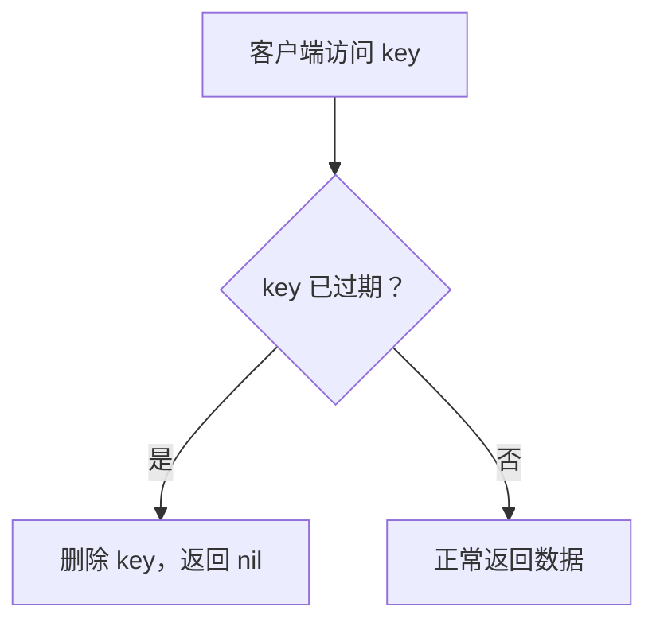
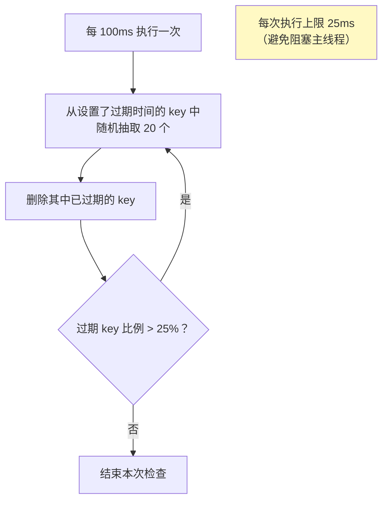
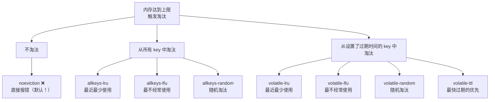
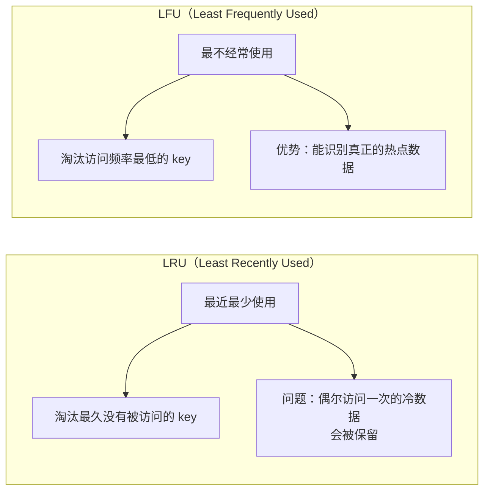

# Redis 内存管理与过期淘汰

Redis 是内存数据库，内存管理直接影响性能和稳定性。

## 过期删除策略

给 key 设置过期时间后，Redis 怎么删除过期的 key？

```sql
SET name "Alice" EX 60      -- 60秒后过期
EXPIRE name 60               -- 给已有 key 设置过期时间
PEXPIRE name 60000           -- 毫秒级
EXPIREAT name 1735689600     -- 指定时间戳
```

### 三种过期删除策略

| 策略 | 原理 | 优点 | 缺点 |
|------|------|------|------|
| **定时删除** | 每个 key 一个定时器，到期立即删 | 内存友好 | CPU 不友好（大量定时器） |
| **惰性删除** | 访问 key 时才检查是否过期 | CPU 友好 | 内存不友好（可能大量过期key没被访问） |
| **定期删除** | 周期性随机抽查，删除过期 key | 折中 | 需要平衡频率和时长 |

> [!important] Redis 使用：惰性删除 + 定期删除

### 惰性删除



### 定期删除（具体实现）

Redis 在 `serverCron` 中每秒执行 10 次（`hz = 10`）：



> [!warning] 大量 key 同时过期的问题
> 如果大量 key 在同一时刻过期，定期删除的循环可能接近 25ms 上限，造成**主线程阻塞**。
> **解决方案**：设置过期时间时加上**随机偏移量**：`EXPIRE key (base_time + random(0, 300))`

---

## 内存淘汰策略

当 Redis 使用内存达到 `maxmemory` 上限时，新的写入命令会触发**内存淘汰**。

### 8 种淘汰策略（Redis 4.0+）



| 策略 | 范围 | 算法 | 适用场景 |
|------|------|------|----------|
| **noeviction** | - | 不淘汰，报错 | 默认，不推荐 |
| **allkeys-lru** ✅ | 所有 key | LRU | **最常用**，缓存场景 |
| **allkeys-lfu** ✅ | 所有 key | LFU | 有热点数据的场景 |
| **allkeys-random** | 所有 key | 随机 | key 访问频率均匀 |
| **volatile-lru** | 有过期时间的 key | LRU | 部分 key 需要持久化 |
| **volatile-lfu** | 有过期时间的 key | LFU | 同上 |
| **volatile-random** | 有过期时间的 key | 随机 | 同上 |
| **volatile-ttl** | 有过期时间的 key | TTL 最小 | 优先淘汰快过期的 |

### LRU vs LFU



### Redis 的近似 LRU

Redis 没有实现精确的 LRU（需要额外链表，内存开销大），而是用**近似 LRU**：

```
每个 key 的 redisObject 中有 24 位 lru 字段（记录最后访问时间戳）

淘汰时：
1. 随机采样 N 个 key（默认 maxmemory-samples = 5）
2. 比较 lru 时间戳
3. 淘汰其中最久没有被访问的
```

> 采样数越大（如 10），越接近精确 LRU，但 CPU 开销越大。默认 5 已经很接近精确 LRU。

### Redis 的 LFU 实现

```
24 位 lru 字段拆分为两部分：

高 16 位: ldt (Last Decrement Time) - 上次衰减时间
低  8 位: logc (Logarithmic Counter) - 对数频率计数器（0-255）
```

**logc 的特点：**
- 不是线性增长，而是**对数增长**（概率性增加）
- 访问频率越高，增加概率越低
- 会**随时间衰减**（长时间不访问会降低）

```
访问时:
  counter_chance = 1.0 / (old_counter * lfu_log_factor + 1)
  if (random() < counter_chance) counter++
  
衰减:
  counter -= (当前时间 - ldt) * lfu_decay_time 分钟
```

> [!tip] 推荐配置
> 缓存场景推荐 **allkeys-lfu**（Redis 4.0+）或 **allkeys-lru**。

---

## 内存优化技巧

### 1. 使用合适的数据结构

```
# 100 万个用户信息

# ❌ 每个用户一个 String key（大量 key 开销）
SET user:1:name "Alice"
SET user:1:age "25"
# 每个 key 都有 redisObject(16B) + SDS + dictEntry 等开销

# ✅ 用 Hash 分桶存储（小 Hash 用 ziplist，内存紧凑）
# 将 user_id 分桶：user_id / 100 为 key，user_id % 100 为 field
HSET user:bucket:0 "1:name" "Alice"
HSET user:bucket:0 "1:age" "25"
```

### 2. 控制 key 的大小

```
# ❌ 长 key
SET user:information:detail:name:12345 "Alice"

# ✅ 短 key
SET u:12345:n "Alice"
```

### 3. 整数共享对象

Redis 启动时预建 0-9999 的整数对象，多个 key 共享。

```
SET a 100   → 引用共享的整数对象 100
SET b 100   → 引用同一个共享对象（refcount++）
```

> 开启 LRU/LFU 淘汰策略时，共享对象仍然生效。

### 4. 大 Key 治理

| 类型 | 大 Key 标准 | 问题 |
|------|-------------|------|
| String | > 10KB | 网络传输慢 |
| Hash/Set/Zset/List | > 5000 个元素 或 > 10MB | 操作阻塞 |

**排查大 Key：**
```bash
redis-cli --bigkeys             # 扫描大 key
redis-cli --memkeys             # 按内存排序
redis-cli MEMORY USAGE key_name # 查看单个 key 内存
```

**删除大 Key：**
```bash
# ❌ DEL bigkey → 阻塞主线程！
# ✅ UNLINK bigkey → 异步删除（后台线程处理）
# ✅ 分批删除（HSCAN + HDEL 每次删一部分）
```

---

## 面试高频问题

### Q1：Redis 的过期策略是什么？

惰性删除 + 定期删除。惰性删除是访问 key 时检查是否过期；定期删除是每秒 10 次随机抽查 20 个有过期时间的 key，删除已过期的。

### Q2：Redis 的内存淘汰策略有哪些？

8 种：noeviction、allkeys-lru、allkeys-lfu、allkeys-random、volatile-lru、volatile-lfu、volatile-random、volatile-ttl。推荐缓存场景用 allkeys-lru 或 allkeys-lfu。

### Q3：LRU 和 LFU 的区别？

LRU 淘汰最近最少**使用**的，LFU 淘汰最不**经常**使用的。LFU 更能识别热点数据，因为偶尔访问一次的冷数据在 LFU 下频率计数仍然很低。

### Q4：大量 key 同时过期会怎样？

可能导致主线程阻塞（定期删除循环执行接近上限时间）。解决方案：设置过期时间时加随机偏移量，避免集中过期。
