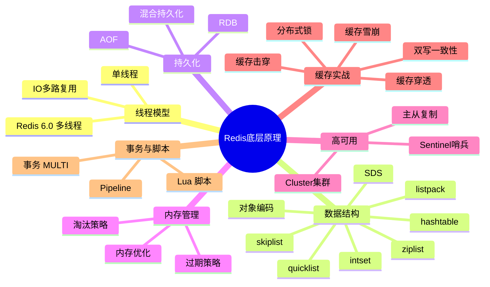

# Redis 底层原理 - 完整知识体系

> [!tip] 使用指南
> 本系列笔记覆盖 Redis 面试全部高频考点，从数据结构到集群架构，由浅入深。每个模块独立成篇，互相链接。建议按顺序阅读。

## 知识地图

## 模块导航

| 序号  | 模块                         | 核心内容                                  | 面试热度  |
| --- | -------------------------- | ------------------------------------- | ----- |
| 1   | [[Redis线程模型与IO多路复用]]       | 单线程原理、epoll、Redis 6.0 多线程IO           | ⭐⭐⭐⭐⭐ |
| 2   | [[Redis数据结构与编码]]           | SDS、ziplist、skiplist、hashtable、对象编码转换 | ⭐⭐⭐⭐⭐ |
| 3   | [[Redis持久化机制]]             | RDB 快照、AOF 日志、混合持久化、对比选型              | ⭐⭐⭐⭐⭐ |
| 4   | [[Redis内存管理与过期淘汰]]         | 过期策略、8种淘汰策略、内存优化                      | ⭐⭐⭐⭐⭐ |
| 5   | [[Redis主从复制]]              | 全量/增量复制、PSYNC、复制积压缓冲区                 | ⭐⭐⭐⭐  |
| 6   | [[Redis Sentinel与Cluster]] | 哨兵选举、Cluster 分片、Gossip 协议、槽迁移         | ⭐⭐⭐⭐⭐ |
| 7   | [[Redis事务与Lua脚本]]          | MULTI/EXEC、Lua 原子性、Pipeline           | ⭐⭐⭐   |
| 8   | [[Redis缓存实战与经典问题]]         | 穿透/击穿/雪崩、双写一致、分布式锁、热Key               | ⭐⭐⭐⭐⭐ |

## 面试高频 Top 10 问题速查

1. **Redis 为什么这么快？** → [[Redis线程模型与IO多路复用#Redis 为什么这么快]]
2. **Redis 的数据结构有哪些？底层实现？** → [[Redis数据结构与编码#五大数据类型与底层编码]]
3. **RDB 和 AOF 的区别？** → [[Redis持久化机制#RDB vs AOF 对比]]
4. **Redis 的过期策略和淘汰策略？** → [[Redis内存管理与过期淘汰#过期删除策略]]
5. **缓存穿透、击穿、雪崩怎么解决？** → [[Redis缓存实战与经典问题#缓存三大问题]]
6. **Redis 集群怎么实现？数据怎么分片？** → [[Redis Sentinel与Cluster#Redis Cluster]]
7. **主从复制的原理？** → [[Redis主从复制#复制流程详解]]
8. **Redis 分布式锁怎么实现？** → [[Redis缓存实战与经典问题#分布式锁]]
9. **如何保证缓存和数据库的双写一致性？** → [[Redis缓存实战与经典问题#缓存与数据库双写一致性]]
10. **Redis 6.0 为什么引入多线程？** → [[Redis线程模型与IO多路复用#Redis 6.0 多线程]]
