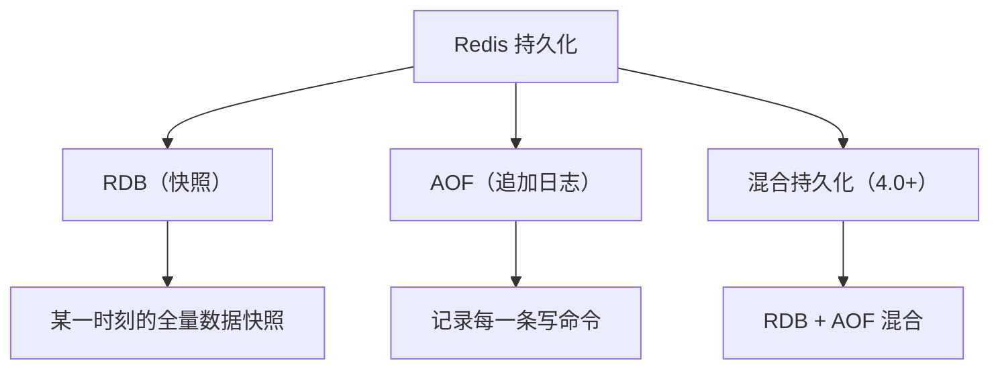
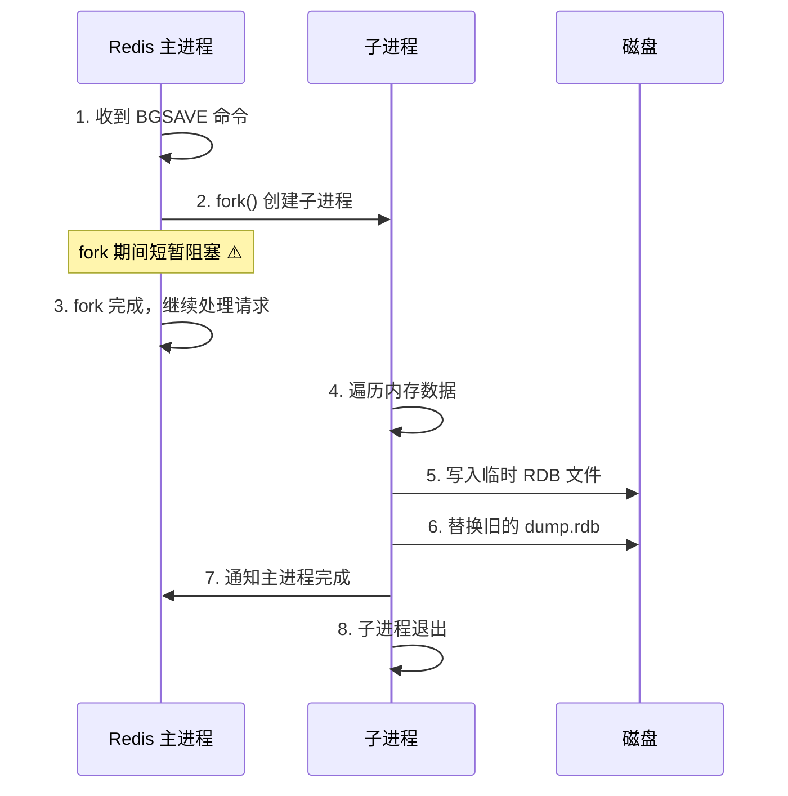
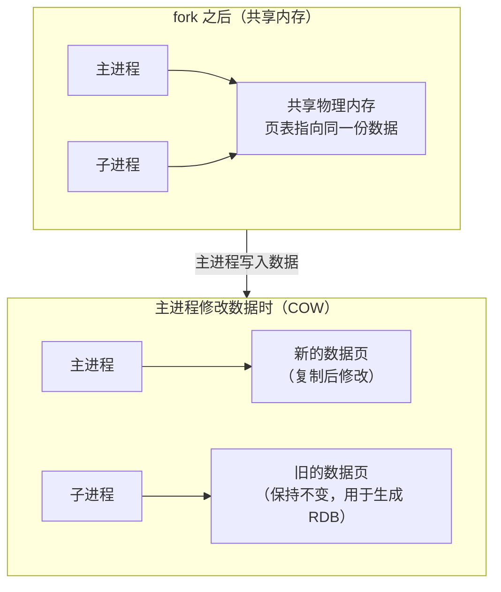
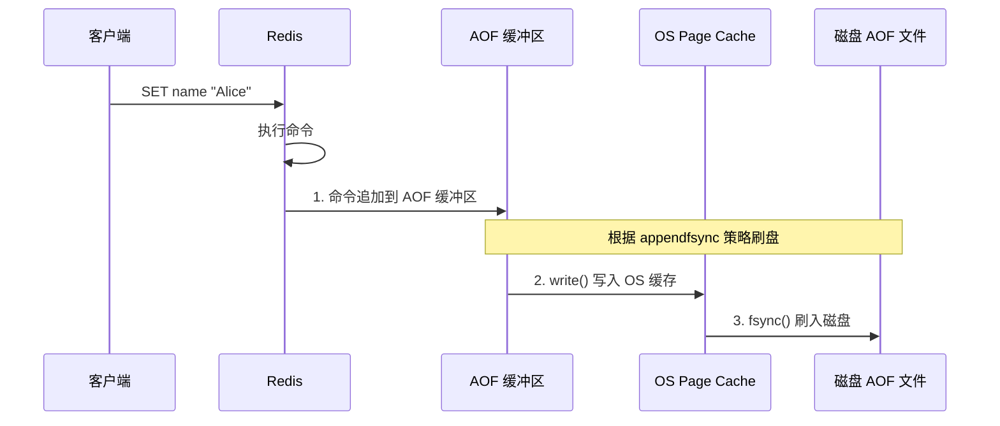
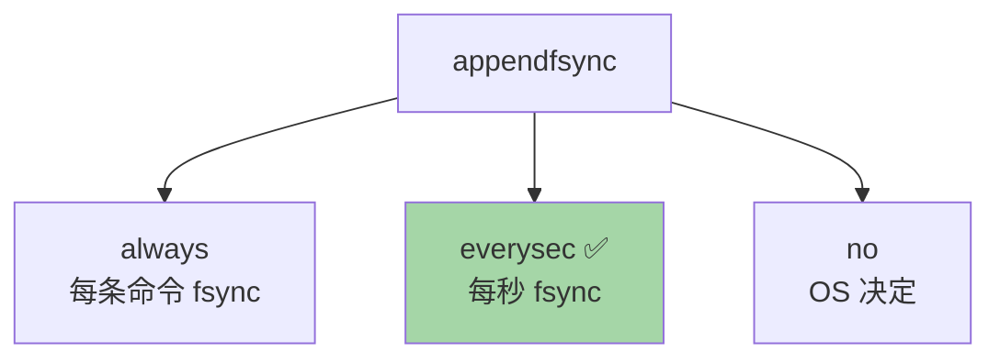
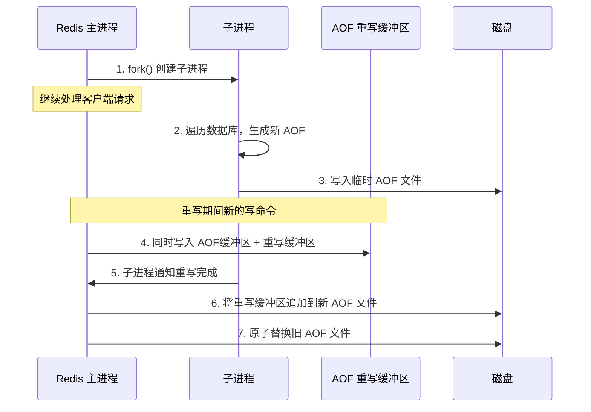
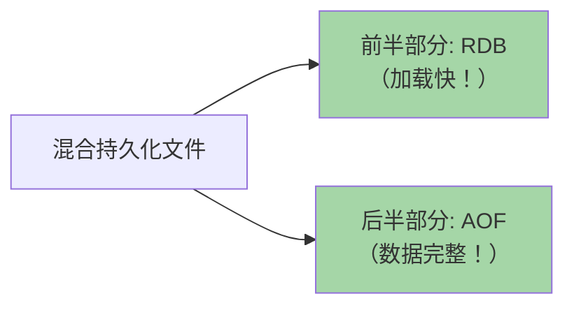
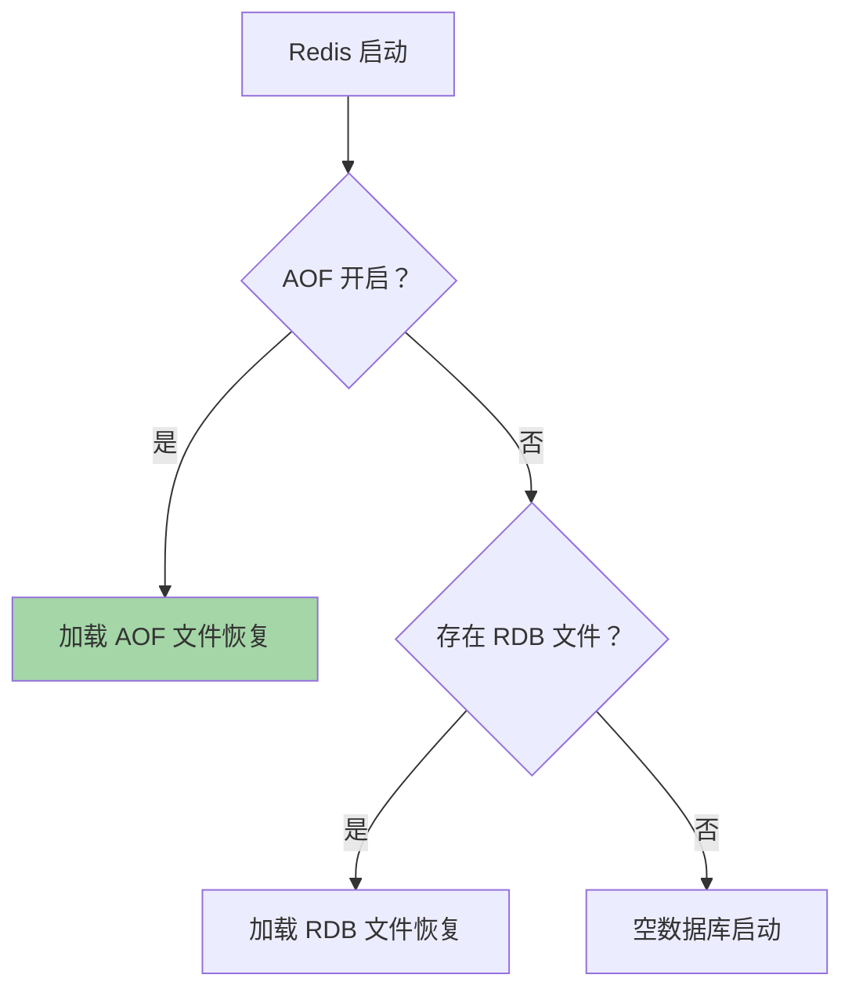

# Redis 持久化机制

Redis 是内存数据库，持久化决定了数据是否能在重启后恢复。

## 持久化方式总览



---

## RDB（Redis Database）

### 什么是 RDB？

将某一时刻 Redis 内存中的**全部数据**生成**二进制快照**文件（dump.rdb）。

### 触发方式

| 方式 | 命令/配置 | 说明 |
|------|-----------|------|
| **手动（同步）** | `SAVE` | 主线程执行，**阻塞所有请求** ❌ |
| **手动（异步）** | `BGSAVE` | fork 子进程执行，**不阻塞** ✅ |
| **自动** | `save 900 1` | 900秒内至少1次修改则自动 BGSAVE |
| **关闭时** | `SHUTDOWN` | 自动执行 RDB 保存 |
| **主从复制** | 全量复制时 | 主节点自动生成 RDB 发给从节点 |

### BGSAVE 执行流程（核心！）



### Copy-On-Write（写时复制）

fork 子进程时，**不会立即复制全部内存**，而是与父进程共享同一份物理内存。



> [!important] COW 的意义
> 1. fork 速度极快（不需要复制内存，只复制页表）
> 2. 子进程看到的是 fork 时刻的**一致性快照**
> 3. 主进程修改数据时，才按需复制对应的内存页
> 4. 但如果写入量大，可能导致内存翻倍！（每个脏页都要复制一份）

### RDB 配置

```
# redis.conf

# 自动触发条件（满足任一即触发 BGSAVE）
save 900 1      # 900秒内至少1次修改
save 300 10     # 300秒内至少10次修改
save 60 10000   # 60秒内至少10000次修改

# RDB 文件名
dbfilename dump.rdb

# RDB 文件目录
dir /var/lib/redis

# RDB 压缩（LZF 压缩，建议开启）
rdbcompression yes

# RDB 校验
rdbchecksum yes
```

### RDB 优缺点

| 优点 | 缺点 |
|------|------|
| 二进制文件，**体积小** | 不能实时持久化，可能**丢失最后一次快照后的数据** |
| **恢复速度快** | fork 时内存可能翻倍（COW） |
| 适合备份和灾难恢复 | fork 期间主线程短暂阻塞 |
| 对 Redis 性能影响小 | 数据量大时 fork 耗时增加 |

---

## AOF（Append Only File）

### 什么是 AOF？

将 Redis 执行的**每一条写命令**追加到 AOF 文件末尾。恢复时重新执行所有命令。

### AOF 写入流程



### AOF 刷盘策略（appendfsync）

| 策略 | 行为 | 性能 | 数据安全 |
|------|------|------|----------|
| **always** | 每条命令都 fsync | 最慢 | **最安全**（最多丢一条） |
| **everysec** | 每秒 fsync 一次 | 折中 | **推荐**（最多丢1秒） |
| **no** | 由 OS 决定 fsync | 最快 | 不安全（可能丢几十秒） |



> [!tip] 为什么先执行命令再写 AOF？
> 1. 避免语法错误的命令写入 AOF
> 2. 不阻塞当前命令执行
> 3. 如果先写 AOF，命令执行失败就需要回滚 AOF

### AOF 文件内容示例

```
*3
$3
SET
$4
name
$5
Alice
*3
$3
SET
$3
age
$2
25
```

RESP 协议格式，可读性好。

---

## AOF 重写（Rewrite）

### 为什么需要重写？

AOF 文件会越来越大（同一个 key 可能被修改 N 次，但只需保留最终状态）。

```
重写前 AOF:                    重写后 AOF:
SET name "Alice"               SET name "Charlie"
SET name "Bob"                 SET age 30
SET name "Charlie"
SET age 25
SET age 30
DEL temp
```

### 重写流程



> [!important] 重写缓冲区的作用
> 重写期间主进程仍在处理写命令，这些新命令需要写入**重写缓冲区**。重写完成后追加到新 AOF 文件，保证数据不丢失。

### 触发条件

```
# 自动触发（两个条件同时满足）
auto-aof-rewrite-percentage 100    # AOF 比上次重写后增长 100%
auto-aof-rewrite-min-size 64mb     # AOF 文件至少 64MB

# 手动触发
BGREWRITEAOF
```

---

## 混合持久化（Redis 4.0+）

### 原理

AOF 重写时，不再是纯命令格式，而是：**RDB 格式（存量数据）+ AOF 格式（增量命令）**

```
┌───────────────────────────────────────┐
│          RDB 二进制数据                │  ← fork 时刻的全量快照
│          (存量数据)                    │
├───────────────────────────────────────┤
│      AOF 增量命令                      │  ← 重写期间的新写命令
│      SET key1 value1                  │
│      DEL key2                         │
└───────────────────────────────────────┘
```



### 开启方式

```
aof-use-rdb-preamble yes   # Redis 5.0+ 默认开启
```

### 优势

- **恢复速度快**（RDB 部分直接加载）
- **数据丢失少**（AOF 部分保证增量完整）
- 兼具 RDB 和 AOF 的优点

---

## RDB vs AOF 对比

| 对比维度 | RDB | AOF |
|----------|-----|-----|
| **持久化方式** | 全量快照 | 增量命令追加 |
| **文件体积** | 小（二进制压缩） | 大（文本命令） |
| **恢复速度** | **快** | 慢（重放命令） |
| **数据安全** | 可能丢失最后一次快照的数据 | 最多丢 1 秒数据（everysec） |
| **性能影响** | fork 时有短暂影响 | everysec 基本无影响 |
| **文件可读性** | 不可读（二进制） | 可读（RESP 命令） |
| **适用场景** | 备份、容灾 | 数据安全要求高 |

> [!tip] 最佳实践
> **同时开启 RDB 和 AOF**，用 AOF 保证数据安全（恢复优先使用 AOF），用 RDB 做冷备。
> Redis 5.0+ 建议开启**混合持久化**。

---

## 数据恢复优先级



> AOF 优先级高于 RDB（因为 AOF 数据通常更完整）。

---

## 面试高频问题

### Q1：RDB 和 AOF 的区别？

从持久化方式、文件大小、恢复速度、数据安全性四个维度对比。

### Q2：BGSAVE 的 fork 会阻塞吗？

fork 本身会**短暂阻塞**主进程（复制页表），但非常快。fork 完成后子进程独立工作，主进程不阻塞。需要注意内存大时 fork 耗时增加，以及 COW 可能导致内存翻倍。

### Q3：AOF 重写期间有新数据写入怎么办？

新写入的命令同时追加到 **AOF 缓冲区**（保证旧 AOF 完整）和 **AOF 重写缓冲区**（保证新 AOF 完整）。重写完成后将重写缓冲区追加到新文件。

### Q4：Redis 4.0 的混合持久化是什么？

AOF 重写时生成的文件，前半段是 RDB 格式（全量快照），后半段是 AOF 格式（增量命令）。兼顾恢复速度和数据安全。
