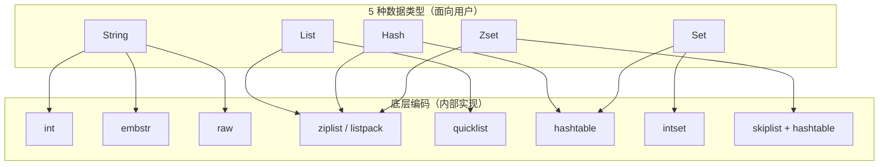
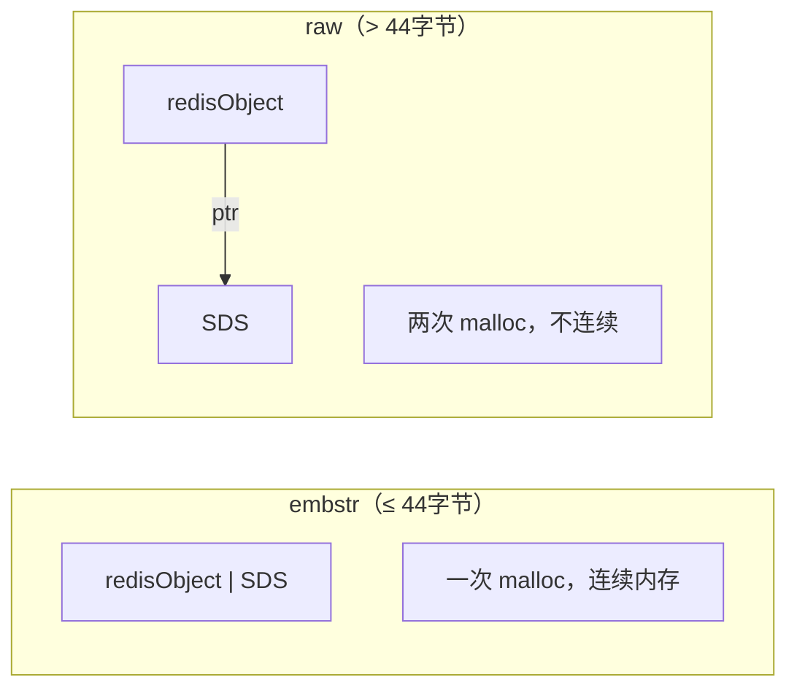
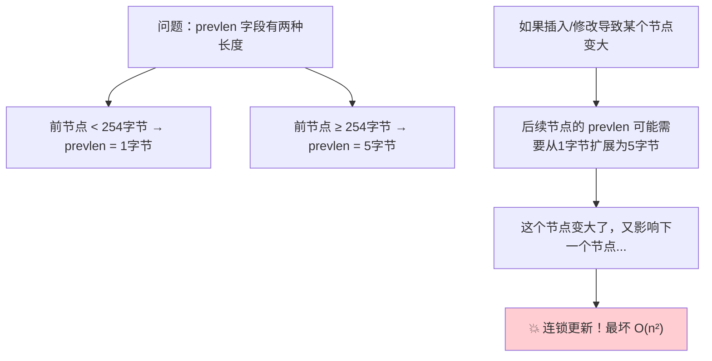
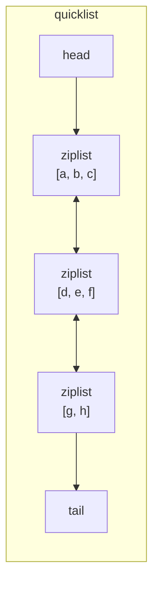
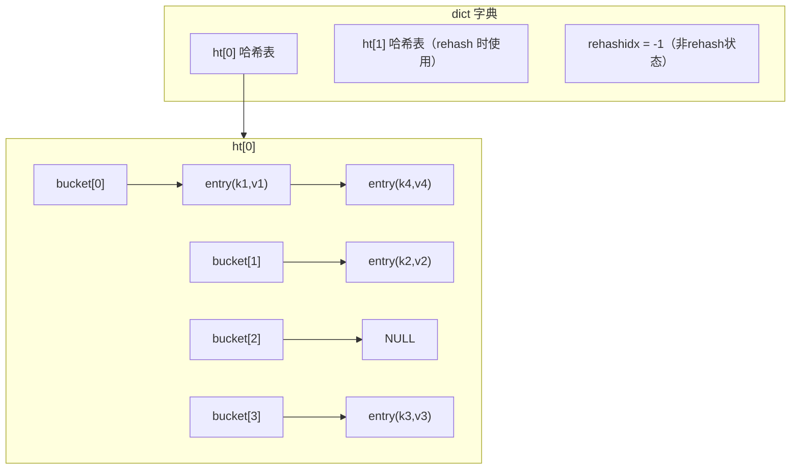
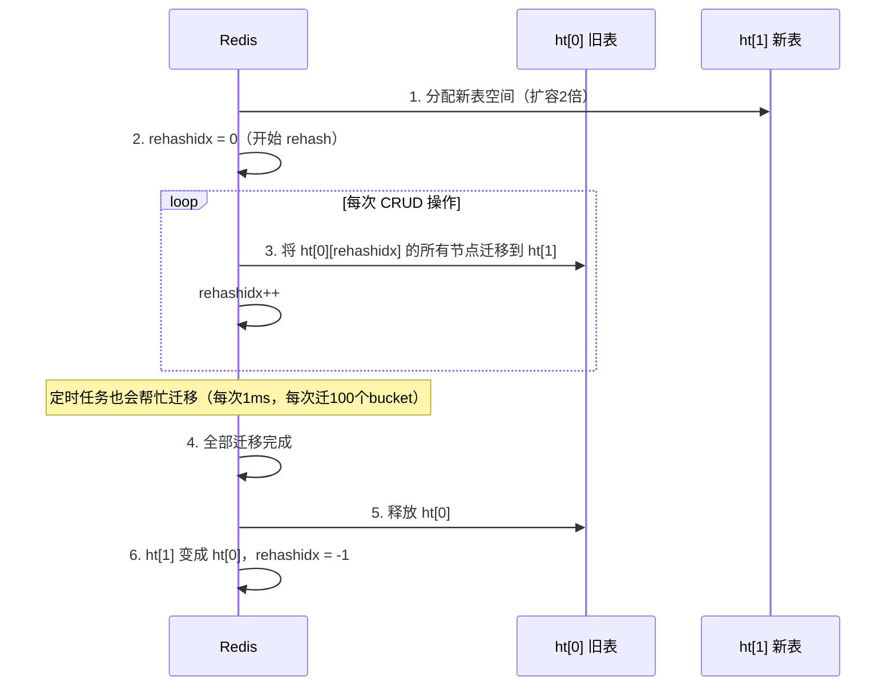
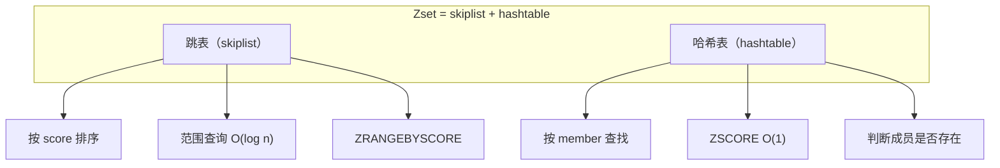
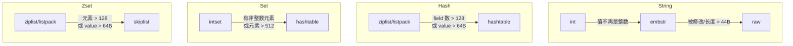

# Redis 数据结构与编码

Redis 的高性能很大程度上归功于其**精心设计的底层数据结构**。面试超高频考点。

## 五大数据类型与底层编码

Redis 的 5 种数据类型（对外接口）和底层编码（内部实现）是**两层概念**：



### 完整编码对照表

| 数据类型 | 编码 | 条件 | 说明 |
|----------|------|------|------|
| **String** | int | 值为整数 | 直接存 long |
| | embstr | 字符串 ≤ 44字节 | 一次内存分配 |
| | raw | 字符串 > 44字节 | 两次内存分配 |
| **List** | ziplist/listpack | 元素少且小 | 7.0 改用 listpack |
| | quicklist | 默认 | ziplist 链表 |
| **Hash** | ziplist/listpack | 元素 ≤ 128 且值 ≤ 64字节 | 紧凑存储 |
| | hashtable | 超出阈值 | 标准哈希表 |
| **Set** | intset | 全是整数且元素 ≤ 512 | 有序整数数组 |
| | hashtable | 超出阈值 | 标准哈希表 |
| **Zset** | ziplist/listpack | 元素 ≤ 128 且值 ≤ 64字节 | 紧凑存储 |
| | skiplist + hashtable | 超出阈值 | 跳表 + 哈希表 |

> [!tip] 查看编码
> ```
> OBJECT ENCODING key_name
> ```

---

## RedisObject 结构

每个 Redis 键值对的值都是一个 `redisObject`：

```
┌──────────────────────────────────────────┐
│              redisObject                  │
├──────────┬──────────┬────────────────────┤
│ type(4位) │encoding  │ lru(24位)          │
│ 数据类型   │(4位)编码  │ 最近访问时间/LFU频率   │
├──────────┴──────────┴────────────────────┤
│ refcount(4字节)                           │
│ 引用计数                                   │
├──────────────────────────────────────────┤
│ *ptr(8字节)                               │
│ 指向底层数据结构的指针                        │
└──────────────────────────────────────────┘
总计: 16 字节（64位系统）
```

- **type**：STRING / LIST / HASH / SET / ZSET
- **encoding**：具体用哪种底层数据结构
- **lru**：配合内存淘汰策略使用
- **refcount**：引用计数，用于内存回收和对象共享
- **ptr**：指向实际的数据

---

## SDS（Simple Dynamic String）

Redis **没有直接使用 C 语言的 char\***，而是自己实现了 SDS。

### SDS 结构

```
┌────────┬────────┬───────────────────────────────┐
│  len   │ alloc  │   buf[] (字节数组)               │
│ 已使用  │ 已分配  │   'R' 'e' 'd' 'i' 's' '\0'    │
│  5     │  10    │                                │
└────────┴────────┴───────────────────────────────┘
                   ↑ ptr 指向这里
```

### SDS vs C 字符串

| 特性 | C 字符串 | SDS |
|------|----------|-----|
| **获取长度** | O(n) 遍历 | **O(1)** 直接读 len |
| **缓冲区溢出** | 可能溢出 | **自动扩容**，安全 |
| **修改时内存分配** | 每次修改都要 | **预分配 + 惰性释放** |
| **二进制安全** | ❌ 遇到 '\0' 截断 | ✅ 用 len 判断结束 |
| **兼容 C 函数** | 天然兼容 | 兼容（末尾有 '\0'） |

### SDS 内存预分配策略

```
修改后 len < 1MB:
  alloc = len × 2        （翻倍扩容）

修改后 len ≥ 1MB:
  alloc = len + 1MB      （每次多分配 1MB）
```

> 惰性释放：缩短字符串时不立即释放多余空间，记录在 alloc 中，下次使用时直接复用。

### embstr vs raw



**为什么是 44 字节？**
- `redisObject` = 16 字节
- SDS header（sdshdr8）= 3 字节
- 末尾 `\0` = 1 字节
- jemalloc 分配 64 字节：64 - 16 - 3 - 1 = **44 字节**

> [!important] embstr 的优势
> 一次内存分配、CPU 缓存友好（连续内存）、释放也是一次。
> 但 embstr 是**只读的**，任何修改操作都会先转换为 raw。

---

## Ziplist（压缩列表）

Redis 7.0 之前广泛使用的紧凑数据结构。

### Ziplist 结构

```
┌─────────┬─────────┬────────┬────────┬─────┬────────┬────────┐
│ zlbytes  │ zltail  │ zllen  │ entry1 │ ... │ entryN │ zlend  │
│ 总字节数  │ 尾偏移  │ 节点数  │        │     │        │ 0xFF   │
│ (4字节)  │ (4字节) │ (2字节) │        │     │        │ (1字节) │
└─────────┴─────────┴────────┴────────┴─────┴────────┴────────┘
```

### Entry 结构

```
┌──────────────────┬──────────┬──────────┐
│ prevlen           │ encoding │ data     │
│ 前一个节点的长度   │ 编码类型  │ 实际数据  │
│ (1字节 或 5字节)   │          │          │
└──────────────────┴──────────┴──────────┘
```

### 连锁更新问题



> 虽然概率低，但这是 ziplist 的设计缺陷。Redis 7.0 引入 **listpack** 解决了这个问题。

---

## Listpack（紧凑列表）

Redis 7.0 引入，替代 ziplist，**没有连锁更新问题**。

### 核心改进

```
Ziplist entry:  | prevlen | encoding | data |
                  ↑ 存储前一个节点长度（耦合！导致连锁更新）

Listpack entry: | encoding | data | backlen |
                                     ↑ 存储当前节点自身长度（解耦！）
```

- 每个节点记录的是**自身长度**而非前一个节点长度
- 反向遍历时：通过当前节点的 backlen 跳到自己的开头，再跳到前一个节点的 backlen
- 彻底消除了连锁更新！

---

## Quicklist（快速列表）

**List 类型的默认底层实现**。本质是 ziplist/listpack 组成的双向链表。



### 为什么需要 quicklist？

| 数据结构 | 优点 | 缺点 |
|----------|------|------|
| 双向链表 | 两端操作 O(1) | 每个节点都有指针开销，内存碎片 |
| ziplist | 内存紧凑 | 修改需要重新分配整块内存 |
| **quicklist** | **两者优点结合** | 折中方案 |

```sql
-- 控制每个 ziplist 节点的最大大小
list-max-ziplist-size -2   
-- -1: 4KB, -2: 8KB(默认), -3: 16KB, -4: 32KB, -5: 64KB

-- 两端不压缩，中间节点用 LZF 压缩
list-compress-depth 1
-- 0: 不压缩, 1: 头尾各1个不压缩, 2: 头尾各2个不压缩
```

---

## Hashtable（哈希表）

### 结构



### 渐进式 Rehash

当负载因子过高或过低时，需要扩容/缩容。Redis 使用**渐进式 rehash** 避免一次性大量数据迁移导致阻塞。



**Rehash 期间的操作规则：**
- **查找**：先查 ht[0]，没找到再查 ht[1]
- **新增**：直接写入 ht[1]（保证 ht[0] 只减不增）
- **删除/更新**：在两个表中都操作

**扩容/缩容条件：**
- 扩容：负载因子 ≥ 1（无 BGSAVE/BGREWRITEAOF）或 ≥ 5（有后台操作）
- 缩容：负载因子 < 0.1

> [!important] 面试要点
> 渐进式 rehash 的核心思想：将一次大迁移分摊到**每次增删改查操作**中，避免阻塞。

---

## Intset（整数集合）

当 Set 全是整数且元素少时使用。

```
┌──────────┬────────┬──────────────────────────┐
│ encoding  │ length │ contents[]                │
│ 编码方式   │ 元素数  │ [1, 3, 5, 7, 9] 有序排列   │
│ (int16/   │        │                          │
│  int32/   │        │ 二分查找 O(log n)          │
│  int64)   │        │                          │
└──────────┴────────┴──────────────────────────┘
```

**编码升级：** 当新元素类型超过当前编码范围时，整个 intset 升级：
- int16 → int32 → int64
- **不可降级**（一旦升级，不会回退）

---

## Skiplist（跳表）

**Zset（有序集合）的核心数据结构**，面试高频考点。

### 为什么选跳表而不是平衡树？

| 特性 | 红黑树/AVL树 | 跳表 |
|------|-------------|------|
| 查找 | O(log n) | O(log n) |
| 插入/删除 | O(log n) + 旋转 | O(log n)，**更简单** |
| 范围查询 | 中序遍历（复杂） | **链表顺序遍历（天然支持）** |
| 实现复杂度 | 复杂（旋转平衡） | **简单** |
| 内存占用 | 每节点固定指针 | 平均 1.33 个指针/节点 |

> [!important] Redis 作者 antirez 的说法
> 跳表实现更简单，范围查询更友好，且通过调节随机层数可以在时空效率间灵活平衡。

### 跳表结构

```
Level 4:  HEAD ──────────────────────────────→ 9 ────→ NULL
Level 3:  HEAD ──────────→ 4 ────────────────→ 9 ────→ NULL
Level 2:  HEAD ────→ 2 ──→ 4 ────→ 6 ────────→ 9 ────→ NULL
Level 1:  HEAD ──→ 1 → 2 → 3 → 4 → 5 → 6 → 7 → 9 ──→ NULL
```


### Redis 跳表的特点

1. **最高 32 层**
2. **随机层数生成**：每层晋升概率 1/4（ZSKIPLIST_P = 0.25）
3. 节点包含 `score`（分数）和 `ele`（成员）
4. **相同 score 按字典序排序**
5. 每个节点有**后退指针（backward）**，支持从尾到头遍历

### Zset 为什么用 skiplist + hashtable？



> 跳表擅长范围查询和排序，哈希表擅长精确查找。两者配合，覆盖 Zset 的所有操作。

---

## 编码转换规则

### 何时发生编码转换？



> [!warning] 编码转换是**单向的**
> 从紧凑编码 → 标准编码，不可逆转！即使后续数据量减少也不会转回来。

---

## 面试高频问题

### Q1：Redis 的 5 种数据类型分别用什么场景？

| 类型 | 典型场景 |
|------|----------|
| **String** | 缓存、计数器、分布式锁、Session |
| **List** | 消息队列、最新列表、时间线 |
| **Hash** | 对象存储（用户信息、商品详情） |
| **Set** | 标签系统、好友关系、去重 |
| **Zset** | 排行榜、延迟队列、滑动窗口限流 |

### Q2：SDS 相比 C 字符串有什么优势？

O(1) 获取长度、防止缓冲区溢出、减少内存分配次数（预分配+惰性释放）、二进制安全。

### Q3：跳表的时间复杂度和空间复杂度？

- 查找/插入/删除：**O(log n)**
- 空间：**O(n)**（平均每个节点 1.33 个指针，因为晋升概率 1/4）

### Q4：ziplist 的连锁更新问题是什么？怎么解决的？

每个 entry 的 prevlen 记录了前一个节点的长度，如果前一个节点扩大导致 prevlen 从 1 字节变为 5 字节，可能引发连锁更新。Redis 7.0 用 listpack 替代，每个节点记录自身长度，彻底消除了这个问题。
