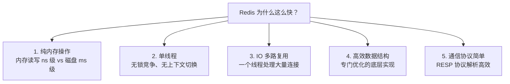
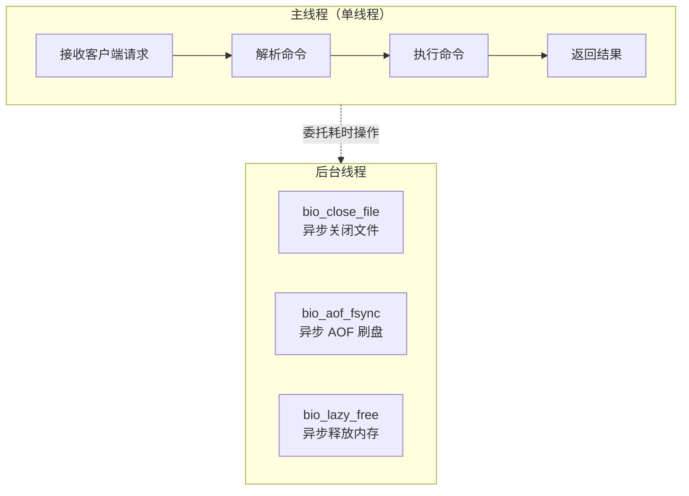
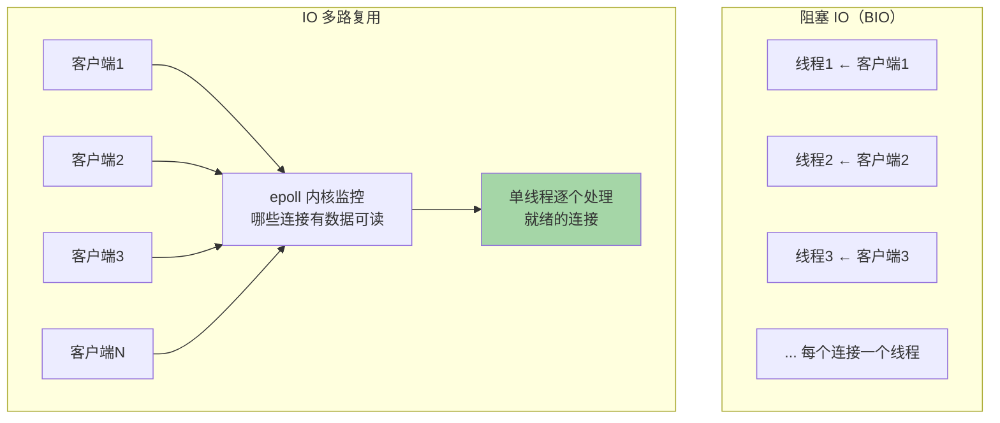
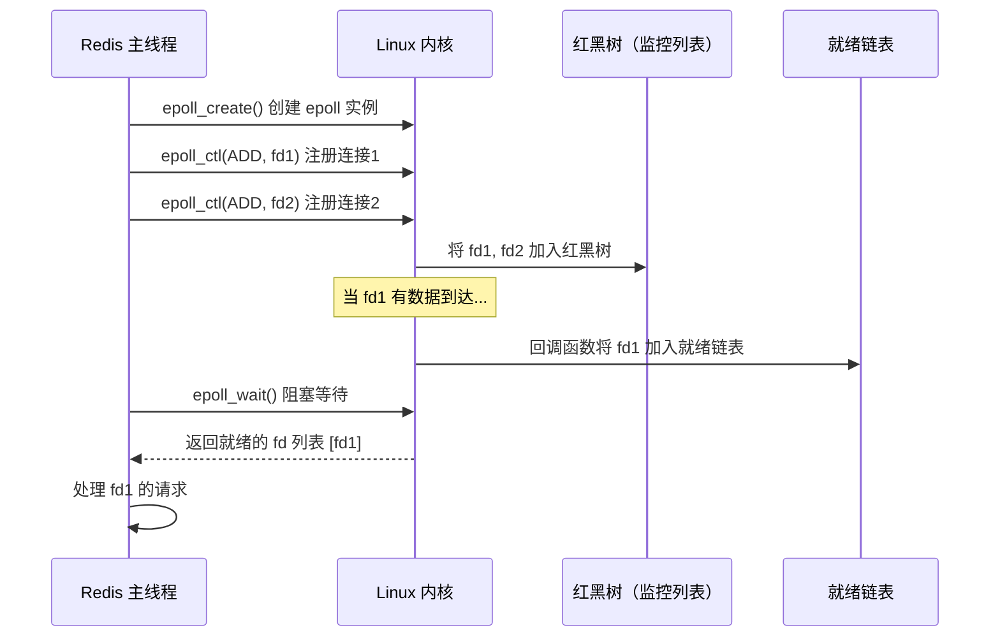
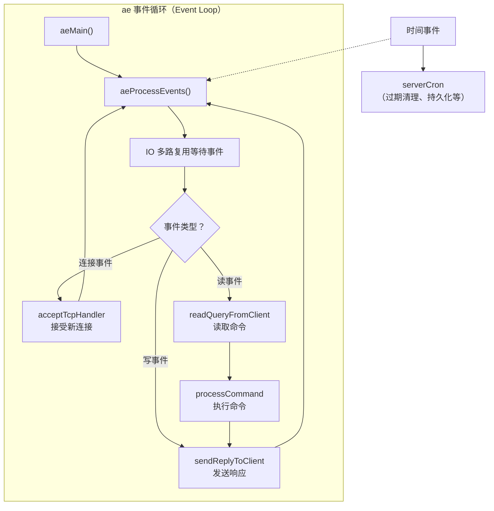
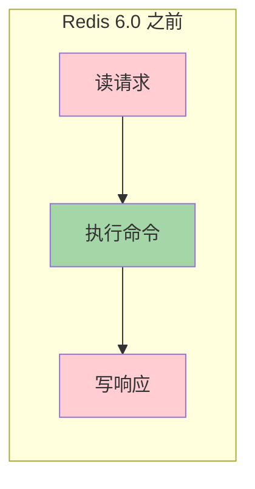
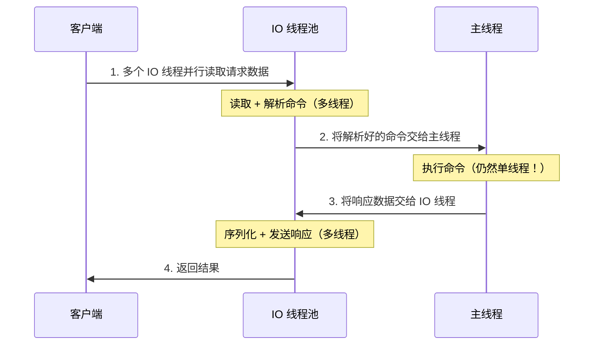
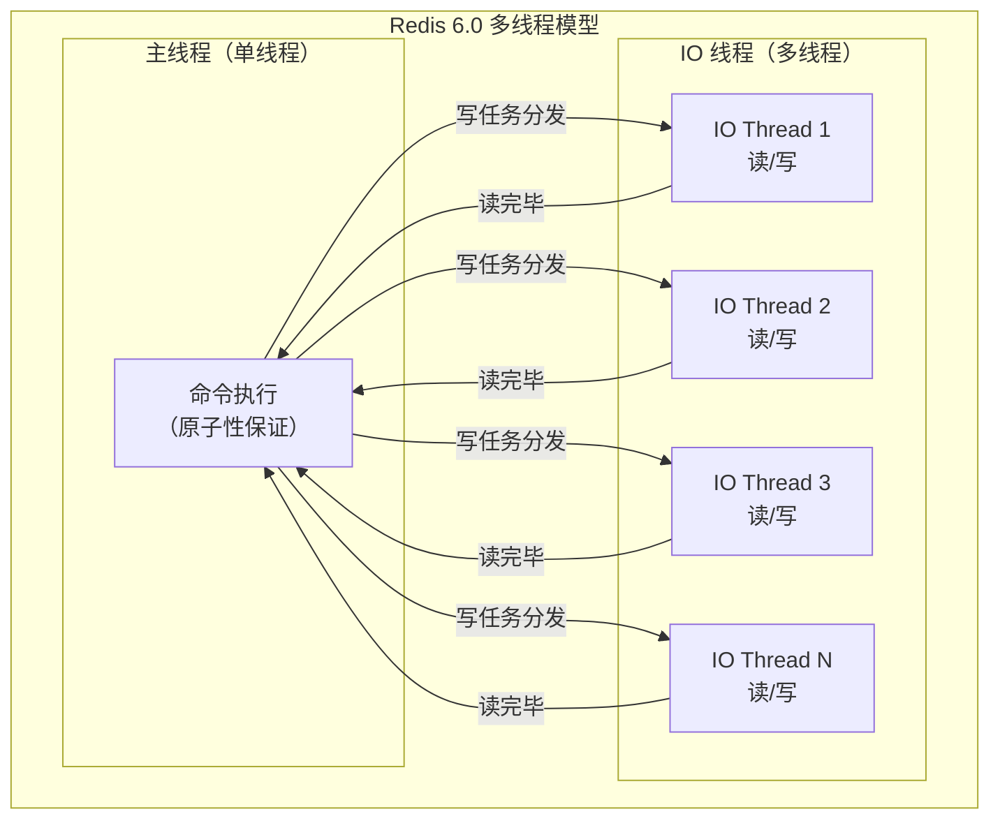

# Redis 线程模型与 IO 多路复用

这是 Redis 面试的**第一个问题**，几乎必问。

## Redis 为什么这么快

Redis 单机 QPS 可达 **10 万+**，核心原因：



> [!important] 面试标准答案
> 1. **基于内存**，读写速度极快（ns 级别）
> 2. **单线程**模型，避免了多线程的锁竞争和上下文切换开销
> 3. 使用 **IO 多路复用**（epoll），单线程高效处理大量并发连接
> 4. **高效的数据结构**（SDS、ziplist、skiplist 等专门设计）
> 5. **RESP 协议**简单高效，解析成本低

---

## 单线程模型

### 什么是"单线程"？

> [!warning] 精确说法
> Redis 的**网络 IO 和命令执行**是单线程的。但 Redis **不是完全的单线程**程序。

Redis 有多个后台线程：
- **主线程**：处理网络 IO + 命令执行（核心，单线程）
- **bio_close_file**：异步关闭文件
- **bio_aof_fsync**：异步 AOF 刷盘
- **bio_lazy_free**：异步释放大对象内存（`UNLINK`、`FLUSHALL ASYNC`）



### 为什么用单线程？

1. **CPU 不是瓶颈**：Redis 操作基于内存，CPU 开销极小，瓶颈在**网络 IO 和内存**
2. **避免锁竞争**：多线程需要加锁保护共享数据，锁的开销可能超过并行带来的收益
3. **避免上下文切换**：线程切换需要保存/恢复寄存器等状态，有额外开销
4. **实现简单**：单线程代码更简单、更容易维护、bug 更少

---

## IO 多路复用

### 问题：单线程怎么处理大量并发连接？

答案是 **IO 多路复用**（I/O Multiplexing）。

### 传统 IO 模型对比



### select / poll / epoll 对比

| 特性 | select | poll | epoll |
|------|--------|------|-------|
| **连接数限制** | 1024（FD_SETSIZE） | 无限制 | 无限制 |
| **数据结构** | bitmap | 数组 | 红黑树 + 就绪链表 |
| **内核态遍历** | O(n) 全部遍历 | O(n) 全部遍历 | **O(1) 回调通知** |
| **用户态拷贝** | 每次全量拷贝 | 每次全量拷贝 | **不需要拷贝** |
| **触发方式** | 水平触发 LT | 水平触发 LT | LT + **边缘触发 ET** |

### epoll 工作原理



**epoll 的核心优势：**
1. **红黑树管理连接**：增删改查 O(log n)
2. **回调机制**：有事件时内核主动通知，不需要遍历所有连接
3. **就绪链表**：`epoll_wait()` 直接返回就绪的连接，O(1)
4. **mmap 共享内存**：内核和用户空间共享就绪列表，减少拷贝

---

## Redis 事件驱动模型

Redis 基于 **Reactor 模式**，封装了一套事件处理框架（ae 库）：



### 文件事件 vs 时间事件

| 事件类型 | 说明 | 示例 |
|----------|------|------|
| **文件事件（File Event）** | 网络 IO 事件 | 新连接、读命令、写响应 |
| **时间事件（Time Event）** | 定时任务 | `serverCron`（默认 100ms 一次） |

**serverCron 做什么？**
- 清理过期 key
- 触发 RDB/AOF 持久化
- 主从复制心跳
- 集群节点状态检测
- 统计信息更新

---

## Redis 6.0 多线程

### 为什么引入多线程？

Redis 性能瓶颈已经从 CPU 转移到**网络 IO**：
- 网络数据的**读取和解析**消耗大量 CPU
- 响应数据的**序列化和发送**也消耗 CPU
- 而命令执行本身很快



```
红色 = 网络IO（耗时大）  绿色 = 命令执行（很快）
```

### 多线程 IO 架构





### 关键点

- **命令执行仍然是单线程**！不需要加锁
- 只有**网络读写**改为多线程
- 默认**不开启**，需要配置：

```
# redis.conf
io-threads 4              # IO 线程数（建议 CPU 核数的一半）
io-threads-do-reads yes    # 开启多线程读
```

> [!important] 面试回答
> Redis 6.0 引入多线程是为了优化**网络 IO 性能**，命令执行仍然是单线程的，所以不需要考虑线程安全问题。多线程 IO 可以提升约 **1 倍**的吞吐量。

---

## 面试高频问题

### Q1：Redis 是单线程还是多线程？

**分版本回答：**
- Redis 6.0 之前：网络 IO + 命令执行 = 单线程（有后台线程处理 close、fsync、free）
- Redis 6.0+：网络 IO = 多线程，命令执行 = 仍然单线程

### Q2：Redis 单线程为什么还这么快？

基于内存 + IO 多路复用 + 高效数据结构 + 避免锁竞争和上下文切换。

### Q3：epoll 和 select 的区别？

1. select 有 1024 连接数限制，epoll 无限制
2. select 每次需要遍历所有连接 O(n)，epoll 回调通知 O(1)
3. select 每次需要用户态和内核态之间拷贝全部 fd，epoll 不需要
4. epoll 支持边缘触发（ET），效率更高

### Q4：什么操作会阻塞 Redis 主线程？

1. **大 Key 操作**：`DEL` 一个百万元素的 Hash/Set
2. **keys *** 命令：O(n) 遍历所有 key
3. **大量 key 同时过期**：集中过期清理
4. **AOF always 刷盘**：每个命令都 fsync
5. **RDB fork**：fork 子进程时父进程短暂阻塞
6. **大集合的聚合操作**：SUNION、SINTER 等

> 解决方案：使用 `UNLINK`（异步删除）代替 `DEL`，用 `SCAN` 代替 `KEYS`。
