# Redis 缓存实战与经典问题

本篇涵盖面试中 Redis 相关的**实战场景题**，是面试的重中之重。

## 缓存三大问题

### 全景图

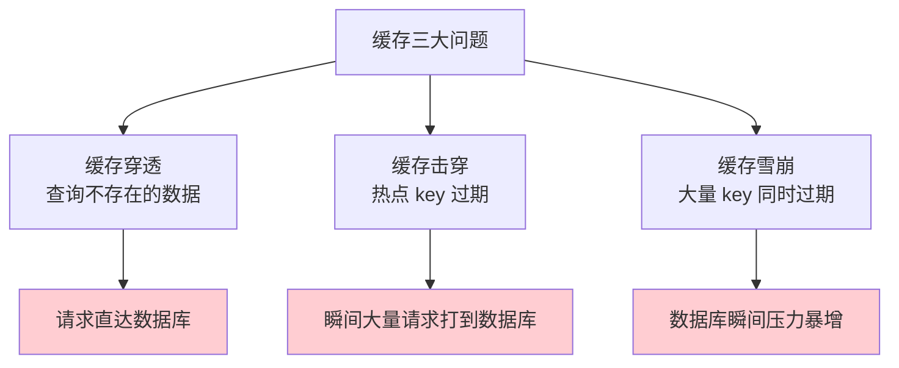

---

### 缓存穿透

**定义**：查询的数据在**缓存和数据库中都不存在**，每次请求都直接打到数据库。

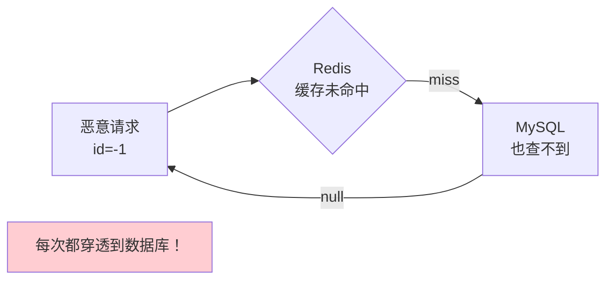

**解决方案：**

| 方案 | 实现 | 优点 | 缺点 |
|------|------|------|------|
| **缓存空值** | 查不到时缓存 `null`，设短过期 | 简单 | 浪费内存、短暂不一致 |
| **布隆过滤器** | 请求前先过布隆过滤器 | 内存省、效率高 | 有误判率、不能删除 |
| **参数校验** | 接口层校验 id > 0 等 | 直接拦截 | 只能防简单攻击 |

#### 布隆过滤器

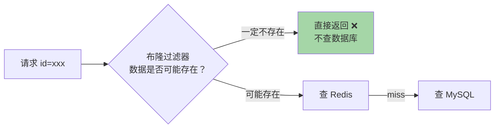

```
布隆过滤器原理：
1. 一个很长的 bit 数组 + 多个哈希函数
2. 添加元素：多个哈希函数计算位置，对应 bit 置为 1
3. 查询元素：所有位置都是 1 → 可能存在
              任何一个位置是 0 → 一定不存在

特点：
✅ 空间极小（1亿数据仅需约 120MB）
✅ 查询 O(k)，k 为哈希函数个数
❌ 有误判率（可能存在，但实际不存在）
❌ 不能删除元素（可以用 Counting Bloom Filter）
```

---

### 缓存击穿

**定义**：某个**热点 key 过期**的瞬间，大量并发请求同时涌入数据库。

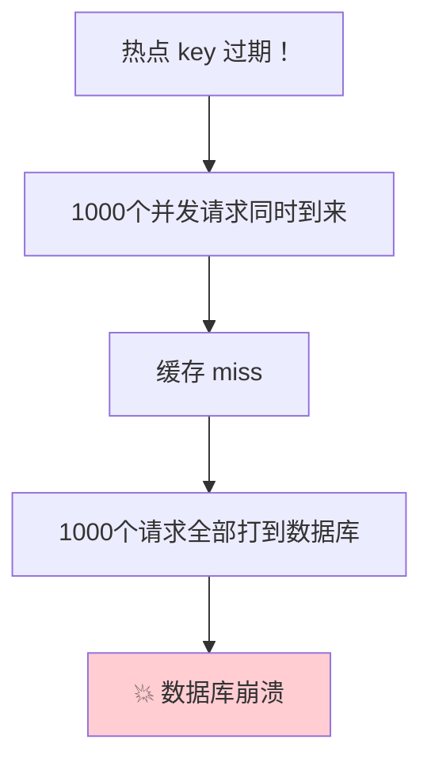

**解决方案：**

| 方案 | 说明 | 适用场景 |
|------|------|----------|
| **互斥锁** | 只有一个线程重建缓存，其他等待 | 一致性要求高 |
| **逻辑过期** | 不设 TTL，在 value 中存逻辑过期时间 | 可用性要求高 |
| **热点 key 永不过期** | 不设过期时间，手动更新 | 数据变化少 |

#### 互斥锁方案

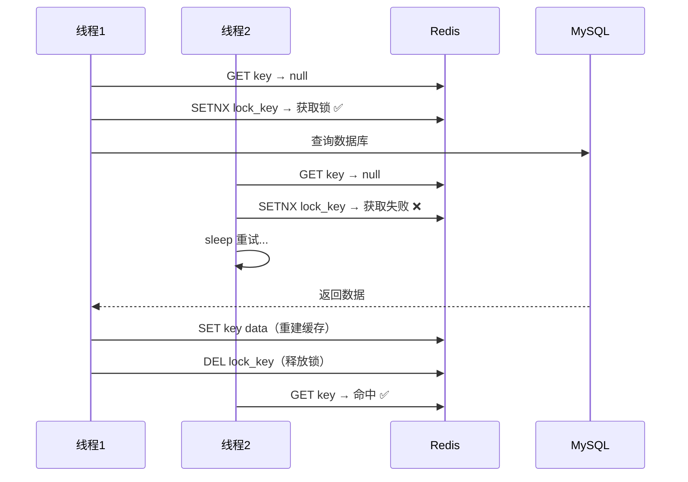

#### 逻辑过期方案

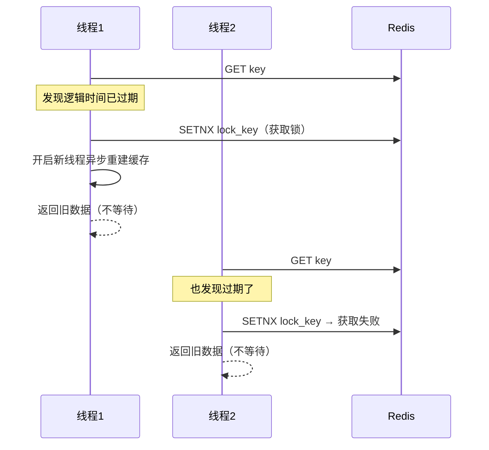

> 逻辑过期牺牲了短暂的一致性，换取高可用（不会等待）。

---

### 缓存雪崩

**定义**：**大量 key 同时过期**，或 **Redis 宕机**，导致请求全部打到数据库。

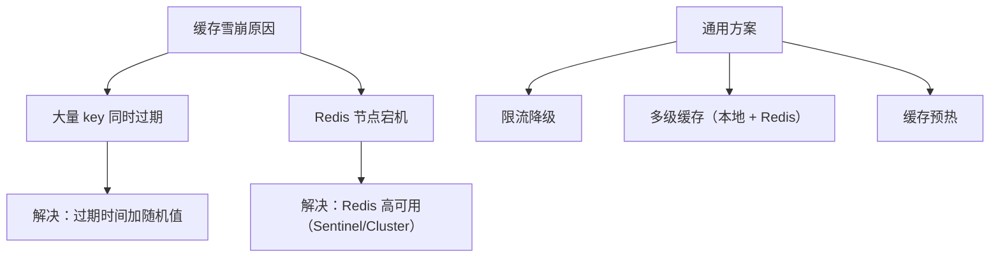

**解决方案汇总：**

| 问题原因 | 解决方案 |
|----------|----------|
| 大量 key 同时过期 | 过期时间加**随机偏移量**（如 base + random(0, 300)s） |
| Redis 宕机 | **Sentinel / Cluster** 高可用架构 |
| 通用 | **限流降级**（Hystrix / Sentinel） |
| 通用 | **多级缓存**（L1 本地缓存 + L2 Redis） |
| 通用 | **缓存预热**（提前加载热点数据） |

---

## 缓存与数据库双写一致性

### 问题本质

数据同时存在于 Redis 和 MySQL，更新数据时如何保证两者一致？

### 四种更新策略

| 策略 | 问题 |
|------|------|
| 先更新缓存，再更新数据库 | ❌ 数据库更新失败 → 缓存脏数据 |
| 先更新数据库，再更新缓存 | ❌ 并发时可能缓存旧值 |
| **先更新数据库，再删除缓存** ✅ | ⚠️ 极端场景有问题，但概率很低 |
| 先删除缓存，再更新数据库 | ❌ 并发时缓存旧值 |

### 推荐方案：Cache Aside Pattern（旁路缓存）

```
读：先读缓存 → 缓存未命中 → 读数据库 → 写入缓存
写：先更新数据库 → 再删除缓存
```

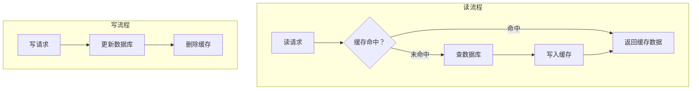

### 为什么是删除缓存而不是更新缓存？

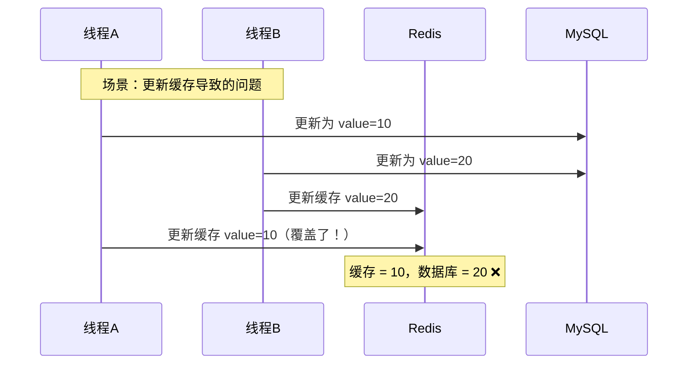

> 删除缓存是**幂等操作**，即使并发也不会产生错误值。下次读取时会重新加载最新数据。

### "先删缓存再更新数据库"的并发问题

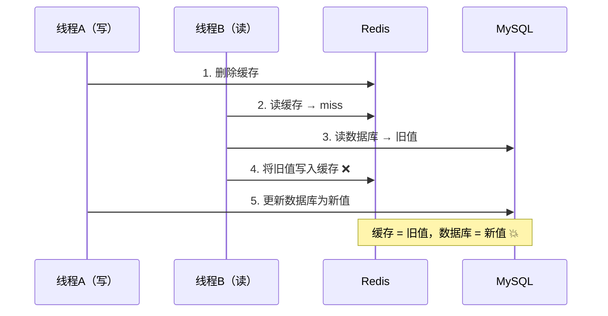

### "先更新数据库再删缓存"的极端问题

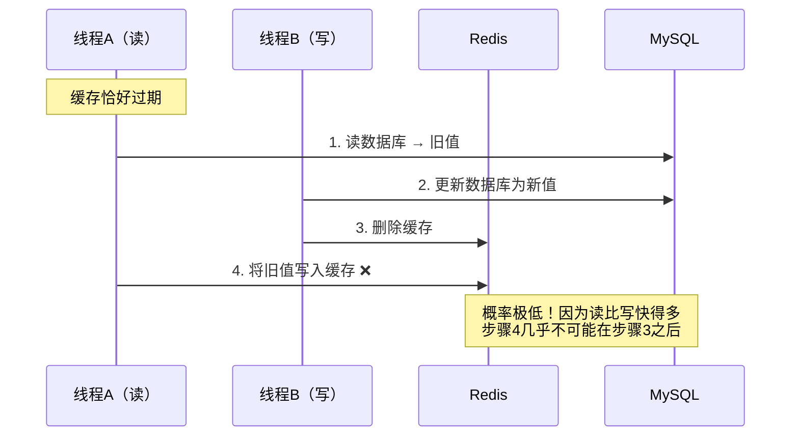

> 这种情况**概率极低**（需要数据库读比写还慢），但为了极致一致性可以加延迟双删。

### 延迟双删

```python
# 写操作
def update(key, value):
    delete_cache(key)       # 1. 先删缓存
    update_db(key, value)   # 2. 更新数据库
    sleep(1)                # 3. 延迟一段时间（大于读请求耗时）
    delete_cache(key)       # 4. 再删缓存（删除可能的脏缓存）
```

### 更可靠的方案：基于消息队列

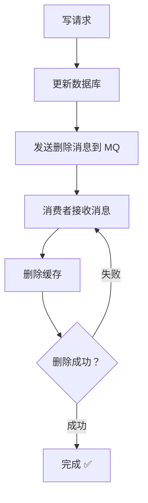

### 最终方案：订阅 Binlog


> [!tip] 最佳实践
> 一般业务用 **Cache Aside（先更新 DB 再删缓存）** 就够了。
> 强一致场景用 **Canal 订阅 Binlog** 方案。

---

## 分布式锁

### 最基本的实现

```bash
# 加锁（原子操作）
SET lock_key unique_value NX PX 30000
# NX: 不存在才设置
# PX: 30秒过期（防止死锁）
# unique_value: 唯一标识（UUID），防止误删

# 释放锁（Lua 脚本保证原子性）
EVAL "if redis.call('GET',KEYS[1])==ARGV[1] then return redis.call('DEL',KEYS[1]) else return 0 end" 1 lock_key unique_value
```

### 为什么释放锁要用 Lua 脚本？

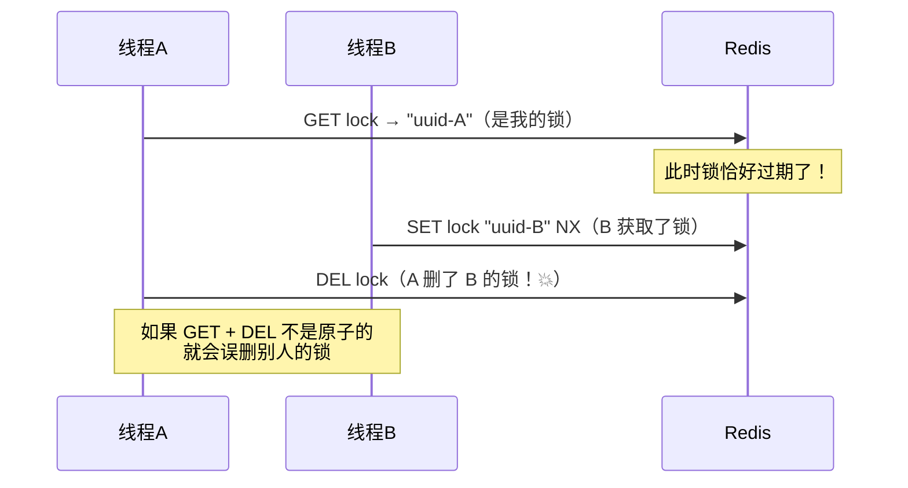

### 分布式锁的完整要求

| 要求 | 实现方式 |
|------|----------|
| **互斥** | `SET NX` |
| **防死锁** | 设置过期时间 `PX` |
| **防误删** | value 存 UUID，释放时校验 |
| **可重入** | 用 Hash 存锁持有者 + 重入次数 |
| **自动续期** | 看门狗机制（Redisson） |

### Redisson 分布式锁

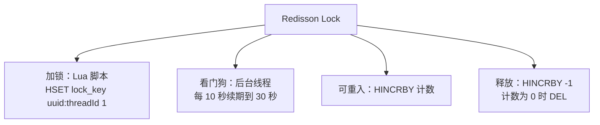

### 看门狗机制

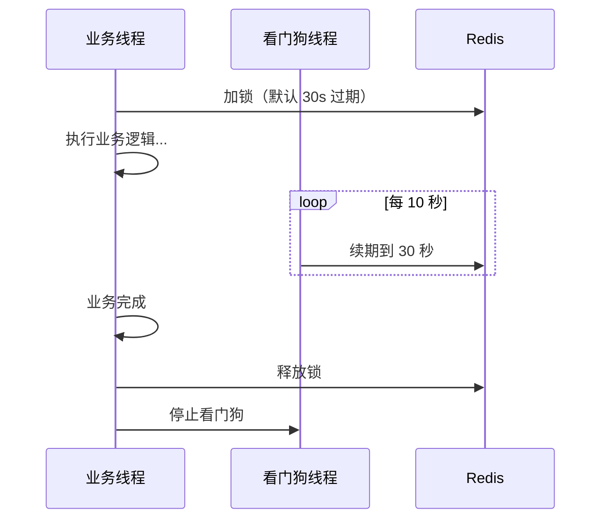

> 只有**不指定过期时间**时才启动看门狗。如果指定了过期时间，不启动看门狗。

### RedLock（红锁）—— 多节点分布式锁

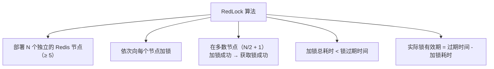

> [!warning] RedLock 争议
> Martin Kleppmann 认为 RedLock 在时钟跳跃等场景下不安全。对强一致有极高要求时，建议使用 **Zookeeper** 分布式锁。大多数场景单节点 Redis 锁 + Redisson 已足够。

---

## 热 Key 问题

### 识别热 Key

```bash
redis-cli --hotkeys             # Redis 4.0+（需 LFU 淘汰策略）
redis-cli MONITOR               # 实时监控（性能影响大，慎用）
# 或在应用层统计
```

### 解决方案

| 方案 | 说明 |
|------|------|
| **本地缓存** | L1 本地缓存（Caffeine/Guava）+ L2 Redis |
| **读写分离** | 热 key 分散到多个从节点读 |
| **Key 分片** | `hot_key_1`, `hot_key_2`...随机读取 |
| **热点发现 + 预加载** | 提前识别并加载到本地缓存 |

---

## 面试高频问题

### Q1：缓存穿透、击穿、雪崩的区别和解决方案？

| 问题 | 原因 | 核心方案 |
|------|------|----------|
| 穿透 | 查不存在的数据 | 布隆过滤器 + 缓存空值 |
| 击穿 | 热点 key 过期 | 互斥锁 / 逻辑过期 |
| 雪崩 | 大量 key 同时过期 | 随机过期 + 限流降级 |

### Q2：如何保证缓存和数据库的一致性？

推荐 **Cache Aside** 模式：读时加载缓存，写时先更新数据库再删除缓存。强一致场景用 Canal 订阅 Binlog。

### Q3：Redis 分布式锁怎么实现？需要注意什么？

`SET key value NX PX timeout`。注意：unique value 防误删、Lua 脚本释放锁、看门狗自动续期、Redisson 框架封装。

### Q4：为什么删除缓存而不是更新缓存？

1. 删除是幂等操作，并发安全
2. 更新缓存可能有并发覆盖问题（A 写 10，B 写 20，最终缓存可能是 10）
3. 缓存的计算成本可能高（不是简单的 DB 值），不一定每次更新都需要重新计算
